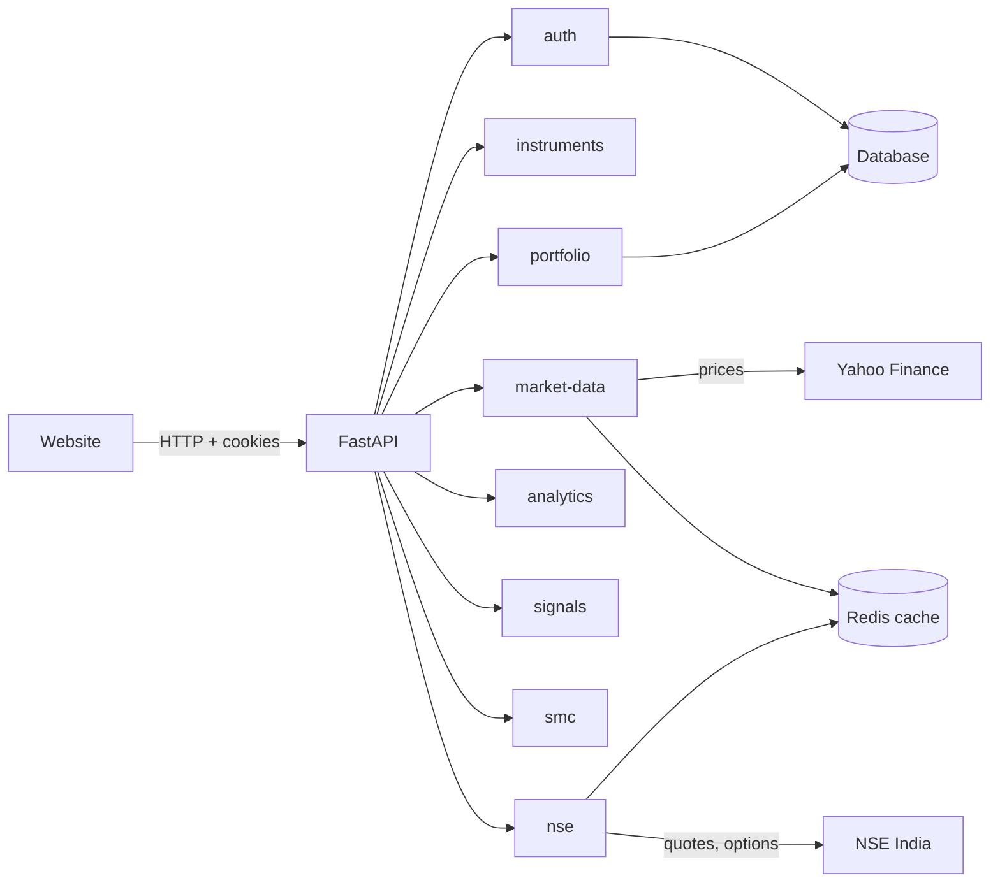

# StockView Backend — Docs

Plain-language docs, one folder per module. Each file is small (<200 words).

## The big picture

Every module folder has the same three code files: `router.py` (takes the
request), `service.py` (does the work), `schemas.py` (answer shapes).

## Module index

| Folder | What it does |
|---|---|
| [auth/](auth/overview.md) | Accounts: register, login, logout |
| [instruments/](instruments/overview.md) | Searchable list of ~646 stocks |
| [market-data/](market-data/overview.md) | Prices and candles from Yahoo |
| [nse/](nse/overview.md) | NSE quotes, options, FII/DII flows |
| [analytics/](analytics/overview.md) | Indicators + support/resistance |
| [signals/](signals/overview.md) | BUY / HOLD / SELL verdicts |
| [smc/](smc/overview.md) | Smart-money chart zones |
| [portfolio/](portfolio/overview.md) | Your watchlist |

Coming later: sentiment, ML, fusion, paper trading, alerts, backtesting,
ledger (`plan/06-rebuild-plan.md`).

## Try it without the website

Open `http://localhost:8000/docs`. Demo login: `demo / demo123`.
API base: `http://localhost:8000/api/v1`.
