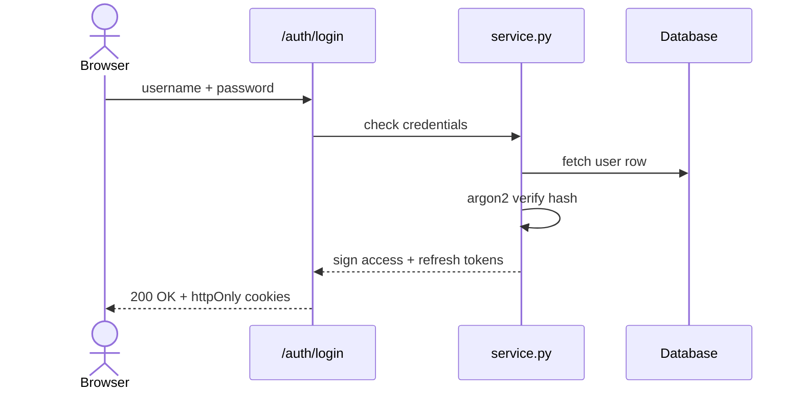

# Auth — Endpoints & Login Flow

## Endpoints

| Method & path | What it does |
|---|---|
| `POST /api/v1/auth/register` | Create account |
| `POST /api/v1/auth/login` | Log in (sets cookies) |
| `POST /api/v1/auth/refresh` | Stay logged in |
| `POST /api/v1/auth/logout` | Log out |
| `GET /api/v1/auth/me` | Current user info |

## What happens on login

## Refresh in one line

The access token is short-lived; the website calls `/refresh` when it gets a
401, gets new cookies, and retries — you never notice.

## Error meanings

- `401` wrong username/password · `429` too many attempts, wait a bit.
