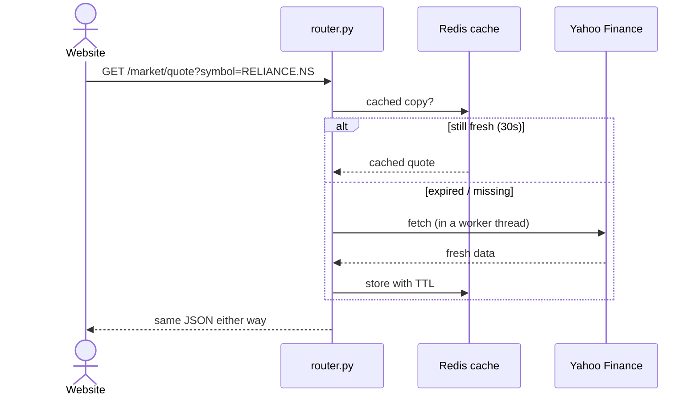

# Market Data — How Caching Works

**Plain words:** answers are remembered for a short time so repeat requests
are instant and we don't get blocked by Yahoo for asking too often.

## TTLs per endpoint

- Quotes **30s** · market summary & gainers **60s**
- History & sectors **300s** · company info **600s**

Same numbers as the old prototype — parity on purpose.

## If Redis is down

The cache "fails open": the app skips caching and still answers from Yahoo.
Nothing breaks, it's just slower until Redis returns.
