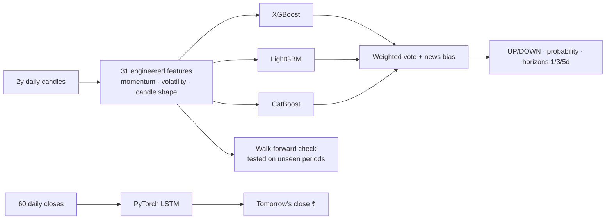

# ML — Overview

**Plain words:** the computer studies ~2 years of a stock's history, learns
patterns, and votes on whether the price will be **higher in 5 trading
days**. Several models vote together (an *ensemble*) so one model's mistake
doesn't dominate. A separate LSTM network predicts **tomorrow's price in ₹**.

- **No peeking ahead:** data is split chronologically (80% past → train,
  20% future → test); never shuffled.
- **Honest scoring:** walk-forward accuracy tests the model on periods it
  never saw. ~50% ≈ coin flip.
- **Graceful degradation:** without the optional libraries the scikit-learn
  trio (RF+GBM+LR) still votes — the app never breaks.

Education only: these are estimates on historical prices, not guarantees.
