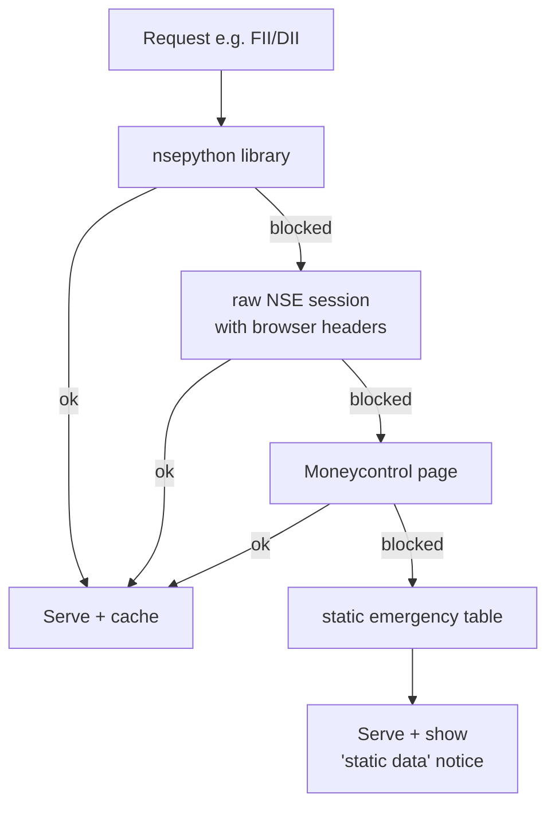

# NSE — Fallback Chains

**Plain words:** NSE blocks automated requests, so every endpoint tries
several sources in order and uses the first one that answers. That's why
this module keeps working when one door closes.

## Chain lengths

- **Quote:** 4 layers · **Option chain:** 3 layers
- **FII/DII:** 5 layers, ending in a static table (flagged in the response
  so the website can show a yellow notice)

## Extra robustness

- Handles NSE renaming its JSON fields over time (several accepted spellings).
- All-zero rows are treated as "source broken" → falls through to the next.
- Delisted tickers in advances/declines are swapped automatically.
