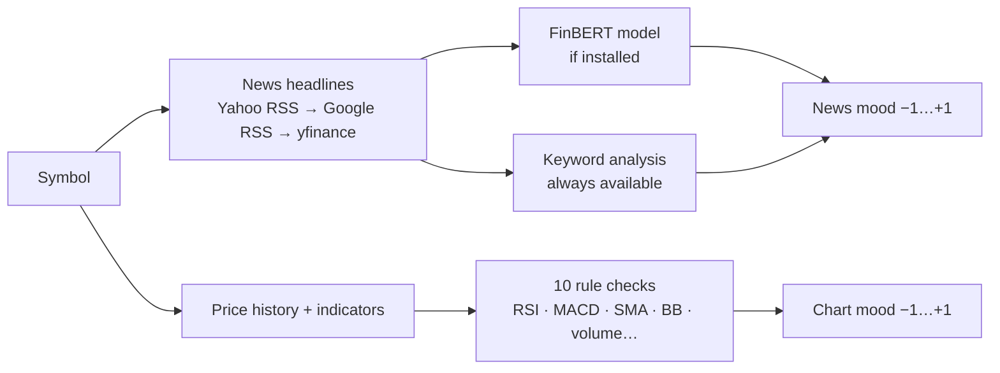

# Sentiment — Overview

**Plain words:** reads two opinions that aren't the price chart itself:
what the **news** says about the stock (news mood), and what the **chart's
indicators** imply (chart mood). Each becomes a score from −1 (very
negative) to +1 (very positive).

## How it works

- **News mood:** each headline is scored; FinBERT (a financial language
  model) counts 70%, keyword analysis 30%. No model installed? Keywords
  alone still work — the app never breaks.
- **Chart mood:** ten indicator checks (golden/death cross, RSI zones,
  MACD crossovers, volume spikes, momentum…) averaged into one opinion.

## Where the code lives

`backend/app/modules/sentiment/` (news, scores, endpoints).
Tests: `backend/tests/test_sentiment.py` (RSS parsing, keyword scoring,
technical signals, graceful degradation).

Education only — tone describes headlines; it can't predict them.
