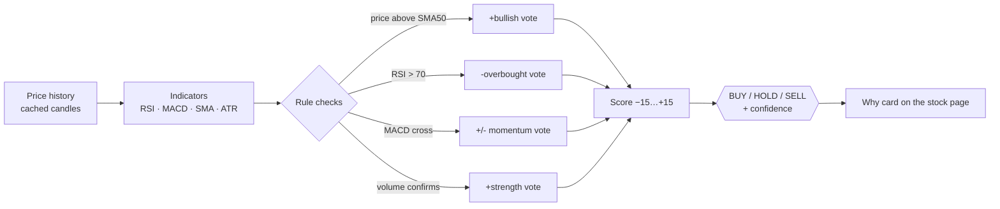

# Signals — Decision Pipeline

## From candles to verdict

## Reading the result

- Score near **+15**: many rules agree upward → BUY.
- Score near **−15**: the reverse → SELL.
- Rules disagree → HOLD with lower confidence.

The stop-loss suggestion comes from ATR: "leave the trade if price falls
roughly one average daily move below entry."
