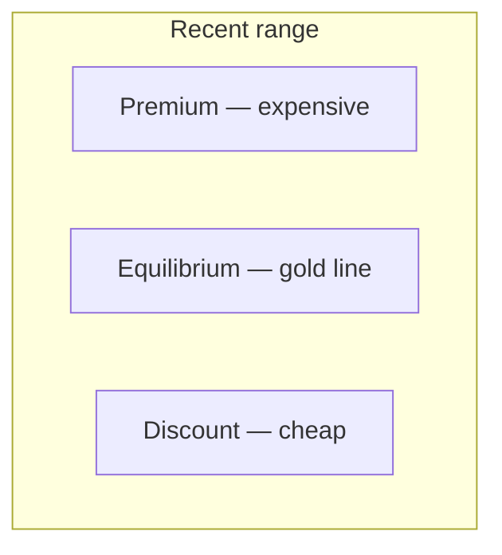

# SMC — Concept Dictionary

Each concept the module finds, in one or two lines each.

## Structure

- **Swing high / low** — a local peak/valley in the zig-zag of price.
- **BOS** (Break of Structure) — price breaks past the last swing in the
  trend direction → trend continues.
- **CHoCH** (Change of Character) — price breaks the *opposite* way →
  possible trend flip. Shown as labelled circles on the chart.

## Zones

- **Order block (OB)** — the last opposite-colored candle before a strong
  move. Institutions allegedly loaded orders there; price often returns.
  Drawn as boxes; "mitigated" once revisited.
- **FVG** (Fair Value Gap) — a three-candle gap where price moved so fast it
  left a hole. Often filled later — a magnet. Drawn as shaded boxes.

## Range

- **Premium / discount** — split the recent range at the halfway (gold
  **equilibrium**) line: above = expensive, below = cheap. Institutions buy
  discount, sell premium.

