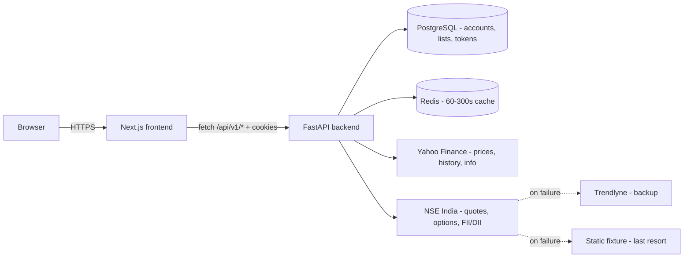
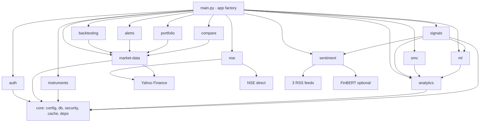
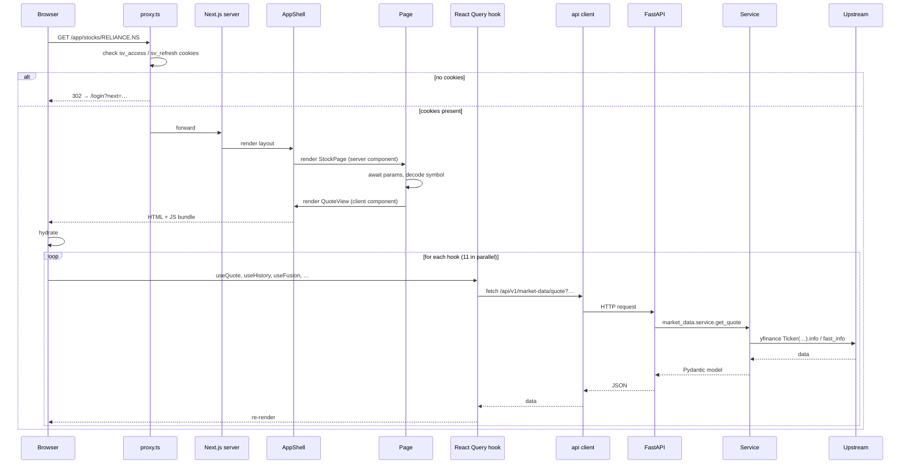
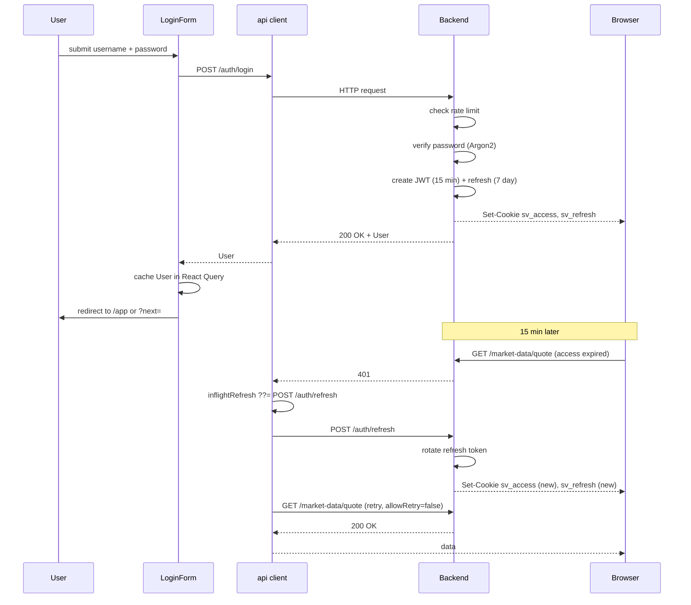

# Architecture

A Next.js website (frontend) talks to a FastAPI server (backend), which
stores account data in PostgreSQL, caches market data in Redis, and
fetches prices from Yahoo Finance and NSE India.

## The big picture



- **Next.js** renders the React UI. Pages live in `frontend/app/`.
- **FastAPI** serves JSON over HTTP. Routers live in
  `backend/app/modules/<name>/router.py`.
- **PostgreSQL 16** holds accounts, refresh tokens, watchlist items,
  and (after the migration) paper portfolios, paper orders, alerts,
  and ML jobs.
- **Redis 7** caches upstream responses (60s for quotes, 300s for
  FII/DII, 900s for sentiment, 15 min for ML results). If Redis is
  down, the backend degrades gracefully — every cache call is wrapped
  in a `try/except RedisError` that falls through to the upstream
  fetch.
- **Yahoo Finance** is the primary price source. yfinance is a
  third-party Python library; no API key required.
- **NSE India** is the primary options / FII-DII / breadth source.
  Direct NSE API calls + an optional `nsepython` helper.

## The backend — 13 modules



Cross-module dependencies are explicit: signals consumes analytics +
sentiment + ML, SMC consumes analytics, ML consumes analytics,
backtesting + alerts + portfolio + compare all consume market-data.

Each module is documented in [modules](modules/). The full technical
detail (every function, request traces, gotchas) is in
`<module>/implementation.md`.

## The frontend — 12 pages

```mermaid
flowchart TD
    RootLayout[app/layout.tsx] --> Landing[/ - landing]
    RootLayout --> AuthGroup[(auth)]
    AuthGroup --> Login[/login]
    AuthGroup --> Register[/register]
    RootLayout --> AppGroup[(app)]
    AppLayout[(app)/app/layout.tsx] --> Shell[AppShell + RequireAuth + proxy.ts]
    Shell --> Dashboard[/app - dashboard]
    Shell --> Stock[/app/stocks/SYM - stock terminal]
    Shell --> Markets[/app/markets - 4 tabs]
    Shell --> Sectors[/app/sectors - treemap]
    Shell --> Compare[/app/compare - 2-4 symbols]
    Shell --> Backtest[/app/backtest - 6 strategies]
    Shell --> Paper[/app/paper-trading - virtual ₹1L]
    Shell --> Alerts[/app/alerts - price alarms]
    Shell --> Settings[/app/settings - profile]
    Shell --> Search[Cmd-K palette - global overlay]
```

The `(app)/app/layout.tsx` wraps every page under `/app/*` with the
`AppShell` (sidebar + topbar) and `RequireAuth` (guarantees a session).
The `proxy.ts` is the route guard — it redirects unauthenticated users
away from `/app/*` and authenticated users away from `/login`.

Each page is documented in [pages](pages/).

## A request lifecycle



The proxy runs on the edge runtime. The page itself is a server
component that hands off to client components. Each client component
fires its own React Query hook in parallel. The api client handles
auth cookies, single-flight refresh, and error mapping.

## Auth flow



Passwords are stored only as **Argon2** hashes. The access JWT is
HS256-signed and 15 minutes. The refresh token is stored hashed in
the `refresh_tokens` table and rotates on every use.

## Caching layers

| Cache | TTL | What | Graceful failure |
|---|---|---|---|
| **Redis** | 60–900s | Upstream responses (quotes, history, indicators, signal, fusion, sentiment, ML) | Yes — falls through to upstream on `RedisError` |
| **In-process** | process lifetime | `instrument_master.json` via `@lru_cache` | N/A (the file is loaded once) |
| **yfinance** | per call | None — every call hits yfinance | N/A |
| **React Query** | 30s default | Hook results on the frontend | Yes — refetch on focus (disabled) or window mount |

The backend's `core/cache.py` wraps every Redis call in a
`try/except`. A Redis outage does **not** crash the API — the request
just runs without the cache hit.

## Code map

```
backend/
├── app/
│   ├── main.py                  # FastAPI app factory, router wiring
│   ├── core/                    # config, db, security, cache, deps
│   └── modules/                 # 13 modules
│       ├── auth/                # JWT, Argon2, rate limit
│       ├── market_data/         # yfinance, 5-tier cache
│       ├── instruments/         # JSON-backed search
│       ├── analytics/           # indicators, S/R, Fibonacci
│       ├── signals/             # rule engine + fusion
│       ├── smc/                 # TraderBuddies port
│       ├── sentiment/           # RSS + FinBERT + 10 rules
│       ├── ml/                  # ensemble + LSTM + SHAP
│       ├── backtesting/         # event-driven simulator
│       ├── alerts/              # price alarms
│       ├── portfolio/           # watchlist + paper trading
│       ├── nse/                 # NSE-specific + fallback
│       └── compare/             # side-by-side
└── docs/                        # per-module dev notes

frontend/
├── app/                         # pages (App Router)
│   ├── page.tsx                 # landing
│   ├── (auth)/                  # login, register
│   └── (app)/app/               # the 10 protected pages
├── components/                  # shared UI primitives
├── lib/
│   ├── api/                     # API client + per-resource functions
│   ├── hooks/                   # React Query hooks
│   └── utils/                   # formatters, helpers
└── proxy.ts                     # route guard
```

For a deep dive into any piece, see the relevant `modules/<name>/` or
`pages/<name>/` folder. For architecture decisions and per-module
rationale, see `backend/docs/` and `frontend/docs/`.