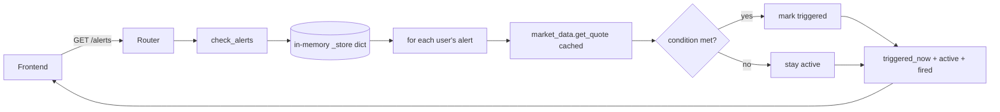

# Alerts — how it works

This page explains the in-memory store, the dataclass, and the re-check loop.

## The big picture



The whole flow runs synchronously inside the request handler. There is no
background worker, no scheduler, no separate polling thread.

## The Alert dataclass

```python
@dataclass
class Alert:
    id: str               # uuid4 hex, 12 chars
    symbol: str           # "TCS.NS" etc.
    price: float          # target
    condition: str        # "above" | "below"
    label: str            # "📈 Crosses Above" | "📉 Crosses Below"
    created: str          # "HH:MM:SS" UTC
    triggered: bool = False
```

Eight fields. One default. That's it.

The `label` is stored verbatim — the frontend sends it as part of the create
request. The backend does not generate it from the condition. This means the
UI controls the wording (so emojis and translations can change without
touching the backend).

`created` is `datetime.now(tz=UTC).strftime("%H:%M:%S")` — only the time-of-day.
No date. The list page shows "Created 14:32:08" without bothering with the
day.

## The store

```python
_store: dict[str, list[Alert]] = {}
```

A two-level dict: `user_id → list of Alert`. The user id is the UUID from the
`users` table (string form). The list is ordered — oldest alert first, newest
last.

There is no encryption, no signing, no per-user validation on read — the
router enforces user scoping via `Depends(get_current_user)` and the service
functions always receive the user id from the router. A user can only see
their own alerts.

## Create flow

```python
def add_alert(user_id, symbol, price, condition, label) -> Alert | None:
    alerts = _store.setdefault(user_id, [])
    existing = {(a.symbol, a.price, a.condition) for a in alerts}
    if (symbol, price, condition) in existing:
        return None
    alert = Alert(
        id=uuid.uuid4().hex[:12],
        symbol=symbol, price=price, condition=condition,
        label=label, created=datetime.now(tz=UTC).strftime("%H:%M:%S"),
    )
    alerts.append(alert)
    return alert
```

The router checks for `None` and returns 409 if the duplicate was rejected.

`_store.setdefault(user_id, [])` creates the user's list on first use. Idempotent.

## Re-check flow

```python
async def check_alerts(user_id: str) -> list[Alert]:
    alerts = _store.get(user_id, [])
    triggered_now: list[Alert] = []
    for alert in alerts:
        if alert.triggered:
            continue
        try:
            quote = await market_data.get_quote(alert.symbol)
            chk_price = quote.get("lastPrice", alert.price) if quote else alert.price
        except (KeyError, ValueError, TypeError):
            chk_price = alert.price
        hit = (
            (alert.condition == "above" and chk_price >= alert.price)
            or (alert.condition == "below" and chk_price <= alert.price)
        )
        if hit:
            alert.triggered = True
            triggered_now.append(alert)
    return triggered_now
```

Notes:

- Already-triggered alerts are skipped. They show in the `fired` bucket.
- The quote call is per-symbol. Five alerts on five symbols = five quote
  calls. The cache keeps these fast (30-second TTL).
- On quote failure (Yahoo down, symbol unknown), `chk_price = alert.price`. The
  comparison `chk_price >= alert.price` (or `<=`) becomes `True`, which would
  incorrectly trigger the alert. This is a **known bug** — see implementation
  notes.
- The list endpoint separates alerts into three buckets:
  - `triggered_now`: alerts that just fired in this check.
  - `active`: alerts still waiting.
  - `fired`: alerts that fired earlier.

## Delete / clear

```python
def delete_alert(user_id, alert_id) -> bool:
    alerts = _store.get(user_id, [])
    for i, a in enumerate(alerts):
        if a.id == alert_id:
            alerts.pop(i)
            return True
    return False

def clear_triggered(user_id):
    alerts = _store.get(user_id, [])
    _store[user_id] = [a for a in alerts if not a.triggered]

def clear_all(user_id):
    _store.pop(user_id, None)
```

- `delete_alert`: linear search by id, splice out, return success bool.
- `clear_triggered`: rebuild the list, keeping only non-triggered.
- `clear_all`: drop the user from the dict entirely. Next create will create
  a fresh empty list.

## What can go wrong

| Symptom | Cause |
|---|---|
| `409 already exists` | Exact duplicate (symbol, price, condition). Edit the price or delete the old one. |
| Alert that should fire does not | The quote call failed and `chk_price` fell back to `alert.price`. The comparison triggers incorrectly (see known bug). |
| Alert fires immediately on creation | If `target == current price` and the inclusive comparison hits. |
| Alerts vanish on backend restart | The store is in-memory. Restart wipes everything. |
| Alerts from another user visible | Should not happen — the router uses `Depends(get_current_user)`. If you see this, the bug is in the service. |
| `chk_price = None` somewhere | If `quote` returns `{"price": ...}` (the real shape), `quote.get("lastPrice", ...)` returns `None`, and the comparison `None >= alert.price` is `False`. The alert never fires. See known bug. |

Related: [implementation](implementation.md) for the file map and the
detailed bug report.