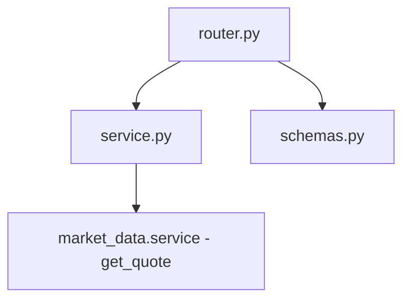
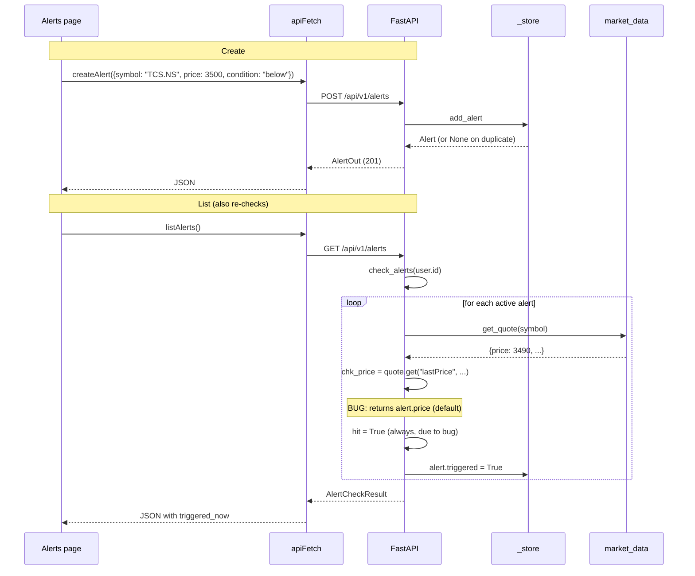

# Alerts — implementation (reading the code)

A guide for someone with the repo open. The whole module fits in two files
plus the router.

## File map



## 1. `backend/app/modules/alerts/service.py` (100 lines)

Four sections.

### Section A — `Alert` dataclass

```python
@dataclass
class Alert:
    id: str
    symbol: str
    price: float
    condition: str
    label: str
    created: str
    triggered: bool = False
```

Pydantic-friendly dataclass. The router uses `AlertOut.model_validate(alert.__dict__)`
to serialise — every field on the dataclass maps to a field on `AlertOut`.

### Section B — store + accessors

```python
_store: dict[str, list[Alert]] = {}

def get_user_alerts(user_id: str) -> list[Alert]:
    return _store.get(user_id, [])
```

`_store` is a module-level dict, populated lazily. `get_user_alerts` returns
a reference to the actual list (not a copy), so `clear_triggered` and
`clear_all` can mutate it via the `delete_alert` pop.

### Section C — write functions

| Function | Purpose |
|---|---|
| `add_alert(user_id, symbol, price, condition, label)` | Add or return `None` if duplicate |
| `delete_alert(user_id, alert_id)` | Linear search, pop, return bool |
| `clear_triggered(user_id)` | Filter out `triggered=True`, replace the list |
| `clear_all(user_id)` | Pop the user from `_store` |

The duplicate check in `add_alert`:

```python
existing = {(a.symbol, a.price, a.condition) for a in alerts}
if (symbol, price, condition) in existing:
    return None
```

Building a set each call is O(N) but N is small (handful of alerts per user)
and the set lookup is O(1). Fine.

### Section D — `check_alerts(user_id)` (the async function)

```python
async def check_alerts(user_id: str) -> list[Alert]:
    alerts = _store.get(user_id, [])
    triggered_now: list[Alert] = []
    for alert in alerts:
        if alert.triggered:
            continue
        try:
            quote = await market_data.get_quote(alert.symbol)
            chk_price = quote.get("lastPrice", alert.price) if quote else alert.price
        except (KeyError, ValueError, TypeError):
            chk_price = alert.price
        hit = (
            (alert.condition == "above" and chk_price >= alert.price)
            or (alert.condition == "below" and chk_price <= alert.price)
        )
        if hit:
            alert.triggered = True
            triggered_now.append(alert)
    return triggered_now
```

This is the **only async function** in the module. Everything else is sync.

### Known bug — `quote.get("lastPrice", ...)`

The market-data `get_quote` response shape is:

```json
{ "symbol": "...", "price": 3490.0, "previous_close": ..., "change": ..., "change_pct": ... }
```

There is **no `lastPrice` key**. The correct field is `price`. The current
code does:

```python
chk_price = quote.get("lastPrice", alert.price) if quote else alert.price
```

`quote.get("lastPrice", alert.price)` returns `alert.price` (the target) as
the default — but since `"lastPrice"` is missing, the default is used. The
comparison then becomes `alert.price >= alert.price` (or `<=`), which is
**always True**. So every active alert triggers immediately on the next
list call.

This is tracked as a bug in `plan/todo.md` under the alerts section. The fix:

```python
chk_price = quote.get("price") if quote else None
if chk_price is None:
    continue   # skip alert if we cannot get a live price
```

Or, more conservatively, retry on the next call without marking triggered.

Until the fix lands, alerts should be considered unreliable. They **will**
trigger — just always and immediately.

## 2. `backend/app/modules/alerts/router.py` (69 lines)

Five endpoints under `/api/v1/alerts/`, all protected.

| Method | Path | Body / Query | Response |
|---|---|---|---|
| `GET` | `/alerts` | — | `AlertCheckResult` |
| `POST` | `/alerts` | `AlertCreate` | `AlertOut` (201) or 409 on duplicate |
| `DELETE` | `/alerts/{alert_id}` | — | 204 or 404 |
| `DELETE` | `/alerts?fired_only=true` | — | 204 |

The router is the only place that enforces user scoping — it always pulls
the user id from `Depends(get_current_user)` and passes `str(user.id)` to
the service functions.

`list_alerts` is the only endpoint that calls `check_alerts`. The check runs
on every list call, so the page is always fresh when you view it.

## 3. `backend/app/modules/alerts/schemas.py` (24 lines)

| Schema | Shape |
|---|---|
| `AlertCreate` | `{ symbol, price, condition, label }` |
| `AlertOut` | `{ id, symbol, price, condition, label, created, triggered }` |
| `AlertCheckResult` | `{ triggered_now: [AlertOut], active: [AlertOut], fired: [AlertOut] }` |

No `Field` constraints — the router and service handle validation.

## 4. Frontend wiring

| File | Purpose |
|---|---|
| `frontend/lib/api/alerts.ts` | `listAlerts()`, `createAlert(body)`, `deleteAlert(id)`, `clearAlerts(firedOnly)` |
| `frontend/lib/hooks/use-alerts.ts` | `useAlerts` (with periodic refetch), `useCreateAlert` (mutation), `useDeleteAlert` |
| `frontend/app/(app)/alerts/page.tsx` | The alerts UI |
| `frontend/app/(app)/alerts/components/AlertForm.tsx` | Create form with symbol picker |

The `useAlerts` hook typically polls every 30–60 seconds while the page is
open, so the user sees fresh triggers without manually refreshing.

## 5. End-to-end request trace

You create an alert, then open the page:



Until the bug is fixed, this trace will show every active alert firing on the
first list call.

## 6. The persistence plan

The module is the only one that uses an in-memory store besides `ml._jobs`.
Both are slated to move to PostgreSQL during the DB migration:

| Current | Target |
|---|---|
| `_store: dict[user_id, list[Alert]]` | `alerts` table |
| `Alert` dataclass | `Alert` SQLAlchemy model |
| `add_alert` | INSERT |
| `delete_alert` | DELETE WHERE id = ? |
| `clear_triggered` | DELETE WHERE triggered = true |
| `clear_all` | DELETE WHERE user_id = ? |

The HTTP contract (request and response shapes) does not change. The
`GET /alerts` behaviour also stays: every call still triggers a fresh
re-check.

Multi-worker deployments need the DB version today — the in-memory dict is
per-process. Worker A's `_store` is invisible to worker B.

## 7. Common gotchas

- **The `lastPrice` bug.** Affects every alert on every list call. The alert
  fires immediately. Tracked in `plan/todo.md`.
- **Alerts vanish on backend restart.** Expected. Documented limitation.
- **Multiple workers split alerts across processes.** A user's alert lives on
  worker A. A request hitting worker B sees an empty list. Documented; fixed
  by the DB migration.
- **No notifications.** By design. The page must be open to see triggers.
- **`label` is not validated.** The router passes it through as-is. The
  frontend is responsible for setting sensible values (`"📈 Crosses Above"`
  or `"📉 Crosses Below"`).
- **Alert at exactly the current price fires immediately.** The inclusive
  comparison (`>=` / `<=`) means creating `TCS.NS above 3500` when TCS is at
  3500 triggers right away. Document the behaviour; the user can choose a
  price slightly above/below to delay.

## 8. Fixing the bug

The minimum-diff fix:

```python
# in service.check_alerts, replace the quote block
try:
    quote = await market_data.get_quote(alert.symbol)
    if not quote:
        continue
    chk_price = quote.get("price")
    if chk_price is None:
        continue
except (KeyError, ValueError, TypeError):
    continue
```

Then the comparison at the bottom works as intended.

Tests should cover:

- Active alert where live price crosses target → triggers.
- Active alert where live price has not reached target → stays active.
- Alert for an unknown symbol → stays active (not triggered by the None
  fallback).
- Alert where live price == target exactly → triggers (inclusive).

## Related

- Backend dev notes: `backend/docs/alerts/`.
- Quote source: [market-data](../market-data/overview.md).
- Frontend page docs: [alerts](../../pages/alerts.md).
- Parent module page: [overview](overview.md).