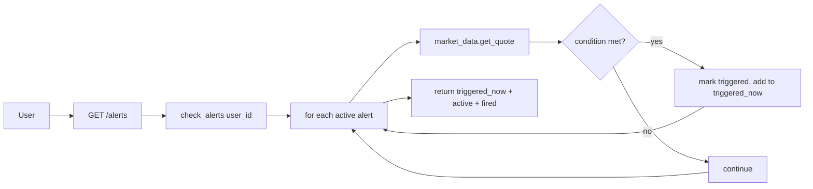

# Alerts — what it is

The alerts module holds **per-user price alarms**. Set a symbol, a target
price, and a condition (`above` or `below`). When the live quote crosses the
target, the alert fires.

This module is the simplest in the project — one dataclass, one in-memory
dict, and a re-check on every list call. There is no background worker, no
notification system, no email/SMS. The alert fires when you next visit the
alerts page.

## What you can do with it

- **Create an alert** — POST with `{ symbol, price, condition, label }`.
- **List alerts** — GET returns `{ triggered_now, active, fired }`.
- **Delete one alert** — DELETE by id.
- **Clear triggered** — bulk-delete only the fired ones.
- **Clear all** — nuke every alert for the user.

## How alerts trigger

Every time you call `GET /alerts`, the backend re-checks every active alert
against the current live price:

There is no polling daemon. If you never open the alerts page, no alerts fire.

## A real example

You create `TCS.NS` below ₹3,500. The server adds an `Alert` dataclass to your
list. Next time you open `/app/alerts`:

- If TCS is currently at ₹3,480: condition met, alert moves to `fired`.
- If TCS is at ₹3,520: condition not met, alert stays in `active`.

When the alert fires, the page highlights it with a red badge. You can leave
it visible as a record or clear it.

## What the condition means

| Condition | Fires when |
|---|---|
| `above` | live price ≥ target price |
| `below` | live price ≤ target price |

The comparison is **inclusive** (`>=` and `<=`). Crossing exactly to the
target price counts as a trigger.

## Duplicate handling

`(symbol, price, condition)` is the uniqueness key. Trying to add the same
alert twice returns `409 Conflict`. This prevents accidentally creating 50
identical alerts from rapid form submissions.

## Why a separate module (and why so small)

- **Per-user state.** Alerts are user-specific. The module owns its own store.
- **Self-contained re-check.** The "fire" logic is local — no dependency on
  the signals module or any background worker.
- **Trivially simple.** 100 lines of Python. The whole module fits in your
  head.

## What it does NOT do (intentional)

- **No background polling.** The check runs when you list alerts.
- **No notifications.** No email, no SMS, no push. The alert is just a flag.
- **No persistence across restarts.** Alerts live in a Python dict. Restart
  the backend and every alert is gone. This is a known limitation tracked for
  the database migration.
- **No deduplication by symbol alone.** You can have one alert for RELIANCE
  above ₹2,500 and another for RELIANCE below ₹2,000 at the same time.

## Where it lives in the codebase

- Backend code: `backend/app/modules/alerts/`
- Backend dev notes: `backend/docs/alerts/`
- Store: `backend/app/modules/alerts/service.py:_store` (in-memory dict)
- Frontend API client: `frontend/lib/api/alerts.ts`
- Frontend hook: `frontend/lib/hooks/use-alerts.ts`
- Frontend consumer: `/app/alerts` page

## Consumed by (frontend pages and other modules)

- [Alerts](../../pages/alerts/overview.md) — the only consumer on the frontend. The
  form, the Watching list, the Triggered list, and the topbar bell icon all read
  from this module.
- Module: [Market data](../market-data/overview.md) — the polling loop calls
  `get_quote` for every active alert. **The known `lastPrice` bug lives in this
  call site** — see the implementation file for the fix.

## Known issues

- **`lastPrice` vs `price` bug** — `service.py:90` reads `quote.get("lastPrice", ...)`
  but the market-data response uses the key `price`. Every active alert fires
  immediately on the next polling cycle. The 4-line fix is in the
  [implementation file](implementation.md#the-fix-in-detail).

## Related pages in this folder

- [How it works](how-it-works.md) — the store, the re-check loop, the dataclass.
- [Implementation](implementation.md) — file map, every function, the schema, a
  known bug, and the persistence plan.