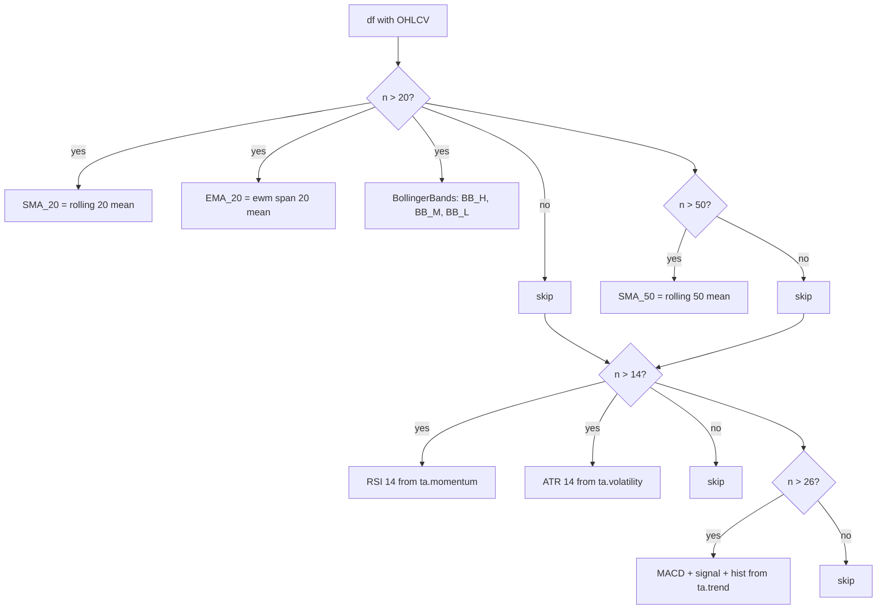
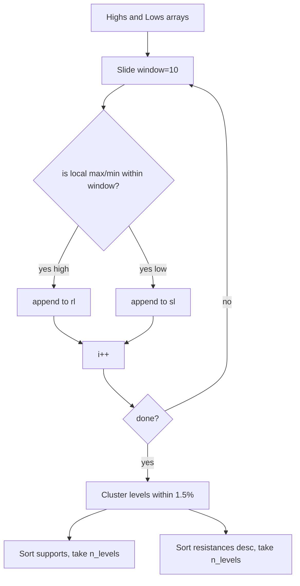

# Analytics — how it works

This page explains the request flow, the candle → DataFrame conversion, the
indicator math, and how the support/resistance cluster algorithm works.

## The big picture

```mermaid
flowchart LR
    Client[Frontend chart] -->|GET /analytics/indicators?symbol=SBIN.NS| API[FastAPI router]
    API --> SVC[service.get_indicators]
    SVC --> MD[market_data.get_history cached in Redis]
    MD --> Candles[list of candle dicts]
    Candles --> TP[anyio.to_thread.run_sync]
    TP --> DF[candles_to_df builds pandas DataFrame]
    DF --> Add[add_indicators computes SMA, EMA, BB, RSI, ATR, MACD]
    Add --> Series[_series drops NaN, emits {time, value}]
    Series --> Resp[IndicatorsResponse]
```

Everything below the cache line runs in a threadpool because pandas is blocking.

## From candles to DataFrame

`candles_to_df(candles)`:

```python
df = pd.DataFrame(candles)
df["time"] = pd.to_datetime(df["time"])
df = df.set_index("time")
return df.rename(columns=str.title)[["Open", "High", "Low", "Close", "Volume"]]
```

- The market-data candles arrive as `[{ time, open, high, low, close, volume }, ...]`.
- We parse `time` as a datetime, set it as the index, then rename columns to
  `Title Case` (`open` → `Open`). `Volume` stays as the only nullable column.
- Result: a DataFrame with `Open/High/Low/Close/Volume` columns indexed by date.

This naming matters because both `ta` (the indicator library) and the rule engine
in `signals.service` reference columns in Title Case.

## Adding indicators

`add_indicators(df)` walks the indicators in order. Each one only runs when there
are enough rows — many indicators need a "warm-up" window before they emit values.



The result is the input frame with extra columns. Rows before the warm-up window
have `NaN` for that indicator. `_series()` drops NaN before returning.

| Indicator | Library | Warm-up | Formula (simplified) |
|---|---|---|---|
| SMA_20 / SMA_50 | pandas | 20 / 50 | `rolling(N).mean()` |
| EMA_20 | pandas | 20 | `ewm(span=20, adjust=False).mean()` |
| BB_H / BB_M / BB_L | `ta.volatility.BollingerBands` | 20 | mid = SMA-20; ±2 std dev |
| RSI | `ta.momentum.RSIIndicator` | 14 | Wilder's smoothed ratio of avg gain / avg loss, scaled 0–100 |
| ATR | `ta.volatility.AverageTrueRange` | 14 | Wilder's smoothed true range |
| MACD / M_SIG / M_HIS | `ta.trend.MACD` | 26 | EMA-12 − EMA-26; signal = EMA-9 of MACD; hist = MACD − signal |

> VWAP is intentionally omitted. The interval presets (`1d` / `1wk` / `1mo`) are
> never intraday, so VWAP would be meaningless. Original comment in `service.py`:
> `app.py:1919 branch can never trigger`.

## From DataFrame to JSON

`_series(df, column)` drops NaN and emits `{ time, value }` dicts:

```python
s = df[column].dropna()
return [{"time": ts.isoformat(), "value": float(v)} for ts, v in s.items()]
```

That gives the frontend a clean series it can plot directly without dealing with
NaN gaps. The router's `_COLUMN_MAP` translates the camelCase API names
(`sma20`, `bb_high`, `macd_signal`) to the DataFrame column names (`SMA_20`,
`BB_H`, `M_SIG`).

## Support and resistance

`find_sr(df, window=10, n_levels=3)` finds local extremes and clusters them:



Two stages:

1. **Find local extremes.** For each candle at index `i`, check whether its high
   is the highest in `[i-window, i+window]` (or its low is the lowest). If so, it
   is a candidate support or resistance level.
2. **Cluster nearby levels.** Levels within 1.5% of each other are grouped; the
   mean of each cluster is one support/resistance line. This stops the output
   from showing ten "resistances" that are really the same level ±0.3%.

After clustering, the three highest-resistance and three lowest-support levels
are returned, plus the nearest support below and nearest resistance above the
current close. The "nearest" filter uses `max(s for s in supports if s <
last_close)` — i.e. the support just under today's price.

### Why "nearest" matters

Without `nearest_support` / `nearest_resistance`, the chart would show three
support and three resistance lines with no hint of which one the price is
testing. The "nearest" fields answer the question "what level should I watch
right now?" — and they are what the chart tooltip highlights.

## Threadpool usage

Every heavy call in this module runs in `anyio.to_thread.run_sync`:

- `get_indicators` — the whole indicator computation.
- `get_support_resistance` — DataFrame conversion + `find_sr` + nearest-level
  extraction.

Reason: pandas + ta are blocking. The FastAPI event loop is async. Running the
math in the default threadpool lets the server keep handling other requests while
the DataFrame crunches. The threadpool size is set by `anyio`'s default
(`40 × CPU cores`), so this scales fine on a multi-core box.

## What can go wrong

| Symptom | Cause |
|---|---|
| `sma50` is empty for a recent IPO | Less than 50 days of history. Need `period=10y` for deeper history. |
| `rsi` is all `null` | First 14 rows are dropped by Wilder's warm-up — expected. |
| `bb_*` empty | Same as SMA-20 — needs 20+ rows. |
| Empty `supports` for a strongly trending stock | No clear swing lows. Try `period=10y` for more swing points. |
| `nearest_support` is `null` | Price is below every support level — usually means the stock is making new lows. |
| 502 on a slow call | Yahoo is slow upstream; the cache miss + indicator compute takes too long. |

Related: [implementation](implementation.md) for the file map and helper details.