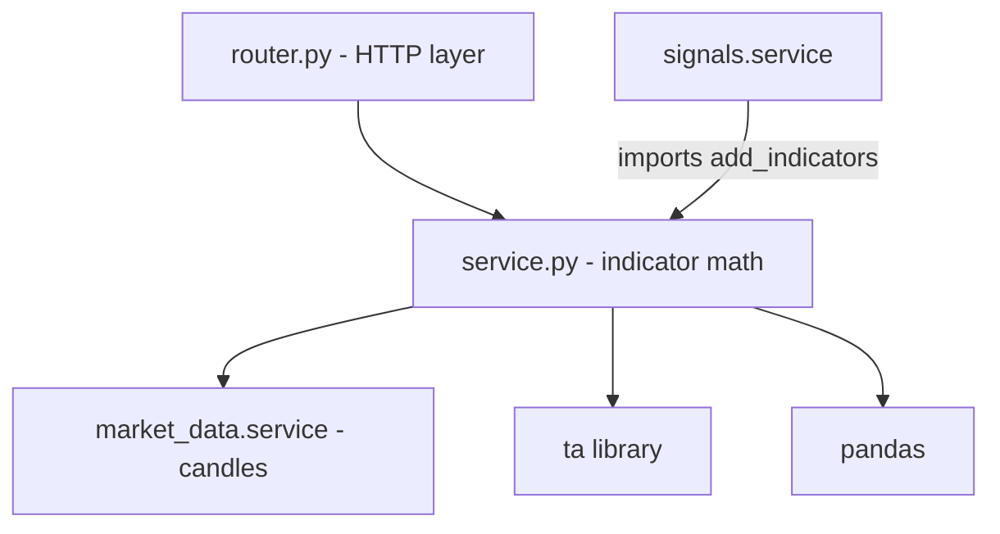
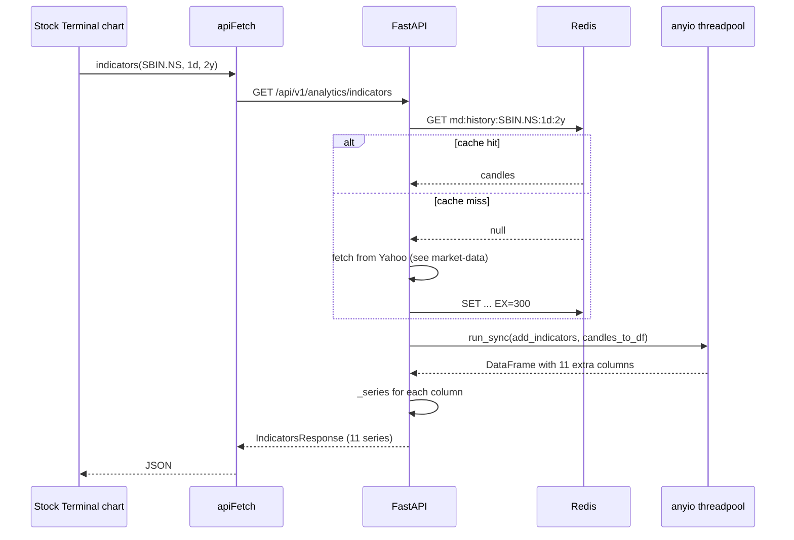

# Analytics — implementation (reading the code)

A guide for someone with the repo open. Read the files in this order.

## File map



## 1. `backend/app/modules/analytics/service.py` (123 lines)

Four sections, top to bottom.

### Section A — `candles_to_df(candles)`

Converts the market-data candle list to a pandas DataFrame indexed by timestamp.

```python
def candles_to_df(candles: list[dict]) -> pd.DataFrame:
    df = pd.DataFrame(candles)
    df["time"] = pd.to_datetime(df["time"])
    df = df.set_index("time")
    return df.rename(columns=str.title)[["Open", "High", "Low", "Close", "Volume"]]
```

Notes:

- `pd.to_datetime` handles ISO 8601 strings (Yahoo's format).
- `.rename(columns=str.title)` maps `open` → `Open`. This is the **only** rename.
  Any deviation in market-data output (e.g. lowercase column names) breaks the
  downstream indicators.
- `[["Open", "High", "Low", "Close", "Volume"]]` selects and orders columns.
  Volume may not exist for some Yahoo responses; the selector silently drops it
  if missing, so `df["Volume"]` later raises `KeyError` — see gotchas below.

### Section B — `add_indicators(df)`

Appends indicator series to the DataFrame. Indicators run in `n > N` order so
each indicator only runs when the frame has enough rows for a meaningful value.

| Branch | Condition | Columns added |
|---|---|---|
| Trend (short) | `n > 20` | `SMA_20`, `EMA_20`, `BB_H`, `BB_L`, `BB_M` |
| Trend (medium) | `n > 50` | `SMA_50` |
| Momentum | `n > 14` | `RSI`, `ATR` |
| MACD | `n > 26` | `MACD`, `M_SIG`, `M_HIS` |

`INDICATOR_COLUMNS` is the canonical list. Adding a new indicator means:

1. Add the branch in `add_indicators` (with its `n > N` guard).
2. Add the column name to `INDICATOR_COLUMNS`.
3. Add the camelCase → DataFrame mapping in `_COLUMN_MAP` in `router.py`.
4. Add a `field: list[SeriesPoint] = []` to `IndicatorsResponse`.

### Section C — `_series(df, column)`

```python
def _series(df: pd.DataFrame, column: str) -> list[dict]:
    s = df[column].dropna()
    return [{"time": ts.isoformat(), "value": float(v)} for ts, v in s.items()]
```

Drops the warm-up NaN values and emits JSON-ready `{ time, value }` dicts. The
result is what the chart overlay reads.

### Section D — support/resistance

`find_sr(df, window=10, n_levels=3)`:

```python
highs = df["High"].values
lows = df["Low"].values
for i in range(window, len(df) - window):
    if highs[i] == max(highs[i - window : i + window + 1]):
        rl.append(highs[i])
    if lows[i] == min(lows[i - window : i + window + 1]):
        sl.append(lows[i])
```

A local extreme: a candle whose high (or low) is the max (or min) within
`±window` candles. Default window is 10, so it finds swing points over ~3 weeks
of daily bars.

Then `cluster()` groups levels within 1.5% of each other:

```python
def cluster(lvls, tol=0.015):
    lvls = sorted(set(lvls))
    cls = [[lvls[0]]]
    for lv in lvls[1:]:
        if (lv - cls[-1][-1]) / cls[-1][-1] < tol:
            cls[-1].append(lv)
        else:
            cls.append([lv])
    return [float(pd.Series(c).mean()) for c in cls]
```

The mean of each cluster becomes one level. The 1.5% tolerance stops the output
from showing "₹828.4, ₹830.2, ₹832.1" as three separate resistances when they
are really one level.

Returns `(sorted(cluster(sl))[:n_levels], sorted(cluster(rl), reverse=True)[:n_levels])`
— three supports ascending, three resistances descending.

### Async API

| Function | What it does |
|---|---|
| `get_indicators(symbol, interval, period)` | Calls `market_data.get_history` → builds DF → adds indicators → returns dict of series |
| `get_support_resistance(symbol, interval, period)` | Calls `market_data.get_history` → builds DF → `find_sr` → returns `{ supports, resistances, nearest_support, nearest_resistance }` |

Both wrap the compute in `anyio.to_thread.run_sync` because pandas + ta are blocking.

`get_indicators` does not cache its own result — the input candles are
Redis-cached by market-data, and the indicator math is fast enough on a 500-row
frame that caching the result is not worth the invalidation complexity.

## 2. `backend/app/modules/analytics/router.py` (52 lines)

Two endpoints under `/api/v1/analytics/`, both protected.

| Method | Path | Query | Response |
|---|---|---|---|
| `GET` | `/indicators` | `symbol` (req), `interval`, `period` | `IndicatorsResponse` |
| `GET` | `/support-resistance` | `symbol` (req), `interval`, `period` | `SupportResistanceResponse` |

The router imports `Interval` and `Period` from `market_data.service` — those
literal types are reused everywhere so the period/interval vocabulary is the
same across modules.

`_COLUMN_MAP` translates the camelCase API names to the DataFrame column names:

```python
_COLUMN_MAP = {
    "sma20": "SMA_20", "sma50": "SMA_50", "ema20": "EMA_20",
    "bb_high": "BB_H", "bb_mid": "BB_M", "bb_low": "BB_L",
    "rsi": "RSI", "atr": "ATR",
    "macd": "MACD", "macd_signal": "M_SIG", "macd_hist": "M_HIS",
}
```

The router then builds the `IndicatorsResponse` by iterating `_COLUMN_MAP`,
calling `_series()` for each, and feeding the result into the matching field.

## 3. `backend/app/modules/analytics/schemas.py` (32 lines)

| Schema | Shape |
|---|---|
| `SeriesPoint` | `{ time: str, value: float }` |
| `IndicatorsResponse` | `{ symbol, interval, period, sma20, sma50, ema20, bb_high, bb_mid, bb_low, rsi, atr, macd, macd_signal, macd_hist }` — every series defaults to `[]` |
| `SupportResistanceResponse` | `{ supports: [float], resistances: [float], nearest_support: float \| None, nearest_resistance: float \| None }` |

Every series has a default `[]` so missing indicators do not raise validation
errors on the client.

## 4. Frontend wiring

| File | Purpose |
|---|---|
| `frontend/lib/api/analytics.ts` | `indicators(symbol, interval, period)`, `supportResistance(symbol, interval, period)` |
| `frontend/lib/hooks/use-analytics.ts` | `useIndicators`, `useSupportResistance` |
| `frontend/app/(app)/stocks/[symbol]/page.tsx` | Consumer — chart overlays, key levels panel |
| `frontend/app/(app)/stocks/[symbol]/components/SignalPanel.tsx` | Indirect consumer (via signals endpoint that calls this module internally) |

The frontend never calls analytics directly for the signal panel — it asks the
signals module, which in turn calls this module. The chart overlays call it
directly because they need the series data, not the verdict.

## 5. End-to-end request trace

You open SBIN. The chart mounts:



Same trace for `/support-resistance`, except the result is `{ supports,
resistances, nearest_support, nearest_resistance }` instead of a list of series.

## 6. Common gotchas

- **Volume column missing.** Yahoo sometimes returns no volume for indices.
  `candles_to_df` does not raise; later `df["Volume"]` does. The signals
  rule for "High Vol + Up" silently skips because the `if "Volume" in df.columns`
  guard catches it. But if you add a new rule that reads `df["Volume"]` without
  the guard, it will `KeyError` for indices.
- **Indicator values disagree with TradingView.** `ta` uses Wilder smoothing for
  RSI and ATR; TradingView uses the same, so usually agree. Some other sites use
  a different smoothing (e.g. simple MA) — they will give slightly different
  RSI values. Document the divergence if anyone asks.
- **Indicator series length.** The result has 500–500 points but is mostly empty
  for short histories. Always check `series.length > 0` before drawing.
- **`bb_high` empty but `bb_low` populated.** Cannot happen — both come from the
  same `BollingerBands` object. If you see this, you have a stale DataFrame
  where one branch ran and the other did not. Re-check `add_indicators`.
- **`find_sr` returns 0 levels for a strong trend.** The window is 10 days; in a
  sharp uptrend there may be no clear swing lows because every dip gets bought.
  Try `period=10y` to include older swing points.
- **`nearest_support` is null.** The price is below every detected support —
  usually a new low. Not a bug, but the UI should handle this case (show "no
  support below").

## 7. Adding a new indicator

Quick recipe for adding, say, Keltner Channels:

1. **Compute it in `add_indicators`**:
   ```python
   if n > 20:
       kc = ta.volatility.KeltnerChannel(high=df["High"], low=df["Low"], close=df["Close"])
       df["KC_H"] = kc.keltner_channel_hband()
       df["KC_L"] = kc.keltner_channel_lband()
       df["KC_M"] = kc.keltner_channel_mband()
   ```

2. **Add to `INDICATOR_COLUMNS`**:
   ```python
   INDICATOR_COLUMNS = [
       ..., "KC_H", "KC_L", "KC_M",
   ]
   ```

3. **Add to `_COLUMN_MAP`** in `router.py`:
   ```python
   "kc_high": "KC_H", "kc_mid": "KC_M", "kc_low": "KC_L",
   ```

4. **Add to `IndicatorsResponse`**:
   ```python
   kc_high: list[SeriesPoint] = []
   kc_mid: list[SeriesPoint] = []
   kc_low: list[SeriesPoint] = []
   ```

5. **Restart the backend** — the `ta` import is at module load.

6. **Draw it on the chart** in the frontend.

## Related

- Backend dev notes: `backend/docs/analytics/`.
- Consumer: [signals](../signals/overview.md) (imports `add_indicators`).
- Source of candles: [market-data](../market-data/overview.md).
- Frontend page docs: [stock-terminal](../../pages/stock-terminal.md).
- Parent module page: [overview](overview.md).