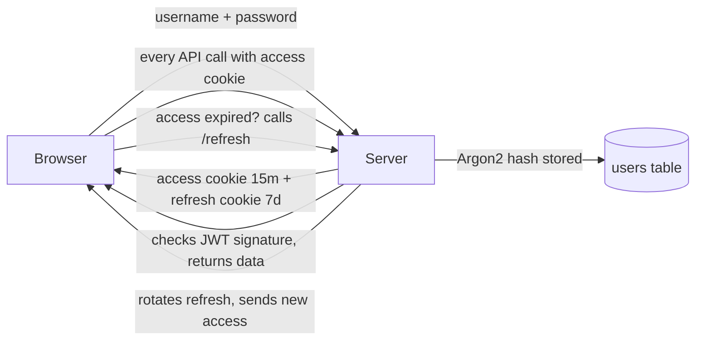
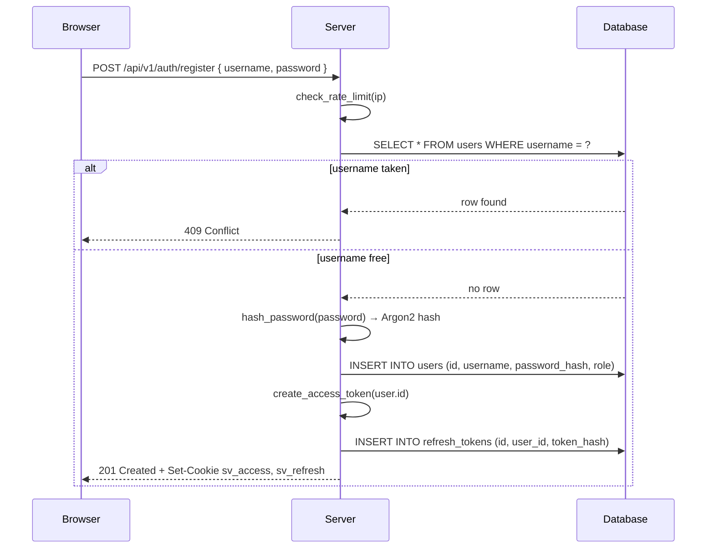
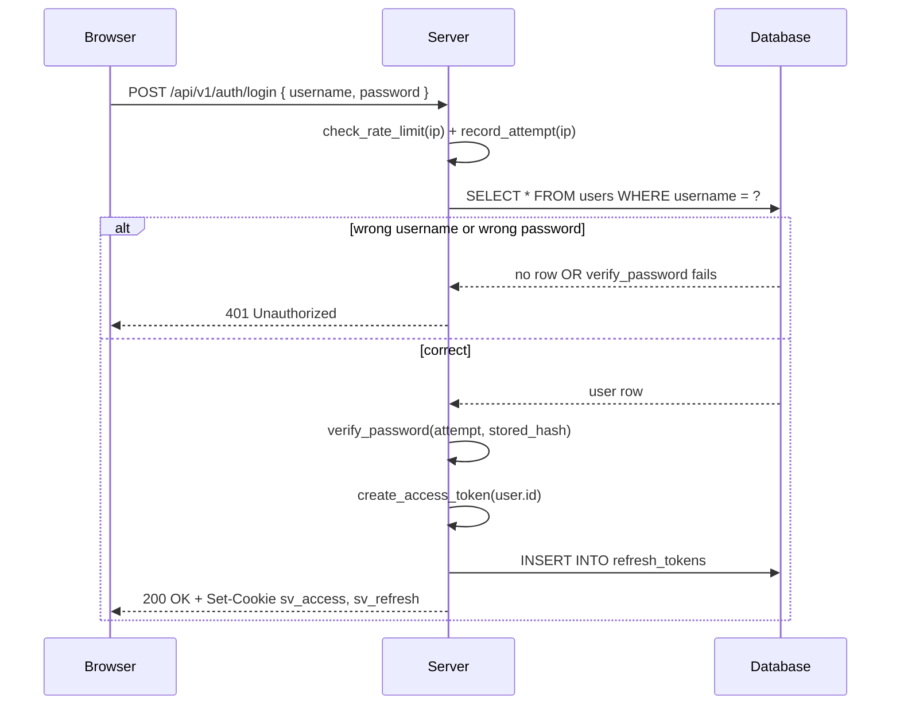
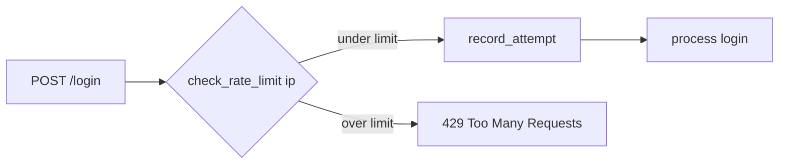
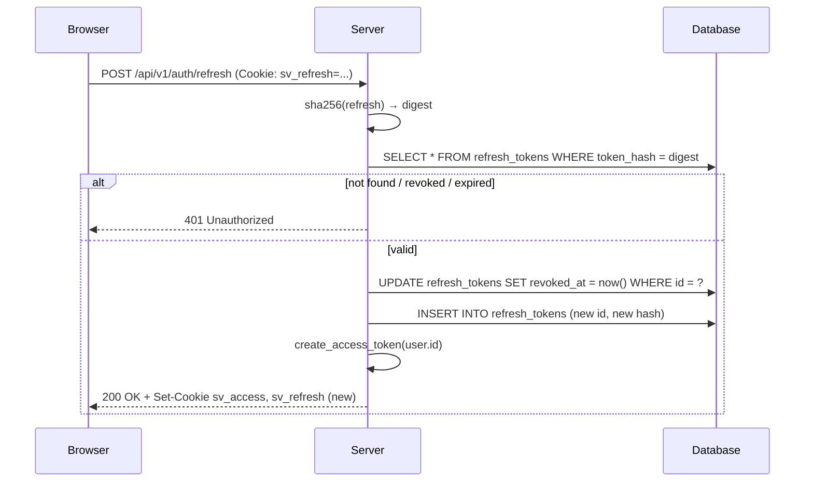
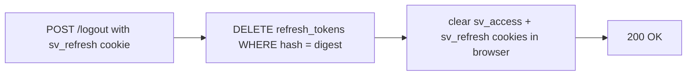
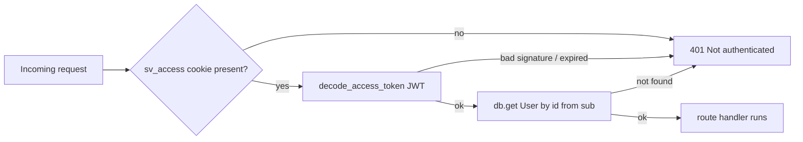

# Auth — how it works

This page explains what happens when you register, log in, refresh, and log out.
Read this if you want to understand the token dance before reading the code.

## The big picture

The server never keeps your session in memory. It hands your browser two tokens; the
tokens themselves prove who you are.

## Registration

Things to notice:

- The plain password **never reaches the database**. Only the Argon2 hash is stored.
- Both cookies are set with `HttpOnly`. JavaScript on the page cannot read them — that
  blocks a whole class of XSS token-stealing attacks.
- The refresh cookie holds a random 48-byte URL-safe string. Only its SHA-256 hash is
  saved. If the database leaks, attackers cannot replay refresh tokens.

## Login

The login error message is the **same** for "no such user" and "wrong password":
`Invalid username or password.` This stops username-enumeration attacks where an
attacker probes valid usernames by watching the error text change.

## Rate limiting

Login and register are limited to a small number of attempts per IP per minute
(default 5). The counter lives in a Python dict on the server. When the limit is hit,
the next call returns `429 Too Many Requests` until the window slides forward.

This is in-memory and per-process. If the backend runs as multiple workers, each
worker has its own counter, so the real limit is roughly `5 × workers`. The planned
move is to Redis (`plan/todo.md` S-02).

## Refresh — the silent part

Each `/refresh` call **revokes** the old refresh token and issues a new one. That is
why we say refresh tokens **rotate**. If an attacker steals your refresh cookie and
tries to use it after you have refreshed, the server sees `revoked_at IS NOT NULL` and
rejects it.

## Logout

The access cookie is stateless — there is nothing on the server to delete. We just
tell the browser to drop it. The refresh cookie is revoked in the DB, so even if the
cookie value is somehow remembered, it is dead.

## Protected routes

Every personal endpoint (watchlist, paper trading, alerts, etc.) depends on
`get_current_user` from `backend/app/core/deps.py`. That function:

1. Reads `sv_access` from the cookie jar.
2. Decodes the JWT with `SV_SECRET_KEY`.
3. Loads the user row by `sub` (the user id from the token).
4. Returns the `User`, or raises `401`.

## Edge cases you might wonder about

- **Wrong password 5 times in a minute.** 6th attempt returns `429` for ~60 seconds.
- **Username already taken on register.** Returns `409 Conflict` with detail
  `Username already taken.`
- **Refresh token used twice.** First use succeeds and rotates it. Second use returns
  `401 Refresh token invalid or expired.`
- **Access token expires mid-session.** The frontend's `apiFetch` (in
  `frontend/lib/api/client.ts`) catches the `401`, calls `/refresh` once, and retries
  the original request. The user sees nothing.
- **Server restarts.** In-memory rate-limit counters reset to zero. Refresh tokens in
  the DB survive. The dev seed users (`demo`, `admin`) are re-created if missing.