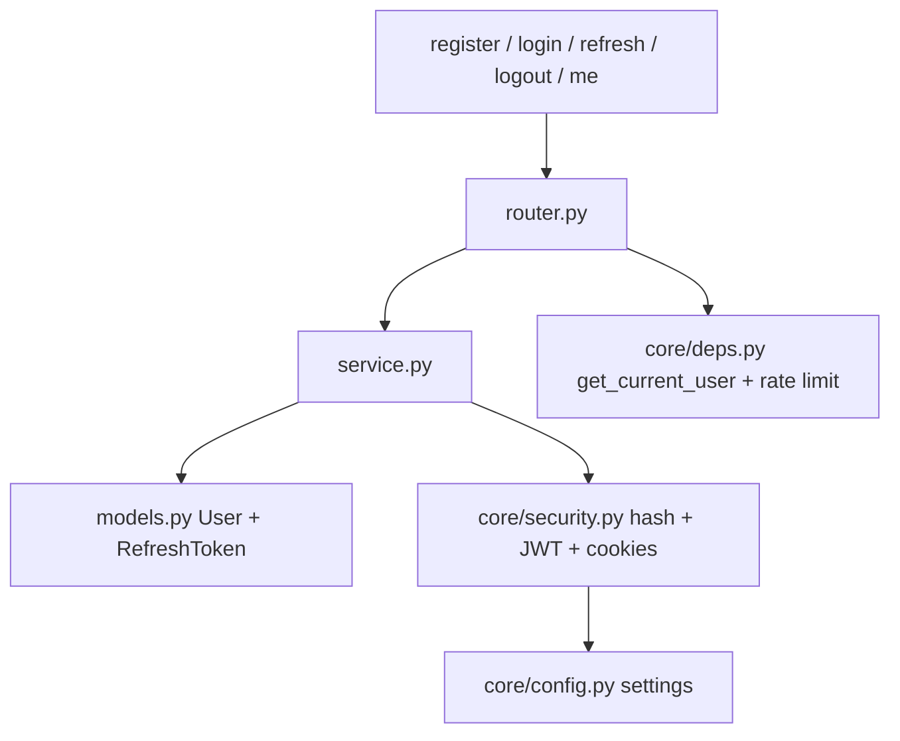
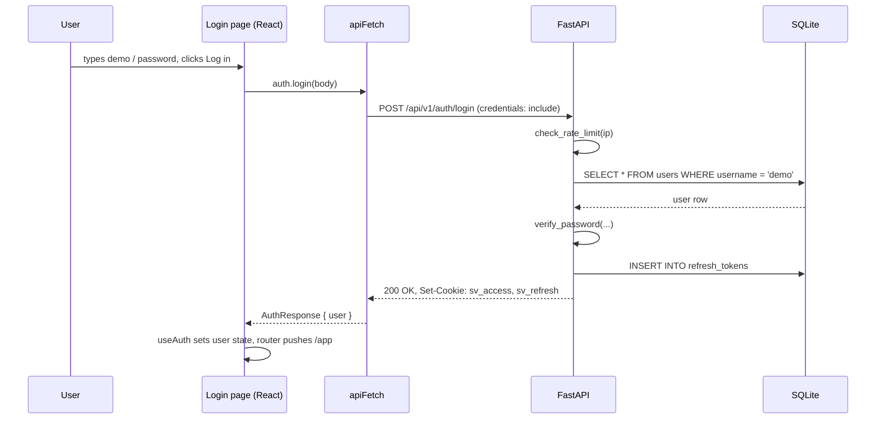

# Auth — implementation (reading the code)

A guide for someone who has the repo open and wants to find their way around the auth
code in 10 minutes. Read the files in this order.

## File map



## 1. `backend/app/modules/auth/models.py` (42 lines)

Two SQLAlchemy tables.

### `users`

| Column | Type | Notes |
|---|---|---|
| `id` | `String(36)` PK | UUID v4, generated in Python |
| `username` | `String(50)` UNIQUE, indexed | Letters, digits, underscore (enforced by Pydantic) |
| `password_hash` | `String(255)` | Argon2 hash, not the plain password |
| `role` | `String(20)` default `"user"` | `"admin"` for the seeded admin account |
| `created_at` | `DateTime(timezone=True)` | Set by the DB on insert |

### `refresh_tokens`

| Column | Type | Notes |
|---|---|---|
| `id` | `String(36)` PK | UUID v4 |
| `user_id` | `String(36)` FK → `users.id`, `ON DELETE CASCADE` | Deleting a user removes their tokens |
| `token_hash` | `String(64)` UNIQUE, indexed | SHA-256 of the raw refresh token |
| `expires_at` | `DateTime(timezone=True)` | 7 days from issue by default |
| `revoked_at` | `DateTime(timezone=True)`, nullable | Set when the token is rotated or on logout |
| `created_at` | `DateTime(timezone=True)` | Set by the DB |

`is_expired` is a Python `@property`, not a DB column. It compares `expires_at` to
`now()` in UTC.

## 2. `backend/app/modules/auth/schemas.py` (30 lines)

Pydantic models for the API.

| Schema | Used by | Fields |
|---|---|---|
| `RegisterRequest` | `POST /auth/register` | `username` (3–50, regex `^[a-zA-Z0-9_]+$`), `password` (6–128) |
| `LoginRequest` | `POST /auth/login` | `username`, `password` (no length check — wrong-password 401 is enough) |
| `UserOut` | responses | `id`, `username`, `role`, `created_at` |
| `AuthResponse` | register, login, refresh | wraps `UserOut` in `{ user: ... }` |
| `MessageResponse` | logout | `{ message: "Logged out." }` |

`UserOut` uses `model_config = ConfigDict(from_attributes=True)` so it can be built
straight from a SQLAlchemy `User` row.

## 3. `backend/app/core/security.py` (54 lines)

Helpers used by auth and by every protected route.

| Function | What it does |
|---|---|
| `hash_password(password)` | Argon2 hash via `PasswordHasher()` |
| `verify_password(password, hash)` | Returns `False` on mismatch instead of raising |
| `create_access_token(subject, extra=None)` | HS256 JWT with `sub`, `iat`, `exp`, `type="access"` |
| `decode_access_token(token)` | Verifies signature and expiry |
| `cookie_kwargs(max_age)` | Returns `max_age`, `httponly=True`, `samesite="lax"`, `secure=settings.cookie_secure`, `domain`, `path="/"` |

Cookie names: `sv_access`, `sv_refresh`.

JWT algorithm and lifetimes come from `settings` (`backend/app/core/config.py`):

| Setting | Default | Purpose |
|---|---|---|
| `secret_key` | env `SV_SECRET_KEY` | HMAC key for JWT |
| `jwt_algorithm` | `"HS256"` | JWT signing algorithm |
| `access_token_minutes` | `15` | Access cookie lifetime |
| `refresh_token_days` | `7` | Refresh cookie lifetime |
| `cookie_secure` | `True` in prod, `False` in dev | Tells the browser to send the cookie only over HTTPS |
| `cookie_domain` | `None` in dev | Set this in prod so cookies work across subdomains |
| `seed_users` | `{ "demo": "...", "admin": "..." }` | Dev accounts created at startup |

## 4. `backend/app/modules/auth/service.py` (120 lines)

Business logic, no FastAPI imports except `HTTPException`.

| Function | What it does |
|---|---|
| `get_user_by_username(db, username)` | Single `SELECT` |
| `register_user(db, username, password)` | 409 if taken, else hash + insert |
| `authenticate_user(db, username, password)` | 401 if missing user OR `verify_password` fails |
| `issue_refresh_token(db, user)` | Generates a random 48-byte token, stores its SHA-256, returns the raw value |
| `rotate_refresh_token(db, raw)` | Look up by hash, reject if revoked/expired, revoke old, issue new |
| `revoke_refresh_token(db, raw)` | `DELETE` by hash; no-op if cookie missing |
| `issue_session(db, user)` | Convenience: returns `(access, refresh)` |
| `seed_users(db)` | Called at app startup to create `demo` / `admin` if missing |

**Why SHA-256 the refresh token?** The raw token is like a password. If we stored it
plain and the database leaked, attackers could forge sessions for every user.
Storing only a hash means a leak does not let anyone use those tokens — they would
need to invert SHA-256 to find the raw value.

## 5. `backend/app/modules/auth/router.py` (106 lines)

Five endpoints. All under `/api/v1/auth/`.

| Method | Path | Auth | Body | Returns | Sets cookies |
|---|---|---|---|---|---|
| `POST` | `/register` | none | `RegisterRequest` | `AuthResponse` | `sv_access`, `sv_refresh` |
| `POST` | `/login` | none | `LoginRequest` | `AuthResponse` | `sv_access`, `sv_refresh` |
| `POST` | `/refresh` | `sv_refresh` | none | `AuthResponse` | `sv_access`, `sv_refresh` (new) |
| `POST` | `/logout` | none (idempotent) | none | `MessageResponse` | clears both |
| `GET` | `/me` | `sv_access` | none | `UserOut` | none |

Two helpers in this file:

- `_set_cookies(response, access, refresh)` — uses `cookie_kwargs` from `core/security.py`.
- `_clear_cookies(response)` — calls `response.delete_cookie(..., path="/")`.

Register and login both call `check_rate_limit(get_client_ip(request))`. Login also
calls `record_attempt` so the next attempt sees the count.

## 6. `backend/app/core/deps.py` (67 lines)

Three things in this file used by auth (and reused everywhere else).

### Rate limiter

```python
_attempts: dict[str, list[float]] = defaultdict(list)
_WINDOW = 60.0
```

`check_rate_limit(ip)` keeps a 60-second sliding window per IP. `record_attempt(ip)`
appends `time.monotonic()` to that window. Limit comes from
`settings.login_rate_limit_per_minute`. **Caveat:** in-memory, per process. Multi-worker
deployments need Redis (tracked in `plan/todo.md` S-02).

### Client IP

`get_client_ip(request)` returns `request.client.host`. If your deployment is behind
a reverse proxy (Nginx, Caddy), update this to read `X-Forwarded-For` first.

### `get_current_user`

FastAPI dependency that returns a `User`. Used by every protected route:

```python
@router.get("/api/v1/portfolio/watchlist")
async def watchlist(user: User = Depends(get_current_user)):
    ...
```

Steps:

1. Read `sv_access` cookie. Missing → `401 Not authenticated.`
2. Decode JWT. Bad signature, wrong type, expired → `401 Session expired or invalid.`
3. Load user by `sub`. Missing → `401 User no longer exists.`
4. Return `User`.

The decoded JWT is **not** cached. Every request hits `decode_access_token` and a DB
lookup. Cheap, but not free — if traffic grows, cache `User` lookups in Redis keyed on
user id.

## 7. Frontend wiring

| File | Purpose |
|---|---|
| `frontend/app/(auth)/login/page.tsx` | Login form |
| `frontend/app/(auth)/register/page.tsx` | Register form |
| `frontend/app/(auth)/layout.tsx` | Shared chrome (logo, simple background) |
| `frontend/lib/api/auth.ts` | `login`, `register`, `logout`, `refresh`, `me` |
| `frontend/lib/hooks/use-auth.ts` | React hook: `user`, `loading`, `login()`, `logout()` |
| `frontend/lib/api/client.ts` | `apiFetch` — adds `credentials: "include"`, auto-refreshes on 401 |

The frontend never reads the cookies directly. It just calls the endpoints with
`credentials: "include"` so the browser sends and stores the cookies.

## 8. End-to-end request trace — a real example

You log in as `demo`:



From here the frontend is "logged in". Any `apiFetch` call includes both cookies,
the server decodes `sv_access`, loads the user, and serves the response.

## 9. Common gotchas

- **Refresh fails silently.** Check the browser devtools → Application → Cookies. If
  `sv_refresh` is missing, the access cookie expired *and* the refresh cookie never
  landed (often because `cookie_secure=True` over plain HTTP in dev).
- **Login 429 in tests.** The in-memory rate limit persists for the lifetime of the
  process. Restart the backend to reset, or use a different IP.
- **`UserOut.from_attributes` works only because** the SQLAlchemy model and the
  Pydantic schema share the same field names (`id`, `username`, `role`, `created_at`).
  Renaming one without the other breaks the response shape.
- **`role` is a string column**, not an enum. There is no DB-level constraint — the
  service layer is the only place that sets it.

## Related

- Backend dev notes with deeper design notes: `backend/docs/auth/`.
- Frontend page docs: [docs/pages/auth.md](../../pages/auth.md).
- Parent module page: [overview](overview.md).