# Backtesting — how it works

This page walks through the engine, the signal-then-fill rule, the six
strategies, and the metrics math.

## The big picture

```mermaid
flowchart LR
    Client[Frontend] -->|POST /backtesting/run| Router[FastAPI router]
    Router --> SVC[service.run_backtest]
    SVC --> MD[market_data.get_history 1d period]
    MD --> DF[build DataFrame OHLCV]
    DF --> TP[anyio.to_thread.run_sync]
    TP --> Engine[_run_backtest_sync]
    Engine --> Ind[_add_bt_indicators]
    Ind --> Loop[bar-by-bar loop]
    Loop --> Equity[equity_curve list]
    Loop --> Trades[trades list]
    Equity --> Metrics[CAGR, Sharpe, Sortino, Calmar, max_dd, ...]
    Trades --> Metrics
    Metrics --> Response[BacktestResponse]
```



Everything runs in a threadpool. The indicator computation + bar loop is
blocking CPU work.

## Period mapping

The router accepts `years: 1..10`. We map it to the Yahoo `period` literal:

| years | Yahoo period |
|---|---|
| 1, 2 | `2y` |
| 3, 5 | `5y` |
| 7, 10 | `10y` |

```python
_PERIOD_MAP = {1: "2y", 2: "2y", 3: "5y", 5: "5y", 7: "10y", 10: "10y"}
```

Anything else defaults to `5y`. The 2-year cap for short backtests is a
practical Yahoo limit — 5-day bars would need a different map.

## Step 1 — Build the indicator frame

`_add_bt_indicators(df)` adds only the columns the strategies need:

| Branch | Condition | Columns |
|---|---|---|
| Short | `n > 20` | `SMA20`, `EMA20`, `BB_H`, `BB_L` |
| Medium | `n > 50` | `SMA50`, `SMA200` |
| Momentum | `n > 14` | `RSI`, `ATR` |
| MACD | `n > 26` | `MACD`, `MACD_S` |
| EMA | `n > 12` | `EMA12`, `EMA26` |

After the indicators, `d = d.dropna().reset_index()` — drop the warm-up rows
where any indicator is NaN. The frame's index column is now `Date`.

> Note: the engine uses **its own** indicator computation (`_add_bt_indicators`)
> rather than `analytics.add_indicators`. This keeps backtesting self-contained —
> you can run a backtest on a frame that has no analytics indicators and still
> get a result.

## Step 2 — The bar-by-bar loop

```python
for i in range(len(d)):
    row = d.iloc[i]
    open_ = float(row["Open"])
    close = float(row["Close"])
    low = float(row["Low"])
    high = float(row["High"])

    # Execute PENDING ENTRY at today's Open
    if pending_entry and position == 0.0:
        fill_px = open_ * (1 + SLIPPAGE_PCT / 100.0)
        invest = capital * (position_size_pct / 100.0)
        ...
        position = shares
        pending_entry = False

    # Execute PENDING EXIT at today's Open
    elif pending_exit and position > 0.0:
        fill_px = open_ * (1 - SLIPPAGE_PCT / 100.0)
        _close_trade(fill_px, date, "Signal")

    # Intrabar SL / TP
    if position > 0.0:
        if sl_price > 0 and low <= sl_price:
            fill_px = sl_price * (1 - SLIPPAGE_PCT / 100.0)
            _close_trade(fill_px, date, "SL")
        elif tp_price < float("inf") and high >= tp_price:
            fill_px = tp_price * (1 - SLIPPAGE_PCT / 100.0)
            _close_trade(fill_px, date, "TP")

    # Detect signal on THIS bar → execute on NEXT bar open
    if position == 0.0 and not pending_entry and entry_signal(i):
        pending_entry = True
    elif position > 0.0 and not pending_exit and exit_signal(i):
        pending_exit = True

    equity_curve.append(...)
```

### The four things in order

1. **Pending entry at open** — yesterday's signal becomes today's fill.
2. **Pending exit at open** — yesterday's exit signal becomes today's fill.
3. **Intrabar SL/TP** — check today's low/high against active stops.
4. **Detect new signal** — sets a pending entry/exit for tomorrow.

> The order matters. SL/TP check on today's bar **after** pending fills, **before**
> new signal detection. So an exit signal that fires on the same bar as a SL
> hit is ignored (SL wins, position is closed).

## Step 3 — The signal functions

Each strategy has two predicates: `entry_signal(i)` and `exit_signal(i)`.

```python
def entry_signal(i: int) -> bool:
    if i < 1: return False
    row, prev = d.iloc[i], d.iloc[i - 1]
    if strategy == "SMA Crossover":
        return (prev["SMA20"] < prev["SMA50"]) and (row["SMA20"] > row["SMA50"])
    ...
```

All strategies check `i >= 1` (need `prev`). All use both `prev` and `row` for
cross detection; level-based strategies (RSI, Bollinger) only use `row`.

### Per-strategy thresholds

| Strategy | Entry | Exit |
|---|---|---|
| SMA Crossover | `SMA20 prev < SMA50 prev` AND `SMA20 now > SMA50 now` | reverse |
| RSI Mean Reversion | `RSI now < 35` | `RSI now > 65` |
| MACD Crossover | `MACD prev < signal prev` AND `MACD now > signal now` | reverse |
| Bollinger Band Bounce | `Close now < BB_L now` | `Close now > BB_H now` |
| EMA Trend | `EMA20 prev < SMA50 prev` AND `EMA20 now > SMA50 now` | reverse |
| Golden Cross | `SMA50 prev < SMA200 prev` AND `SMA50 now > SMA200 now` | reverse |

The Golden Cross strategy silently returns `False` if `SMA200` is not in the
frame (i.e. fewer than 200 bars of history).

## Step 4 — Trade execution

`_close_trade(fill_px, date, exit_reason)`:

```python
gross = position * fill_px
commission_paid = gross * (commission_pct / 100.0)
net = gross - commission_paid
capital += net
pnl = net - (position * entry_px)
pnl_pct = (fill_px - entry_px) / entry_px * 100.0
```

`pnl` is the net-of-commission profit. `pnl_pct` is the simple percentage
return on the entry price. The trade record is appended with `exit_reason`:
`"Signal"` (planned), `"SL"` (stop-loss), `"TP"` (take-profit), `"End"` (end
of backtest, position still open).

## Step 5 — Metrics

After the loop, the equity curve and trade list become the input to the
metrics block.

### Returns

```python
final_equity = eq_df["equity"].iloc[-1]
total_ret_pct = (final_equity - initial_capital) / initial_capital * 100.0
n_days = len(eq_df)
years = n_days / 252.0
cagr = ((final_equity / initial_capital) ** (1.0 / years) - 1.0) * 100.0 if years > 0 else 0.0
```

`n_days / 252.0` — there are roughly 252 trading days per year. CAGR is the
geometric mean annual return.

### Sharpe and Sortino

```python
daily_ret = eq_series.pct_change().dropna()
rf_daily = 0.06 / 252.0  # 6% annual risk-free rate
excess_ret = daily_ret - rf_daily
sharpe = float(excess_ret.mean() / excess_ret.std() * np.sqrt(252)) if excess_ret.std() > 0 else 0.0

downside = excess_ret[excess_ret < 0]
sortino = float(excess_ret.mean() / downside.std() * np.sqrt(252)) if (len(downside) > 0 and downside.std() > 0) else 0.0
```

Sharpe = (mean daily excess return) / (daily volatility) × √252.
Sortino = same but volatility is calculated from negative days only.

The risk-free rate is hardcoded at 6% (Indian government securities). To
change it, edit `rf_daily`.

### Drawdown

```python
roll_max = eq_series.cummax()
drawdown = (eq_series - roll_max) / roll_max * 100.0
max_dd = float(drawdown.min())
```

Max drawdown = the worst drop from a running peak. The duration is the longest
streak of days where the equity is below its running peak.

### Calmar

```python
calmar = abs(cagr / max_dd) if max_dd != 0 else 0.0
```

Calmar = CAGR / |max drawdown|. Higher is better — more return per unit of
pain.

### Trade stats

```python
total_trades = len(tdf_bt)
wins = int(tdf_bt["win"].sum())
win_rate = wins / total_trades * 100.0
avg_win = tdf_bt[tdf_bt["win"]]["pnl_pct"].mean()
avg_loss = abs(tdf_bt[~tdf_bt["win"]]["pnl_pct"].mean())
profit_factor = tdf_bt[tdf_bt["win"]]["pnl"].sum() / abs(tdf_bt[~tdf_bt["win"]]["pnl"].sum())
```

`profit_factor` is gross wins / gross losses. > 1.5 is healthy, < 1.0 is a
losing strategy. Returns `inf` if there are no losing trades.

### Alpha vs buy-and-hold

```python
bh_start = float(df["Close"].iloc[0])
bh_end = float(df["Close"].iloc[-1])
bh_ret = (bh_end - bh_start) / bh_start * 100.0
bh_cagr = ((bh_end / bh_start) ** (1.0 / max(years, 0.01)) - 1.0) * 100.0
alpha = cagr - bh_cagr
```

Buy-and-hold is the baseline. `alpha` is the CAGR gap. Positive alpha means
the strategy beat the index.

### Monthly returns

```python
eq_df["date"] = pd.to_datetime(eq_df["date"], errors="coerce")
eq_df.set_index("date", inplace=True)
monthly = eq_df["equity"].resample("ME").last().pct_change().dropna() * 100
```

End-of-month equity → month-over-month percentage change. Returned as a list
of `{ month: "2024-01", return_pct: 3.4 }` for the heatmap.

## What can go wrong

| Symptom | Cause |
|---|---|
| `404 Not enough data to backtest` | Fewer than 60 bars after indicators + dropna. Pick a longer `years`. |
| Empty `trades` list | Strategy never fired (e.g. no RSI < 35 in the period). The response shape still includes empty arrays. |
| CAGR near 0 with high max drawdown | Strategy entered then sat in drawdown — rare but possible. |
| Sharpe 0 | Daily excess return was constant — flat equity. |
| Sharpe > 3 | Suspicious — check for a bug in your strategy or extreme luck. |
| Profit factor `null` | No losing trades. Could be a great strategy or too few trades to evaluate. |
| Alpha negative | Strategy underperformed buy-and-hold. Expected for most strategies on most symbols. |
| Golden Cross entries = 0 | Less than 200 bars of history. The strategy returns False silently. |

Related: [implementation](implementation.md) for the file map and helper details.