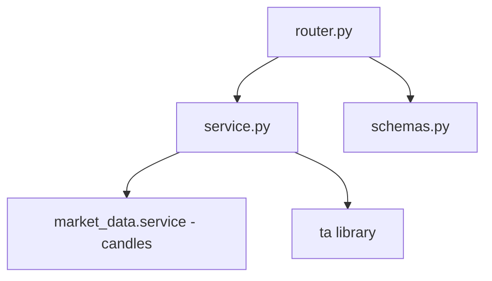
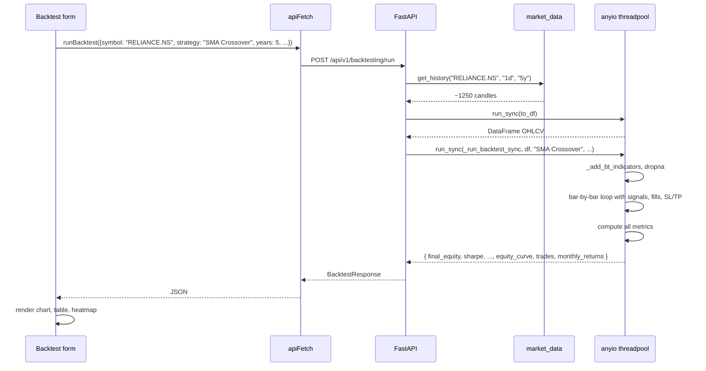

# Backtesting — implementation (reading the code)

A guide for someone with the repo open. Read the files in this order.

## File map



## 1. `backend/app/modules/backtesting/service.py` (370 lines)

Four sections, top to bottom.

### Section A — constants and strategy list

```python
SLIPPAGE_PCT = 0.05

_PERIOD_MAP: dict[int, Period] = {1: "2y", 2: "2y", 3: "5y", 5: "5y", 7: "10y", 10: "10y"}

STRATEGIES = ["SMA Crossover", "RSI Mean Reversion", "MACD Crossover",
              "Bollinger Band Bounce", "EMA Trend", "Golden Cross (SMA50/200)"]

STRATEGY_DESCRIPTIONS = { ... }  # one-line blurb per strategy
```

`SLIPPAGE_PCT` is the only fee-related constant. Commission is configurable
per request.

### Section B — `_add_bt_indicators(df)`

Five branch guards by row count:

| `n > ?` | Columns added |
|---|---|
| 20 | `SMA20`, `EMA20`, `BB_H`, `BB_L` |
| 50 | `SMA50`, `SMA200` |
| 14 | `RSI`, `ATR` |
| 26 | `MACD`, `MACD_S` |
| 12 | `EMA12`, `EMA26` |

This is independent from `analytics.add_indicators`. The backtesting module
computes its own indicators because:

1. Backtests run on raw OHLCV without depending on the analytics module.
2. The exact column names (`MACD_S` vs `M_SIG`) match the signal switches
   below — using a different library would break them.

### Section C — `_run_backtest_sync(df, strategy, initial_capital, commission_pct, sl_pct, tp_pct, position_size_pct)`

The engine. 250+ lines. Three logical parts.

#### Part C1 — signal functions

```python
def entry_signal(i: int) -> bool:
    if i < 1: return False
    row, prev = d.iloc[i], d.iloc[i - 1]
    if strategy == "SMA Crossover":
        return (prev["SMA20"] < prev["SMA50"]) and (row["SMA20"] > row["SMA50"])
    elif strategy == "RSI Mean Reversion":
        return row["RSI"] < 35
    # ... 4 more strategies
```

A chain of `if/elif`. Each branch reads from `row` and `prev`. Returns `False`
for unknown strategies (defensive).

#### Part C2 — `_close_trade(fill_px, date, exit_reason)`

Appends a trade record:

```python
gross = position * fill_px
commission_paid = gross * (commission_pct / 100.0)
net = gross - commission_paid
capital += net
pnl = net - (position * entry_px)
pnl_pct = (fill_px - entry_px) / entry_px * 100.0
trades.append({
    "entry_date": ..., "exit_date": ..., "entry_px": ...,
    "exit_px": ..., "shares": ..., "pnl": ..., "pnl_pct": ...,
    "hold_days": ..., "exit_reason": ..., "win": pnl > 0,
})
```

Resets state: `position = 0.0`, `entry_px = 0.0`, `sl_price = 0.0`,
`tp_price = inf`, `pending_exit = False`.

#### Part C3 — the bar-by-bar loop

The four-step sequence described in `how-it-works.md`:

1. Execute pending entry at today's Open (with slippage).
2. Execute pending exit at today's Open (with slippage).
3. Check intrabar SL/TP against today's Low/High.
4. Detect new entry/exit signal on today's bar.

`equity_curve.append({"date": ..., "equity": capital + position * close})` runs
at the end of every bar — equity is mark-to-market at the close.

### Section D — metrics

After the loop:

```python
if not trades or not equity_curve:
    return {}

eq_df = pd.DataFrame(equity_curve)
tdf_bt = pd.DataFrame(trades)
```

The empty-result guard prevents division-by-zero in the trade stat calculations.

The metrics block computes and returns:

- **Returns**: `final_equity`, `total_ret_pct`, `cagr`
- **Risk-adjusted**: `sharpe`, `sortino`, `calmar`
- **Drawdown**: `max_dd`, `dd_dur_days`
- **Trade stats**: `total_trades`, `wins`, `losses`, `win_rate`, `avg_win`,
  `avg_loss`, `profit_factor`, `expectancy`, `expectancy_pct`, `avg_hold`
- **Baseline**: `bh_ret`, `bh_cagr`, `alpha`
- **Period**: `years`
- **Charts**: `equity_curve`, `trades`, `monthly_returns`

The full list is in `schemas.BacktestResponse`.

### Section E — `run_backtest(symbol, strategy, years, initial_capital, commission_pct, sl_pct, tp_pct, position_size_pct)`

The async public API:

```python
async def run_backtest(symbol, strategy, years=5, initial_capital=100_000.0,
                       commission_pct=0.1, sl_pct=5.0, tp_pct=0.0,
                       position_size_pct=100.0) -> dict:
    period = _PERIOD_MAP.get(years, "5y")
    candles = await market_data.get_history(symbol, "1d", period)

    def to_df() -> pd.DataFrame:
        if not candles:
            return pd.DataFrame()
        df = pd.DataFrame(candles)
        if "time" in df.columns and "Date" not in df.columns:
            df.rename(columns={"time": "Date"}, inplace=True)
        for col in ["open", "high", "low", "close", "volume"]:
            if col in df.columns:
                df[col] = pd.to_numeric(df[col], errors="coerce")
        df.rename(columns={"open": "Open", "high": "High",
                           "low": "Low", "close": "Close",
                           "volume": "Volume"}, inplace=True)
        df.dropna(subset=["Open", "High", "Low", "Close"], inplace=True)
        return df

    df = await anyio.to_thread.run_sync(to_df)
    if df.empty or len(df) < 60:
        return {}

    return await anyio.to_thread.run_sync(
        _run_backtest_sync, df, strategy, initial_capital,
        commission_pct, sl_pct, tp_pct, position_size_pct,
    )
```

Notes:

- `to_df` renames market-data column names (`open`) to Title Case (`Open`)
  expected by the engine. Volume is optional — only included if present.
- The 60-bar floor is checked after `dropna`. If indicators eat rows, fewer
  than 60 survive.
- Two `anyio.to_thread.run_sync` calls — one for DataFrame construction, one
  for the engine. The DataFrame construction is fast; the engine is the slow
  part.

## 2. `backend/app/modules/backtesting/router.py` (56 lines)

Two endpoints under `/api/v1/backtesting/`, both protected.

| Method | Path | Body / Query | Response |
|---|---|---|---|
| `GET` | `/strategies` | — | `{ strategies: [{name, description}] }` |
| `POST` | `/run` | `BacktestRequest` (see schema) | `BacktestResponse` |

The router validates:

- `body.strategy` is in `service.STRATEGIES` (else 400).
- `result` is non-empty (else 404 — usually means not enough data).

## 3. `backend/app/modules/backtesting/schemas.py` (63 lines)

| Schema | Shape |
|---|---|
| `BacktestRequest` | `{ symbol, strategy, years (1-10), initial_capital (10k-10M), commission_pct (0-1), sl_pct (0-20), tp_pct (0-50), position_size_pct (10-100) }` |
| `TradeOut` | `{ entry_date, exit_date, entry_px, exit_px, shares, pnl, pnl_pct, hold_days, exit_reason, win }` |
| `MonthlyReturn` | `{ month (YYYY-MM), return_pct }` |
| `BacktestResponse` | the full metrics block + `{ equity_curve: [dict], trades: [TradeOut], monthly_returns: [MonthlyReturn] }` |

Pydantic Field constraints enforce valid ranges — invalid inputs get 422
before the handler runs.

## 4. Frontend wiring

| File | Purpose |
|---|---|
| `frontend/lib/api/backtest.ts` | `listStrategies()`, `runBacktest(body)` |
| `frontend/lib/hooks/use-backtest.ts` | `useStrategies`, `useBacktest` (mutation hook) |
| `frontend/app/(app)/backtest/page.tsx` | Form + results page |
| `frontend/app/(app)/backtest/components/EquityChart.tsx` | Renders equity curve vs buy-and-hold |
| `frontend/app/(app)/backtest/components/MonthlyHeatmap.tsx` | Renders the monthly returns grid |
| `frontend/app/(app)/backtest/components/TradesTable.tsx` | Renders the trade log |

The form lets the user pick symbol, strategy, years, capital, commission, SL,
TP, position size. The submit triggers the mutation; the result drives the
chart and tables.

## 5. End-to-end request trace

You run SMA Crossover on RELIANCE, 5 years, ₹100,000:



A 5-year run takes 200–500 ms in the threadpool. 10-year runs are slower.

## 6. Adding a new strategy

Quick recipe for, say, **Donchian Breakout** (20-day high breakout):

1. **Add to `STRATEGIES`**:
   ```python
   STRATEGIES = [..., "Donchian Breakout"]
   ```

2. **Add a description**:
   ```python
   STRATEGY_DESCRIPTIONS["Donchian Breakout"] = "Buy when close breaks above 20-day high. Sell when close breaks below 10-day low."
   ```

3. **Add branches in `entry_signal` and `exit_signal`**:
   ```python
   elif strategy == "Donchian Breakout":
       return row["Close"] > row["High"].rolling(20).max().iloc[i-1]  # breakout above yesterday's 20d high
   ...
   elif strategy == "Donchian Breakout":
       return row["Close"] < row["Low"].rolling(10).min().iloc[i-1]
   ```

4. **Pre-compute the rolling highs/lows** in `_add_bt_indicators`:
   ```python
   if n > 20:
       d["DC20H"] = d["High"].rolling(20).max()
       d["DC10L"] = d["Low"].rolling(10).min()
   ```

5. **Test it** — `tests/test_backtesting.py` has a pattern for adding
   strategy-specific tests.

6. **Frontend** — the strategy dropdown auto-updates from `GET /strategies`.

## 7. Common gotchas

- **No trades in 5 years of history.** The strategy's entry condition never
  fired. Try a different strategy or a longer period. RSI < 35 is rare on
  strongly trending symbols; SMA crossover can sit for months without a cross.
- **Massive drawdown despite profitable strategy.** Possible — a single bad
  trade with no stop-loss can wipe out 30% of capital. Set `sl_pct` to a
  realistic number (3–10%).
- **Sharpe > 3.** Suspicious — usually means the strategy was cherry-picked
  on a specific historical period. Verify by trying different years.
- **`alpha` is negative.** The strategy underperformed buy-and-hold. Expected
  for most strategies on most symbols.
- **`profit_factor` is `null`.** No losing trades in the trade log. Either the
  strategy is incredible or it has only a handful of trades — both possible.
- **Equity curve looks flat.** The strategy never traded, or every trade was
  round-tripped with no net gain. Check `total_trades` — if 0, the strategy
  did nothing.
- **Golden Cross returns 0 trades on 2-year data.** `SMA200` requires >200
  rows of pre-computed history. The strategy returns False silently. Pick a
  longer period.
- **The same trade fires twice in two adjacent bars.** This is not a bug.
  Entry happens at `bar[i+1]` open, but the next bar's signal check on `row[i+2]`
  may still satisfy the condition. The strategy naturally re-enters after a
  brief exit.

## Related

- Backend dev notes: `backend/docs/backtesting/`.
- Candle source: [market-data](../market-data/overview.md).
- Indicator library: `ta` (third-party).
- Strategy references: `signals` module shares some thresholds (RSI 30/70, MACD
  cross) but the backtesting strategies are **not** the same as the signals
  rule engine — they use simpler, dedicated logic.
- Frontend page docs: [backtest](../../pages/backtest.md).
- Parent module page: [overview](overview.md).