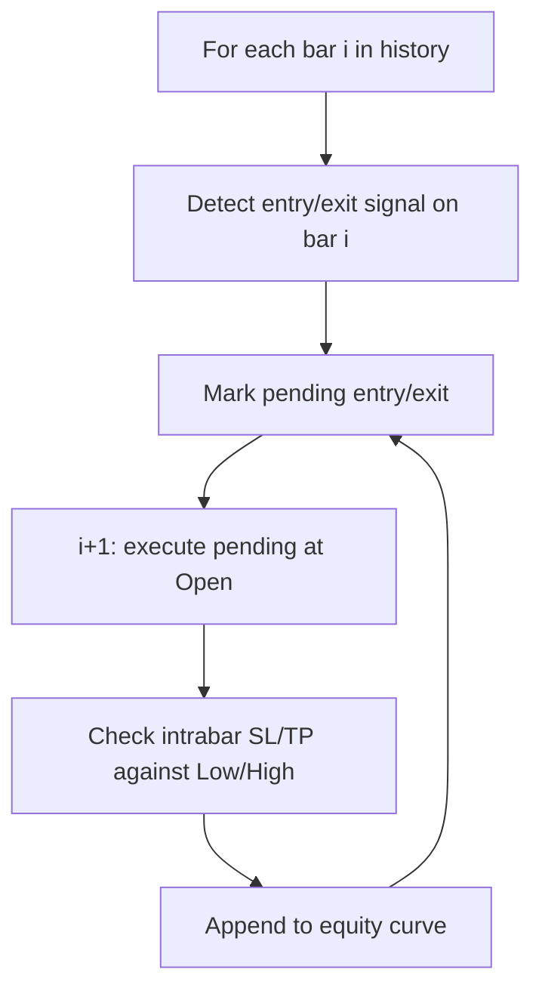

# Backtesting — what it is

The backtesting module **replays a trading strategy against historical candles**
and reports how it would have performed. It is a single-bar event-driven
simulator with realistic fills, slippage, and commissions.

Backtesting answers the question "would this strategy have made money on this
symbol over the last N years?". It does not trade. It does not promise future
results.

## What you can do with it

- **List the six available strategies** with `GET /backtesting/strategies`.
- **Run a backtest** with `POST /backtesting/run` — symbol, strategy, years,
  capital, commission, stop-loss, take-profit, position size.

The response includes the equity curve, every trade with entry/exit reason,
and 20+ performance metrics (CAGR, Sharpe, Sortino, Calmar, max drawdown, win
rate, profit factor, expectancy, alpha vs buy-and-hold, monthly returns).

## The six strategies

| Strategy | Logic | Direction |
|---|---|---|
| **SMA Crossover** | Buy when SMA-20 crosses above SMA-50. Sell on death cross. | Trend-following |
| **RSI Mean Reversion** | Buy when RSI < 35 (oversold). Sell when RSI > 65 (overbought). | Counter-trend |
| **MACD Crossover** | Buy on MACD bullish cross above signal. Sell on bearish cross. | Momentum |
| **Bollinger Band Bounce** | Buy when close touches lower BB. Sell at upper BB. | Mean-reversion |
| **EMA Trend** | Buy when EMA-20 crosses above SMA-50. Sell on reverse. | Fast trend filter |
| **Golden Cross (SMA50/200)** | Buy on Golden Cross (SMA-50 > SMA-200). Sell on Death Cross. | Long-term |

All six are **long-only**. There is no short-selling path. Strategies that
require >200 bars of history (Golden Cross) silently disable on shorter
histories.

## The simulation model



Three rules that make the simulation honest:

1. **Signal on bar `i` → fill on bar `i+1` open.** No look-ahead bias.
   Today's close is not known at today's open.
2. **Slippage is 0.05%** in the unfavourable direction for every fill.
3. **Commission is `commission_pct` of the trade value** on both entry and
   exit, deducted from capital.

Optional stop-loss and take-profit are checked against the **intrabar low /
high**, not the close. If both SL and TP would trigger on the same bar, SL
wins (the safer assumption).

## What the metrics mean

| Metric | What it tells you |
|---|---|
| **CAGR** | Compound annual growth rate — average yearly return assuming compounding |
| **Sharpe** | Return per unit of total volatility (annualised) |
| **Sortino** | Return per unit of downside volatility — ignores upside wiggles |
| **Calmar** | CAGR divided by max drawdown — return per unit of pain |
| **Max drawdown** | Worst peak-to-trough equity drop (negative %) |
| **Drawdown duration** | Longest streak of days in a drawdown |
| **Win rate** | % of trades with positive PnL |
| **Profit factor** | Gross wins / gross losses. > 1.5 is good, < 1.0 is losing |
| **Expectancy** | Average PnL per trade in ₹ |
| **Alpha** | Strategy CAGR minus buy-and-hold CAGR |

The risk-free rate for Sharpe/Sortino is hardcoded at 6% annualised (Indian
government securities).

## A real example

You run `SMA Crossover` on RELIANCE.NS over 5 years with ₹100,000 starting
capital, 0.1% commission, 5% stop-loss:

```json
{
  "final_equity": 142000,
  "total_ret_pct": 42.0,
  "cagr": 7.3,
  "sharpe": 1.1,
  "sortino": 1.4,
  "calmar": 0.9,
  "max_dd": -8.2,
  "dd_dur_days": 47,
  "total_trades": 38,
  "wins": 22,
  "losses": 16,
  "win_rate": 57.9,
  "avg_win": 4.2,
  "avg_loss": 2.1,
  "profit_factor": 1.95,
  "alpha": 1.8,
  "bh_ret": 35.0,
  "bh_cagr": 6.2
}
```

The strategy beat buy-and-hold by 1.8% CAGR (alpha). Sharpe 1.1 means the
return per unit of volatility was decent. Max drawdown −8.2% with 47 days
underwater.

## Why a separate module

- **Strategy logic is dense.** Six strategies × entry/exit detection × SL/TP
  rules × metrics would clutter any other module.
- **Each strategy is a single-file change.** Adding a seventh strategy means
  adding one entry to `STRATEGIES`, `STRATEGY_DESCRIPTIONS`, and `entry_signal`
  / `exit_signal` switches in `_run_backtest_sync`.
- **Output is large but stable.** The shape of the response is fixed; only the
  numbers change per run.

## Where it lives in the codebase

- Backend code: `backend/app/modules/backtesting/`
- Backend dev notes: `backend/docs/backtesting/`
- Indicator library: `ta` (https://github.com/bukosabino/ta)
- Candle source: `market_data.get_history` (cached)
- Frontend API client: `frontend/lib/api/backtest.ts`
- Frontend hook: `frontend/lib/hooks/use-backtest.ts`
- Frontend consumer: backtest page (`/app/backtest`)

## Consumed by (frontend pages and other modules)

- [Backtest](../../pages/backtest/overview.md) — the only consumer on the frontend.
  The strategy selector, the equity curve, the metrics panel, and the trade log
  all render the backtest result.
- Module: [Market data](../market-data/overview.md) — fetches the historical candles
  (via Redis cache).
- Module: [Analytics](../analytics/overview.md) — computes the indicators that the
  strategies need (SMA, EMA, RSI, MACD, BB, Donchian).

## Related pages in this folder

- [How it works](how-it-works.md) — the event loop, the signal-then-fill rule,
  every strategy's threshold, the metrics math.
- [Implementation](implementation.md) — file map, the engine code, period map,
  schemas, request trace, gotchas.