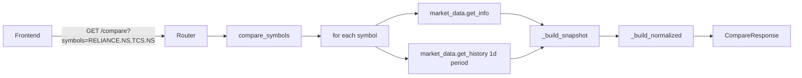

# Compare — how it works

This page walks through the period mapping, the snapshot builder, and the
normalisation algorithm.

## The big picture



Two parallel `await`s per symbol, then a single linear pass to build the
response. The whole call is fast (1–2 seconds, dominated by the two
`market_data` calls per symbol).

## Period mapping

```python
_PERIOD_MAP = {
    "1mo": "2y", "3mo": "2y", "6mo": "2y",
    "1y": "2y",
    "3y": "5y", "5y": "5y",
}
```

The compare module accepts six periods. Yahoo Finance does not support
"1mo" or "3mo" as a `period` literal — it only has `1mo, 3mo, 6mo, 1y, 2y,
5y, 10y, ytd, max`. The module uses the longer period then filters or
normalises from a common start. For "1mo" through "1y" it fetches 2 years
of data (the 1-year window is contained within); for "3y" and "5y" it
fetches 5 years.

The normalisation in `_build_normalized` uses the **intersection of all
symbol dates** as the start. So if you ask for "1y" and the symbols have
different start dates, the common start is the later one.

## Step 1 — Build per-symbol snapshot

`_build_snapshot(symbol, info, df)`:

```python
last_price = float(info.get("currentPrice") or info.get("regularMarketPrice") or 0)
change_pct = float(info.get("regularMarketChangePercent") or 0)
volume = int(info.get("regularMarketVolume") or 0)
market_cap = info.get("marketCap")
pe_ratio = info.get("trailingPE")
high_52w = info.get("fiftyTwoWeekHigh")
low_52w = info.get("fiftyTwoWeekLow")
```

These come from `market_data.get_info`, which is a pass-through of yfinance's
`Ticker.info` dict. The `or 0` fallbacks handle missing keys gracefully.

Then **local indicator computation** — the compare module does not use
`analytics.add_indicators`. It computes its own SMA, RSI, MACD from the
history:

```python
if df is not None and len(df) >= 20:
    close = df["Close"]
    sma_20 = float(close.rolling(20).mean().iloc[-1])
    if len(df) >= 50:
        sma_50 = float(close.rolling(50).mean().iloc[-1])

    delta = close.diff()
    gain = delta.clip(lower=0).rolling(14).mean()
    loss = (-delta.clip(upper=0)).rolling(14).mean()
    rs = gain / loss.replace(0, float("nan"))
    rsi_s = 100 - (100 / (1 + rs))
    rsi_drop = rsi_s.dropna()
    if len(rsi_drop) > 0:
        rsi_val = float(rsi_drop.iloc[-1])

    if len(df) >= 26:
        ema12 = close.ewm(span=12, adjust=False).mean()
        ema26 = close.ewm(span=26, adjust=False).mean()
        macd_line = ema12 - ema26
        sig_line = macd_line.ewm(span=9, adjust=False).mean()
        macd_val = float(macd_line.iloc[-1])
        macd_sig = float(sig_line.iloc[-1])
        macd_hist = float(macd_line.iloc[-1] - sig_line.iloc[-1])
```

This is a stripped-down version of the `analytics` module — just the four
indicators the compare view needs, computed from the raw history. The
`len(df) >= N` guards prevent crashes on short histories.

## Step 2 — Build the normalised overlay

`_build_normalized(hist_map)`:

```python
all_dates = None
for df in hist_map.values():
    dates = set(df.index.strftime("%Y-%m-%d"))
    all_dates = dates if all_dates is None else all_dates & dates
```

`hist_map` is `{symbol: DataFrame}`. The intersection of all date sets is
the dates when **every** symbol traded. This is the "common trading days".

```python
sorted_dates = sorted(all_dates)
if len(sorted_dates) < 2:
    return []
```

Need at least 2 points (start and end) to draw a line. If any symbol has a
mismatched calendar (e.g. recent IPO), the intersection may be smaller than
expected.

```python
base_prices: dict[str, float] = {}
for sym, df in hist_map.items():
    for d in sorted_dates:
        ts = pd.Timestamp(d)
        if ts in df.index:
            base_prices[sym] = float(df.loc[ts, "Close"])
            break
    else:
        base_prices[sym] = 1.0
```

Each symbol's **base price** = the close on the first common trading day.
The `for...else` is a Python pattern: the `else` runs if the inner loop
completes without `break`. Here it means "if the first common date was not
in this symbol's history, fall back to 1.0" (effectively skipping it).

```python
result = []
for d in sorted_dates:
    ts = pd.Timestamp(d)
    vals = {}
    for sym, df in hist_map.items():
        if ts in df.index:
            raw = float(df.loc[ts, "Close"])
            vals[sym] = round((raw / base_prices[sym]) * 100, 2)
    if vals:
        result.append({"date": d, "values": vals})
```

For each common date, compute `(close / base) × 100` for every symbol that
traded on that day. The result is `{date, values: {symbol: 100.x}}`. The
`if vals` guard skips days where **no** symbol has data (should not happen
since we intersected, but defensive).

## Step 3 — The display name

```python
_NAMES = {
    "RELIANCE.NS": "Reliance Industries",
    "TCS.NS": "Tata Consultancy Services",
    ...
}

def _get_name(symbol: str) -> str:
    if symbol in _NAMES:
        return _NAMES[symbol]
    clean = symbol.replace(".NS", "").replace(".BO", "")
    return clean.replace("^", "").replace(".", " ").title()
```

A hardcoded map for the most common Nifty 50 tickers. Unknown symbols get
a derived name: `HDFCBANK.NS` → `Hdfcbank`, `^NSEI` → `Nsei`, `RELIANCE.BO`
→ `Reliance`. The `title()` call is naive but readable for the common case.

## What can go wrong

| Symptom | Cause |
|---|---|
| `400 Provide at least 2` | Only 1 symbol in the query |
| `400 Maximum 4` | More than 4 symbols in the query |
| Empty `normalized` | Less than 2 common trading days across all symbols |
| Snapshot shows 0 for everything | `market_data.get_info` returned an empty dict. Check the symbol. |
| MACD/RSI is `None` | Less than 14 / 26 bars of history for that symbol |
| Different start dates in the chart | The intersection of trading days. The earlier-starting symbol's pre-common period is hidden. |
| Symbol name looks wrong | Not in the `_NAMES` map. The fallback `title()` is naive. |

Related: [implementation](implementation.md) for the file map and helpers.