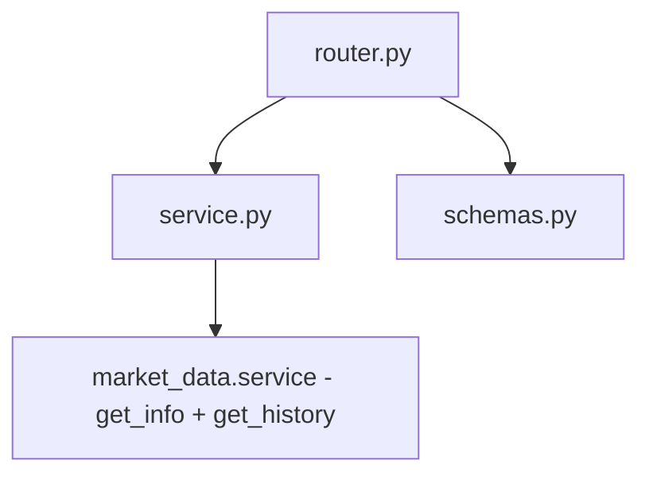
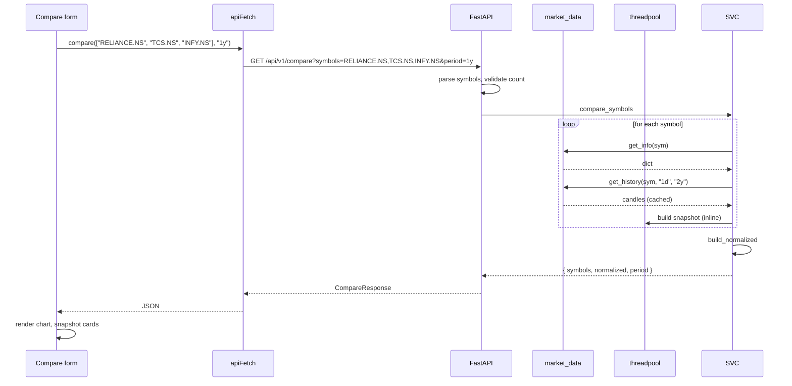

# Compare — implementation (reading the code)

A guide for someone with the repo open. The whole module is ~250 lines across
three files.

## File map



## 1. `backend/app/modules/compare/router.py` (27 lines)

One endpoint, protected.

| Method | Path | Query | Response |
|---|---|---|---|
| `GET` | `/compare` | `symbols` (comma-separated, 2–4) | `CompareResponse` |

The router validates symbol count:

```python
syms = [s.strip() for s in symbols.split(",") if s.strip()]
if len(syms) < 2: raise 400
if len(syms) > 4: raise 400
```

No symbol validation against the instruments list — any ticker that
yfinance recognises will work. The 4-symbol cap is to keep the chart
legible.

## 2. `backend/app/modules/compare/service.py` (184 lines)

Four sections.

### Section A — period map and name map

```python
_PERIOD_MAP = {"1mo": "2y", "3mo": "2y", "6mo": "2y", "1y": "2y",
               "3y": "5y", "5y": "5y"}

_NAMES = {
    "RELIANCE.NS": "Reliance Industries",
    "TCS.NS": "Tata Consultancy Services",
    ...
}
```

`_NAMES` covers the 20 Nifty 50 constituents as of the last update.
Anything else falls back to the title-case transformation.

### Section B — `_get_name(symbol)`

```python
def _get_name(symbol: str) -> str:
    if symbol in _NAMES:
        return _NAMES[symbol]
    clean = symbol.replace(".NS", "").replace(".BO", "")
    return clean.replace("^", "").replace(".", " ").title()
```

A two-tier lookup. Known symbols get their curated name; unknown symbols
get a derived name like `HDFCBANK` → `Hdfcbank`. Not pretty, but readable.

### Section C — `_build_snapshot(symbol, info, df)`

Builds the per-symbol data row:

```python
def _build_snapshot(symbol, info, df):
    last_price = float(info.get("currentPrice") or info.get("regularMarketPrice") or 0)
    change_pct = float(info.get("regularMarketChangePercent") or 0)
    ...
    if df is not None and len(df) >= 20:
        close = df["Close"]
        sma_20 = float(close.rolling(20).mean().iloc[-1])
        if len(df) >= 50:
            sma_50 = float(close.rolling(50).mean().iloc[-1])
        # RSI, MACD ...
    return {
        "symbol": symbol,
        "name": _get_name(symbol),
        "last_price": round(last_price, 2),
        ...
    }
```

The function reads from `info` (yfinance metadata) and `df` (history).
The `or 0` chain on every field handles missing keys. Every numeric is
rounded to 2 decimals before returning.

The indicator computation (SMA-20/50, RSI-14, MACD) is a local copy — not
imported from `analytics`. The compare module is self-contained.

### Section D — `_build_normalized(hist_map)`

Builds the overlay series:

```python
def _build_normalized(hist_map):
    all_dates = None
    for df in hist_map.values():
        dates = set(df.index.strftime("%Y-%m-%d"))
        all_dates = dates if all_dates is None else all_dates & dates
    if not all_dates:
        return []
    sorted_dates = sorted(all_dates)
    if len(sorted_dates) < 2:
        return []
    
    base_prices = {}
    for sym, df in hist_map.items():
        for d in sorted_dates:
            ts = pd.Timestamp(d)
            if ts in df.index:
                base_prices[sym] = float(df.loc[ts, "Close"])
                break
        else:
            base_prices[sym] = 1.0
    
    result = []
    for d in sorted_dates:
        ts = pd.Timestamp(d)
        vals = {}
        for sym, df in hist_map.items():
            if ts in df.index:
                raw = float(df.loc[ts, "Close"])
                vals[sym] = round((raw / base_prices[sym]) * 100, 2)
        if vals:
            result.append({"date": d, "values": vals})
    return result
```

The algorithm has three phases:

1. **Intersect dates** — find the dates when every symbol traded.
2. **Find base prices** — for each symbol, the close on the first common date.
3. **Rebase** — for each common date, compute `(close / base) × 100`.

The `for...else` pattern at step 2 is unusual: the `else` runs if the
inner loop completed without `break`. It handles the case where the first
common date is missing from this symbol's history (unusual but possible
if the symbol was suspended or its data was amended).

### Section E — `compare_symbols(symbols, period)`

The async public API:

```python
async def compare_symbols(symbols, period="1y"):
    clean_syms = [s.strip().upper() for s in symbols]
    yf_period = _PERIOD_MAP.get(period, "2y")
    
    async def _fetch_one(sym):
        try:
            info = await market_data.get_info(sym)
        except Exception:
            info = {}
        try:
            candles = await market_data.get_history(sym, "1d", yf_period)
            df = pd.DataFrame(candles)
            # ... rename columns to Title Case
        except Exception:
            df = None
        return info, df
    
    results = [await _fetch_one(s) for s in clean_syms]
    
    snapshots = []
    hist_map = {}
    for sym, (info, df) in zip(clean_syms, results):
        snapshots.append(_build_snapshot(sym, info, df))
        if df is not None and "Close" in df.columns and len(df) > 10:
            hist_map[sym] = df
    
    normalized = _build_normalized(hist_map)
    
    return {
        "symbols": snapshots,
        "normalized": normalized,
        "period": period,
    }
```

Notes:

- Symbols are uppercased. `"reliance.ns"` and `"RELIANCE.NS"` are the same.
- `_fetch_one` swallows exceptions on both info and history. A bad symbol
  gets an empty info and a None df — the snapshot will have 0s.
- The `len(df) > 10` check before adding to `hist_map` is to skip near-empty
  DataFrames. The intersection would be near-empty anyway.
- The `results = [await _fetch_one(s) for s in clean_syms]` runs the fetches
  sequentially. For 2–4 symbols, this is fine. A future improvement is
  `asyncio.gather` for parallel fetches.

## 3. `backend/app/modules/compare/schemas.py` (37 lines)

| Schema | Shape |
|---|---|
| `CompareRequest` | `{ symbols: [str] (2-4), period: str (default "1y") }` |
| `SymbolSnapshot` | 14 fields — see overview |
| `NormalizedPoint` | `{ date: str, values: dict[str, float] }` |
| `CompareResponse` | `{ symbols: [SymbolSnapshot], normalized: [NormalizedPoint], period: str }` |

The `values` dict on `NormalizedPoint` is intentionally `dict[str, float]`
— any symbol key is valid. Pydantic does not constrain the keys.

## 4. Frontend wiring

| File | Purpose |
|---|---|
| `frontend/lib/api/compare.ts` | `compare(symbols, period)` |
| `frontend/lib/hooks/use-compare.ts` | `useCompare(symbols, period)` |
| `frontend/app/(app)/compare/page.tsx` | The form + chart + snapshot cards |
| `frontend/app/(app)/compare/components/NormalizedChart.tsx` | Renders the multi-line overlay |
| `frontend/app/(app)/compare/components/SnapshotCard.tsx` | Renders one symbol's data |

The form has a symbol picker (autocomplete from `instruments`) and a period
dropdown. The submit triggers the mutation; the result drives the chart and
the snapshot cards.

## 5. End-to-end request trace

You compare RELIANCE, TCS, INFY over 1y:



Three sequential fetches per symbol. With caching, this is fast (~500ms total).
The normalised chart is pure CPU work on the DataFrames.

## 6. Common gotchas

- **One bad symbol poisons nothing.** `_fetch_one` catches exceptions. The
  bad symbol's snapshot will have 0s; the other symbols render normally.
- **Empty `normalized` on a 3-symbol compare.** If one symbol has a
  mismatched calendar (e.g. recent IPO), the intersection may be tiny. Drop
  the IPO and try again.
- **Snapshot shows 0 for everything.** `market_data.get_info` returned an
  empty dict. Check the ticker on Yahoo.
- **Symbol name looks wrong.** Not in `_NAMES`. Update the map for curated
  names; the `title()` fallback is the safety net.
- **Indicator is `None`.** Less than 14/26/50 bars. Normal for very new
  symbols.
- **Chart starts at different points.** The first common trading day. If
  one symbol started trading a month later than the others, the chart's
  first point is the later start.
- **`len > 10` filter is arbitrary.** A symbol with 11 daily bars will
  appear in the snapshot but not the normalised overlay. Bump the threshold
  to 20 if this matters.

## 7. Adding a comparison metric

Quick recipe for, say, **Sharpe ratio per symbol**:

1. **Compute in `_build_snapshot`**:
   ```python
   daily_ret = close.pct_change().dropna()
   sharpe = float(daily_ret.mean() / daily_ret.std() * np.sqrt(252)) if daily_ret.std() > 0 else None
   ```

2. **Add to the returned dict**:
   ```python
   return {..., "sharpe": round(sharpe, 2) if sharpe is not None else None}
   ```

3. **Add to `SymbolSnapshot`** in `schemas.py`:
   ```python
   class SymbolSnapshot(BaseModel):
       ...
       sharpe: float | None = None
   ```

4. **Display in the snapshot card** on the frontend.

## Related

- Backend dev notes: `backend/docs/compare/`.
- Source: [market-data](../market-data/overview.md).
- Frontend page docs: [compare](../../pages/compare.md).
- Parent module page: [overview](overview.md).