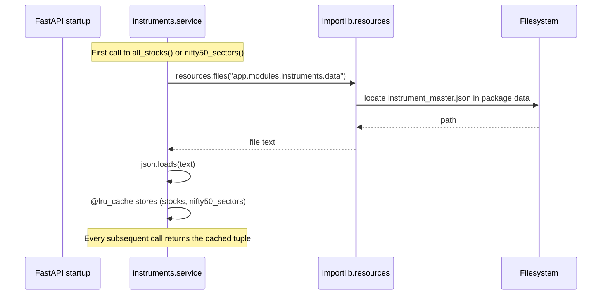
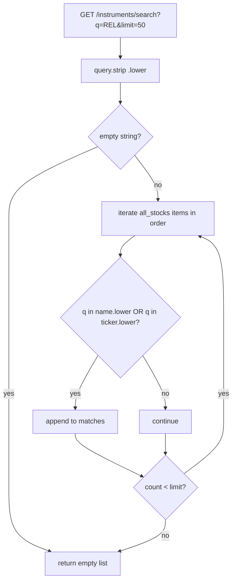
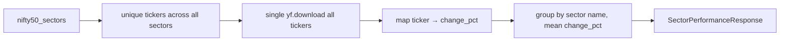

# Instruments — how it works

This page explains the search algorithm and how the JSON file gets loaded.

## The big picture

```mermaid
flowchart LR
    A[App startup] --> B[importlib.resources reads instrument_master.json]
    B --> C[@lru_cache stores parsed JSON]
    D[GET /instruments/search?q=rel] --> E[search_stocks q]
    E --> F[all_stocks iterates cached dict]
    F --> G[substring match q in name.lower OR ticker.lower]
    G --> H[truncate to limit]
    H --> I[InstrumentSearchResponse]
```

The whole module fits in your head: one JSON file, one cached loader, one
substring filter.

## How the file is loaded



The `@lru_cache(maxsize=1)` decorator means:

- The file is read **once per process**. Subsequent calls are in-memory dict access.
- Different processes each load the file once. Multi-worker deployments read the
  file N times on startup.
- The cache is keyed on argument identity. With no args, the cache is "one entry
  total" — exactly what we want.

`importlib.resources.files(...)` is the modern way to read package data. It works
whether the package is on disk (dev) or inside a zip (wheel install). No more
`os.path.dirname(__file__)` hacks.

## How search works



A few things to notice:

- **Order is preserved.** Results come back in the same order as the JSON file. UI
  listings rely on this — the first match is always the most "important" symbol.
- **The filter is a substring on both fields.** That is why typing `rel` matches
  "Reliance Industries" by name and `^NSEI` by ticker (no, wait — that does not
  match; `rel` is not in `^NSEI`). Name match wins for partial words.
- **Limit is a hard cap.** `limit=50` by default, max 200. The frontend rarely asks
  for more than 10.
- **Empty query short-circuits.** No point iterating 300 entries for `q=""`.

## How sector grouping works

`nifty50_sectors()` returns the second part of the JSON. It is consumed by
`market_data._sector_performance_impl()`:



The same `_load_asset()` cached tuple provides both halves. No second file read,
no second cache.

## What can go wrong

| Symptom | Cause |
|---|---|
| Search returns nothing for a known symbol | The symbol is not in `instrument_master.json`. Add it. |
| Sector treemap shows "Unknown" stocks | A ticker in `nifty50_sectors` is not in Yahoo (renamed, delisted). |
| `FileNotFoundError` on first request | The data file is missing from the wheel. Reinstall the package. |
| Duplicate matches | Two names with the same ticker (e.g. "Reliance" and "RIL"). Keep both — the user picks. |
| Stale results after editing the JSON | Restart the server — `@lru_cache` holds the old version until then. |

## Adding a new symbol

Three steps:

1. Add `"Company Name": "TICKER.NS"` to the `stocks` dict in
   `instrument_master.json`. Keep insertion order — add at the end of the right
   sector or group.
2. If the ticker is part of NIFTY 50, also add it to `nifty50_sectors` under the
   right sector with `[ticker, label, mcap_crores]`.
3. Restart the backend.

There is no admin UI for this. The file is the source of truth.

Related: [implementation](implementation.md) for the file map and helper details.