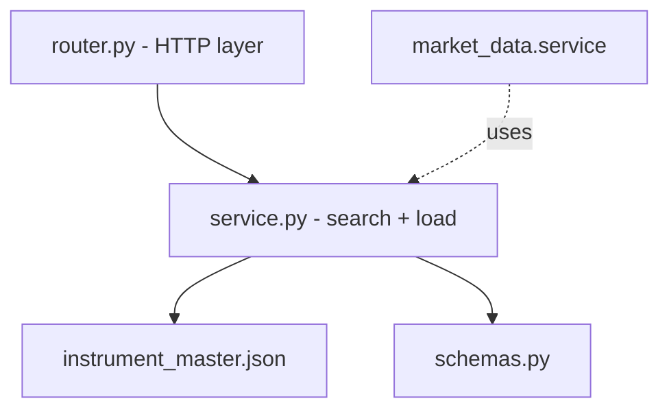
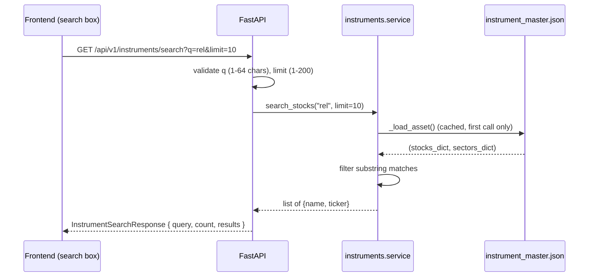

# Instruments — implementation (reading the code)

A guide for someone with the repo open. Read the files in this order.

## File map



## 1. `backend/app/modules/instruments/data/instrument_master.json`

The data file. Two top-level keys:

| Key | Type | Purpose |
|---|---|---|
| `stocks` | ordered `dict[str, str]` | `human name → Yahoo ticker` (e.g. `"Reliance Industries": "RELIANCE.NS"`) |
| `nifty50_sectors` | `dict[str, list[list]]` | `sector → [[ticker, label, mcap], ...]` |

The `stocks` dict mixes indices (`"Nifty 50": "^NSEI"`) and equities. Order matters:
results from search preserve this order.

The `nifty50_sectors` value is a list of triples, not objects, because the file is
hand-curated and brevity helps. Consumers unpack as `ticker, label, mcap = row`.

The file lives in `app/modules/instruments/data/` and is exposed as package data
via `__init__.py` (or the implicit package-data declaration when installed).

## 2. `backend/app/modules/instruments/service.py` (44 lines)

Four functions.

### `_load_asset()`

```python
@lru_cache(maxsize=1)
def _load_asset() -> tuple[dict[str, str], dict[str, list[list]]]:
    raw = resources.files(DATA_PACKAGE).joinpath(ASSET_NAME).read_text(encoding="utf-8")
    payload = json.loads(raw)
    return payload["stocks"], payload["nifty50_sectors"]
```

Reads `instrument_master.json` via `importlib.resources`, parses JSON, returns the
two halves as a tuple. `@lru_cache(maxsize=1)` caches the result forever — no
arguments, no eviction. The first caller pays the cost; every other caller gets a
tuple for free.

`DATA_PACKAGE = "app.modules.instruments.data"` and `ASSET_NAME = "instrument_master.json"`.
If you move or rename the file, update these two constants.

### `all_stocks()`

Returns `payload["stocks"]` — the ordered name → ticker dict. The market-data
sector implementation calls this to enumerate the universe.

### `search_stocks(query, limit=50)`

```python
q = query.strip().lower()
if not q:
    return []
matches = [
    {"name": name, "ticker": ticker}
    for name, ticker in all_stocks().items()
    if q in name.lower() or q in ticker.lower()
]
return matches[:limit]
```

The whole search algorithm in five lines. Substring match (case-insensitive) on
both name and ticker, preserves dict order, truncates to `limit`.

Notes:

- The result includes both name and ticker because the search response schema
  (`Instrument`) needs both.
- Limit is `[:limit]` — a slice, not a counter. Slicing is fine for small lists;
  no need to break out early.

### `nifty50_sectors()`

Returns `payload["nifty50_sectors"]`. Consumed by `market_data._sector_performance_impl`.

## 3. `backend/app/modules/instruments/router.py` (34 lines)

Two endpoints, both under `/api/v1/instruments/`, both protected by
`get_current_user`.

| Method | Path | Query | Response |
|---|---|---|---|
| `GET` | `/instruments` | — | `InstrumentListResponse` |
| `GET` | `/instruments/search` | `q` (1–64 chars), `limit` (1–200, default 50) | `InstrumentSearchResponse` |

The list endpoint returns the entire catalogue. The frontend calls it once on app
load to populate the sidebar.

The search endpoint validates `q` is non-empty (Pydantic Query validator) and
returns the matched instruments.



## 4. `backend/app/modules/instruments/schemas.py` (19 lines)

| Schema | Shape |
|---|---|
| `Instrument` | `{ name: str, ticker: str }` |
| `InstrumentListResponse` | `{ count: int, instruments: [Instrument] }` |
| `InstrumentSearchResponse` | `{ query: str, count: int, results: [Instrument] }` |

`count` lets the frontend show "12 results" without re-counting.

## 5. Adding a new symbol

You want to add "Zomato" (now Eternal Ltd).

1. **Edit the JSON file**:
   ```json
   "stocks": {
       ...
       "Eternal": "ETERNAL.NS",   // append to preserve existing order
       "Zomato (legacy)": "ZOMATO.NS"  // optional, for back-compat
   }
   ```

2. **If it is in NIFTY 50**, also add to `nifty50_sectors`:
   ```json
   "nifty50_sectors": {
       "Internet & New Economy": [
           ["ETERNAL.NS", "Eternal Ltd", 180000],
           ...
       ]
   }
   ```

3. **Restart the backend** — the `@lru_cache` won't pick up the change otherwise.

4. **If Yahoo doesn't recognise the ticker**, `/market/quote?symbol=ETERNAL.NS`
   will return 404. Use `curl` to verify the ticker on `finance.yahoo.com` first.

## 6. Regenerating the master file

`backend/scripts/seed_instruments.py` (referenced in the dev notes; not always
present in the repo) is the script that produces the JSON. Run it when NSE
rebalances NIFTY 50, or quarterly to pick up new listings. The refresh date goes
in the backend README; tracked as B-04 in `plan/todo.md`.

## 7. Frontend wiring

| File | Purpose |
|---|---|
| `frontend/lib/api/instruments.ts` | `list()` → all instruments, `search(q)` → filtered |
| `frontend/lib/hooks/use-instruments.ts` | `useInstruments()` (cache once), `useSearch(query)` (debounced) |
| `frontend/components/symbol-search.tsx` | Sidebar autocomplete |
| `frontend/components/search/command-palette.tsx` | `⌘K` palette |

The `useInstruments` hook caches the full list in React state / SWR for the
session so the user does not hit the network on every keystroke. The
`useSearch` hook is debounced (300 ms typical) before firing.

## 8. Common gotchas

- **Stale data after editing the JSON.** Restart the backend. The
  `@lru_cache(maxsize=1)` survives process lifetime.
- **Empty results in production but works in dev.** The wheel may not include
  `app/modules/instruments/data/`. Check `MANIFEST.in` or `pyproject.toml`'s
  package-data section.
- **Search is case-insensitive but accent-sensitive.** "HDFC" matches; "HDFC
  Bank" matches; "HDFC_Bank" matches the ticker. "L&T" does not match "Larsen"
  because the substring `lt` is not in `larsen and toubro`.
- **Unicode.** Company names are stored in their original form (e.g.
  "भारतीय"). Search normalises the query with `.lower()`; Unicode-aware case
  folding handles most cases. Diacritics stay as-is.
- **Cross-module use.** `market_data.service._sector_performance_impl` calls
  `instruments.nifty50_sectors()` directly. If you ever split instruments into
  a separate service (microservice, gRPC), this import breaks first — make it
  an HTTP call instead.

## Related

- Backend dev notes: `backend/docs/instruments/`.
- Consumer: [market-data](market-data/overview.md) (uses `nifty50_sectors`).
- Frontend page docs: [search](../../pages/search.md).
- Parent module page: [overview](overview.md).