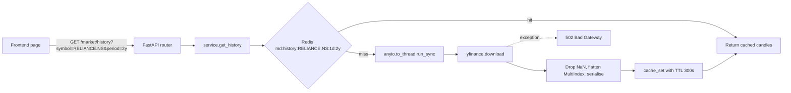
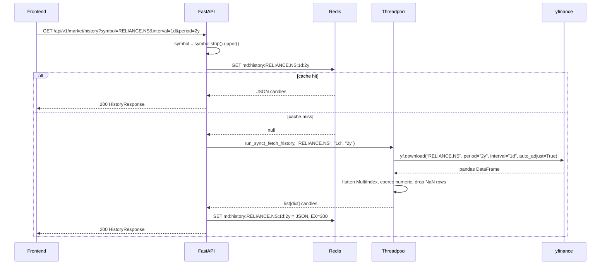
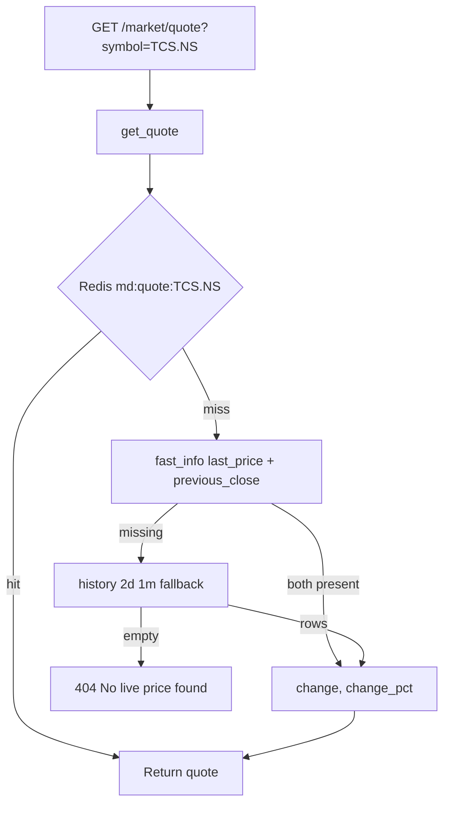
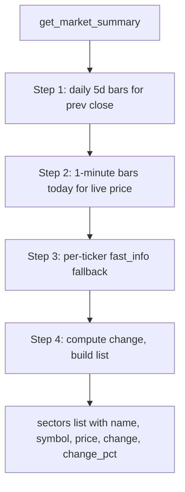
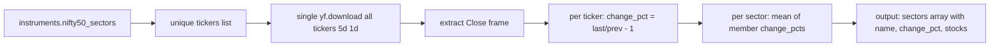

# Market data — how it works

This page explains how a single `/history` request travels through the system, and how
the module handles Yahoo's quirks (multi-index columns, NaN values, empty frames).

## The big picture

Three things to notice:

- **The synchronous Yahoo call runs in a threadpool.** `yfinance` is blocking. The
  FastAPI event loop is async. Running the call in `anyio.to_thread.run_sync(...)`
  means the server can keep handling other requests while Yahoo thinks.
- **Every call goes through Redis.** Cache TTLs vary by how often the data changes.
  Quotes are 30s, history 5min, info 10min, summary 1min, movers 1min, sectors 5min.
- **Cache failures do not break the call.** `cache_get` and `cache_set` swallow
  Redis errors and log a warning. If Redis is down, the module still serves fresh
  data from Yahoo — just slower.

## Cache TTLs (where they come from)

| Endpoint | TTL | Why |
|---|---|---|
| `/history` | 300 s (5 min) | Daily candles do not change every second |
| `/info` | 600 s (10 min) | Company metadata is mostly static |
| `/quote` | 30 s | Live price — keep it fresh |
| `/market-summary` | 60 s | Index moves during the day |
| `/gainers-losers` | 60 s | Top movers change every few minutes |
| `/sector-performance` | 300 s | 50 tickers per call — keep upstream load low |

These match the original Streamlit `st.cache_data` decorators from `app.py`, kept
deliberately so behaviour does not change between the old and new backend.

## The history endpoint — end to end

### Inside `_fetch_history`

1. Call `yf.download(symbol, period, interval, progress=False, auto_adjust=True)`.
   - `auto_adjust=True` adjusts historical OHLC for splits and dividends. This matches
     Yahoo's displayed adjusted close and keeps long-term charts continuous.
2. If the result is empty, raise `404 No data found for 'XYZ'.` — this is the
   "symbol not found" path.
3. If columns are a `MultiIndex` (happens when Yahoo returns OHLC + Volume as
   stacked levels), flatten to the top level.
4. Coerce OHLCV to numeric with `pd.to_numeric(errors="coerce")`. Bad cells become
   `NaN`.
5. Drop rows where any of Open/High/Low/Close is `NaN`. Volume `NaN` is kept as `None`.
6. For each row, build `{ time, open, high, low, close, volume }`. `time` is the
   pandas timestamp as ISO 8601 (UTC for daily/weekly/monthly bars).
7. Return as a list of dicts (JSON-serialisable).

The `_finite()` helper maps `NaN` and `±inf` to `None` so Pydantic and JSON both
behave. This matters because yfinance regularly returns `inf` for volume on illiquid
symbols.

## The quote endpoint — three layers deep

Why the fallback? Yahoo's `fast_info` is the fast path but it occasionally returns
nothing (rate-limited, server hiccup, ticker with no last trade). Falling back to
`history(period="2d", interval="1m")` and reading the last two close prices is the
last resort. If both fail, the user gets a 404 — not a fabricated price.

## Market summary — the hardest one

Five indices: Nifty 50, Sensex, Bank Nifty, IT, Gold. The endpoint combines three
data sources to get a "live price vs previous close" picture:

If the daily download fails (network hiccup), Step 1 returns empty — Step 3 fills
in `previous_close` via `fast_info`. If the minute download fails, Step 3 fills in
`last_price`. The goal is to return a partial result whenever possible rather than
fail the whole summary because one source is down.

If after all three steps there are no live prices at all, `502 Yahoo Finance index
feed unavailable.` This is rare.

## Sector performance

This is the most expensive call: ~50 tickers in one batched download.

The 5-minute cache on `md:sectors` is critical here — without it, every dashboard
refresh would hammer Yahoo with 50 tickers.

## Maintenance notes

The `MOVERS_TICKERS` list in `service.py` has a comment dated **2026-08** flagging
two renames:

- `TATAMOTORS.NS` → `TMPV.NS` (Tata Motors demerger)
- `ZOMATO.NS` → `ETERNAL.NS` (Eternal Ltd rebrand)

If you are debugging a 404 on a ticker that "should work", check this list and
`app/modules/instruments/data/instrument_master.json` first.

## What can go wrong

| Symptom | Cause |
|---|---|
| `404 No data found for 'XYZ'` | Bad ticker, or Yahoo has no data for that symbol |
| `502 Yahoo Finance … failed` | Yahoo is down or rate-limiting this server |
| Empty `candles` array but no error | Symbol has data but every row had NaN OHLC — almost never happens |
| Stale quote | Cached for 30s — wait or invalidate the key |
| Sector heatmap blank | Yahoo returned all NaN for the 5d batch — usually a bad market day |

Related: [implementation](implementation.md) for the file map and helper details.