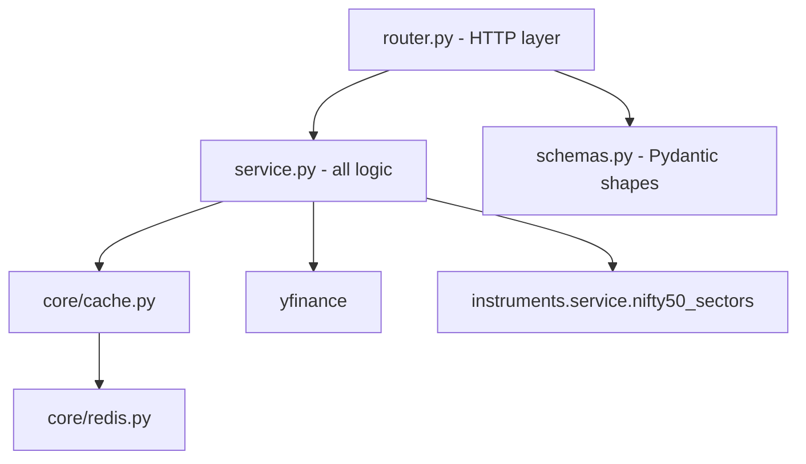
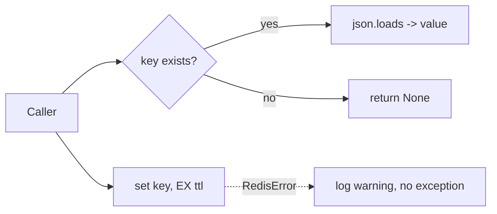
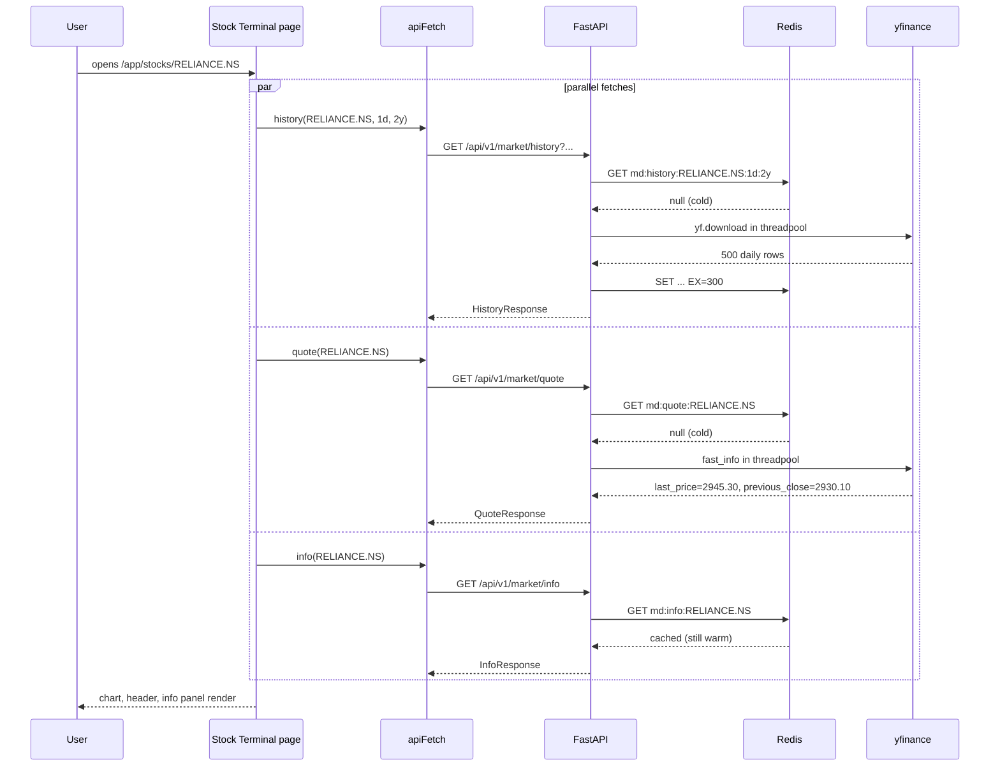

# Market data — implementation (reading the code)

A guide for someone with the repo open. Read the files in this order.

## File map

## 1. `backend/app/modules/market_data/router.py` (71 lines)

Six endpoints. The router has `dependencies=[Depends(get_current_user)]`, so every
call requires a valid `sv_access` cookie.

| Method | Path | Query | Response model | Service call |
|---|---|---|---|---|
| `GET` | `/history` | `symbol` (req), `interval` (`"1d"`/`"1wk"`/`"1mo"`), `period` (`"2y"`/`"5y"`/`"10y"`) | `HistoryResponse` | `get_history(symbol, interval, period)` |
| `GET` | `/quote` | `symbol` (req) | `QuoteResponse` | `get_quote(symbol)` |
| `GET` | `/info` | `symbol` (req) | `InfoResponse` | `get_info(symbol)` |
| `GET` | `/market-summary` | — | `MarketSummaryResponse` | `get_market_summary()` |
| `GET` | `/sector-performance` | — | `SectorPerformanceResponse` | `get_sector_performance()` |
| `GET` | `/gainers-losers` | — | `GainersLosersResponse` | `get_gainers_losers()` |

All routes live under `/api/v1/market/`. The router normalises the symbol with
`symbol.strip().upper()` before any service call so `"reliance.ns "` becomes
`"RELIANCE.NS"`.

The literal types `service.Interval` and `service.Period` (defined as `Literal[...]`
in `service.py`) drive FastAPI's query-param validation. Sending `interval=4h`
returns a 422 from FastAPI before the handler runs.

## 2. `backend/app/modules/market_data/service.py` (426 lines)

Three layers, top to bottom:

### Layer A — constants and types

| Name | Value | Purpose |
|---|---|---|
| `Interval` | `Literal["1d", "1wk", "1mo"]` | API accepts these only |
| `Period` | `Literal["2y", "5y", "10y"]` | API accepts these only |
| `INDICES` | dict of 5 `name → ticker` | Nifty 50, Sensex, Bank Nifty, IT, Gold |
| `MOVERS_TICKERS` | list of 20 NSE large-caps | Source for gainers/losers |
| `HISTORY_TTL` | 300 s | History cache |
| `INFO_TTL` | 600 s | Info cache |
| `QUOTE_TTL` | 30 s | Quote cache |
| `SUMMARY_TTL` | 60 s | Market summary cache |
| `MOVERS_TTL` | 60 s | Gainers/losers cache |
| `SECTOR_TTL` | 300 s | Sector performance cache |

### Layer B — small helpers

| Helper | What it does |
|---|---|
| `_not_found(detail)` | Builds a `404 HTTPException` |
| `_upstream(detail)` | Builds a `502 HTTPException` for upstream failures |
| `_finite(value)` | `float(value)` that maps `NaN`/`inf` to `None` |
| `_extract_close_df(raw)` | Pulls the `Close` frame from a possibly-MultiIndex Yahoo download |
| `_with_cache(key, ttl, func, *args)` | The async wrapper: cache → threadpool → cache_set |

### Layer C — synchronous Yahoo functions (run in threadpool)

| Function | Yahoo calls | Output |
|---|---|---|
| `_fetch_history(symbol, interval, period)` | `yf.download(...)` once | `list[dict]` of OHLCV rows |
| `_fetch_info(symbol)` | `yf.Ticker(symbol).info` once | `dict[str, Any]` of metadata |
| `_fetch_quote(symbol)` | `fast_info`, then `history(period="2d", interval="1m")` fallback | `{ price, previous_close, change, change_pct }` |
| `_fetch_market_summary()` | daily 5d batch + minute 1d batch + per-ticker fast_info fallback | `list[dict]` of index quotes |
| `_fetch_gainers_losers()` | daily 5d batch + minute 1d batch over 20 tickers | `{ gainers: [...5], losers: [...5] }` |
| `_sector_performance_impl()` | one batched download of all NIFTY 50 tickers + mean-aggregation | `{ sectors: [{name, change_pct, stocks:[...]}] }` |

Each function raises:

- `404` when the symbol exists but Yahoo has no data.
- `502` when the upstream call fails (network, rate limit, parse error).

### Layer D — async public API

| Function | Cache key | TTL | Threadpool target |
|---|---|---|---|
| `get_history(symbol, interval, period)` | `md:history:{symbol}:{interval}:{period}` | 300 | `_fetch_history` |
| `get_quote(symbol)` | `md:quote:{symbol}` | 30 | `_fetch_quote` |
| `get_info(symbol)` | `md:info:{symbol}` | 600 | `_fetch_info` |
| `get_market_summary()` | `md:summary` | 60 | `_fetch_market_summary` |
| `get_gainers_losers()` | `md:movers` | 60 | `_fetch_gainers_losers` |
| `get_sector_performance()` | `md:sectors` | 300 | `_sector_performance_impl` |

Note: `get_sector_performance` is hand-rolled (not using `_with_cache`) because it
needs a slightly different structure — single key, single TTL, but the inner
function does its own aggregation across two calls.

## 3. `backend/app/modules/market_data/schemas.py` (76 lines)

| Schema | Shape |
|---|---|
| `Candle` | `{ time: str, open: float, high: float, low: float, close: float, volume: float \| None }` |
| `HistoryResponse` | `{ symbol, interval, period, count, candles: [Candle] }` |
| `QuoteResponse` | `{ symbol, price, previous_close \| None, change \| None, change_pct \| None }` |
| `InfoResponse` | `{ symbol, info: dict[str, Any] }` |
| `IndexQuote` | `{ name, symbol, price, change, change_pct }` |
| `MarketSummaryResponse` | `{ indices: [IndexQuote] }` |
| `Mover` | `{ symbol, price, change, change_pct }` |
| `GainersLosersResponse` | `{ gainers: [Mover], losers: [Mover] }` |
| `SectorStock` | `{ ticker, label, mcap, change_pct \| None }` |
| `SectorPerformance` | `{ name, change_pct \| None, stocks: [SectorStock] }` |
| `SectorPerformanceResponse` | `{ sectors: [SectorPerformance] }` |

`InfoResponse.info` is deliberately typed as `dict[str, Any]` — Yahoo's metadata
shape is huge and unstable across versions, so we pass through whatever we get.

## 4. `backend/app/core/cache.py` (32 lines)

Two functions, both swallow Redis errors so a Redis outage degrades the system
(worse latency) but does not break it.

| Function | What it does |
|---|---|
| `cache_get(key) → Any \| None` | `GET key`, return `json.loads` or `None` |
| `cache_set(key, value, ttl_seconds)` | `SET key json.dumps(value) EX ttl` |

Used by every market-data async function. Also used by `analytics`, `signals`,
`ml`, and `sentiment`.

## 5. `backend/app/core/redis.py` (30 lines)

A shared async Redis client. `get_redis()` returns a singleton `redis.asyncio`
client built from `settings.redis_url`. The client is closed on FastAPI shutdown
via the lifespan handler in `backend/app/main.py`.

## 6. `backend/app/modules/instruments/data/instrument_master.json`

A curated JSON file loaded by `instruments.service._load_asset()`. Has two top-level
keys:

- `stocks`: ordered dict of `name → Yahoo ticker`. Includes indices, NSE/BSE
  equities, and thematic tickers. Order is preserved for stable UI listings.
- `nifty50_sectors`: dict of `sector name → [[ticker, label, mcap], ...]`. Used by
  `market_data._sector_performance_impl`.

If you add a new symbol, append it here. The file is read once per process
(`@lru_cache`) and lives in the package data directory so it ships with the wheel.

## 7. Frontend wiring

| File | Purpose |
|---|---|
| `frontend/lib/api/market.ts` | Typed wrappers: `history(symbol, interval, period)`, `quote(symbol)`, `info(symbol)`, `marketSummary()`, `sectorPerformance()`, `gainersLosers()` |
| `frontend/lib/hooks/use-market.ts` | React hooks for each: `useHistory`, `useQuote`, `useInfo`, etc. Each wraps the API call in `useSWR` or `useQuery` with the right cache key. |
| `frontend/app/(app)/dashboard/page.tsx` | Consumer — index cards from `/market-summary` |
| `frontend/app/(app)/markets/page.tsx` | Consumer — gainers/losers + summary |
| `frontend/app/(app)/sectors/page.tsx` | Consumer — sector treemap |
| `frontend/app/(app)/stocks/[symbol]/page.tsx` | Consumer — history + quote + info |

The hooks are responsible for invalidating the cache when the user changes the
symbol. The server cache (Redis) is independent.

## 8. A complete request trace

You open `/app/stocks/RELIANCE.NS`:

Three requests fire in parallel. The browser does not wait for any one to finish
before showing the others.

## 9. Common gotchas

- **MultiIndex columns.** `yf.download([...symbols...])` returns columns as a
  MultiIndex. `_extract_close_df` only handles the case where the top level is the
  field name (`Open`/`Close`/etc.). Some Yahoo responses put the symbol first; if
  you see empty results for sector performance, check the column order in
  `_sector_performance_impl`.
- **`auto_adjust=True`.** All downloads use adjusted prices. Backtesting and chart
  view agree on the same numbers. If you switch to `auto_adjust=False`, dividends
  and splits will create visible gaps.
- **Cache invalidation.** There is no admin endpoint to bust the cache. To force a
  refresh after Yahoo fixes a wrong number, manually `DEL md:quote:RELIANCE.NS` in
  Redis.
- **Symbol case.** Yahoo is case-insensitive on `.NS` but not always on `.BO`. The
  router uppercases everything; that is fine for NSE.
- **NaN volume.** Some illiquid tickers have `volume=NaN` for many rows. The
  `_finite` helper maps those to `None`, which serialises as JSON `null`.
- **`MOVERS_TICKERS` rot.** As of 2026-08, `TATAMOTORS.NS` is dead (renamed
  `TMPV.NS`) and `ZOMATO.NS` is now `ETERNAL.NS`. Both fixes are in the file. New
  renames will need similar updates here **and** in
  `instruments/data/instrument_master.json`.

## Related

- Backend dev notes: `backend/docs/market_data/` — caching, fallback strategies,
  test fixtures.
- Frontend page docs: [dashboard](../../pages/dashboard.md), [stock-terminal](../../pages/stock-terminal.md),
  [markets](../../pages/markets.md), [sectors](../../pages/sectors.md).
- Parent module page: [overview](overview.md).