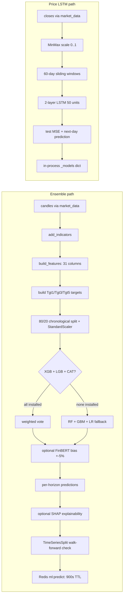
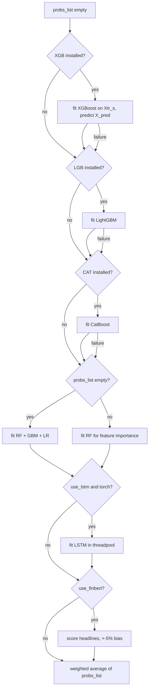
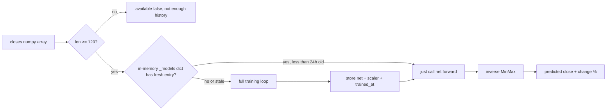

# ML — how it works

This page walks through the full ensemble pipeline, the price LSTM training, and
the background-job system. Read it once and the rest of the file is mechanical.

## The big picture



The ensemble is the heavy compute path. The price LSTM is fast (a few hundred
ms) and cached per symbol for 24 hours in memory.

## Capability flags

`capabilities.py` imports optional libraries at module load and sets a flag:

```python
try:
    import xgboost as xgb
    XGB_OK = True
except ImportError:
    xgb = None
    XGB_OK = False
```

Same pattern for `lightgbm`, `catboost`, `torch`, `shap`. `sklearn` is a hard
dependency — `active_ensemble()` always returns at least `["RF", "GBM", "LR"]`.

`GET /ml/capabilities` returns the boolean map plus `active_ensemble` — what
the frontend shows in the "Models used" line.

## Step 1 — Feature engineering

`features.build_features(df, sector)` takes the indicator-enriched DataFrame
and adds ~25 derived columns.


Two things to know:

- All divisions use `+ 1e-9` to avoid divide-by-zero on quiet tickers.
- `SECTOR_ID` maps Yahoo's sector string to an integer (Technology → 0,
  Financial Services → 1, etc.); unknown sectors map to −1.

## Step 2 — Targets

```python
fd["Tgt1"] = (fd["Close"].shift(-1) > fd["Close"]).astype(int)
fd["Tgt3"] = (fd["Close"].shift(-3) > fd["Close"]).astype(int)
fd["Tgt5"] = (fd["Close"].shift(-5) > fd["Close"]).astype(int)
```

Each target is `1` if the close N days later is higher than today's close, `0`
otherwise. The shift(-N) means the last N rows have NaN targets and are
dropped.

## Step 3 — Split + scale

```python
fd.replace([np.inf, -np.inf], np.nan, inplace=True)
fd.dropna(inplace=True)
if len(fd) < 100:
    return None

sp = int(len(X_all) * 0.80)
Xtr, Xte = X_all[:sp], X_all[sp:]
ytr, yte = y_all[:sp], y_all[sp:]
sc_ = StandardScaler()
Xtr_s = sc_.fit_transform(Xtr)
Xte_s = sc_.transform(Xte)
X_pred = sc_.transform(X_all[-1].reshape(1, -1))
```

Notes:

- `inf` values are replaced with NaN, then rows with NaN are dropped. This
  catches edge cases where division produced infinities.
- 100 rows minimum. Below that, the model cannot learn.
- The scaler is fit on train only — never on test. Otherwise test data leaks.
- `X_pred` is the **last row** in scaled form — this is what gets predicted.

## Step 4 — Models vote



Each model appends `(up_probability, weight)` to `probs_list`. Final ensemble
probability is the weighted average plus the optional sentiment bias:

```python
total_w = sum(w for _, w in probs_list)
ens_up = sum(p * w for p, w in probs_list) / total_w + sent_bias
ens_up = clip(ens_up, 0, 1)
```

### Why each weight?

| Model | Weight | Reason |
|---|---|---|
| XGBoost | 4 | Strong on tabular, fast on small data |
| LightGBM | 4 | Faster than XGB, similar accuracy |
| CatBoost | 3 | Slightly lower typical accuracy |
| LSTM | 2 | Smaller sample after windowing, weaker signal |
| RF / GBM / LR (fallback) | 3 / 3 / 1 | RF and GBM strong; LR weak but adds diversity |

## Step 5 — Walk-forward check

```python
tscv = TimeSeriesSplit(n_splits=5)
wf_accs = []
for tr_i, te_i in tscv.split(X_all):
    _m = RandomForestClassifier(n_estimators=100, max_depth=6, random_state=42, n_jobs=-1)
    _sc = StandardScaler()
    _m.fit(_sc.fit_transform(X_all[tr_i]), y_all[tr_i])
    wf_accs.append(_m.score(_sc.transform(X_all[te_i]), y_all[te_i]))
wf_acc = float(np.mean(wf_accs)) * 100
```

5 time-series folds. Each fold trains on earlier data, tests on later data.
The reported `walk_fwd_acc` is the mean across folds.

This number is the **honest accuracy estimate**. The single train/test split
is optimistic; walk-forward is realistic.

## Step 6 — SHAP (optional)

If `shap` is installed and RF was trained:

```python
_shap_exp = caps.shap.TreeExplainer(rf_)
_shap_vals = _shap_exp.shap_values(Xte_s)
```

SHAP gives per-feature attribution — "why did the model say UP?". Two outputs:

- `importance`: mean absolute SHAP value per feature (top 10).
- `waterfall`: SHAP values for the **current** prediction, sorted by absolute
  impact (top 10).

If SHAP is not installed or fails, `shap_result = { ok: false, error: ... }`.
The frontend shows "SHAP unavailable" when this happens.

## Step 7 — Predicted price (ATR-scaled)

The model returns UP/DOWN, not a price. The service layer builds a rough
predicted price by scaling today's ATR by conviction:

```python
_expected_move = _atr_now * (0.5 + 0.5 * _conviction)
_pred_price = _last_close + (_expected_move if pc == 1 else -_expected_move)
```

- `_conviction = abs(ens_up - 0.5) * 2` — 0 at 50/50, 1 at 100/0.
- `_expected_move` ranges from 0.5× ATR (low conviction) to 1× ATR (high
  conviction).
- Sign matches the prediction direction.

This is a heuristic, not a model output. The LSTM price forecast below is the
real price prediction.

## Step 8 — Confidence tier

```python
if conf >= 75:   tier = "HIGH"
elif conf >= 60: tier = "MEDIUM"
else:            tier = "LOW"
```

The frontend renders these as green / gold / red badges.

## The price LSTM (separate path)

`price_lstm.forecast_from_closes(symbol, closes)` is a different model with a
different output: a single number (tomorrow's predicted close).



Training details:

- **Architecture**: 2 stacked LSTM layers of 50 units each, dropout 0.1,
  followed by a linear head. Mirrors `plan/lstm.py`.
- **Lookback**: 60 days. Each training sample is the last 60 closes.
- **Scaler**: MinMax (0–1), per-symbol. Fitted on the input.
- **Loss**: MSE on scaled values.
- **Optimizer**: Adam lr=1e-3.
- **Epochs**: 12.
- **Batch**: 32.
- **Split**: 80/20 chronological.
- **Seed**: 42 (reproducible).

The trained model lives in `_models[symbol]` for 24 hours. After that, it
retrains. This means a fresh process restarts the model for every symbol.

### Why MinMax, not StandardScaler?

Price series have different absolute scales per symbol. StandardScaler would
normalize the mean/std but keep the magnitudes; MinMax forces everything to
[0, 1] so the LSTM learns the *shape* of price evolution, not the absolute
level.

## The background-job system

`jobs.py` is a tiny in-process registry:

```python
def create_job(symbol: str, coro) -> str:
    job_id = uuid.uuid4().hex[:12]
    _jobs[job_id] = {"job_id": job_id, ...}
    _job_futures[job_id] = asyncio.create_task(_run(job_id, coro))
    return job_id

async def _run(job_id: str, coro) -> None:
    try:
        result = await coro
        _jobs[job_id]["result"] = result
        _jobs[job_id]["status"] = "done"
    except Exception as exc:
        _jobs[job_id]["error"] = str(exc)
        _jobs[job_id]["status"] = "error"
```

`POST /ml/predict` calls `create_job(symbol, service.predict(...))`. The
service itself caches its result in Redis (15-minute TTL) so subsequent calls
do not retrain.

The job registry survives for the process lifetime. There is no persistence —
restart and jobs vanish. The Redis cache survives, so the **result** of a
finished job is still served.

The docstring notes a planned migration to `arq` (Redis-backed task queue) for
multi-worker deployments. The HTTP contract stays identical.

## What can go wrong

| Symptom | Cause |
|---|---|
| `404 Not enough price history` | Fewer than 120 daily bars; try a longer-history symbol |
| `walk_fwd_acc ≈ 50%` | Model is at coin-flip accuracy — honest signal |
| `confidence < 60` (LOW tier) | Ensemble is uncertain — most common outcome |
| `shap.ok = false` | SHAP not installed or feature importances failed |
| Ensemble uses only RF+GBM+LR | No booster libraries installed (XGB/LGB/CAT missing) |
| LSTM price forecast missing | `torch` not installed |
| Job status stuck at `running` | The training task is genuinely still running; check the backend logs |
| Job error 500 with `training failed` | The torch training loop raised — usually NaN loss on a degenerate series |

Related: [implementation](implementation.md) for the file map and helper details.