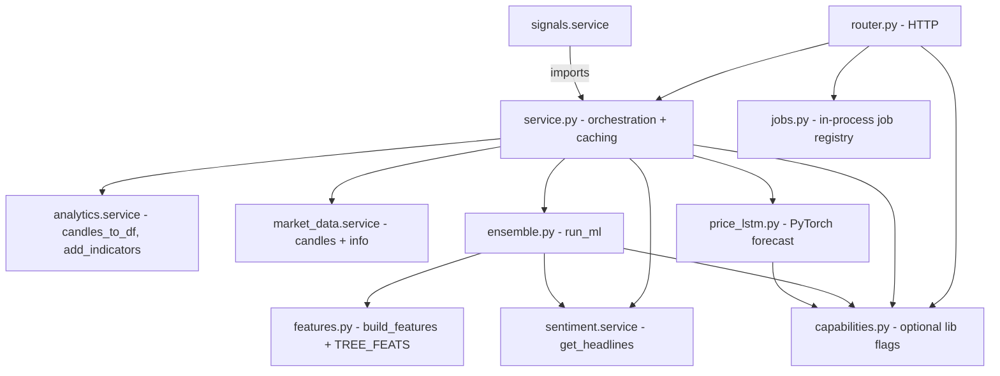
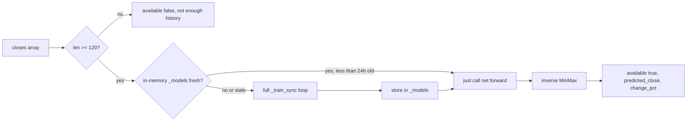
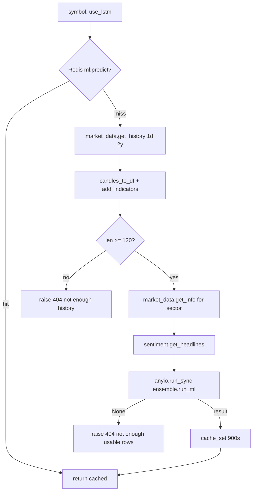
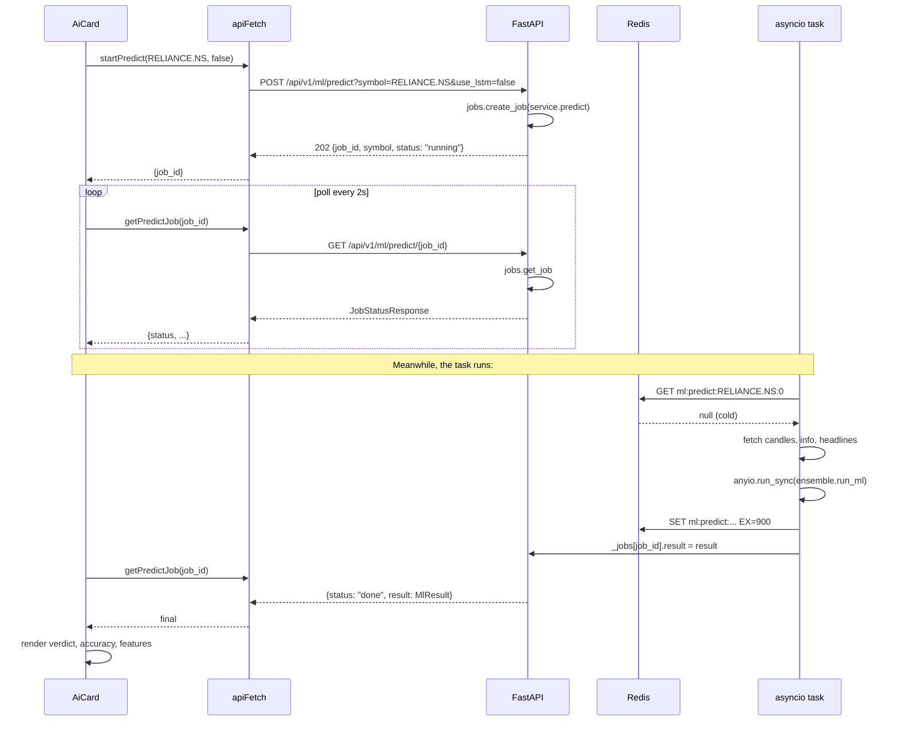
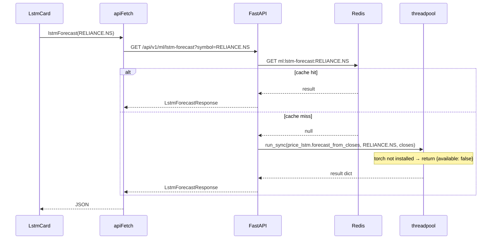

# ML — implementation (reading the code)

A guide for someone with the repo open. The ML module is the largest in the
project — six Python files, ~880 lines, plus the optional-dependency story.
Read in this order.

## File map



## 1. `backend/app/modules/ml/capabilities.py` (75 lines)

Six optional-import blocks at module load:

| Flag | Library | Used by |
|---|---|---|
| `XGB_OK` | `xgboost` | XGBoost direction classifier |
| `LGB_OK` | `lightgbm` | LightGBM direction classifier |
| `CAT_OK` | `catboost` | CatBoost direction classifier |
| `TORCH_OK` | `torch` | LSTM direction + price LSTM |
| `SHAP_OK` | `shap` | SHAP explainability |

`sklearn` is a hard dependency — always present.

Two helpers:

- `capability_map() → dict[str, bool]` — returns the flag dict.
- `active_ensemble() → list[str]` — returns the model names that will actually
  run. Falls back to `["RF", "GBM", "LR"]` if no boosters are installed.

Importing this module has side effects — at startup it tries to import the
heavy libraries. If they are missing, the import is silent and the flag is
False.

## 2. `backend/app/modules/ml/features.py` (84 lines)

`build_features(df, sector="")`:

Takes the indicator-enriched DataFrame and returns a copy with ~30 new columns.
All divisions use `+ 1e-9` to avoid divide-by-zero. The full list of
categories is in `how-it-works.md`.

`TREE_FEATS` is the canonical 31-column list that goes into the tree models.
The first 4 features by typical importance are `R5`, `RN` (RSI/100), `BBP`,
and `MOM5`.

### Important quirks

- `BBP` is `(Close - BB_L) / (BB_H - BB_L + 1e-9)` — a value of 0 means price
  is at the lower band, 1 means upper band, 0.5 means middle.
- `BBW` (bandwidth) is the relative width of the bands — high `BBW` means
  volatile.
- `SECTOR_ID` comes from a hardcoded mapping. Yahoo returns the sector string
  (e.g. "Technology"). Unknown sectors get `-1` and CatBoost treats them as a
  separate category.

## 3. `backend/app/modules/ml/ensemble.py` (326 lines)

The heart of the module. `run_ml(df, sector, headlines, use_lstm, use_finbert)`.

### Step-by-step

```mermaid
flowchart TD
    In[Indicator frame] --> Guard{required cols present?}
    Guard -->|no| Out[return None]
    Guard -->|yes| Feat[build_features]
    Feat --> Tgt[build Tgt1/Tgt3/Tgt5]
    Tgt --> Clean[replace inf, dropna]
    Clean --> MinLen{len >= 100?}
    MinLen -->|no| Out
    MinLen -->|yes| Split[80/20 split + StandardScaler]
    Split --> XGB{XGB?}
    XGB -->|yes| XGBFit[fit XGBoost, score test, predict last]
    XGB -->|no| LGB
    XGBFit --> LGB{LGB?}
    XGBFit -.->|except| LGB
    LGB -->|yes| LGBFit[fit LightGBM]
    LGBFit --> CAT{CAT?}
    CAT -->|yes| CATFit[fit CatBoost]
    CATFit --> Fall{probs_list empty?}
    Fall -->|yes| FB[fit RF + GBM + LR]
    Fall -->|no| RFFI[fit RF for feature importance only]
    RFFI --> LSTMStep
    FB --> LSTMStep
    LSTMStep{use_lstm and TORCH_OK and len >= 150?}
    LSTMStep -->|yes| LSTMFit[20-bar sliding windows, 40 epochs]
    LSTMStep -->|no| SentStep
    LSTMFit --> SentStep
    SentStep{use_finbert and headlines?}
    SentStep -->|yes| Sent[FinBERT score, +-5% bias]
    SentStep -->|no| Vote
    Sent --> Vote[weighted average]
    Vote --> Hor[per-horizon XGB]
    Hor --> Imp[RF feature importance top 6]
    Imp --> SHAP{SHAP_OK?}
    SHAP -->|yes| SHAPCalc[TreeExplainer + waterfall]
    SHAP -->|no| WF
    SHAPCalc --> WF[TimeSeriesSplit walk-forward RF]
    WF --> Tier[confidence tier]
    Tier --> Price[ATR-scaled predicted price]
    Price --> ReturnDict
```



### Model details

**XGBoost** (weight 4):

```python
caps.xgb.XGBClassifier(
    n_estimators=300, max_depth=5, learning_rate=0.05,
    subsample=0.8, colsample_bytree=0.8,
    eval_metric="logloss", random_state=42, n_jobs=-1, verbosity=0,
)
xgb_m.fit(Xtr_s, ytr, eval_set=[(Xte_s, yte)], verbose=False)
xgb_acc = xgb_m.score(Xte_s, yte)
xgb_up = float(xgb_m.predict_proba(X_pred)[0][1])
probs_list.append((xgb_up, 4))
model_accs["XGB"] = round(xgb_acc * 100, 1)
```

Each booster trains with early-stopping-style eval set, scores the test, and
predicts the last row.

**LightGBM** (weight 4) — same structure, different library.

**CatBoost** (weight 3) — uses `SECTOR_ID` as a categorical feature if present.

**Fallback trio** (weights 3 / 3 / 1) — only runs if no booster succeeded.

**LSTM direction** (weight 2, optional) — `LSTMNet` in `ensemble.py:30`:

```python
class LSTMNet(caps.nn.Module):
    def __init__(self, input_size, hidden=64, layers=2, dropout=0.3):
        self.lstm = caps.nn.LSTM(input_size, hidden, num_layers=layers,
                                batch_first=True, bidirectional=True,
                                dropout=dropout if layers > 1 else 0.0)
        self.norm = caps.nn.LayerNorm(hidden * 2)
        self.fc = caps.nn.Sequential(
            caps.nn.Linear(hidden * 2, 32), caps.nn.ReLU(),
            caps.nn.Dropout(dropout), caps.nn.Linear(32, 2),
        )

    def forward(self, x):
        out, _ = self.lstm(x)
        return self.fc(self.norm(out[:, -1, :]))
```

Bidirectional 2-layer LSTM, hidden=64 per direction, LayerNorm on the last
hidden state, MLP head with 32-unit hidden.

Trains for 40 epochs in a tight loop (no DataLoader — direct torch tensors).
Input is 20-day sliding windows of the scaled features. Output is the
classification logits for down/up.

### Per-horizon predictions

```python
for h, col in [(1, "Tgt1"), (3, "Tgt3"), (5, "Tgt5")]:
    yh = fd[col].values
    if len(np.unique(yh)) < 2:  # skip if no variation
        continue
    if caps.XGB_OK:
        hm = caps.xgb.XGBClassifier(
            n_estimators=200, max_depth=4, learning_rate=0.05,
            eval_metric="logloss", random_state=42, n_jobs=-1, verbosity=0,
        )
    else:
        hm = RandomForestClassifier(n_estimators=120, max_depth=6, ...)
    hm.fit(Xtr_s, yh[:sp])
    ph = float(hm.predict_proba(X_pred)[0][1])
    horizon_preds[str(h)] = {"direction": "up" if ph > 0.5 else "down",
                             "prob": round(ph * 100, 1)}
```

Three separate classifiers, one per horizon. The 5-day horizon is the primary
training target, but 1-day and 3-day are reported separately.

### Walk-forward check

Uses `sklearn.model_selection.TimeSeriesSplit` with 5 splits. Each split
trains a fresh RF on the train indices and scores on the test indices. The
mean of 5 fold accuracies is `walk_fwd_acc`.

### SHAP explainability

```python
if caps.SHAP_OK and rf_ is not None:
    _shap_exp = caps.shap.TreeExplainer(rf_)
    _shap_vals_r = _shap_exp.shap_values(Xte_s)
    _shap_vals = _shap_vals_r[1] if isinstance(_shap_vals_r, list) else _shap_vals_r
    _ev = _shap_exp.expected_value
    _base_val = float(_ev[1]) if hasattr(_ev, "__len__") else float(_ev)
    _shap_lat_r = _shap_exp.shap_values(X_pred)
    _shap_lat = _shap_lat_r[1][0] if isinstance(_shap_lat_r, list) else _shap_lat_r[0]
    _mean_abs = np.abs(_shap_vals).mean(axis=0)
    shap_result = {
        "ok": True,
        "importance": sorted(zip(avail_feats, _mean_abs.tolist()),
                             key=lambda x: -x[1])[:10],
        "waterfall": sorted(zip(avail_feats, _shap_lat.tolist()),
                            key=lambda x: -abs(x[1]))[:10],
        "base_value": _base_val,
    }
```

Two outputs:

- `importance`: mean absolute SHAP value across the test set, top 10 features.
- `waterfall`: SHAP values for the **current** prediction, sorted by absolute
  impact.

`expected_value` is the base rate of the model. The waterfall shows how each
feature pushes the prediction above or below the base.

### Predicted price (heuristic)

```python
_last_close = float(fd["Close"].iloc[-1])
_atr_now = float(fd["ATR"].iloc[-1]) if "ATR" in fd.columns else _last_close * 0.015
_conviction = abs(ens_up - 0.5) * 2
_expected_move = _atr_now * (0.5 + 0.5 * _conviction)
_pred_price = _last_close + (_expected_move if pc == 1 else -_expected_move)
```

The price is today's close ± a fraction of today's ATR, scaled by ensemble
conviction. Direction matches the ensemble prediction. This is **not** a model
output — it is a UI hint.

## 4. `backend/app/modules/ml/price_lstm.py` (139 lines)

`_PriceLSTM` class:

```python
class _PriceLSTM(caps.nn.Module):
    def __init__(self, features: int = 1):
        super().__init__()
        self.lstm = caps.nn.LSTM(features, 50, num_layers=2,
                                batch_first=True, dropout=0.1)
        self.head = caps.nn.Sequential(caps.nn.Linear(50, 1))

    def forward(self, x):
        out, _ = self.lstm(x)
        return self.head(out[:, -1, :]).squeeze(-1)
```

Two stacked LSTM layers of 50 units each, dropout 0.1, single linear head.
This is a regression network — outputs one number (next close).

`_train_sync(closes)`:

- MinMax-scale to [0, 1].
- Build 60-day sliding windows.
- 80/20 chronological split.
- Adam lr=1e-3, MSE loss, 12 epochs, batch size 32.
- Final test MSE is reported as `test_mse_scaled`.
- Predict the last 60-day window.

`forecast_from_closes(symbol, closes)`:



The `_models` dict is a per-process cache keyed by symbol. `TRAIN_TTL = 24h`
forces retraining after a day.

`forecast_from_df(symbol, df)` is a convenience that drops NaN closes and calls
`forecast_from_closes`.

## 5. `backend/app/modules/ml/jobs.py` (50 lines)

A tiny in-process async-job registry:

```python
_jobs: dict[str, dict] = {}
_job_futures: dict[str, asyncio.Task] = {}

def create_job(symbol: str, coro) -> str:
    job_id = uuid.uuid4().hex[:12]
    _jobs[job_id] = {"job_id": job_id, "symbol": symbol,
                      "status": "running", "started_at": time.time(),
                      "finished_at": None, "result": None, "error": None}
    _job_futures[job_id] = asyncio.create_task(_run(job_id, coro))
    return job_id

async def _run(job_id, coro):
    try:
        result = await coro
        _jobs[job_id]["result"] = result
        _jobs[job_id]["status"] = "done"
    except Exception as exc:
        _jobs[job_id]["error"] = str(exc)
        _jobs[job_id]["status"] = "error"
    finally:
        _jobs[job_id]["finished_at"] = time.time()
        _job_futures.pop(job_id, None)

def get_job(job_id) -> dict | None:
    return _jobs.get(job_id)
```

`uuid.uuid4().hex[:12]` is a 12-char job id (e.g. `a3f7b29c1d4e`).

`asyncio.create_task` schedules the coroutine. The job dict is updated as the
task progresses.

Caveats:

- **No persistence.** Process restart loses all jobs.
- **No multi-worker.** Two backend processes have two separate registries.
- **No queueing.** N concurrent jobs hold N coroutines in memory.

The planned migration to `arq` (Redis-backed task queue) keeps the HTTP
contract identical — only the registry implementation changes.

## 6. `backend/app/modules/ml/service.py` (97 lines)

Three async functions:

### `predict(symbol, use_lstm=False)`



The cached result survives the process restart (Redis). The job registry does
not.

### `lstm_forecast(symbol)`

```python
if not caps.TORCH_OK:
    return {"available": False, "reason": "torch not installed"}

key = f"ml:lstm-forecast:{symbol}"
cached = await cache_get(key)
if cached is not None:
    return cached

candles = await market_data.get_history(symbol, "1d", "2y")
df = analytics.candles_to_df(candles)
closes = df["Close"].dropna().values.astype(float)

result = await anyio.to_thread.run_sync(price_lstm.forecast_from_closes, symbol, closes)
if result.get("available"):
    await cache_set(key, result, LSTM_TTL)
return result
```

15-minute Redis cache. Per-process in-memory cache in `_models` is separate.

### `evaluate(symbol)`

```python
async def evaluate(symbol):
    result = await predict(symbol)
    return {
        "symbol": symbol,
        "walk_fwd_acc": result["walk_fwd_acc"],
        "model_accs": result["model_accs"],
        "n_train": result["n_train"],
        "n_test": result["n_test"],
        "fold_scores": [],  # reserved
    }
```

Pulls the cached prediction and re-shapes the response. `fold_scores` is a
placeholder for per-fold detail (future work).

## 7. `backend/app/modules/ml/router.py` (60 lines)

Five endpoints under `/api/v1/ml/`, all protected.

| Method | Path | Query | Response |
|---|---|---|---|
| `GET` | `/capabilities` | — | `CapabilitiesResponse` |
| `POST` | `/predict` | `symbol`, `use_lstm` (default `false`) | `JobCreatedResponse` (202 Accepted) |
| `GET` | `/predict/{job_id}` | — | `JobStatusResponse` |
| `GET` | `/lstm-forecast` | `symbol` | `LstmForecastResponse` |
| `GET` | `/eval` | `symbol` | `EvalResponse` |

The POST returns 202 (Accepted) — the work is in progress. The GET endpoint
polls until status is `done` or `error`.

## 8. `backend/app/modules/ml/schemas.py` (82 lines)

| Schema | Shape |
|---|---|
| `CapabilitiesResponse` | `{ sklearn, xgboost, lightgbm, catboost, torch, shap, active_ensemble: [str] }` |
| `JobCreatedResponse` | `{ job_id, symbol, status }` |
| `HorizonPred` | `{ direction, prob }` |
| `FeatureImportance` | `{ feature, importance }` |
| `MlResult` | full prediction output — 19 fields |
| `JobStatusResponse` | `{ job_id, symbol, status, started_at, finished_at, result: MlResult \| None, error }` |
| `LstmForecastResponse` | `{ available, symbol, model, last_close, predicted_close, expected_change_pct, trained_points, test_mse_scaled, reason }` |
| `EvalResponse` | `{ symbol, walk_fwd_acc, model_accs, n_train, n_test, fold_scores }` |

`MlResult` is the schema that matches the `run_ml` return dict field-for-field.

## 9. Frontend wiring

| File | Purpose |
|---|---|
| `frontend/lib/api/ml.ts` | `capabilities()`, `startPredict(symbol, useLstm)`, `getPredictJob(jobId)`, `lstmForecast(symbol)`, `evaluate(symbol)` |
| `frontend/lib/hooks/use-ml.ts` | `useCapabilities`, `useMlPrediction` (job polling), `useLstmForecast`, `useMlEval` |
| `frontend/app/(app)/stocks/[symbol]/components/AiCard.tsx` | Renders the AI card with verdict, accuracy, top features |
| `frontend/app/(app)/stocks/[symbol]/components/ShapChart.tsx` | Renders the SHAP waterfall when available |
| `frontend/app/(app)/stocks/[symbol]/components/LstmCard.tsx` | Renders the LSTM price forecast card |

The job polling hook loops every 2 seconds until the job is `done` or `error`,
then caches the result in React state for the rest of the session.

## 10. End-to-end request trace — predict with job

You open RELIANCE. The AI card mounts:



The user sees "running" briefly, then the full result. Subsequent calls hit
the Redis cache (15 min) and return synchronously through the service without
a job.

## 11. End-to-end request trace — lstm-forecast

You open the LSTM card. It calls:



If `torch` is missing, the response is `{ available: false, reason: "torch
not installed" }` and the card shows "LSTM unavailable".

## 12. Common gotchas

- **`walk_fwd_acc` near 50% on most symbols.** This is honest. Daily direction
  is roughly coin-flip from features alone. Anything consistently above 55% is
  worth attention.
- **Ensemble drops to RF+GBM+LR silently.** If you see `active_models:
  "RF+GBM+LR"` in the response, the boosters are not installed. Install them
  via `pip install -e ".[ml-heavy]"`.
- **LSTM price forecast differs wildly from the ensemble's heuristic price.**
  That's correct — they are independent. The LSTM is a real regression; the
  heuristic is `close ± ATR × conviction`.
- **Job stuck at `running` for over a minute.** The training is genuinely
  taking long. Watch the backend logs. Cancel by killing the process.
- **`shap.ok = false`.** SHAP may fail on a feature with constant value, or
  on an RF that has only one tree. Check the `error` field in the response.
- **`CatBoost` warns about categorical features.** CatBoost requires the
  `SECTOR_ID` to be passed as `cat_features=[...]` if present. The code does
  this; if you add new categorical features, update the call.
- **`features.build_features` modifies the input.** No, it copies first
  (`fd = df.copy()`). But the copy is by-reference for the underlying numpy
  arrays — fine for read-only use, but if you ever mutate `fd["Close"]` after
  calling build_features, the original `df` will see the mutation.
- **Predicted price is None.** The heuristic threw an exception. The most
  common cause is missing ATR (illiquid ticker). The LSTM forecast still works.
- **Job error with `training failed`.** The LSTM's training loop raised. Common
  causes: NaN in input, zero-variance target. Check the input symbols for
  recent corporate actions.
- **`expected_change_pct` is very large.** The LSTM overfit on a small training
  set. `test_mse_scaled` is the honest signal — if it's > 0.05, treat the
  forecast with low confidence.

## 13. Installing the heavy extras

```bash
pip install -e ".[ml-heavy]"
```

This installs XGBoost, LightGBM, CatBoost, PyTorch, and SHAP. The first run
takes a while (PyTorch is large). Subsequent runs use the system's installed
version.

If you want only some of them, install individually:

```bash
pip install xgboost lightgbm catboost
pip install torch --index-url https://download.pytorch.org/whl/cpu
pip install shap
```

For a CPU-only deployment, install PyTorch with the CPU index URL (saves ~1 GB
of CUDA libraries).

## Related

- Backend dev notes: `backend/docs/ml/`.
- Feature source: [analytics](../analytics/overview.md).
- Candle source: [market-data](../market-data/overview.md).
- News source: [sentiment](../sentiment/overview.md).
- Consumer: [signals](../signals/overview.md) (imports `predict`).
- Frontend page docs: [stock-terminal](../../pages/stock-terminal.md).
- Parent module page: [overview](overview.md).