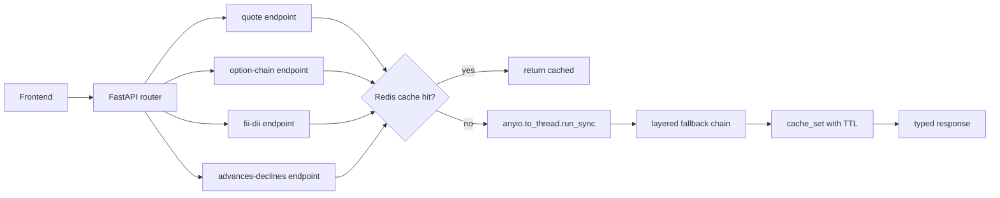
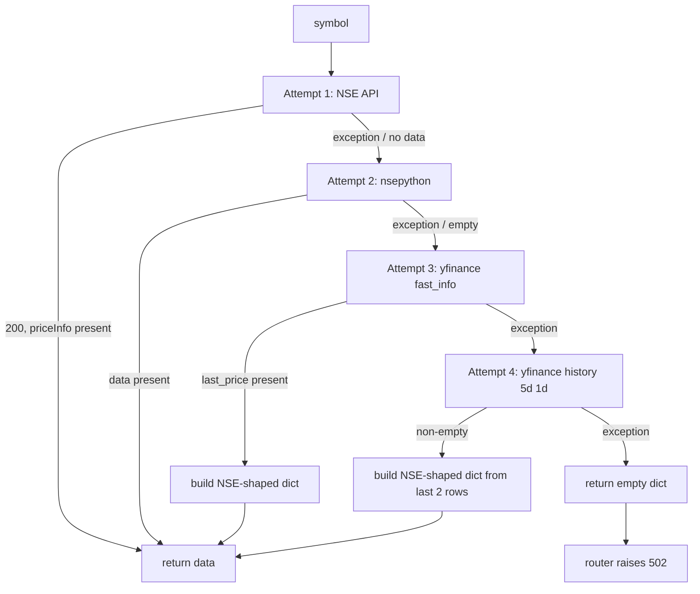
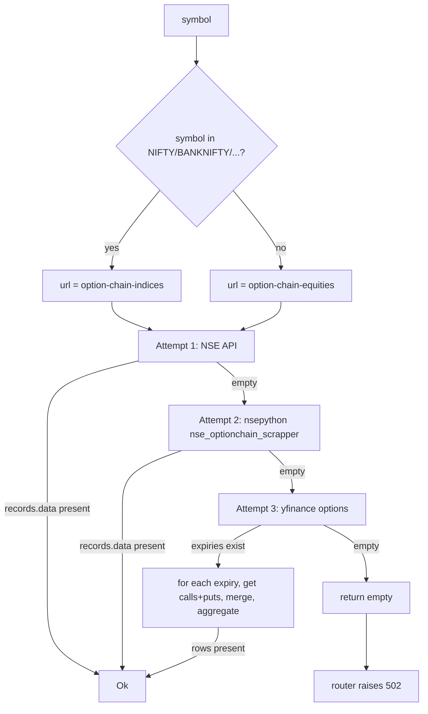
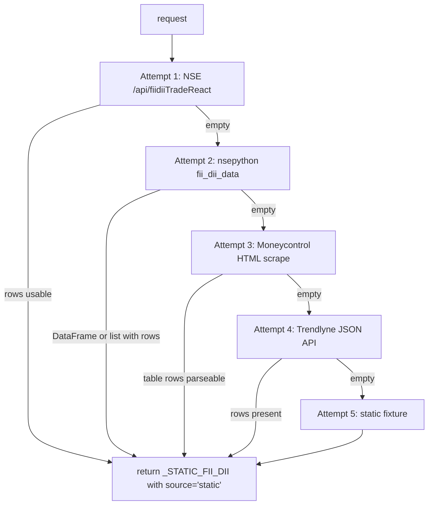
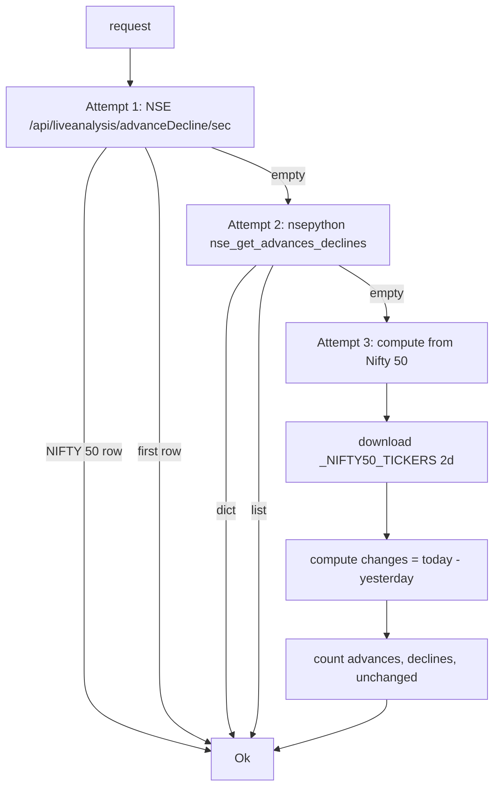

# NSE — how it works

This page walks through the NSE session primer, the four endpoint fallback
chains, and the two derived metrics (PCR and max pain).

## The big picture



The cache check is the first thing. The fallback chain is the slow path. The
cache write happens only on success.

## The NSE session primer

Every NSE call needs cookies set during a real visit. The primer:

```python
def _nse_session() -> requests.Session:
    session = requests.Session()
    try:
        session.get("https://www.nseindia.com", headers=_nse_headers(), timeout=8)
        time.sleep(0.5)
        session.get("https://www.nseindia.com/market-data/live-equity-market",
                    headers=_nse_headers(), timeout=8)
    except Exception:
        pass
    return session
```

The session visits the homepage, waits 500ms, then visits the market-data
page. Both calls set the cookies required by the API endpoints.

The headers mimic a real Chrome 124 on Windows:

```
User-Agent: Mozilla/5.0 ... Chrome/124.0.0.0 Safari/537.36
Accept: application/json, text/plain, */*
Referer: https://www.nseindia.com/
sec-ch-ua: "Chromium";v="124", ...
sec-fetch-mode: cors
sec-fetch-site: same-origin
```

Without these, NSE returns 401. The primer is best-effort — failures are
logged at debug level and the fallback chain takes over.

> The primer does **not** retry. On flaky networks, the first attempt may
> succeed silently but with incomplete cookies, causing the actual API call
> to fail. This is fine because the fallback chain catches it.

## The quote endpoint



The NSE API URL: `https://www.nseindia.com/api/quote-equity?symbol={sym}`

The yfinance attempts construct a **NSE-shaped** dict from the yfinance data,
so the rest of the response normalisation in the router works the same way
regardless of which source served the data.

If all four attempts fail, `get_nse_quote` returns `{}` and the router
raises `502 Bad Gateway` with `detail: "NSE feed unavailable right now."`.

## The option chain endpoint



The yfinance fallback walks the first 6 expiries:

```python
exps = tk.options  # list of date strings
for exp in exps[:6]:
    chain = tk.option_chain(exp)
    calls = chain.calls[["strike", "openInterest", "lastPrice"]]
    puts = chain.puts[["strike", "openInterest", "lastPrice"]]
    # merge on strike, fill NaN with 0
```

The merged result is grouped by strike, summing OI and averaging LTP. This
gives an aggregated chain across all expiries — not the same as NSE's per-
expiry view, but close enough for the strike ladder.

## The FII/DII endpoint

This is the longest fallback chain — five attempts:



The static fixture has 10 days of historical data. It is **flagged** with
`source: "static"` so the UI can show a notice ("Showing last published data").

`_rows_from_api_items` normalises the field names because NSE has changed
them multiple times. The `pick(item, *keys)` helper tries every known
spelling:

```python
def pick(item, *keys):
    for key in keys:
        if key in item:
            return _safe_float(item[key])
    return 0.0
```

`_safe_float` handles commas, em-dashes, and whitespace — scrape values are
messy.

## The advances/declines endpoint



The computed fallback is the most useful one — it always works as long as
yfinance works. The result has `_source: "yfinance-computed"`.

The Nifty 50 ticker list has the same maintenance note as the market-data
module: `TATAMOTORS.NS` was replaced with `TMPV.NS` after the 2026-08 demerger.

## PCR and max pain

Both are derived in `compute_pcr_maxpain(oc_data)`:

```python
def compute_pcr_maxpain(oc_data):
    records = oc_data.get("records", {})
    data = records.get("data", [])
    strikes, ce_ois, pe_ois = [], [], []
    for item in data:
        ce = item.get("CE", {})
        pe = item.get("PE", {})
        strikes.append(item.get("strikePrice", 0))
        ce_ois.append(ce.get("openInterest", 0))
        pe_ois.append(pe.get("openInterest", 0))

    pcr = round(total_pe_oi / total_ce_oi, 3) if total_ce_oi > 0 else None

    def pain_at(strike):
        ce_pain = sum((max(s - strike, 0) * oi) for s, oi in zip(strikes, ce_ois))
        pe_pain = sum((max(strike - s, 0) * oi) for s, oi in zip(strikes, pe_ois))
        return ce_pain + pe_pain

    max_pain_strike = float(min(zip(strikes, map(pain_at, strikes)),
                                key=lambda t: t[1])[0])
    return pcr, max_pain_strike
```

**PCR** = `total put OI / total call OI`. Higher = more put protection
positioned = often interpreted as bullish (institutions hedging against drops).

**Max pain** is the strike that minimises the option-buyer payout. Computed
by evaluating `pain_at(s)` for every strike and picking the minimum. O(n²)
in strikes — fine for typical 20–30 strikes per expiry.

## The router's `_num` helper

```python
def _num(value) -> float:
    try:
        return float(value or 0)
    except (TypeError, ValueError):
        return 0.0
```

Coerces any value (None, string, dict) to a float, defaulting to 0.0 on
failure. Used for every numeric field in the response. The frontend can
trust the shape — every field is a number, never `None`.

## What can go wrong

| Symptom | Cause |
|---|---|
| `502 NSE feed unavailable` | All live sources failed. Check the logs for which attempt was the last. |
| `source: "static"` in FII/DII response | All four live sources failed; the static fixture is being served. The UI should show a notice. |
| `source: "yfinance-computed"` in advances-declines | NSE and nsepython failed; we computed from Nifty 50. |
| PCR is `null` | Total call OI is 0 (degenerate chain). Check the symbol. |
| Max pain is `null` | No strike data at all. |
| Quote shows 0 for everything | All four quote sources failed, then the router's `_num` converted all missing fields to 0.0. |

Related: [implementation](implementation.md) for the file map and the exact URLs.