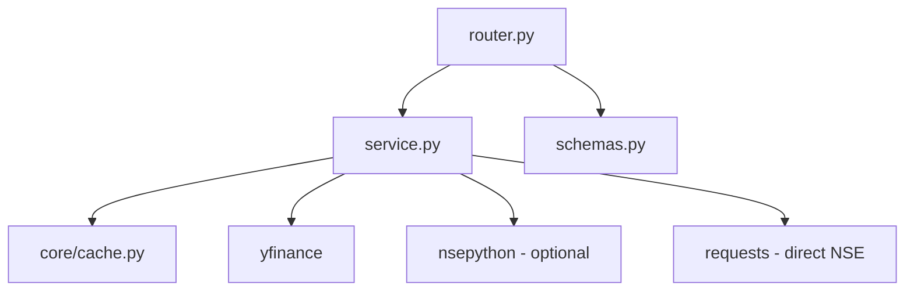
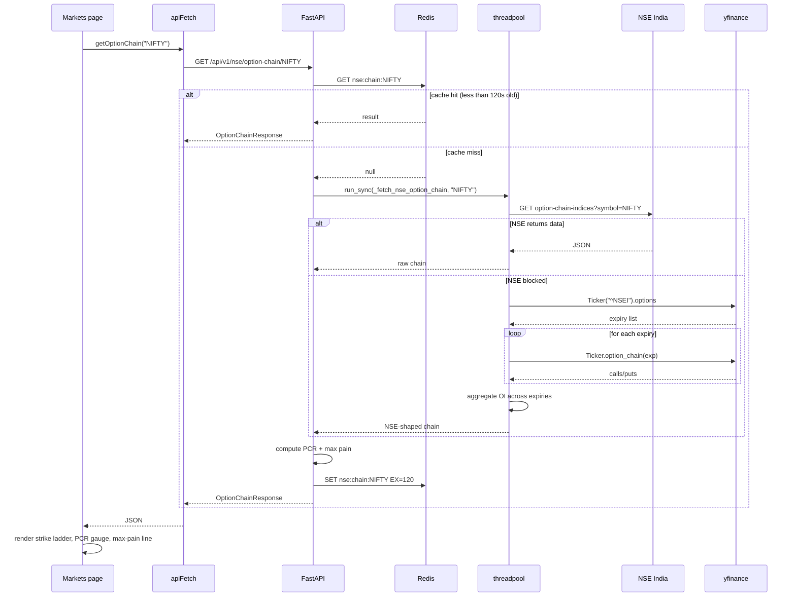

# NSE — implementation (reading the code)

A guide for someone with the repo open. Read in this order.

## File map



## 1. `backend/app/modules/nse/service.py` (650 lines)

Five logical sections.

### Section A — capability flag + cache TTLs

```python
try:
    from nsepython import fii_dii_data, nse_eq, nse_optionchain_scrapper
    NSE_AVAILABLE = True
except Exception:
    NSE_AVAILABLE = False

QUOTE_TTL = 60
CHAIN_TTL = 120
FII_DII_TTL = 300
ADV_DEC_TTL = 120
```

`nsepython` is optional. The fallback chain works without it.

### Section B — NSE session + headers

```python
def _nse_headers() -> dict:
    return {
        "User-Agent": "Mozilla/5.0 ... Chrome/124.0.0.0 Safari/537.36",
        "Accept": "application/json, text/plain, */*",
        "Referer": "https://www.nseindia.com/",
        "X-Requested-With": "XMLHttpRequest",
        "sec-ch-ua": '"Chromium";v="124", ...',
        "Sec-Fetch-Mode": "cors",
        "Sec-Fetch-Site": "same-origin",
        ...
    }

def _nse_session() -> requests.Session:
    session = requests.Session()
    try:
        session.get("https://www.nseindia.com", headers=_nse_headers(), timeout=8)
        time.sleep(0.5)
        session.get("https://www.nseindia.com/market-data/live-equity-market",
                    headers=_nse_headers(), timeout=8)
    except Exception as exc:
        logger.debug("NSE session priming failed: %s", exc)
    return session
```

Each NSE API call creates a new session via `_nse_session()`. The primer
takes ~1 second (the `time.sleep(0.5)` between visits). The session is
discarded after the call.

### Section C — quote chain (`_fetch_nse_quote`)

Four attempts, each in a `try/except`:

| # | Source | What it does |
|---|---|---|
| 1 | NSE `/api/quote-equity` | Direct API call, parses JSON |
| 2 | `nsepython.nse_eq` | If installed, scrapes via the library |
| 3 | `yfinance.Ticker.fast_info` | Falls back to fast_info; builds NSE-shaped dict |
| 4 | `yfinance.Ticker.history(5d, 1d)` | Last resort: uses last 2 daily bars |

Attempts 3 and 4 build the NSE-shaped response from yfinance data, so the
caller does not need to know the source.

### Section D — option chain + PCR/max pain

| # | Source | Notes |
|---|---|---|
| 1 | NSE `/api/option-chain-indices` or `/api/option-chain-equities` | URL depends on whether symbol is an index |
| 2 | `nsepython.nse_optionchain_scrapper` | If installed |
| 3 | `yfinance.Ticker.options` then per-expiry `option_chain` | Aggregates OI across first 6 expiries |

`compute_pcr_maxpain(oc_data)` runs on the raw chain data, regardless of
which source served it.

### Section E — FII/DII chain

| # | Source | Notes |
|---|---|---|
| 1 | NSE `/api/fiidiiTradeReact` | Direct JSON |
| 2 | `nsepython.fii_dii_data()` | Returns DataFrame or list |
| 3 | Moneycontrol HTML scrape | Regex on `<tr>` and `<td>` |
| 4 | Trendlyne JSON API | Public endpoint at `https://trendlyne.com/macro/fii-dii-data/ajax/?format=json` |
| 5 | `_STATIC_FII_DII` | Hardcoded 10-day fixture |

The HTML scrape in attempt 3 uses regex:

```python
rows_html = _re2.findall(r"<tr[^>]*>(.*?)</tr>", mc_resp.text, _re2.DOTALL)
for row_html in rows_html:
    cells = _re2.findall(r"<td[^>]*>(.*?)</td>", row_html, _re2.DOTALL)
    cells = [_re2.sub(r"<[^>]+>", "", c).strip() for c in cells]
    if len(cells) >= 7:
        # date check + numeric parse
```

The date check accepts `dd-MMM-yyyy`, `yyyy-mm-dd`, or `MMM dd, yyyy` — the
three formats Moneycontrol has used over the years.

The static fixture (`_STATIC_FII_DII`) has 10 days of NSE-published figures.
It is the **last** fallback — used when all four live sources fail (e.g.
market holiday, full network block).

### Section F — advances/declines chain

| # | Source | Notes |
|---|---|---|
| 1 | NSE `/api/liveanalysis/advanceDecline/sec` | Direct JSON |
| 2 | `nsepython.nse_get_advances_declines` | If installed |
| 3 | Compute from Nifty 50 tickers | Downloads `_NIFTY50_TICKERS` for 2 days, counts sign of changes |

The Nifty 50 ticker list (`_NIFTY50_TICKERS`) is a hardcoded 50-tuple. It
includes the post-demerger ticker `TMPV.NS` instead of `TATAMOTORS.NS`.

## 2. `backend/app/modules/nse/router.py` (125 lines)

Four endpoints, all protected. Each calls the service and shapes the
response.

| Method | Path | Service call | Response |
|---|---|---|---|
| `GET` | `/quote/{symbol}` | `get_nse_quote` | `NseQuoteResponse` |
| `GET` | `/fii-dii` | `get_fii_dii` | `FiiDiiResponse` |
| `GET` | `/advances-declines` | `get_advances_declines` | `AdvDecResponse` |
| `GET` | `/option-chain/{symbol}` | `get_option_chain` | `OptionChainResponse` |

The router normalises NSE-shaped JSON into typed Pydantic models. A local
`_num` helper coerces any value to float, defaulting to 0.0:

```python
def _num(value) -> float:
    try:
        return float(value or 0)
    except (TypeError, ValueError):
        return 0.0
```

A module-level `_UPSTREAM` exception is raised on empty results:

```python
_UPSTREAM = HTTPException(
    status_code=status.HTTP_502_BAD_GATEWAY,
    detail="NSE feed unavailable right now.",
)
```

## 3. `backend/app/modules/nse/schemas.py` (63 lines)

| Schema | Shape |
|---|---|
| `NseQuoteResponse` | `{ symbol, company_name, industry, last_price, open, day_high, day_low, prev_close, change, change_pct, week_high, week_low, volume, vwap, trading_status }` |
| `FiiDiiRow` | `{ date, fii_buy, fii_sell, fii_net, dii_buy, dii_sell, dii_net }` |
| `FiiDiiResponse` | `{ source, rows: [FiiDiiRow] }` |
| `AdvDecResponse` | `{ advances, declines, unchanged, source }` |
| `OptionChainRow` | `{ strike, ce_oi, ce_chg_oi, ce_ltp, pe_oi, pe_chg_oi, pe_ltp }` |
| `OptionChainResponse` | `{ symbol, source, underlying_value, expiries, pcr, max_pain, rows: [OptionChainRow] }` |

The `source` field on FII/DII, advances/declines, and option chain responses
tells the frontend where the data came from. The frontend uses this to
display a "showing last published" notice when source is `static`.

## 4. Frontend wiring

| File | Purpose |
|---|---|
| `frontend/lib/api/nse.ts` | `getNseQuote(symbol)`, `getOptionChain(symbol)`, `getFiiDii()`, `getAdvancesDeclines()` |
| `frontend/lib/hooks/use-nse.ts` | `useNseQuote`, `useOptionChain`, `useFiiDii`, `useAdvancesDeclines` |
| `frontend/app/(app)/markets/page.tsx` | Consumer — NIFTY chain tab, FII/DII tab, breadth |
| `frontend/app/(app)/stocks/[symbol]/page.tsx` | Consumer — the NSE quote for the header |

The 502 response renders a "NSE feed unavailable" card. The `source: "static"`
flag in the FII/DII response renders a smaller "showing last published" hint.

## 5. End-to-end request trace — NIFTY option chain

You open the NIFTY options tab:



A successful NSE call takes ~2 seconds (session primer + API). A yfinance
fallback takes ~3–5 seconds (multiple option_chain calls). The cache makes
repeat calls instant.

## 6. Common gotchas

- **`502 NSE feed unavailable right now.`** All fallback attempts failed.
  Common from non-India IPs. The user can still browse cached data within
  the TTL, or use Yahoo-based pages (stock terminal, dashboard).
- **Static FII/DII.** Look at the `source` field. If it's `"static"`, the
  data is from the fixture, not live. The UI should show a notice.
- **Empty option chain for an equity symbol.** NSE option chains are only
  available for F&O stocks. Non-F&O equities return 502.
- **PCR is `null`.** Total call OI was 0. Either the chain is degenerate
  (rare) or the data source did not provide OI.
- **Max pain is `null`.** No strike data at all.
- **Quote shows 0 for everything.** All four quote sources failed. The
  router's `_num` defaults to 0.0. Look at the backend logs for the chain
  of failures.
- **NSE is rate-limiting this server.** Reduce the request rate, or wait
  for the cache TTL to expire (60s for quotes).
- **`nsepython` import fails.** The library is not installed. The fallback
  chain still works (attempts 1, 3, 4 for quote; 1, 3 for chain).
- **The static fixture is out of date.** The dates in `_STATIC_FII_DII`
  start at "17-Apr-2026". If the current date is later, the fixture is
  stale but the response is still served. The UI should show a clear notice.

## 7. Adding a new NSE endpoint

Quick recipe for, say, **NSE bulk deals**:

1. **Add a function in `service.py`**:
   ```python
   def _fetch_nse_bulk_deals() -> dict:
       # similar fallback chain
       ...

   async def get_bulk_deals() -> dict:
       cached = await cache_get("nse:bulk-deals")
       if cached is not None: return cached
       result = await anyio.to_thread.run_sync(_fetch_nse_bulk_deals)
       if result: await cache_set("nse:bulk-deals", result, BULK_TTL)
       return result
   ```

2. **Add a `BULK_TTL = 300` constant** at the top with the others.

3. **Add a Pydantic schema** in `schemas.py`:
   ```python
   class BulkDealRow(BaseModel):
       date: str
       symbol: str
       client_name: str
       deal_type: str  # "BUY" | "SELL"
       quantity: int
       price: float

   class BulkDealsResponse(BaseModel):
       source: str
       rows: list[BulkDealRow]
   ```

4. **Add a router endpoint**:
   ```python
   @router.get("/bulk-deals", response_model=BulkDealsResponse)
   async def bulk_deals() -> BulkDealsResponse:
       data = await service.get_bulk_deals()
       if not data: raise _UPSTREAM
       return BulkDealsResponse(source=data.get("source", "nse"), rows=[BulkDealRow(**r) for r in data.get("rows", [])])
   ```

5. **Frontend** — add to `lib/api/nse.ts` and `use-nse.ts`. Add a tab on
   the markets page.

## Related

- Backend dev notes: `backend/docs/nse/fallback-chains.md`.
- Source of live price fallback: [market-data](../market-data/overview.md).
- Cache helper: `core/cache.py`.
- Frontend page docs: [markets](../../pages/markets.md).
- Parent module page: [overview](overview.md).