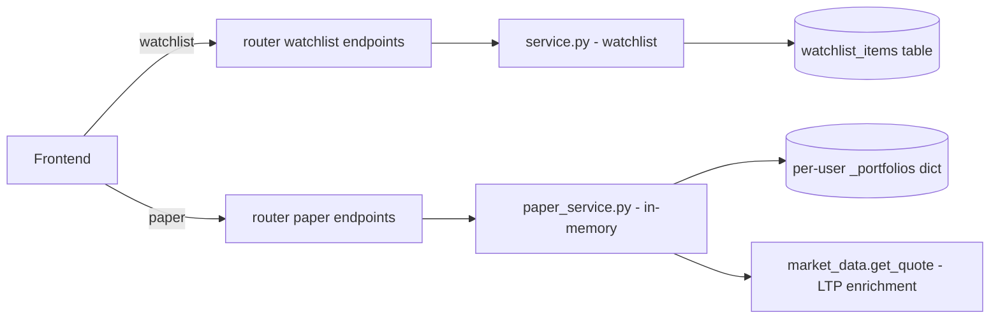
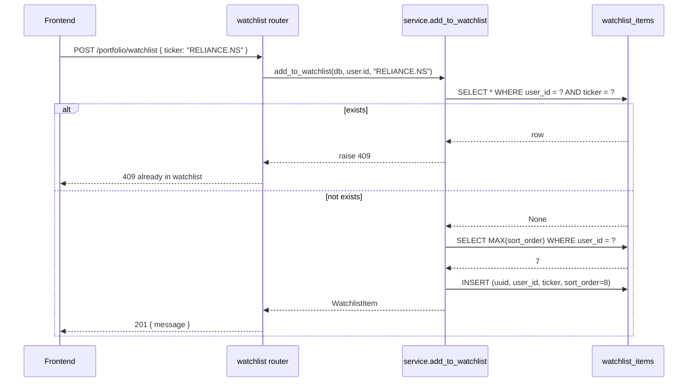
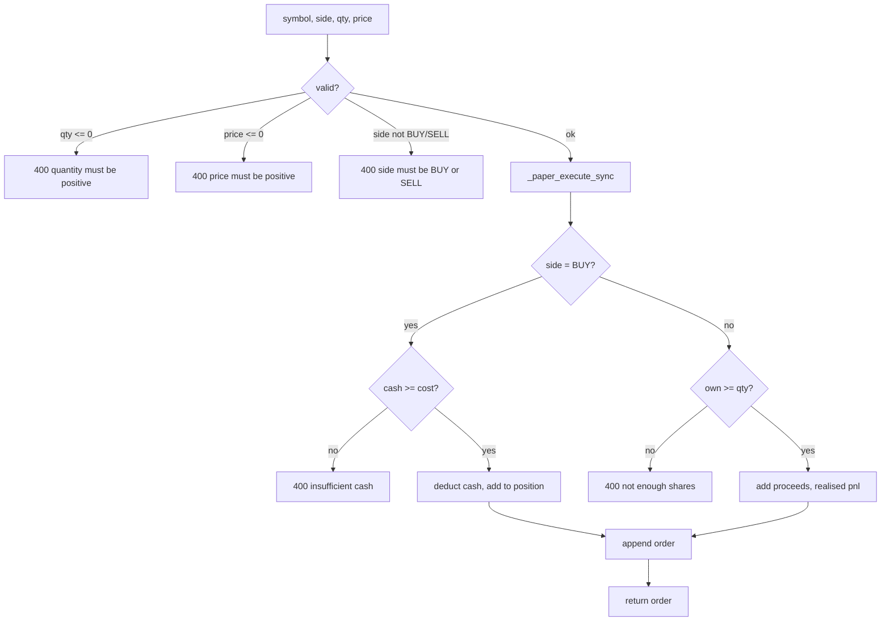

# Portfolio — how it works

This page walks through the watchlist CRUD, the paper order state machine, the
average-cost update, and the live-position enrichment.

## The big picture



The two halves do not talk to each other. Watchlist is DB-backed, paper
trading is in-memory. Same router prefix for URL cohesion only.

## Watchlist

### Add



Notes:

- `ticker` is uppercased server-side. "reliance.ns" and "RELIANCE.NS" hit the
  same row.
- The duplicate check happens **before** the sort-order query. Two identical
  POSTs do not bump the order.
- The unique constraint on `(user_id, ticker)` is the last line of defence —
  if two concurrent inserts race past the Python check, the DB rejects one.

### List

```python
result = await db.scalars(
    select(WatchlistItem)
    .where(WatchlistItem.user_id == user_id)
    .order_by(WatchlistItem.sort_order, WatchlistItem.created_at)
)
```

Ordered by `sort_order` (the user-controlled position), then `created_at` as
a tiebreaker for items with the same `sort_order`.

### Remove

```python
item = await get_item(db, user_id, clean)
if item is None: raise 404
await db.delete(item)
await db.commit()
```

No soft delete. The row is gone. The `ON DELETE CASCADE` on the FK to `users`
means deleting a user cleans up their watchlist automatically.

## Paper trading — the state

```python
_portfolios: dict[str, dict] = {}
_INITIAL_CASH = 100_000.0

# Per user:
{
    "cash": 100_000.0,        # available to spend
    "positions": {            # symbol -> {qty, avg}
        "RELIANCE.NS": {"qty": 10, "avg": 2950.0}
    },
    "orders": [               # chronological
        {"id": "A3F7B29C", "ts": "2026-04-17T...", "type": "BUY", ...}
    ],
    "pnl": 0.0,               # realised P&L
}
```

The dict is created on first use via `_get_portfolio(user_id)`.

## The order state machine

`place_order(user_id, symbol, side, qty, price)`:



Validation comes first. Then `_paper_execute_sync` does the actual state
mutation. Both BUY and SELL are atomic — there is no partial fill or pending
state.

### The BUY branch

```python
if txn_type == "BUY":
    if portfolio["cash"] < cost:
        return False, f"Insufficient cash ..."
    portfolio["cash"] -= cost
    pos = portfolio["positions"].get(symbol, {"qty": 0, "avg": 0.0})
    new_qty = pos["qty"] + qty
    new_avg = round((pos["qty"] * pos["avg"] + cost) / new_qty, 2)
    portfolio["positions"][symbol] = {"qty": new_qty, "avg": new_avg}
```

Key points:

- **Cash check first.** Never deduct cash if the order cannot be filled.
- **Average cost is a weighted mean.** `new_avg = (old_qty × old_avg + cost) / new_qty`
- **First buy creates a new position row** with `qty = new_qty` and
  `avg = new_avg`. The `positions.get(symbol, ...)` default ensures this.
- **`new_qty > 0` always** because the cash check prevents selling what you
  don't own, so qty never decreases via BUY.

### The SELL branch

```python
else:  # SELL
    pos = portfolio["positions"].get(symbol, {"qty": 0, "avg": 0.0})
    if pos["qty"] < qty:
        return False, f"Not enough shares ..."
    proceeds = round(qty * price, 2)
    pnl = round((price - pos["avg"]) * qty, 2)
    portfolio["cash"] += proceeds
    portfolio["pnl"] += pnl
    new_qty = pos["qty"] - qty
    if new_qty == 0:
        portfolio["positions"].pop(symbol, None)
    else:
        portfolio["positions"][symbol]["qty"] = new_qty
```

Key points:

- **Quantity check first.** No naked shorts.
- **Realised P&L** = `(price - avg_cost) × qty`. This is added to the running
  `pnl` total.
- **Average cost stays the same on partial sells.** Selling 5 of 10 @ avg
  ₹100 leaves the remaining 5 at avg ₹100. The reduction is in qty, not avg.
- **Position removed when qty hits 0.** Avoids empty rows cluttering the
  positions list.

## Position enrichment

`get_positions(user_id)` enriches each open position with live LTP:

```python
for sym, pos in pp["positions"].items():
    ltp = pos["avg"]  # fallback
    try:
        quote = await market_data.get_quote(sym)
        ltp = float(quote.get("price", pos["avg"]))
    except Exception:
        pass
    unrealised = round((ltp - pos["avg"]) * pos["qty"], 2)
    pnl_pct = round((ltp - pos["avg"]) / pos["avg"] * 100, 2) if pos["avg"] else 0.0
    positions.append({
        "symbol": sym, "qty": pos["qty"],
        "avg_cost": round(pos["avg"], 2), "ltp": round(ltp, 2),
        "unrealised_pnl": unrealised, "pnl_pct": pnl_pct,
    })
```

Notes:

- The fallback `ltp = pos["avg"]` is critical. If Yahoo is down, the position
  shows zero unrealised P&L — not NaN, not a 500.
- The `quote.get("price", pos["avg"])` is correct here (unlike the alerts
  bug). The `market_data.get_quote` response uses `price`, and the code reads
  the right key.
- The catch-all `except Exception: pass` is intentional — a single bad symbol
  does not poison the whole list.

## The reset endpoint

```python
def reset_portfolio(user_id: str) -> dict:
    _portfolios[user_id] = {
        "cash": _INITIAL_CASH, "positions": {}, "orders": [], "pnl": 0.0,
    }
    return get_summary(user_id)
```

Wipes positions, orders, pnl. Resets cash to ₹1,00,000. Returns the new
summary.

The reset is **destructive and immediate** — there is no undo. The button in
the UI should confirm.

## What can go wrong

| Symptom | Cause |
|---|---|
| 409 on watchlist add | Ticker already in your watchlist. Either remove it first or skip. |
| 404 on watchlist remove | Ticker not in your watchlist. |
| 400 "insufficient cash" | Trying to buy more than cash allows. Reduce qty or price. |
| 400 "not enough shares" | Trying to sell more than you own. |
| Unrealised P&L = 0 | Quote failed for that symbol. LTP fell back to avg cost. |
| Paper portfolio vanished | Backend restarted. In-memory store is process-local. |
| Order id collides | `uuid.uuid4()[:8].upper()` — collision chance is ~1 in 4 billion. Effectively zero. |

Related: [implementation](implementation.md) for the file map and helpers.