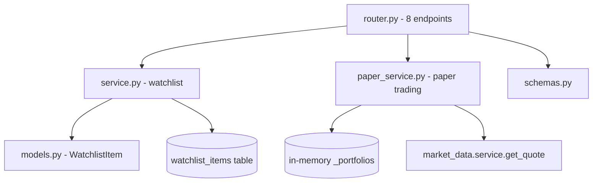
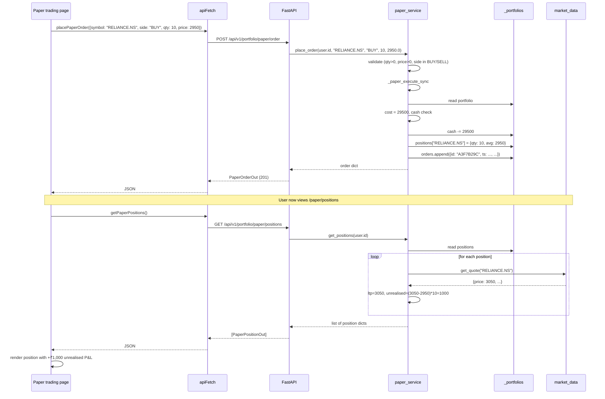

# Portfolio — implementation (reading the code)

A guide for someone with the repo open. Read in this order.

## File map



## 1. `backend/app/modules/portfolio/models.py` (25 lines)

```python
class WatchlistItem(Base):
    __tablename__ = "watchlist_items"
    __table_args__ = (UniqueConstraint("user_id", "ticker", name="uq_watchlist_user_ticker"),)

    id: Mapped[str] = mapped_column(String(36), primary_key=True)
    user_id: Mapped[str] = mapped_column(
        String(36), ForeignKey("users.id", ondelete="CASCADE"), index=True
    )
    ticker: Mapped[str] = mapped_column(String(32), index=True)
    sort_order: Mapped[int] = mapped_column(Integer, default=0)
    created_at: Mapped[datetime] = mapped_column(
        DateTime(timezone=True), default=lambda: datetime.now(UTC)
    )
```

| Column | Type | Notes |
|---|---|---|
| `id` | UUID v4 | Primary key, generated in Python |
| `user_id` | UUID | FK to `users.id`, `ON DELETE CASCADE` |
| `ticker` | Yahoo ticker (e.g. `RELIANCE.NS`) | Indexed for fast lookup |
| `sort_order` | int | Position in the user's list, default 0 |
| `created_at` | timestamp with timezone | Defaults to `now(UTC)` |

The unique constraint `(user_id, ticker)` is the DB-level duplicate guard.

`WatchlistItem` is the only table in this module. The paper-trading state lives
in memory and is planned for the PostgreSQL migration.

## 2. `backend/app/modules/portfolio/service.py` (60 lines)

Watchlist CRUD against SQLAlchemy.

| Function | What it does |
|---|---|
| `list_watchlist(db, user_id)` | `SELECT … WHERE user_id = ? ORDER BY sort_order, created_at` |
| `get_item(db, user_id, ticker)` | `SELECT … WHERE user_id = ? AND ticker = ?` |
| `add_to_watchlist(db, user_id, ticker)` | duplicate check → next sort_order = max + 1 → INSERT |
| `remove_from_watchlist(db, user_id, ticker)` | SELECT → DELETE → COMMIT (404 if missing) |

`add_to_watchlist` raises `409 Conflict` on duplicate and returns the new
`WatchlistItem` on success.

`remove_from_watchlist` raises `404 Not Found` if the ticker is not in the
user's list. Idempotent at the row level (a missing row is not a "bad" delete
in the DB, but the service treats it as a user error).

## 3. `backend/app/modules/portfolio/paper_service.py` (155 lines)

### Section A — state

```python
_INITIAL_CASH = 100_000.0
_portfolios: dict[str, dict[str, Any]] = {}

def _get_portfolio(user_id: str) -> dict[str, Any]:
    if user_id not in _portfolios:
        _portfolios[user_id] = {
            "cash": _INITIAL_CASH,
            "positions": {},
            "orders": [],
            "pnl": 0.0,
        }
    return _portfolios[user_id]
```

`_portfolios` is a module-level dict. The state shape is documented in
`how-it-works.md`. `_get_portfolio` lazily creates the user entry on first
use.

### Section B — `_paper_execute_sync(symbol, txn_type, qty, price, portfolio)`

The state mutator. Returns `(success: bool, result: str | dict)`.

```python
cost = round(qty * price, 2)

if txn_type == "BUY":
    if portfolio["cash"] < cost:
        return False, f"Insufficient cash (need ₹{cost:,.0f}, have ₹{portfolio['cash']:,.0f})"
    portfolio["cash"] -= cost
    pos = portfolio["positions"].get(symbol, {"qty": 0, "avg": 0.0})
    new_qty = pos["qty"] + qty
    new_avg = round((pos["qty"] * pos["avg"] + cost) / new_qty, 2)
    portfolio["positions"][symbol] = {"qty": new_qty, "avg": new_avg}
else:  # SELL
    pos = portfolio["positions"].get(symbol, {"qty": 0, "avg": 0.0})
    if pos["qty"] < qty:
        return False, f"Not enough shares (have {pos['qty']}, want to sell {qty})"
    proceeds = round(qty * price, 2)
    pnl = round((price - pos["avg"]) * qty, 2)
    portfolio["cash"] += proceeds
    portfolio["pnl"] += pnl
    new_qty = pos["qty"] - qty
    if new_qty == 0:
        portfolio["positions"].pop(symbol, None)
    else:
        portfolio["positions"][symbol]["qty"] = new_qty
```

The function is **synchronous** (no async). The router calls it directly
without `to_thread` because the math is trivial. The expensive part of the
position endpoint (live LTP fetch) is the async one.

### Section C — public API

| Function | What it does | Async? |
|---|---|---|
| `get_summary(user_id)` | Returns `{ cash, positions_count, orders_count, pnl, initial_cash }` | No |
| `place_order(user_id, symbol, side, qty, price)` | Validates, calls `_paper_execute_sync`, returns the order dict | No (calls async `get_quote` only via positions, not here) |
| `get_positions(user_id)` | Enriches each position with live LTP from `market_data.get_quote` | **Yes** |
| `get_orders(user_id)` | Returns orders reversed (newest first) | No |
| `reset_portfolio(user_id)` | Wipes state, returns new summary | No |

`place_order` validates first:

```python
if qty <= 0: raise 400
if price <= 0: raise 400
if side not in ("BUY", "SELL"): raise 400
```

The actual `_paper_execute_sync` may also return a failure tuple — the router
converts that to `400` with the error string.

### Section D — the order id

```python
order = {
    "id": str(uuid.uuid4())[:8].upper(),
    ...
}
```

`uuid.uuid4()` gives a 32-char hex; slicing to 8 chars and uppercasing gives
an 8-char id like `"A3F7B29C"`. Collision probability for 8 hex chars is
~1 in 4 billion. The frontend uses this as a display key.

## 4. `backend/app/modules/portfolio/router.py` (115 lines)

Eight endpoints under `/api/v1/portfolio/`, all protected.

| Method | Path | Handler | Response |
|---|---|---|---|
| `GET` | `/watchlist` | `get_watchlist` | `WatchlistResponse` |
| `POST` | `/watchlist` | `add_to_watchlist` | `MessageResponse` (201) |
| `DELETE` | `/watchlist/{ticker}` | `remove_from_watchlist` | `MessageResponse` |
| `GET` | `/paper` | `paper_summary` | `PaperSummaryResponse` |
| `POST` | `/paper/order` | `paper_place_order` | `PaperOrderOut` (201) |
| `GET` | `/paper/positions` | `paper_positions` | `[PaperPositionOut]` |
| `GET` | `/paper/orders` | `paper_orders` | `[PaperOrderOut]` |
| `POST` | `/paper/reset` | `paper_reset` | `PaperSummaryResponse` |

The watchlist handlers take `db: AsyncSession = Depends(get_db)`. The paper
handlers do not — paper state is in-memory.

## 5. `backend/app/modules/portfolio/schemas.py` (66 lines)

| Schema | Shape |
|---|---|
| `WatchlistAddRequest` | `{ ticker: str }` |
| `WatchlistItemOut` | `{ ticker, sort_order, created_at }` (uses `from_attributes=True`) |
| `WatchlistResponse` | `{ count, items: [WatchlistItemOut] }` |
| `MessageResponse` | `{ message }` |
| `PaperSummaryResponse` | `{ cash, positions_count, orders_count, pnl, initial_cash }` |
| `PaperOrderRequest` | `{ symbol, side (regex BUY\|SELL), qty (1-100k), price (0-1M) }` |
| `PaperOrderOut` | `{ id, ts, symbol, type, qty, price, value, mode }` |
| `PaperPositionOut` | `{ symbol, qty, avg_cost, ltp, unrealised_pnl, pnl_pct }` |

`WatchlistItemOut` uses `ConfigDict(from_attributes=True)` so it can be
serialised directly from a SQLAlchemy row.

## 6. Frontend wiring

| File | Purpose |
|---|---|
| `frontend/lib/api/portfolio.ts` | `getWatchlist`, `addToWatchlist`, `removeFromWatchlist`, `getPaperSummary`, `placePaperOrder`, `getPaperPositions`, `getPaperOrders`, `resetPaper` |
| `frontend/lib/hooks/use-paper.ts` | `usePaperSummary`, `usePaperPositions`, `usePaperOrders`, `usePlaceOrder`, `useResetPaper` |
| `frontend/app/(app)/dashboard/page.tsx` | Watchlist tiles |
| `frontend/app/(app)/paper-trading/page.tsx` | Full paper portfolio UI |
| `frontend/app/(app)/stocks/[symbol]/components/AddToWatchlistButton.tsx` | The star button on stock pages |

The `usePaper*` hooks are typically polled every 30–60 seconds so unrealised
P&L stays fresh.

## 7. End-to-end request trace — place a paper order

You BUY 10 RELIANCE @ 2950:



The order placement is fast (sub-millisecond). The positions call is slower
(one network round-trip per open symbol).

## 8. The persistence plan (paper trading)

The current `_portfolios` dict has the same multi-worker problem as the
alerts module. The DB migration adds two tables:

| Current | Target |
|---|---|
| `_portfolios[user_id] = {cash, positions, orders, pnl}` | `paper_portfolios` table |
| `positions[symbol] = {qty, avg}` | `paper_positions` table |
| `orders = [dict]` | `paper_orders` table |
| `pnl` (scalar) | column on `paper_portfolios` |

The HTTP contract stays identical. `place_order` becomes `INSERT INTO
paper_orders; UPDATE paper_positions; UPDATE paper_portfolios SET cash, pnl`.

## 9. Common gotchas

- **Multi-worker deployments split state.** Worker A's `_portfolios` is
  invisible to Worker B. The DB migration fixes this.
- **Restart wipes state.** In-memory only. Same caveat as alerts.
- **`unrealised_pnl = 0` on a real position.** Quote failed; LTP fell back to
  avg cost. The UI should show "—" or "no quote".
- **Order id collisions.** ~1 in 4 billion per order. Effectively zero, but
  if you see two orders with the same id, report it.
- **Average cost on a single buy.** `new_avg = round((0 × 0 + cost) / qty, 2) =
  round(cost / qty, 2)` = price. Correct.
- **Average cost on a sell.** Unchanged. Sells do not affect avg.
- **Average cost rounding.** Two-decimal rounding is applied at every update.
  Over many trades, this can drift by a few paise. Not worth fixing for paper
  trading.
- **Cash precision.** `round(cash, 2)` everywhere. Never stores more than 2
  decimal places. Matches real money in INR.
- **Negative cash after a race.** Should not happen — the cash check is
  synchronous. If you ever see this, the buy/sell paths were both entered
  concurrently; Python's GIL makes that impossible in CPython.

## Related

- Backend dev notes: `backend/docs/portfolio/`.
- Watchlist model in `models.py`.
- Quote source: [market-data](../market-data/overview.md).
- Frontend page docs: [paper-trading](../../pages/paper-trading.md).
- Parent module page: [overview](overview.md).