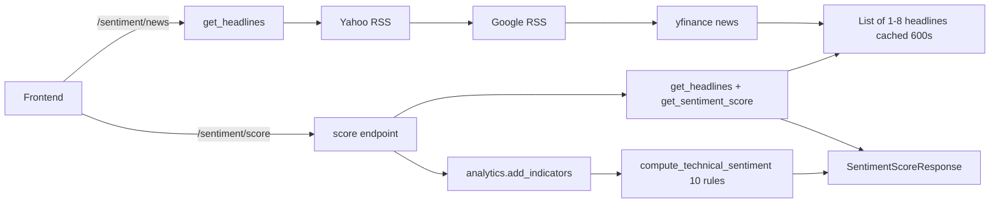
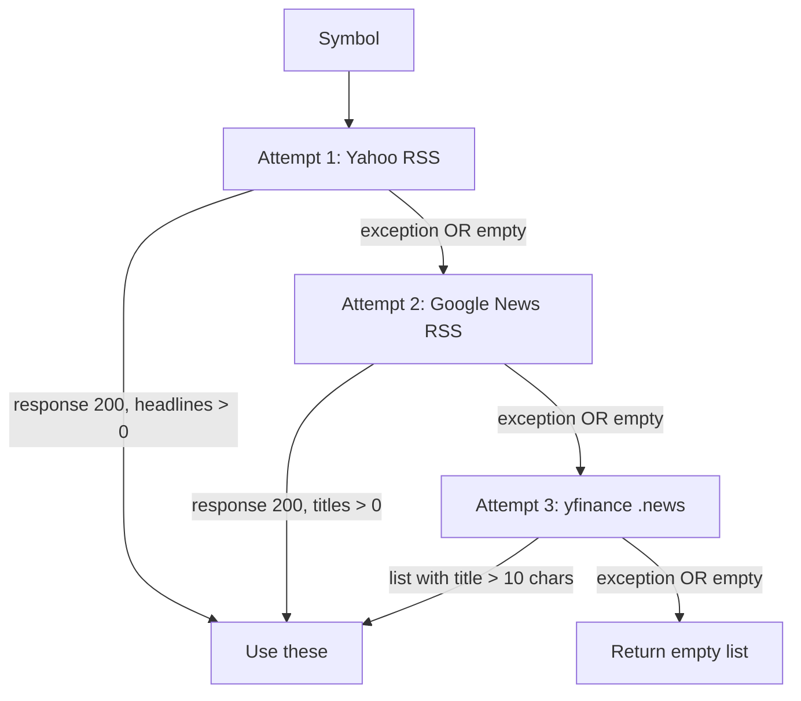
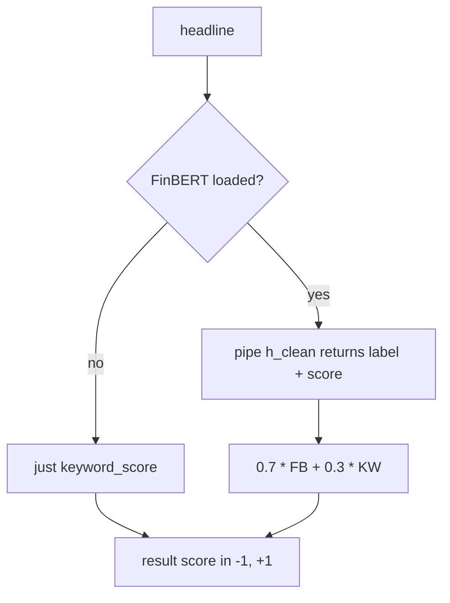
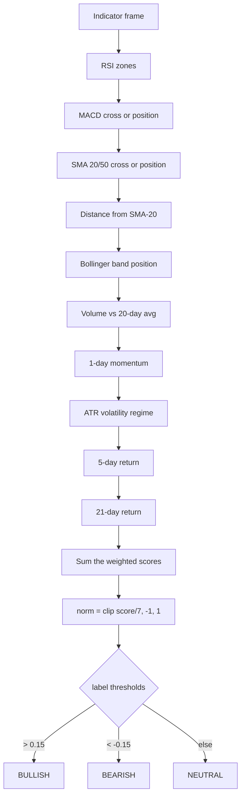

# Sentiment — how it works

This page walks through the news fetching pipeline, the FinBERT+keyword scoring
blend, and the ten-rule technical sentiment engine. Read it once and the rest
of the file is mechanical.

## The big picture



The `/sentiment/news` endpoint only fetches headlines. `/sentiment/score` adds
the scoring and the technical layer.

## News headline fetching

Three-tier fallback:



Each attempt is wrapped in `try/except` and silently moves on to the next on
failure. The first attempt to return any headlines wins.

### Yahoo RSS

```python
rss_url = f"https://feeds.finance.yahoo.com/rss/2.0/headline?s={symbol}&region=IN&lang=en-IN"
resp = requests.get(rss_url, timeout=7, headers=_UA)
if resp.status_code == 200:
    headlines = _extract_titles(resp.text)[:max_items]
```

Yahoo's RSS feeds are public. The `region=IN` and `lang=en-IN` query params bias
results to India. The `_UA` header (`Mozilla/5.0 ...`) avoids being treated as a
bot.

`_extract_titles` handles two XML formats:

1. CDATA-wrapped titles: `<title><![CDATA[...]]></title>`.
2. Plain `<title>...</title>` rows.

Yahoo uses format 1; Google News uses format 2. Headlines shorter than 20 chars
are skipped (often metadata), and `Yahoo! Finance` placeholder rows are
filtered.

### Google News RSS fallback

```python
query = f"{clean}+stock+NSE+India"
rss_url2 = f"https://news.google.com/rss/search?q={query}&hl=en-IN&gl=IN&ceid=IN:en"
```

The query is `{TICKER} stock NSE India`. The `.NS` suffix is stripped from the
symbol first (`clean = symbol.replace(".NS", "").replace(".BO", "").replace("^", "")`).

### yfinance fallback

```python
tk = yf.Ticker(symbol)
for item in (tk.news or [])[:max_items]:
    title = item.get("title", "")
    if title and len(title) > 10:
        headlines.append(title)
```

Yahoo's newer news endpoint returns a list of dicts. The yfinance library
exposes it as `Ticker(symbol).news`. Less reliable than RSS but a useful last
resort.

### Caching

`get_headlines` caches results in Redis for **600 seconds (10 minutes)** under
key `sentiment:news:{symbol}:{max_items}`. Headlines change slowly; the TTL
avoids hammering the RSS hosts on every page load.

```python
key = f"sentiment:news:{symbol}:{max_items}"
cached = await cache_get(key)
if cached is not None:
    return cached
headlines = await anyio.to_thread.run_sync(_fetch_headlines_sync, symbol, max_items)
await cache_set(key, headlines, NEWS_TTL)
return headlines
```

## FinBERT loading

Optional. The import is wrapped:

```python
try:
    from transformers import pipeline as hf_pipeline
    FINBERT_OK = True
except ImportError:
    hf_pipeline = None
    FINBERT_OK = False
```

If `transformers` is not installed, `FINBERT_OK = False` and the module falls
back to pure keyword scoring. The `finbert_available` flag in the response
tells the UI which path was used.

The model itself is loaded lazily on first use:

```python
_FINBERT_PIPE = None

def _load_finbert():
    global _FINBERT_PIPE
    if _FINBERT_PIPE is None and FINBERT_OK:
        try:
            _FINBERT_PIPE = hf_pipeline(
                "sentiment-analysis", model="ProsusAI/finbert",
                tokenizer="ProsusAI/finbert", truncation=True, max_length=512,
            )
        except Exception:
            _FINBERT_PIPE = None
    return _FINBERT_PIPE
```

The `ProsusAI/finbert` model is downloaded on first load (~440 MB) and cached
in `~/.cache/huggingface/`. After that, scoring is local — no API call.

The `_FINBERT_PIPE` global caches the loaded pipeline. If the load fails (no
network, no disk space), `_FINBERT_PIPE` stays `None` and the keyword fallback
takes over.

## Per-headline scoring

For each headline (up to 10):



FinBERT's label map:

```python
lmap = {"positive": 1.0, "negative": -1.0, "neutral": 0.0}
fb_value = lmap[out["label"].lower()] * out["score"]
```

So a "positive" with 0.9 confidence contributes `+0.9`; a "negative" with 0.8
contributes `-0.8`. Neutral contributes `0`.

Keyword scoring counts hits in the curated `BULL_WORDS` and `BEAR_WORDS` lists
(150+ India-specific terms — SEBI, RBI, NPA, ED notice, etc.):

```python
bull = sum(1 for w in BULL_WORDS if w in t.lower())
bear = sum(1 for w in BEAR_WORDS if w in t.lower())
return float((bull - bear) / max(bull + bear, 1))
```

Returns a value in `[-1, +1]` based on the **ratio** of bull to bear words, not
the absolute count. A headline with 1 bull and 0 bear scores +1.0; one with 3
bull and 1 bear scores +0.5.

### Aggregate label

```python
avg = float(np.mean(scored))
if avg > 0.08:   label = "BULLISH"
elif avg < -0.08: label = "BEARISH"
else:             label = "NEUTRAL"
```

The ±0.08 threshold prevents a single mildly-positive headline from flipping
the whole aggregate.

## Technical sentiment engine

`compute_technical_sentiment(df)` runs ten independent rules against the
indicator-enriched DataFrame.



Each rule pushes a tuple `(name, tone, message, weight)` to `signals` and
adds the weight to the running score. The whole thing is wrapped in a single
`try/except` so any data hiccup degrades to neutral.

The `max_possible = 7.0` constant is the sum of all positive weights if every
rule fired bullish. Real scores are typically in `[-3, +3]`.

The label thresholds (±0.15) are **wider** than the news ones (±0.08) because
technical sentiment scores are smaller — most rules fire with weight ±0.4 to
±0.7.

## Async API

| Function | Returns | Caching |
|---|---|---|
| `get_headlines(symbol, max_items=8)` | `list[str]` | Redis 600s |
| `get_sentiment_score(headlines)` | `{ score, label, detail }` | None |
| `compute_technical_sentiment(df)` | `{ score, label, signals, raw_score }` | None (input candles are cached upstream) |

`get_sentiment_score` is sync (CPU-bound). The `/sentiment/score` router calls
it directly without `to_thread` — it is fast enough (under 100ms for 10
headlines).

`compute_technical_sentiment` is also sync. The router calls it from the async
handler, which means the event loop blocks for the duration. For a 500-candle
frame this is fine; if you ever profile a slowdown here, wrap in `to_thread`.

## What can go wrong

| Symptom | Cause |
|---|---|
| Empty headlines, no error | All three RSS sources failed (network blocked, rate limited) |
| `finbert_available: false` | `transformers` package not installed |
| News score always 0 | All headlines keyword-neutral and FinBERT neutral |
| News score wildly negative | One headline with strong bearish FinBERT + multiple bear keywords |
| Technical score stuck at 0 | All ten rules fired neutral |
| `/sentiment/score` slow | FinBERT model download on first call (~30s for 440 MB). Subsequent calls are sub-second. |
| `BULL_WORDS` / `BEAR_WORDS` feel wrong | Domain-specific vocabulary that may not match your style. Edit the lists. |

## Caching note for `/sentiment/score`

The endpoint does **not** cache its own result. It calls `get_headlines` (which
caches for 600s) and re-runs the technical sentiment every time. The technical
math is fast; the cache is the headlines.

If you want to cache the full score response too, add a `cache_get` /
`cache_set` wrapper in the router. Recommended TTL: 60–120s.

Related: [implementation](implementation.md) for the file map and helper details.