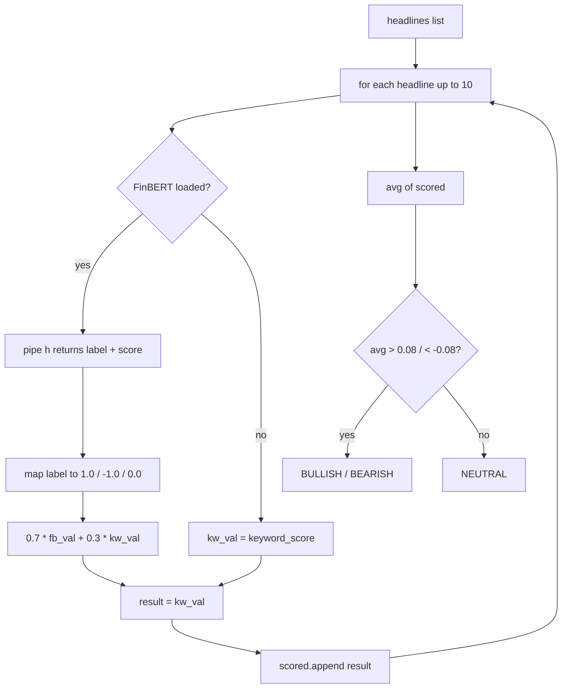
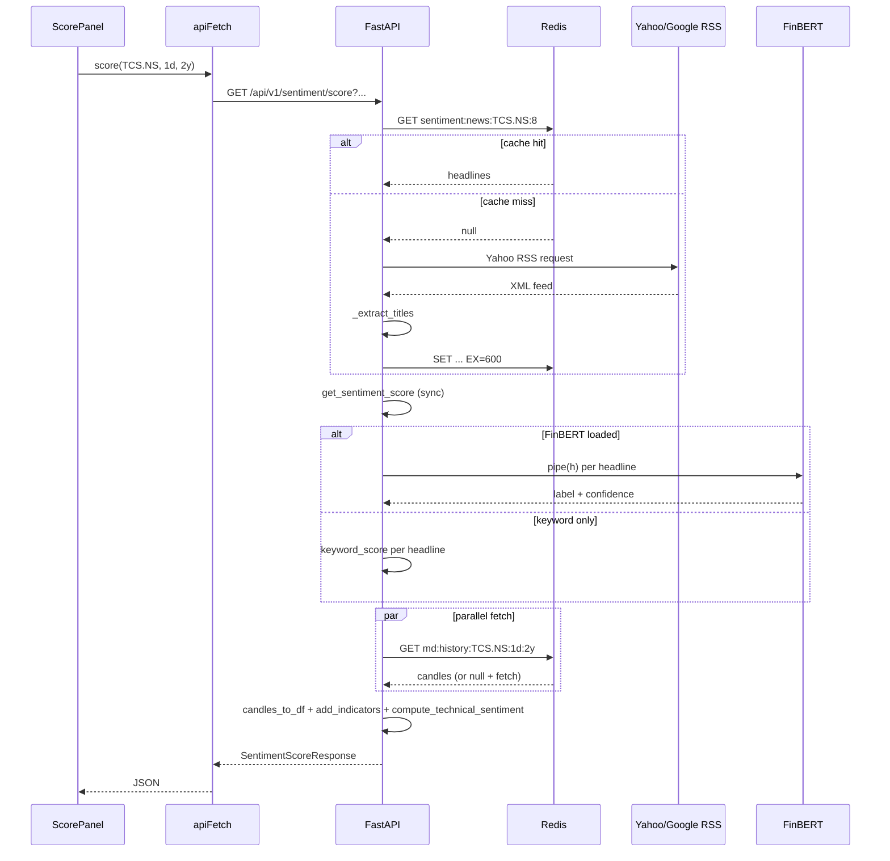

# Sentiment — implementation (reading the code)

A guide for someone with the repo open. Read the files in this order.

## File map

```mermaid
flowflowchart TD
    Router[router.py] --> Service[service.py]
    Service --> Cache[core/cache.py]
    Service --> Requests[requests - RSS]
    Service --> YF[yfinance - last-resort news]
    Service --> OPT[transformers - optional FinBERT]
    Service --> AnSvc[analytics.service - candles_to_df, add_indicators]
    Service --> MD[market_data.service - candles]
    Signals[signals.service.get_fusion] -->|imports| Service
```

## 1. `backend/app/modules/sentiment/service.py` (397 lines)

Four logical sections, top to bottom.

### Section A — constants and optional import

```python
NEWS_TTL = 600  # 10 minutes
_UA = {"User-Agent": "Mozilla/5.0 (Windows NT 10.0; Win64; x64)"}

try:
    from transformers import pipeline as hf_pipeline
    FINBERT_OK = True
except ImportError:
    hf_pipeline = None
    FINBERT_OK = False

_FINBERT_PIPE = None
```

`FINBERT_OK` is set at module load. `_FINBERT_PIPE` is the lazy-loaded model
pipeline (None until first use).

### Section B — news headline fetching (lines 40–115)

| Function | Purpose |
|---|---|
| `_extract_titles(xml)` | Regex: CDATA titles first, then plain `<title>` rows. Strips `Yahoo! Finance` placeholders. |
| `_fetch_headlines_sync(symbol, max_items)` | Tries Yahoo → Google → yfinance. Returns list of headline strings. |
| `get_headlines(symbol, max_items=8)` | Async wrapper. Redis-cached for 600s under `sentiment:news:{symbol}:{max_items}`. Runs the sync fetch in `anyio.to_thread.run_sync`. |

The three attempts inside `_fetch_headlines_sync` are sequential best-effort:

1. Yahoo RSS at `https://feeds.finance.yahoo.com/rss/2.0/headline?s={symbol}&region=IN&lang=en-IN`.
2. Google News RSS at `https://news.google.com/rss/search?q={clean}+stock+NSE+India&hl=en-IN&gl=IN&ceid=IN:en`.
3. yfinance `.news` attribute (the modern Yahoo news endpoint).

Each is wrapped in `try/except`. The first to produce non-empty results wins.

### Section C — news scoring (lines 117–222)

Two curated word lists:

| List | Length | Examples |
|---|---|---|
| `BULL_WORDS` | ~70 | surge, rally, upgrade, beat, record, bullish, expansion, contract, partnership, dividend, buyback, robust, above estimate, target raised |
| `BEAR_WORDS` | ~80 | fall, drop, crash, slump, plunge, loss, downgrade, weak, miss, below estimate, bearish, fraud, scam, probe, NPA, lower circuit, delist, target cut |

Both lists are India-domain-aware: `npa`, `sebi action`, `ed notice`,
`income tax`, `lower circuit`, `delist` are stock-market-specific.

#### `_keyword_score(text)`

```python
def _keyword_score(text: str) -> float:
    t = text.lower()
    bull = sum(1 for w in BULL_WORDS if w in t)
    bear = sum(1 for w in BEAR_WORDS if w in t)
    total = bull + bear
    if total == 0:
        return 0.0
    return float((bull - bear) / total)
```

Returns `(bull − bear) / total` in `[-1, +1]`. A 0/0 case returns `0.0` (neutral).

#### `_load_finbert()`

Lazy singleton loader:

```python
def _load_finbert():
    global _FINBERT_PIPE
    if _FINBERT_PIPE is None and FINBERT_OK:
        try:
            _FINBERT_PIPE = hf_pipeline(
                "sentiment-analysis", model="ProsusAI/finbert",
                tokenizer="ProsusAI/finbert", truncation=True, max_length=512,
            )
        except Exception:
            _FINBERT_PIPE = None
    return _FINBERT_PIPE
```

Returns the loaded pipeline or `None`. The `truncation=True, max_length=512`
handles long headlines by cutting them at the model limit.

#### `get_sentiment_score(headlines)`



Returns `{ score, label, detail: [{ headline, label, conf, score }, ...] }`.

### Section D — technical sentiment (lines 227–399)

`compute_technical_sentiment(df)`:

| # | Rule | Code lines | Bullish weight | Bearish weight |
|---|---|---|---|---|
| 1 | RSI zones | 239–254 | +0.7 (<30), +0.3 (55–70) | −0.6 (>70), −0.3 (<45) |
| 2 | MACD crossover | 257–273 | +0.9 (cross), +0.4 (above) | −0.9 (cross), −0.4 (below) |
| 3 | SMA 20/50 | 276–292 | +1.0 (golden), +0.4 (above) | −1.0 (death), −0.4 (below) |
| 4 | Price vs SMA-20 | 295–305 | +0.4 (>3% above) | −0.4 (<3% below) |
| 5 | Bollinger | 308–322 | +0.6 (above upper), +0.2 (upper half) | −0.6 (below lower), −0.2 (lower half) |
| 6 | Volume | 325–336 | +0.7 (1.5× avg AND up) | −0.7 (1.5× avg AND down) |
| 7 | 1-day momentum | 339–346 | +0.5 (>2%) | −0.5 (<−2%) |
| 8 | ATR volatility | 349–358 | — | −0.2 (>3% range) |
| 9 | 5-day return | 361–370 | +0.5 (>5%) | −0.5 (<−5%) |
| 10 | 21-day return | 373–382 | +0.5 (>10%) | −0.5 (<−10%) |

Each rule appends a `(name, tone, message, weight)` tuple to `signals`. The
whole block is wrapped in `try/except` — any data issue degrades to a neutral
result with an empty signal list.

Final normalisation:

```python
max_possible = 7.0
norm = float(np.clip(score / max_possible, -1.0, 1.0))
if norm > 0.15: label = "BULLISH"
elif norm < -0.15: label = "BEARISH"
else: label = "NEUTRAL"
return {"score": round(norm, 4), "label": label, "signals": signals, "raw_score": round(score, 2)}
```

## 2. `backend/app/modules/sentiment/router.py` (63 lines)

Two endpoints under `/api/v1/sentiment/`, both protected.

| Method | Path | Query | Response |
|---|---|---|---|
| `GET` | `/news` | `symbol`, `max_items` (1–20, default 8) | `NewsResponse` |
| `GET` | `/score` | `symbol`, `interval`, `period` | `SentimentScoreResponse` |

`/score` does the full job:

1. Fetch headlines (cached).
2. Run `get_sentiment_score` (sync).
3. Fetch candles from market_data.
4. Build DataFrame + add indicators.
5. Run `compute_technical_sentiment`.
6. Wrap and return both.

The function bodies use lazy imports inside the handler:

```python
from app.modules.analytics import service as analytics
from app.modules.market_data import service as market_data
```

This keeps the module imports clean (no circular dependency risk if analytics
or market_data ever grows a sentiment dependency).

## 3. `backend/app/modules/sentiment/schemas.py` (41 lines)

| Schema | Shape |
|---|---|
| `NewsResponse` | `{ symbol, count, headlines: [str] }` |
| `HeadlineSentiment` | `{ headline, label, conf, score }` |
| `NewsSentiment` | `{ score, label, detail: [HeadlineSentiment] }` |
| `TechnicalSignal` | `{ name, tone, message, weight }` |
| `TechnicalSentiment` | `{ score, label, raw_score, signals: [TechnicalSignal] }` |
| `SentimentScoreResponse` | `{ symbol, finbert_available, news, technical }` |

`finbert_available` is set from the module-level `FINBERT_OK` constant at
response time.

## 4. Frontend wiring

| File | Purpose |
|---|---|
| `frontend/lib/api/sentiment.ts` | `news(symbol, maxItems)`, `score(symbol, interval, period)` |
| `frontend/lib/hooks/use-sentiment.ts` | `useNews`, `useScore` |
| `frontend/app/(app)/stocks/[symbol]/components/NewsPanel.tsx` | Renders the news card with tone badges |
| `frontend/app/(app)/stocks/[symbol]/components/TechnicalSentimentCard.tsx` | Renders the ten rules |

The frontend reads `finbert_available` to decide whether to show "AI-scored"
or "keyword-scored" labels.

## 5. End-to-end request trace

You open TCS. The score panel mounts:



The whole call is in the 200–800ms range when cached, longer on first hit (Yahoo
RSS + maybe FinBERT model download).

## 6. Common gotchas

- **`finbert_available: false` in production.** `transformers` not installed in
  the Docker image. Either install it (`pip install transformers torch`) or
  accept the keyword fallback.
- **First call is very slow.** FinBERT model download (~440 MB). Add a
  warm-up call at startup, or pre-bake the model into the Docker image.
- **Headlines empty.** RSS rate-limited or network blocked. The yfinance
  fallback often works when RSS fails. If all three are empty, the symbol may
  have no recent news (small-cap, illiquid).
- **Score always 0.** Either no headlines (so no scores), or every headline has
  exactly equal bull and bear keywords (rare). Check `detail` in the response.
- **`compute_technical_sentiment` returns neutral on missing indicators.**
  The wrapping `try/except` catches any data hiccup. If you see neutral with
  empty `signals` for a stock that should be bullish, the input DataFrame is
  malformed — check `analytics.add_indicators`.
- **Keyword scoring has false positives.** "Stock buy" matches "buy" — bearish
  context (e.g. "Don't buy this stock") still scores bullish. FinBERT handles
  this correctly; keyword scoring is a rough proxy.
- **The `BULL_WORDS` list does not cover every domain.** If you want crypto,
  pharma-specific, or commodity terms, add them.

## 8. Installing FinBERT

```bash
pip install transformers torch
```

That's it — the module detects the import and sets `FINBERT_OK = True`. The
first call triggers the model download.

For Docker, pre-download at build time to avoid the runtime stall:

```dockerfile
RUN python -c "from transformers import pipeline; \
  pipeline('sentiment-analysis', model='ProsusAI/finbert', \
  tokenizer='ProsusAI/finbert')"
```

## Related

- Backend dev notes: `backend/docs/sentiment/`.
- Indicator source: [analytics](../analytics/overview.md).
- Candle source: [market-data](../market-data/overview.md).
- Consumer: [signals](../signals/overview.md) (imports for the news layer of fusion).
- Frontend page docs: [stock-terminal](../../pages/stock-terminal.md).
- Parent module page: [overview](overview.md).