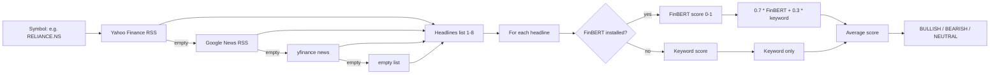

# Sentiment — what it is

The sentiment module measures **how bullish or bearish the mood is** around a
stock. Two flavours:

- **News sentiment** — what financial headlines say about the company.
- **Technical sentiment** — how the chart indicators lean (separate from the
  rule-based verdict in `signals`).

Both feed into the 3-layer signal fusion as the "news" layer (15% weight).

## What you can do with it

- **Fetch news headlines** for a symbol with `GET /sentiment/news`.
- **Fetch the full sentiment score** with `GET /sentiment/score` — returns both
  news and technical mood.
- **Check whether FinBERT is available** — the response includes
  `finbert_available: bool`. When `false`, the module falls back to pure keyword
  scoring.

## How news sentiment works



Three-tier headline fallback:

1. **Yahoo Finance RSS** — primary source, India-specific (`region=IN&lang=en-IN`).
2. **Google News RSS** — if Yahoo returns nothing, search for
   `"{ticker} stock NSE India"`.
3. **yfinance `.news`** — last resort.

Each tier is best-effort. Failures are caught silently and the next tier is
tried. Only the first tier with results contributes.

### Per-headline scoring

When FinBERT is installed (default if you have `transformers`):

- FinBERT returns `(label, score)` where label is `positive` / `negative` /
  `neutral` and score is confidence 0–1.
- The numeric value is `lmap[label] * confidence` → in `[-1, +1]`.
- Final headline score = `0.70 × FinBERT + 0.30 × keyword`.

When FinBERT is not installed (lighter deployments):

- Pure keyword scoring against `BULL_WORDS` / `BEAR_WORDS` lists (~150 words
  total, India-specific — SEBI, RBI, NPA, ED notice, etc.).
- Result = `(bull_count − bear_count) / total_matches`.

### Aggregate label

Average of all per-headline scores:

| Average | Label |
|---|---|
| > +0.08 | `BULLISH` |
| < −0.08 | `BEARISH` |
| otherwise | `NEUTRAL` |

## How technical sentiment works

Ten indicator rules, each contributing a weighted score. Final score is
normalised to `[-1, +1]` by dividing by `7.0` (the maximum possible sum).

| # | Rule | Bullish | Bearish | Weight |
|---|---|---|---|---|
| 1 | RSI | < 30 (+0.7), 55–70 (+0.3) | > 70 (−0.6), < 45 (−0.3) | ±0.3–0.7 |
| 2 | MACD crossover | bullish cross (+0.9), above signal (+0.4) | bearish cross (−0.9), below (−0.4) | ±0.4–0.9 |
| 3 | SMA 20/50 | golden cross (+1.0), above (+0.4) | death cross (−1.0), below (−0.4) | ±0.4–1.0 |
| 4 | Price vs SMA-20 | +3% above (+0.4) | −3% below (−0.4) | ±0.4 |
| 5 | Bollinger | above upper (+0.6), upper half (+0.2) | below lower (−0.6), lower half (−0.2) | ±0.2–0.6 |
| 6 | Volume | 1.5× avg AND up day (+0.7) | 1.5× avg AND down day (−0.7) | ±0.7 |
| 7 | 1-day momentum | > +2% (+0.5) | < −2% (−0.5) | ±0.5 |
| 8 | ATR | — | > 3% (high vol, −0.2) | −0.2 |
| 9 | 5-day return | > +5% (+0.5) | < −5% (−0.5) | ±0.5 |
| 10 | 21-day return | > +10% (+0.5) | < −10% (−0.5) | ±0.5 |

Maximum possible bullish score is +7.0. Scores are clipped to `[-1, +1]`.

This is **separate** from the rule engine in `signals.service.compute_signal`.
The signals rule engine uses integer thresholds (±2 to ±4 weights) for a binary
verdict. The sentiment rule engine uses smaller decimal weights for a continuous
mood.

## A real example

You open TCS. The `/sentiment/score` endpoint returns:

```json
{
  "symbol": "TCS.NS",
  "finbert_available": true,
  "news": {
    "score": 0.42,
    "label": "BULLISH",
    "detail": [
      {"headline": "TCS bags ₹15,000 cr deal", "label": "positive", "conf": 0.89, "score": 0.62},
      {"headline": "TCS Q3 profit up 12%", "label": "positive", "conf": 0.91, "score": 0.64},
      ...
    ]
  },
  "technical": {
    "score": 0.34,
    "label": "BULLISH",
    "raw_score": 2.4,
    "signals": [
      {"name": "MACD", "tone": "BULLISH", "message": "MACD above signal", "weight": 0.4},
      {"name": "5D Trend", "tone": "BULLISH", "message": "5-day return +6.2%", "weight": 0.5},
      ...
    ]
  }
}
```

Both layers bullish → news +0.42, technical +0.34. The signals fusion picks
this up as the news layer (15% weight).

## What the frontend does with it

- **News panel**: shows the headlines with green/red/grey tone badges, plus the
  aggregate score as a horizontal bar.
- **Technical panel**: shows the ten rule signals as a list with tone badges.
- **Fusion panel**: the news layer is shown as a 15%-weighted segment of the
  BlendBar gauge.

## Where it lives in the codebase

- Backend code: `backend/app/modules/sentiment/`
- Backend dev notes: `backend/docs/sentiment/`
- Optional: `transformers` + `ProsusAI/finbert` (~440 MB download)
- Frontend API client: `frontend/lib/api/sentiment.ts`
- Frontend hook: `frontend/lib/hooks/use-sentiment.ts`
- Consumer: signals fusion (`signals.service.get_fusion`)

## Consumed by (frontend pages and other modules)

- [Stock terminal](../../pages/stock-terminal/overview.md) — the news card. Each headline
  is scored and the aggregate mood is shown as a coloured badge.
- [Dashboard](../../pages/dashboard/overview.md) — the recent-news ticker.
- Module: [Signals](../signals/overview.md) — fusion calls `get_sentiment_score` for the
  15% news weight in the verdict.

## Related pages in this folder

- [How it works](how-it-works.md) — RSS parsing, FinBERT loading, keyword scoring,
  the ten-rule engine, threadpool usage.
- [Implementation](implementation.md) — file map, every function, the optional
  FinBERT import, frontend wiring.