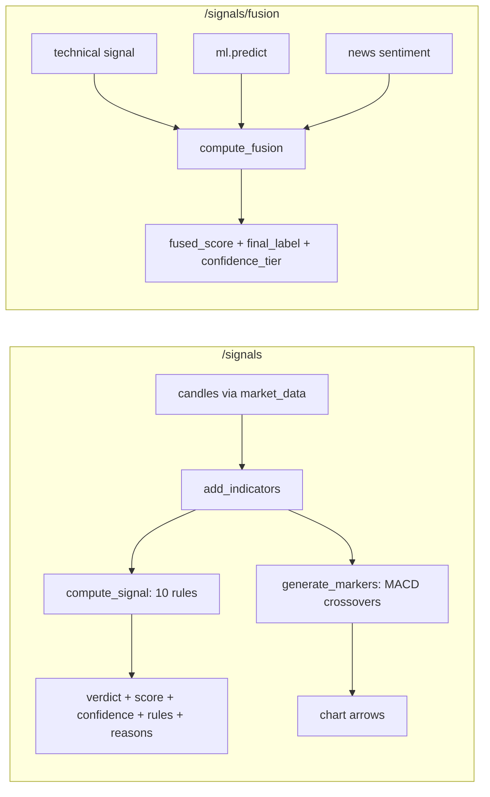
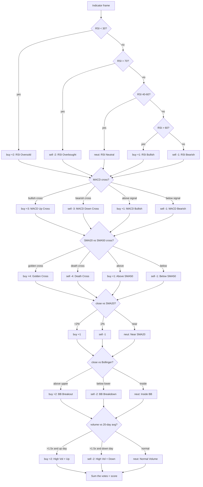
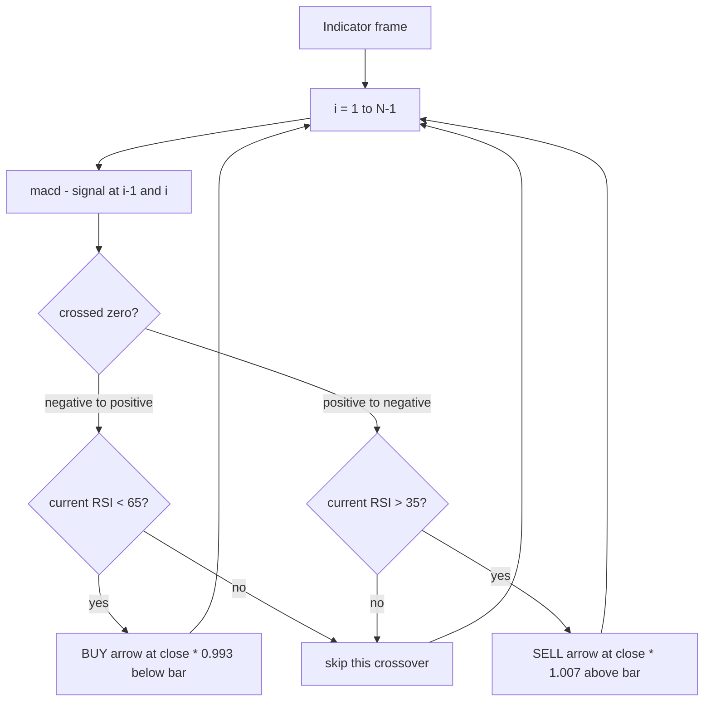
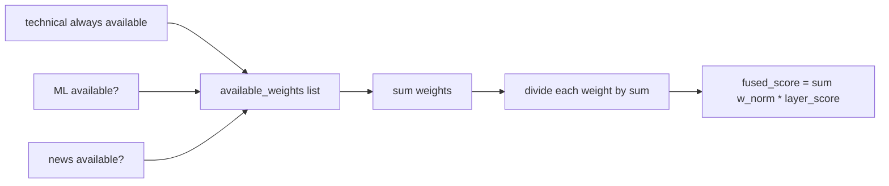
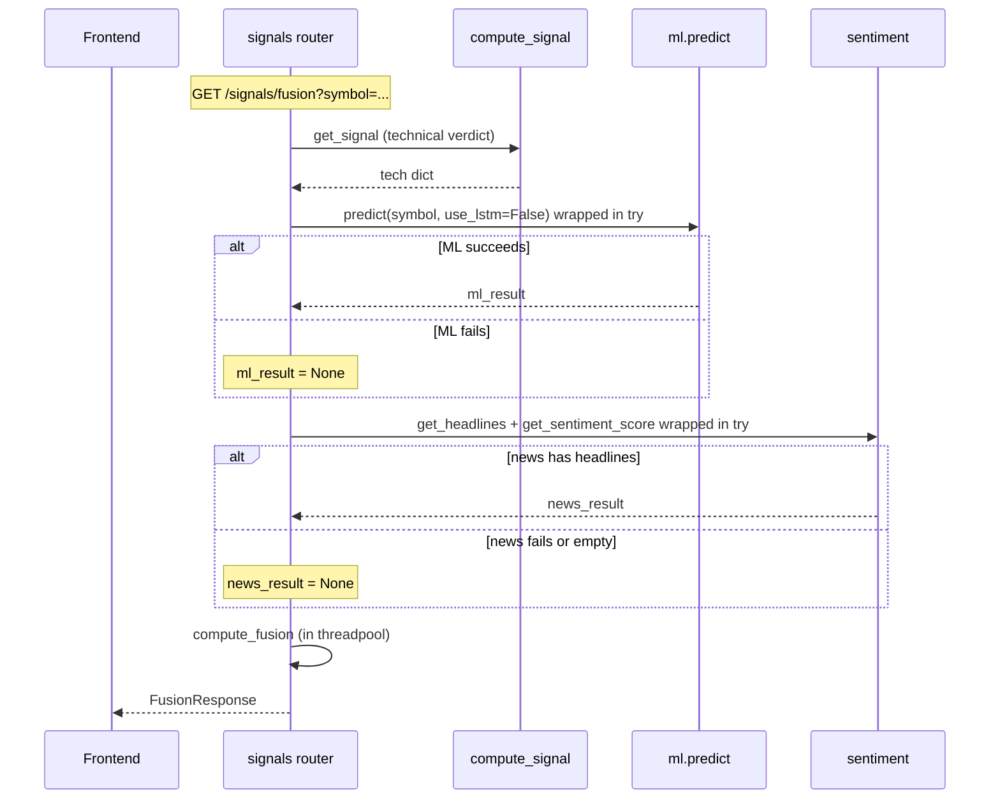

# Signals — how it works

This page walks through the rule engine, the marker generator, and the fusion
blend. Read it once and the rest of the file is mechanical.

## The big picture — two endpoints, two pipelines



`/signals` is self-contained. `/signals/fusion` calls `/signals` internally, plus
ML and news, then blends.

## The rule engine — `compute_signal(df)`

Takes the indicator-enriched DataFrame from `analytics.add_indicators`. Returns
a dict with `verdict`, `score`, `confidence`, `signals`, `reasons`.

### The ten rules



The score range is roughly **−18 to +18** (worst case: all bearish rules fire
with maximum weight). In practice, scores cluster between −6 and +6.

### Verdict from score

| Score | Verdict |
|---|---|
| ≥ +5 | `BUY` |
| +2 to +4 | `WEAK BUY` |
| −1 to +1 | `HOLD` |
| −4 to −2 | `WEAK SELL` |
| ≤ −5 | `SELL` |

### Confidence

```python
directional = [(label, kind) for label, kind in signals if kind in ("buy", "sell")]
if directional:
    dominant = "buy" if score >= 0 else "sell"
    agree = sum(1 for _, k in directional if k == dominant)
    agreement_ratio = agree / len(directional)
else:
    agreement_ratio = 0.5

score_norm = min(abs(score) / 7.0, 1.0)
raw_conf = 0.60 * agreement_ratio + 0.40 * score_norm
confidence = 0.50 + 0.50 * raw_conf
```

Two ingredients:

- **Agreement ratio** (60% weight): how many directional rules voted with the
  dominant side.
- **Score magnitude** (40% weight): how big the score is (capped at 7).

Final is floored at 0.50 — even an all-overbought bearish score on a quiet day
shows ≥ 0.5 confidence. Floor protects the UI from showing "30% confident"
which users read as "broken".

### Reasons

Every rule that votes with weight (≥ 2) appends a human-readable line to
`reasons`. Neutral and ±1 votes do not — keeps the list short and meaningful.
Examples:

- `"RSI 28.4 < 30 — oversold zone"`
- `"SMA20 × SMA50 Golden Cross"`
- `"Volume 1.7× avg with price up"`

## Markers — `generate_markers(df)`

Returns the buy/sell arrows for the chart, one per MACD crossover.



The RSI filter (`< 65` for buys, `> 35` for sells) blocks crossovers that happen
in extreme momentum — those are usually continuations, not reversals. The price
multipliers (`0.993`, `1.007`) nudge the marker slightly off the candle so the
arrow is visible.

Output: a list of `{ time, position: "belowBar"|"aboveBar", kind: "buy"|"sell", price }`
sorted by time.

## Fusion — `compute_fusion(tech, ml_result, news_result)`

The three layers are computed independently, then blended.

### Step 1: Normalise each layer to −1..+1

| Layer | Raw value | Normalised |
|---|---|---|
| Technical | `score` (int, typically −18..+18) | `clip(score / 12, -1, 1)` |
| ML | `up_prob` (0–100) | `(up_prob − 50) / 50` |
| News | `score` (float, −1..+1 from sentiment) | as-is |

The technical normalisation uses 12 as the "saturated" score because that
captures roughly the strongest realistic signal without extreme-case bonus.

### Step 2: Re-weight if a layer is missing



If ML and news are both missing, only technical is in the list, its weight is
1.0, and the fused score equals the technical score.

A layer is "missing" when:

- ML: `ml_result is None` (training failed or symbol not in any model's training
  set).
- News: `news_result is None` **or** `news_result["score"] == 0.0` (no
  headlines, or all neutral).

### Step 3: Map fused score to final label

| Fused score | Final label |
|---|---|
| ≥ +0.35 | `STRONG BUY` |
| +0.12 to +0.34 | `BUY` |
| −0.11 to +0.11 | `NEUTRAL` |
| −0.34 to −0.12 | `SELL` |
| ≤ −0.35 | `STRONG SELL` |

Each label has a fixed description (e.g. "All 3 layers aligned bullish. High
conviction upside expected.").

### Step 4: Confidence tier

```python
direction_labels = [l for l in [ts_label, ml_label, ns_label] if l != "NEUTRAL"]
if not direction_labels:
    tier = "LOW"
elif all agree:
    tier = "HIGH"
else:
    tier = "MEDIUM"
```

- `HIGH`: every layer with a direction agrees (e.g. technical BULLISH, ML
  BULLISH, news BULLISH).
- `MEDIUM`: at least one layer has a direction and disagrees with the others.
- `LOW`: no layer has a direction (everything is NEUTRAL or missing).

### Step 5: "What's missing" flags

If ML is missing: `"ML prediction not available — training data insufficient."`
If news is missing: `"News sentiment unavailable — no headlines fetched."`

These show up in the UI so the user knows why confidence is not HIGH.

## Async API



The ML and news calls are wrapped in `try/except` with bare `pass` — failures
are **expected**. Missing layers are a feature, not an error. The whole point
of the re-weighting is to give a useful answer when one layer is down.

## What can go wrong

| Symptom | Cause |
|---|---|
| Verdict stuck at HOLD | All rules vote neutral or the score is in −1..+1 |
| Score is huge (±15) | Multiple strong signals aligned — uncommon but valid (e.g. golden cross + RSI oversold + volume spike) |
| `markers` empty | No MACD crossovers in the chosen period |
| Fusion always `NEUTRAL` | All layers return score 0 or all missing |
| Fusion `LOW` confidence with `HIGH` technical | News and ML both missing — only technical carries weight |
| `fused_score > 0.35` but tech verdict is `HOLD` | ML or news is strongly bullish enough to overcome neutral technical |

Related: [implementation](implementation.md) for the file map and helper details.