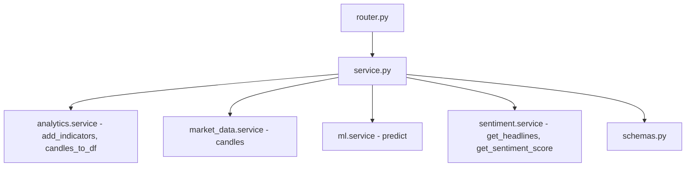
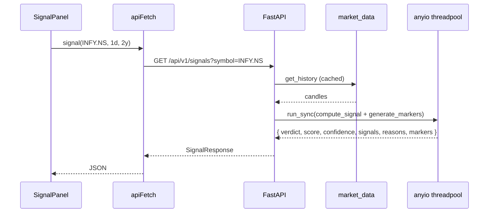
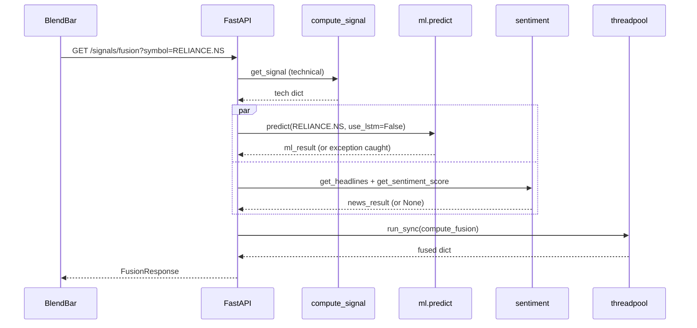

# Signals — implementation (reading the code)

A guide for someone with the repo open. Read the files in this order.

## File map



## 1. `backend/app/modules/signals/service.py` (426 lines)

Four sections, top to bottom.

### Section A — constants and weights

```python
_TECH_W = 0.45
_ML_W = 0.40
_NEWS_W = 0.15
```

Hardcoded fusion weights. To re-tune the blend, change these three lines.
The `compute_fusion` function re-weights proportionally when a layer is
missing, so weights stay in sync.

### Section B — rule engine

`compute_signal(df: pd.DataFrame) -> dict`:

Returns `{ verdict, score, confidence, signals, reasons }`. Each rule block is
guarded with `if "<COLUMN>" in df.columns` so the function survives on
incomplete indicator frames.

| Rule | Code line area | Condition | Vote |
|---|---|---|---|
| RSI | 25–42 | `RSI < 30`, `RSI > 70`, `40 <= RSI <= 60`, `RSI > 60`, else | ±2 or neut |
| MACD | 44–62 | bullish/bearish cross or above/below signal | ±3 (cross) or ±1 (above/below) |
| Golden/Death | 64–82 | `SMA20` crosses `SMA50` | ±4 (cross) or ±1 (above/below) |
| SMA-20 distance | 84–94 | `close > SMA20 * 1.02`, `< * 0.98`, else | ±1 or neut |
| Bollinger | 96–109 | `close > BB_H`, `< BB_L`, else | ±2 or neut |
| Volume | 111–124 | `Volume > 20-day avg * 1.5` AND day direction | ±2 or neut |

Each rule appends `(label, kind)` to `signals` and (when vote is ±2 or more) a
human-readable line to `reasons`.

### Verdict thresholds (lines 126–135)

```python
if score >= 5: verdict = "BUY"
elif score <= -5: verdict = "SELL"
elif score >= 2: verdict = "WEAK BUY"
elif score <= -2: verdict = "WEAK SELL"
else: verdict = "HOLD"
```

### Confidence (lines 137–148)

The blended formula is documented in `how-it-works.md`. Floor 0.50, range
0.50–1.00.

### Section C — markers

`generate_markers(df)`:

```python
macd = df["MACD"].ffill()
sig = df["M_SIG"].ffill()
rsi = df["RSI"].fillna(50) if "RSI" in df.columns else pd.Series(50, index=df.index)

for i in range(1, len(df)):
    pd_ = float(macd.iloc[i - 1]) - float(sig.iloc[i - 1])
    cd = float(macd.iloc[i]) - float(sig.iloc[i])
    rv = float(rsi.iloc[i])
    cl = float(df["Close"].iloc[i])

    if pd_ < 0 and cd > 0 and rv < 65:
        bd.append((df.index[i], cl * 0.993))
    elif pd_ > 0 and cd < 0 and rv > 35:
        sd.append((df.index[i], cl * 1.007))
```

`ffill()` handles gaps from the indicator warm-up. The RSI filter blocks
extreme-momentum crossovers. Returns sorted `{ time, position, kind, price }`
list ready for the chart.

### Section D — fusion

`compute_fusion(tech_result, ml_result, news_result)`:

1. Normalise technical score to −1..+1 via `clip(score / 12, -1, 1)`.
2. If ML available, normalise ML via `(up_prob − 50) / 50`.
3. If news available and `score != 0`, normalise news (already −1..+1).
4. Build `available_weights` and `available_scores` lists.
5. Compute `fused_score = sum(w * s) / sum(w)`, clipped to −1..+1.
6. Map to `final_label` using thresholds (±0.35 / ±0.12).
7. Build `confidence_tier` from layer agreement.
8. Build `missing` list of human-readable warnings.

### Async API

| Function | Returns | Caching |
|---|---|---|
| `get_signal(symbol, interval, period)` | `SignalResponse` shape | None — re-computed every call |
| `get_fusion(symbol, interval, period)` | `FusionResponse` shape | None |

`get_fusion` calls `get_signal` internally, then tries `ml.predict`, then tries
`sentiment.get_headlines + get_sentiment_score`. Each external call is wrapped
in `try/except` so failures degrade gracefully.

## 2. `backend/app/modules/signals/router.py` (65 lines)

Two endpoints under `/api/v1/signals/`, both protected.

| Method | Path | Query | Response |
|---|---|---|---|
| `GET` | `/signals` | `symbol`, `interval`, `period` | `SignalResponse` |
| `GET` | `/signals/fusion` | `symbol`, `interval`, `period` | `FusionResponse` |

Both call `symbol.strip().upper()` before passing to the service. The literal
types `Interval` and `Period` come from `market_data.service` — same vocabulary
everywhere.

## 3. `backend/app/modules/signals/schemas.py` (74 lines)

| Schema | Shape |
|---|---|
| `RuleOut` | `{ rule: str, kind: "buy"\|"sell"\|"neut" }` |
| `MarkerOut` | `{ time, position: "aboveBar"\|"belowBar", kind: "buy"\|"sell", price }` |
| `SignalResponse` | `{ symbol, verdict, score, confidence, rules: [RuleOut], reasons: [str], markers: [MarkerOut] }` |
| `LayerDetail` | `{ score, label, weight }` |
| `TechnicalLayer` | extends LayerDetail with `signals: [dict]`, `reasons: [str]` |
| `MlLayer` | extends LayerDetail with `available`, `up_prob`, `confidence`, `horizon`, `model_accs`, `conf_tier`, `walk_fwd_acc`, `active_models` |
| `NewsLayer` | extends LayerDetail with `available`, `detail: [dict]` |
| `FusionLayers` | `{ technical, ml, news }` |
| `FusionResponse` | `{ symbol, fused_score, final_label, final_desc, confidence_tier, confidence_tone, missing: [str], layers }` |

`fused_score` is constrained to `[−1, 1]` via Pydantic `Field(ge=-1.0, le=1.0)`.

## 4. Frontend wiring

| File | Purpose |
|---|---|
| `frontend/lib/api/signals.ts` | `signal(symbol, interval, period)`, `fusion(symbol, interval, period)` |
| `frontend/lib/hooks/use-signals.ts` | `useSignal`, `useFusion` |
| `frontend/app/(app)/stocks/[symbol]/components/SignalPanel.tsx` | Verdict card + rule chips |
| `frontend/app/(app)/stocks/[symbol]/components/BlendBar.tsx` | Three-layer gauge for fusion |
| `frontend/app/(app)/stocks/[symbol]/components/Chart.tsx` | Reads `markers` for buy/sell arrows |

The frontend renders the verdict badge, the rule chips (green / red / grey), the
reasons as bullet text, and the markers as chart arrows.

## 5. End-to-end request traces

### `/signals` for INFY



### `/signals/fusion` for RELIANCE



The technical call is always fast (sub-second). The ML and news calls can be
slow on a cold cache (10–60 seconds). Wrapping them in `try/except` ensures a
slow ML call does not block the response — if ML takes more than the request
timeout, the call is cancelled and fusion proceeds without it.

## 6. Tuning the rules

The rule weights (the +1 / +2 / +3 / +4 numbers) and thresholds (≥ 5 for BUY)
are hardcoded in `compute_signal`. To change them:

| What to change | Where |
|---|---|
| A specific rule's vote weight | The `score += N` / `score -= N` line in that rule block |
| A rule's bullish/bearish condition | The `if/elif` ladder inside that block |
| BUY / SELL threshold | The `if score >= 5` ladder at lines 126–135 |
| Confidence floor | The `0.50 + 0.50 * raw_conf` line at 148 |
| Fusion layer weight | `_TECH_W` / `_ML_W` / `_NEWS_W` at the top |
| Fusion thresholds | The `>= 0.35` / `>= 0.12` ladder inside `compute_fusion` |

Every change has a corresponding test in `backend/tests/test_analytics_signals.py`
that asserts the new expected score / verdict. Run the test suite after any
change.

## 7. Common gotchas

- **"Verdict looks wrong on a quiet stock"** — the score is in −1..+1 because
  no rule fires with weight ±2 or more. This is by design. The UI shows
  `HOLD` at 0.50 confidence, which reads as "we have no opinion".
- **`fused_score = 0.42` but technical says HOLD** — happens when ML is strongly
  bullish (up_prob > 56) and pushes the fused score over the STRONG BUY
  threshold even though technical is neutral. The fusion does not require the
  layers to agree before speaking. Check the per-layer scores in the response.
- **Fusion `confidence_tier: LOW` even when two layers agree** — happens when
  the third layer is missing AND `news_result.score == 0.0` (neutral). The
  tier logic only counts layers with a non-NEUTRAL direction. To debug, look at
  `missing` in the response.
- **Markers stop appearing after a date** — `generate_markers` uses `.ffill()`,
  so MACD gaps become 0. If the gap is at a crossover boundary, the marker is
  lost. Not a real-world issue (daily bars rarely have gaps), but worth knowing.
- **MACD cross fires on the same day as Golden Cross** — both add up. A
  simultaneous Golden Cross + MACD bullish + RSI oversold recovery can hit +8
  in one day. This is rare but correct.
- **`up_prob` always 50.0** — the ML layer is not trained on this symbol yet, or
  training failed. The `predict` function returns a neutral result rather than
  raising. See `ml` module docs for the training triggers.

## Related

- Backend dev notes: `backend/docs/signals/`.
- Indicator source: [analytics](../analytics/overview.md).
- Candle source: [market-data](../market-data/overview.md).
- ML source: [ml](../ml/overview.md).
- News source: [sentiment](../sentiment/overview.md).
- Frontend page docs: [stock-terminal](../../pages/stock-terminal.md).
- Parent module page: [overview](overview.md).