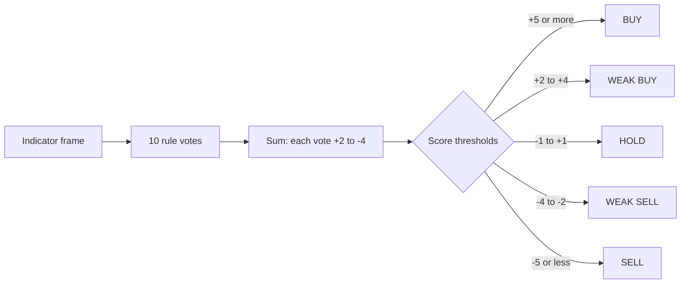
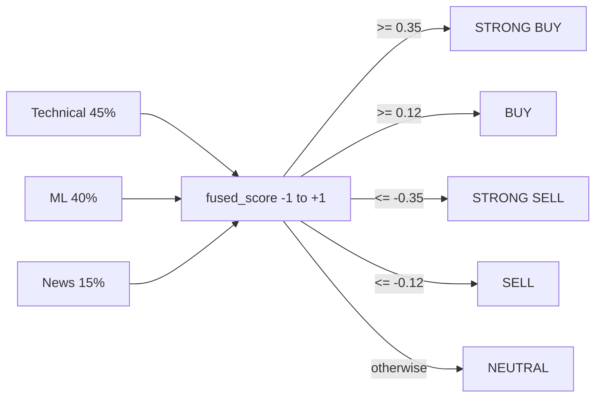

# Signals — what it is

The signals module turns price + indicator data into a **buy / sell / hold verdict**.
It is the "what should I do?" layer on top of "what does the chart look like".

There are two endpoints:

- **`/signals`** — the rule-based verdict from ten chart rules, plus chart markers.
- **`/signals/fusion`** — a 3-layer blend of technical rules, ML prediction, and
  news sentiment, with graceful degradation when layers are unavailable.

## What you can do with it

- Get a **verdict** for any symbol: `BUY`, `WEAK BUY`, `HOLD`, `WEAK SELL`, `SELL`.
- See the **score** (the sum of weighted rule votes).
- See the **confidence** (0.5–1.0, never below 50%).
- See **which rules fired** and which way each voted (buy / sell / neut).
- See **human-readable reasons** (e.g. "RSI 28.4 < 30 — oversold zone").
- Get **chart markers** — buy/sell arrows for every MACD crossover in the history.
- Get the **fused verdict** that combines rules, ML, and news into one final call.

## How the rules work

Ten rules, each one examines one slice of the indicator stack and votes:

| Rule | Looks at | Bullish | Bearish |
|---|---|---|---|
| RSI | `RSI` last value | <30 (oversold) or 60–70 | >70 (overbought) or <40 |
| MACD cross | `MACD` vs signal line | bullish cross or MACD above signal | bearish cross or below |
| Golden/Death cross | `SMA_20` vs `SMA_50` | SMA-20 crosses above | crosses below |
| Above SMA-20 | close vs `SMA_20` | +2% above | −2% below |
| Bollinger breakout | close vs `BB_H`/`BB_L` | close above upper | close below lower |
| High volume | today's volume vs 20-day avg | >1.5× avg AND up day | >1.5× AND down day |

Each rule adds (or subtracts) a number of points. The total is the **score**:



Confidence blends how many rules agree with the dominant direction and how big
the score is:

```
agreement_ratio = (rules voting with verdict) / (rules voting with a direction)
score_norm = min(|score| / 7, 1)
raw_conf = 0.60 * agreement_ratio + 0.40 * score_norm
confidence = 0.50 + 0.50 * raw_conf   # floor 0.50, range 0.50–1.00
```

The floor at 0.50 (50%) is deliberate. We never tell the user "we are 30%
confident" — even a noisy HOLD shows 50%.

## What fusion does

The verdict is technical-only. Fusion adds ML and news on top:



Weights are fixed: technical 45%, ML 40%, news 15%. If ML or news is
unavailable, the remaining layers are **re-weighted proportionally**. So if ML
is down and news is empty, technical becomes 100% (still meaningful).

Confidence in fusion is **layer agreement**:

- `HIGH`: all available non-neutral layers point the same way.
- `MEDIUM`: at least one layer disagrees.
- `LOW`: no layer has a direction (everything is neutral).

## A real example

You open RELIANCE. `/signals` returns:

```json
{
  "verdict": "BUY",
  "score": 7,
  "confidence": 0.84,
  "rules": [
    {"rule": "Golden Cross", "kind": "buy"},
    {"rule": "MACD Bullish", "kind": "buy"},
    {"rule": "RSI Bullish", "kind": "buy"},
    {"rule": "Above SMA50", "kind": "buy"},
    {"rule": "Above SMA20 +2%", "kind": "buy"},
    {"rule": "Inside BB", "kind": "neut"},
    {"rule": "Normal Volume", "kind": "neut"}
  ],
  "reasons": [
    "SMA20 × SMA50 Golden Cross",
    "MACD bullish crossover"
  ]
}
```

Five rules voted buy, zero voted sell, two neutral. Score +7. Confidence 0.84
(strong agreement + strong score). Verdict: BUY.

You then call `/signals/fusion`:

```json
{
  "fused_score": 0.42,
  "final_label": "STRONG BUY",
  "confidence_tier": "HIGH",
  "layers": {
    "technical": {"score": 0.58, "label": "BULLISH", "weight": 0.45},
    "ml": {"score": 0.24, "label": "BULLISH", "weight": 0.40, "up_prob": 62.0},
    "news": {"score": 0.20, "label": "BULLISH", "weight": 0.15}
  }
}
```

All three layers point bullish → `STRONG BUY` at `HIGH` confidence.

## Why a separate module

- **One home for the verdict logic.** Indicators live in `analytics`, ML lives
  in `ml`, news in `sentiment`. Signals orchestrates all three.
- **Fusion weights are easy to tune.** Change `_TECH_W` / `_ML_W` / `_NEWS_W` in
  one file.
- **Markers live here too.** The `generate_markers` function finds MACD crossovers
  and emits buy/sell arrows for the chart. The chart reads them from `/signals`.

## Where it lives in the codebase

- Backend code: `backend/app/modules/signals/`
- Backend dev notes: `backend/docs/signals/`
- Imports: `analytics.add_indicators`, `analytics.candles_to_df`
- Calls: `ml.predict`, `sentiment.get_headlines + get_sentiment_score`
- Frontend API client: `frontend/lib/api/signals.ts`
- Frontend hook: `frontend/lib/hooks/use-signals.ts`
- Frontend consumer: stock-terminal `SignalPanel.tsx`, dashboard summary

## Consumed by (frontend pages and other modules)

- [Stock terminal](../../pages/stock-terminal/overview.md) — the verdict card at the top.
  This is the only place on the frontend that consumes the fusion output directly.
- [Backtest](../../pages/backtest/overview.md) — uses the rule engine (technical layer only)
  to drive the SMA / EMA / RSI / MACD / BB / Donchian strategies.
- Module: [ML](../ml/overview.md) — fusion calls `ml.predict` to get the 40% ML weight.
- Module: [Sentiment](../sentiment/overview.md) — fusion calls `get_sentiment_score` for
  the 15% news weight.

## Related pages in this folder

- [How it works](how-it-works.md) — the rule engine, fusion math, the degradation
  logic, markers.
- [Implementation](implementation.md) — file map, rule score table, fusion
  thresholds, request traces.