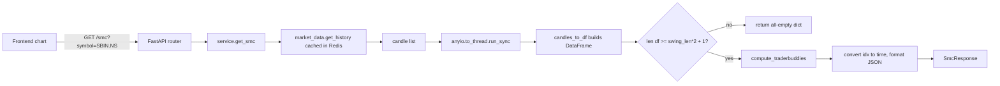
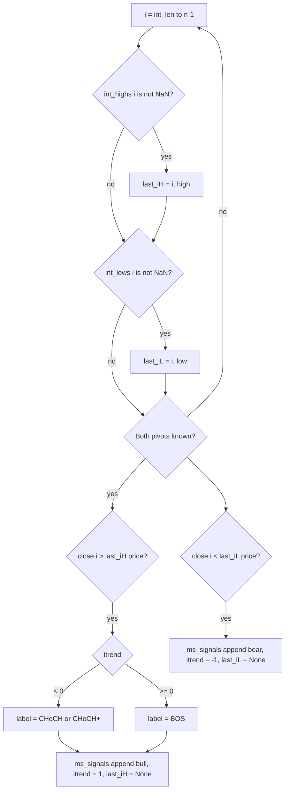
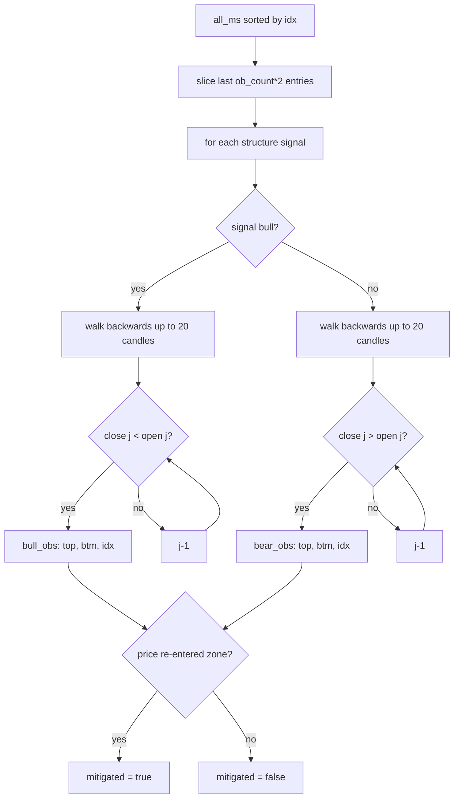

# SMC — how it works

This page walks through the TraderBuddies engine step by step. Read it once and
the rest of the file is mechanical.

## The big picture



Everything inside `compute_traderbuddies` runs in a threadpool because it is
pure CPU work over the candle array.

## Step 1 — Pivot detection

Two helpers find local extremes:

```python
def _pivot_highs(arr, length, n):
    ph = np.full(n, np.nan)
    for i in range(length, n - length):
        window = arr[i - length : i + length + 1]
        if arr[i] == np.max(window):
            ph[i] = arr[i]
    return ph
```

A pivot high at index `i` is a candle whose high is the maximum of the
`2 × length + 1` candles centred on `i`. Default `length=50` for swing pivots,
`length=5` for internal pivots.

Result: two numpy arrays of length `n` with `NaN` everywhere except at the pivot
indices, where the array holds the pivot price.

The `n - length` upper bound means the last `length` candles can never be a
pivot — there are not enough future candles to compare against. This is correct
behaviour but worth knowing: the most recent swing pivot is always at least
`length` bars old.

## Step 2 — Market structure (BOS / CHoCH)

The structure walker keeps state for the most recent internal and swing pivots.
When a candle closes beyond a stored pivot, it emits a structure event.



The key choices:

- **Internal vs swing structure is computed independently.** Two separate loops
  with two separate state machines (`itrend` / `last_iH` for internal,
  `strend` / `last_sH` for swing).
- **`last_iH = None` after a break.** This means a single pivot can only be
  broken once. The walker waits for the next internal pivot to detect another
  break.
- **CHoCH+ condition**: when the current pivot is itself higher/lower than the
  prior pivot, the reversal is stronger. For internal structure:
  ```python
  "CHoCH+" if (prev_iL_price and last_iL[1] > prev_iL_price) else "CHoCH"
  ```
  Reads: "this swing low is higher than the previous swing low — the
  downtrend's internal structure is making higher lows".

The output `ms_signals` keeps at most 20 entries (the most recent). Each entry is
`{ idx, price, label, bull }`.

## Step 3 — Order blocks

Order blocks come from the **last opposing candle before a structural break**.



Notes:

- **`ob_count * 2`** because each structure event looks at both internal and
  swing signals. Duplicates (same idx appearing in both) are removed by the
  `seen` set.
- **Walking back up to 20 candles** stops the search if the opposing candle is
  too far back (no longer relevant).
- **`mitigated` flag**: a bullish OB is mitigated if the latest close is below
  its top — meaning price has dipped back into the zone and the OB's thesis is
  invalidated. The opposite for bearish OBs.
- **Sort and slice**: `sorted by idx`, take the last `ob_count` of each side.
  Default 3, max 10.

## Step 4 — Fair value gaps

Three-candle patterns.

```python
for i in range(2, n):
    if lo[i] > hi[i - 2]:   # bullish FVG
        fvgs.append({"bull": True, "top": lo[i], "btm": hi[i-2], ...})
    elif hi[i] < lo[i - 2]: # bearish FVG
        fvgs.append({"bull": False, "top": lo[i-2], "btm": hi[i], ...})
```

Bullish FVG: candle-2 high is below candle `i` low. There is a price gap where
no trades happened — a "fair value gap" the market may come back to fill.

A limit of 5 bullish and 5 bearish FVGs is enforced; the final list is sliced
to the most recent 6 overall (`[-6:]`).

`mitigated` flag: bullish FVG mitigated if latest close is below the FVG top;
bearish if above.

## Step 5 — Premium / discount / equilibrium

```python
valid_sh = [hi[i] for i in range(n) if not np.isnan(swing_highs[i])]
valid_sl = [lo[i] for i in range(n) if not np.isnan(swing_lows[i])]
range_high = max(valid_sh[-3:]) if len(valid_sh) >= 3 else max(valid_sh)
range_low = min(valid_sl[-3:]) if len(valid_sl) >= 3 else min(valid_sl)
equilibrium = (range_high + range_low) / 2
```

- **range_high** = highest of the last 3 swing highs (or all of them if fewer).
- **range_low** = lowest of the last 3 swing lows.
- **equilibrium** = midpoint of the range.

The chart draws three horizontal lines: range high, equilibrium, range low.
Above equilibrium is the **premium zone** (where institutions tend to sell);
below is the **discount zone** (where they tend to buy).

If there are no valid swings at all, all three are `None` and the chart skips
the overlay.

## Step 6 — JSON wrapping

`_points()` and inline `box()` / dict comprehensions convert the numpy arrays
and `idx`-keyed dicts into `{ time, value }` / `{ time, top, btm, mitigated }`
shapes ready for the frontend chart.

The wrapping happens in `get_smc` after `compute_traderbuddies` returns. The
indices become ISO timestamps via `df.index[idx].isoformat()`.

## The three slider parameters

| Param | Default | Range | Effect |
|---|---|---|---|
| `swing_len` | 50 | 5–100 | Window for swing pivot detection. Lower = more pivots. |
| `int_len` | 5 | 2–20 | Window for internal pivot detection. Lower = more pivots. |
| `ob_count` | 3 | 1–10 | How many order blocks to return per side. |

These mirror the Streamlit sliders from `app.py:1009-1011`. Changing them does
not change the underlying math, just the granularity and the output size.

## What can go wrong

| Symptom | Cause |
|---|---|
| Empty response, no error | `len(df) < max(swing_len*2 + 1, 20)` — not enough history. Try `period=10y`. |
| `itrend = 0` always | Price is range-bound; no internal breaks in either direction. |
| `range_high = None` | No valid swing pivots. Usually means the symbol is too new or too quiet. |
| All OBs mitigated | Price has retraced into every OB zone. The signal is no longer actionable. |
| FVG list empty | No three-candle gaps in the period. Sharp trending moves are required. |
| Order blocks look random | The structure signal `idx` and the opposing candle `idx` may be far apart. Check `ob_count`. |

Related: [implementation](implementation.md) for the file map and helper details.