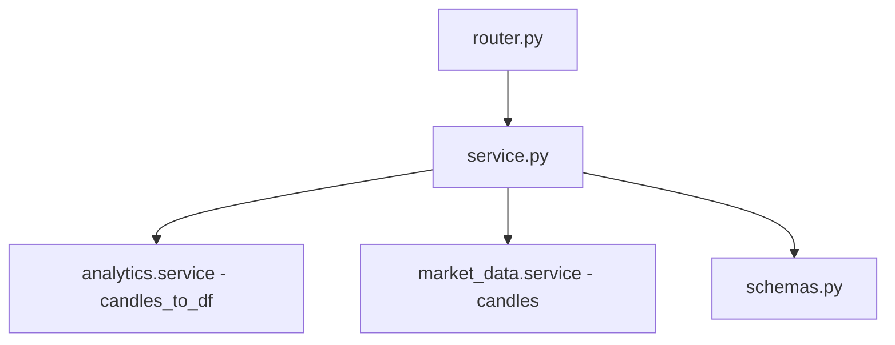
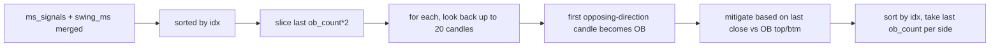
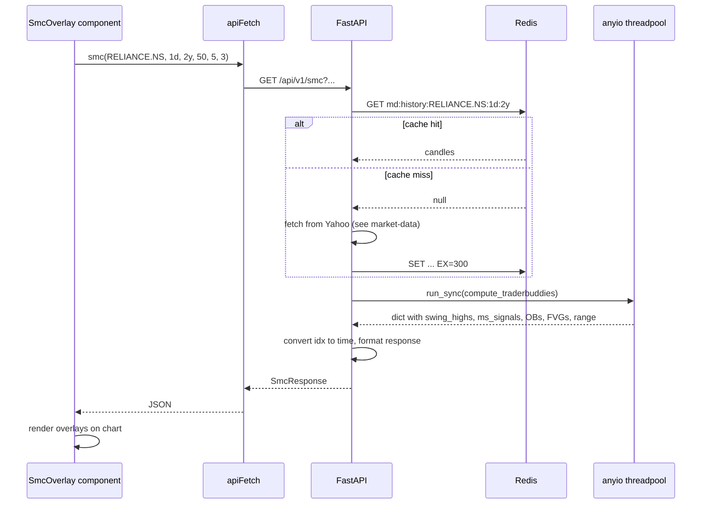

# SMC — implementation (reading the code)

A guide for someone with the repo open. Read the files in this order.

## File map



## 1. `backend/app/modules/smc/service.py` (325 lines)

Five logical sections, top to bottom.

### Section A — pivot helpers

`_pivot_highs(arr, length, n)` and `_pivot_lows(arr, length, n)`:

```python
def _pivot_highs(arr: np.ndarray, length: int, n: int) -> np.ndarray:
    ph = np.full(n, np.nan)
    for i in range(length, n - length):
        window = arr[i - length : i + length + 1]
        if arr[i] == np.max(window):
            ph[i] = arr[i]
    return ph
```

Returns a numpy array of length `n` with `NaN` everywhere except at pivot
indices. Same algorithm for lows (mirrored with `np.min`).

Used at four scales in `compute_traderbuddies`:

| Variable | Source | length |
|---|---|---|
| `swing_highs` | `df["High"]` | 50 |
| `swing_lows` | `df["Low"]` | 50 |
| `int_highs` | `df["High"]` | 5 |
| `int_lows` | `df["Low"]` | 5 |

### Section B — internal market structure loop (lines 54–100)

State machine walking `range(int_len, n)`:

- `itrend`: current internal trend, `+1` (up), `-1` (down), `0` (initial).
- `last_iH`, `last_iL`: most recent internal pivot as `(idx, price)`.
- `prev_iH_price`, `prev_iL_price`: prior pivot price (used for CHoCH+
  detection).

When a new internal pivot is found, it updates `last_i*` and (if it exists) the
`prev_*_price`. When `close[i]` exceeds the last pivot high, it emits a bullish
structure signal; when it falls below the last pivot low, it emits a bearish
signal. After emission, the pivot is cleared (`last_iH = None`) so it can only
fire once.

### Section C — swing market structure loop (lines 103–146)

Identical algorithm to internal, but with `swing_highs`/`swing_lows` and the
state variables `strend`, `last_sH`, `last_sL`, `prev_sH_price`, `prev_sL_price`.

### Section D — order blocks (lines 148–189)



Key constants:

- `ob_count * 2`: doubled to cover both internal and swing signals per side.
- `seen` set: prevents duplicate OB at the same `idx`.
- 20-candle lookback: how far back to search for the opposing candle.

After mitigation marking, both lists are sorted by `idx` and sliced to the most
recent `ob_count`.

### Section E — fair value gaps (lines 192–219)

A 3-candle pattern detector:

```python
for i in range(2, n):
    if lo[i] > hi[i - 2]:    # bullish FVG
        ...
    elif hi[i] < lo[i - 2]:  # bearish FVG
        ...
```

Each side is limited to 5 FVGs; the final list is sliced to `[-6:]` (most recent
overall).

### Section F — premium / discount (lines 221–232)

```python
range_high = float(max(valid_sh[-3:]) if len(valid_sh) >= 3 else max(valid_sh))
range_low = float(min(valid_sl[-3:]) if len(valid_sl) >= 3 else min(valid_sl))
equilibrium = (range_high + range_low) / 2
```

If fewer than 3 swings exist on either side, falls back to the max/min of
what's available. If none exist, all three are `None`.

### Async wrapper — `get_smc(symbol, interval, period, swing_len, int_len, ob_count)`

1. Fetch candles via `market_data.get_history` (Redis-cached).
2. Build the DataFrame with `candles_to_df`.
3. **Guard**: if `len(df) < max(swing_len*2 + 1, 20)`, return all-empty dict.
   This prevents pivot-detection loops from running on too-short frames.
4. Run `compute_traderbuddies(df, swing_len, int_len, ob_count)` in
   `anyio.to_thread.run_sync`.
5. Convert indices → ISO times, format the response.

`_points(index, values)` extracts non-NaN pivot values as `{ time, value }`
dicts. The inline `box()` dict comprehension wraps OBs and FVGs as
`{ time, top, btm, mitigated }`.

## 2. `backend/app/modules/smc/router.py` (31 lines)

One endpoint under `/api/v1/smc/`:

| Method | Path | Query | Response |
|---|---|---|---|
| `GET` | `/smc` | `symbol` (req), `interval`, `period`, `swing_len` (5–100, default 50), `int_len` (2–20, default 5), `ob_count` (1–10, default 3) | `SmcResponse` |

All three slider parameters are required by the frontend to mirror the Streamlit
controls. Defaults preserve the legacy behaviour.

## 3. `backend/app/modules/smc/schemas.py` (49 lines)

| Schema | Shape |
|---|---|
| `SwingPoint` | `{ time, value }` |
| `MSSignal` | `{ time, price, label: "BOS"\|"CHoCH"\|"CHoCH+", bull }` |
| `SmcBox` | `{ time, top, btm, mitigated }` — used for both order blocks |
| `FVGBox` | `{ time, bull, top, btm, mitigated }` |
| `SmcResponse` | `{ symbol, interval, period, swing_highs, swing_lows, ms_signals, bull_obs, bear_obs, fvgs, range_high, range_low, equilibrium, itrend, strend }` |

`itrend` and `strend` are integers (`-1`, `0`, `+1`) representing the current
internal and swing trend direction.

## 4. Frontend wiring

| File | Purpose |
|---|---|
| `frontend/lib/api/smc.ts` | `smc(symbol, interval, period, swingLen, intLen, obCount)` |
| `frontend/lib/hooks/use-smc.ts` | `useSmc` — fetches and caches by full param set |
| `frontend/app/(app)/stocks/[symbol]/components/SmcOverlay.tsx` | Renders all SMC overlays on the chart |
| `frontend/app/(app)/stocks/[symbol]/components/SmcPanel.tsx` | Side panel with toggle switches and the order block list |

The frontend reads `range_high` / `equilibrium` / `range_low` and draws three
horizontal lines. `bull_obs` and `bear_obs` become shaded rectangles. `fvgs`
become smaller shaded rectangles. Swing highs and lows become dots.

## 5. End-to-end request trace

You open RELIANCE. The chart mounts with SMC overlays enabled:



The threadpool call is the slow part — everything else is in-memory.

## 6. Common gotchas

- **Empty response without error.** `len(df)` too small for the chosen
  `swing_len`. Drop `swing_len` to 30, or pick `period=10y`.
- **`itrend` and `strend` disagree.** Common and correct. Internal trend can be
  up while swing trend is down (short-term bounce in a long-term decline). The
  frontend renders both as separate indicators.
- **Order blocks look "off" by a few candles.** The lookback walks back up to
  20 candles. If the OB is 21+ candles before the structure event, it is missed.
  This is a deliberate cap — too far back, the OB is no longer relevant.
- **`CHoCH+` shows up rarely.** It requires the new pivot to break the prior
  pivot's price. Most CHoCHs are plain CHoCH. This is by design — CHoCH+ is
  the strong reversal, plain CHoCH is the ordinary one.
- **`fvgs` shows only 6 entries.** Hard limit in `service.py:219` (`[-6:]`).
  Increase by editing the line if needed.
- **No order blocks at all for a quiet stock.** The OB algorithm requires a
  structural break (BOS or CHoCH) before looking for the opposing candle. A
  sideways stock with no breaks has no OBs.
- **Premium / discount is `None`.** Same root cause: no valid swings. Show "no
  range detected" in the UI.
- **`mitigated = true` for every OB.** Price has retraced into every OB zone.
  Either the symbol is ranging heavily, or the period is too short. Increase
  `period`.

## 7. Adding a new SMC concept

Quick recipe for adding, say, **Liquidity Sweeps** (where price briefly pierces
a swing high/low then reverses):

1. **Compute in `compute_traderbuddies`**. Walk forward from each swing pivot;
   find candles whose high (for swing_highs) exceeds the pivot then closes
   back below it. Emit `{ idx, pivot_idx, sweep_kind }`.
2. **Add to return dict**.
3. **Wrap in `get_smc`** alongside the existing conversions.
4. **Add to `SmcResponse`** and create a new `LiquiditySweep` schema.
5. **Draw on the chart** in the frontend overlay component.

The pattern is the same: pure-python detection → numpy/dict → wrap with time
conversion → schema → frontend rendering.

## Related

- Backend dev notes: `backend/docs/smc/concepts.md`.
- Candle source: [market-data](../market-data/overview.md).
- Indicator source: [analytics](../analytics/overview.md).
- Frontend page docs: [stock-terminal](../../pages/stock-terminal.md).
- Parent module page: [overview](overview.md).