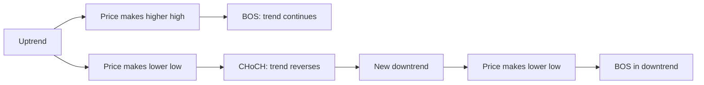
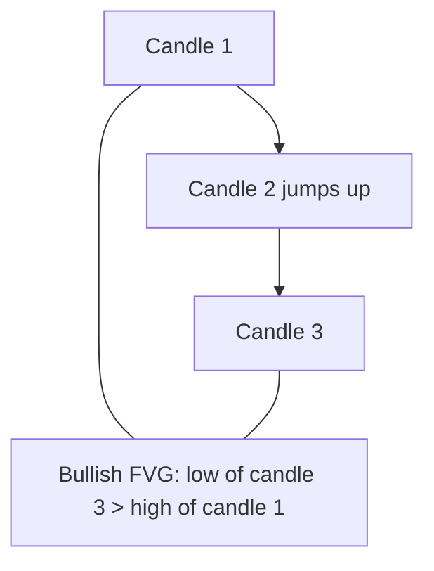

# SMC — what it is

The SMC module computes **Smart Money Concepts** overlays. These are chart
zones drawn from price structure that highlight where large institutional orders
likely showed up.

SMC is descriptive, not predictive. It marks zones; it does not give buy/sell
verdicts. The chart reads the overlays and the user decides.

## What you can do with it

Get a single response with five overlay types for a symbol:

| Overlay | What it shows |
|---|---|
| **Swing highs / lows** | Pivot points at both "internal" (5-bar) and "swing" (50-bar) scales |
| **Market structure** (BOS / CHoCH) | "Break of Structure" and "Change of Character" events |
| **Order blocks** | The last opposing candle before a structural break — where big players likely entered |
| **Fair Value Gaps (FVG)** | Price ranges that got skipped by a fast move — often come back to be filled |
| **Premium / discount zones** | Equilibrium (50%) of the last 3 swing highs/lows, with range high and range low |

## The five concepts in plain English

**Swing highs and lows.** A swing high is a candle whose high is higher than the
N candles on either side. Swing low is the mirror. Default N is 50 — a swing
high is a multi-month turning point. Internal swings use N=5 for short-term
pivots.

**Market structure: BOS vs CHoCH.**

- **BOS** (Break of Structure): price broke a prior pivot while the trend was
  already in that direction. The trend continues.
- **CHoCH** (Change of Character): price broke a prior pivot **against** the
  current trend. The trend is reversing.
- **CHoCH+**: a CHoCH that itself breaks a higher/lower prior pivot — stronger
  reversal signal.

**Order blocks.** The last "calm" candle before a strong move in one direction.
Smart money places large orders on these candles, so when price comes back, it
often bounces off the zone. The module marks:

- **Bullish OB**: a red (close < open) candle just before a bullish BOS/CHoCH.
- **Bearish OB**: a green candle just before a bearish BOS/CHoCH.

**Fair Value Gaps.** Three-candle patterns where the middle candle moves so
fast that the high of candle-2 is below the low of candle+1 (bullish FVG), or
the low of candle-2 is above the high of candle+1 (bearish FVG). Price usually
comes back to "fill" the gap.

**Premium / discount.** The 50% level of the last three swing highs and lows
is the **equilibrium**. Above it is the **premium zone** (sell area). Below it
is the **discount zone** (buy area).

## A real example

You open HDFCBANK. The SMC endpoint returns:

- 3 swing highs around ₹1720, ₹1685, ₹1645 (last 12 months).
- 5 swing lows, the most recent around ₹1600.
- `itrend = 1` (current internal trend is up), `strend = -1` (swing trend
  flipped recently).
- 3 bullish order blocks near ₹1580–₹1620, none mitigated (price has not
  returned to test them yet).
- 2 bearish FVGs above the current price (potential resistance).
- Range high ₹1720, range low ₹1580, equilibrium ₹1650.

The chart draws the swing dots, shades the order block zones, marks the FVGs,
and shows the equilibrium as a horizontal line.

## What the frontend does with it

- **Swing highs/lows**: small dots above/below the pivot candle.
- **BOS / CHoCH markers**: labelled arrows on the chart.
- **Order blocks**: shaded rectangles spanning the OB's high and low.
- **FVGs**: shaded rectangles spanning the FVG's top and bottom.
- **Premium/discount**: three horizontal lines (range high, equilibrium, range low).

The chart only shows overlays the user toggles on. The endpoint returns all of
them; the frontend filters.

## Why a separate module

- **Single home for the TraderBuddies engine.** All SMC math is ported from a
  Pine Script indicator. Keeping it in one place makes bug fixes easy.
- **Heavy pure-math computation.** The engine walks the candle array multiple
  times looking for pivots. Running it in a threadpool keeps the rest of the
  server responsive.
- **Independent of signals.** SMC does not feed into the rule engine or fusion.
  It is purely descriptive. This is intentional — the verdict should not depend
  on a complex structural overlay.

## Where it lives in the codebase

- Backend code: `backend/app/modules/smc/`
- Backend dev notes: `backend/docs/smc/`
- Source: `app/modules/analytics/service.py` (`candles_to_df`)
- Frontend API client: `frontend/lib/api/smc.ts`
- Frontend hook: `frontend/lib/hooks/use-smc.ts`
- Frontend consumer: stock-terminal chart, SMC overlay panel

## Consumed by (frontend pages and other modules)

- [Stock terminal](../../pages/stock-terminal/overview.md) — the only consumer. The
  verdict card shows "Why: Bullish BOS, OB at ₹2,820" when the SMC overlay flags a
  bullish structure shift.
- Module: [Analytics](../analytics/overview.md) — uses `candles_to_df` to build the
  price series for pivot detection.

## Related pages in this folder

- [How it works](how-it-works.md) — pivot detection, structure algorithm, OB and
  FVG detection, premium/discount math.
- [Implementation](implementation.md) — file map, every helper, the JSON
  wrapping, request trace, gotchas.