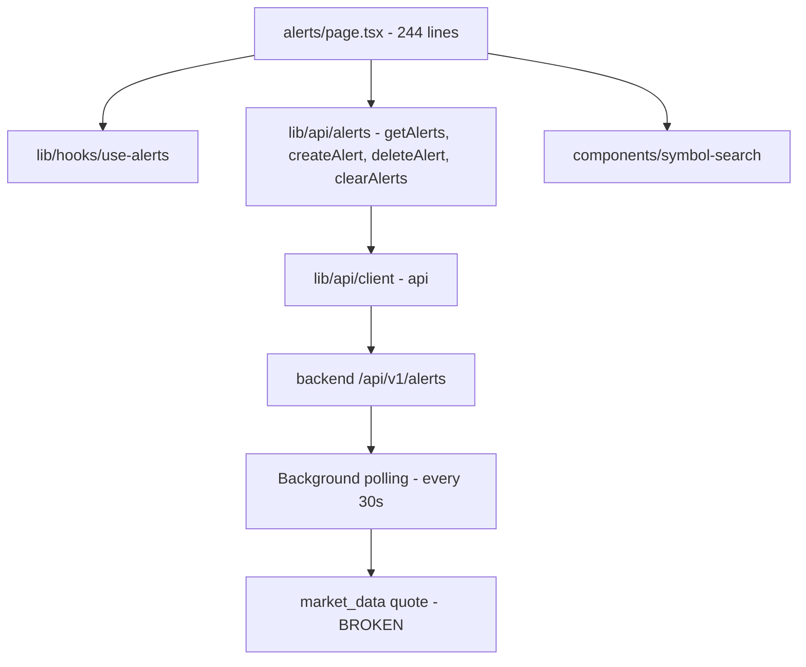
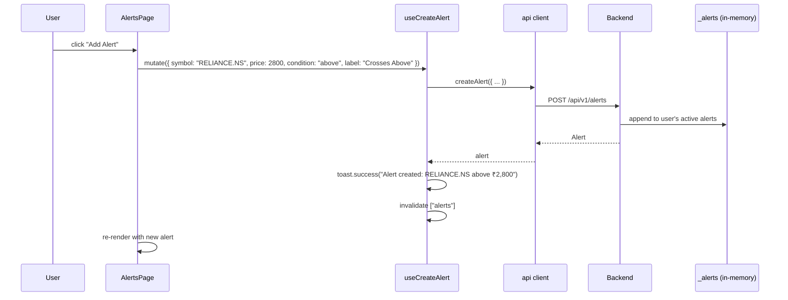
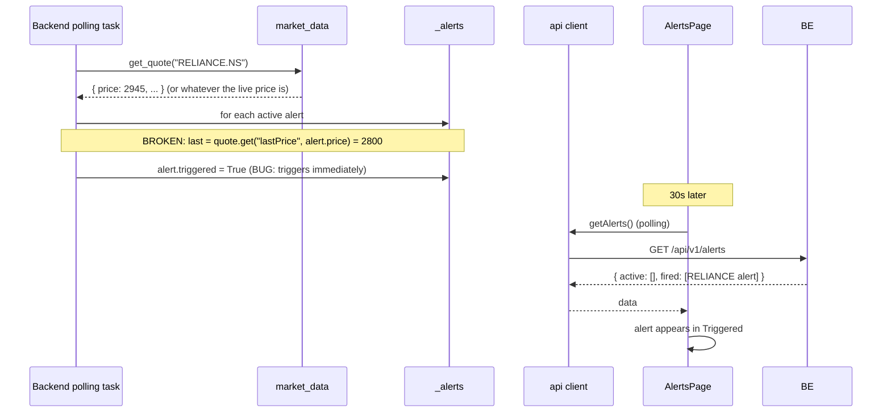

# Alerts — implementation (reading the code)

A guide for someone with the repo open. The whole page is one file.

## File map



## 1. `frontend/app/(app)/app/alerts/page.tsx` (244 lines)

A single client component with no sub-components (everything is inline).

### Hooks

```typescript
const { data, isLoading } = useAlerts();
const createAlert = useCreateAlert();
const deleteAlert = useDeleteAlert();
const clearAlerts = useClearAlerts();
```

Four hooks, all from `use-alerts.ts`. The page itself has no other
state besides the form fields.

### Form state

```typescript
const [symbol, setSymbol] = useState("RELIANCE.NS");
const [price, setPrice] = useState("");
const [condition, setCondition] = useState("above");
```

### Derived

```typescript
const active = data?.active ?? [];
const fired = data?.fired ?? [];
```

The `data` object has three fields (`active`, `fired`, `triggered_now`).
The page uses two. `triggered_now` is not used — it's available for
toast popups but the page does not consume it.

## 2. The create form

Already covered in `how-it-works.md`. Key parts:

### The submit handler

```typescript
const handleCreate = () => {
  if (!symbol.trim() || !price) return;
  createAlert.mutate(
    {
      symbol: symbol.trim().toUpperCase(),
      price: Number(price),
      condition,
      label: condition === "above" ? "Crosses Above" : "Crosses Below",
    },
    { onSuccess: () => setPrice("") },
  );
};
```

The `Number(price)` converts the string to a number. The `label` is
derived from the condition.

The form clears the price on success (so the user can place another
alert quickly). The symbol and condition are preserved.

### The button

```tsx
<Button
  onClick={handleCreate}
  disabled={createAlert.isPending || !symbol.trim() || !price}
  className="w-full bg-gold text-gold-foreground hover:bg-gold/90 sm:w-auto"
>
  <Plus className="mr-1 size-4" />
  Add Alert
</Button>
```

The button is disabled when:
- The mutation is in flight.
- The symbol is empty.
- The price is empty.

The colour is gold — the "alert" theme.

## 3. The Watching list

```tsx
{active.map((a) => (
  <div key={a.id} className="flex items-center justify-between rounded-xl border border-border bg-card px-4 py-3">
    <div className="flex items-center gap-4">
      <Bell className="size-4 text-gold" />
      <span className="font-mono text-sm font-bold">{a.symbol}</span>
      <span className={cn("rounded-full px-2 py-0.5 text-[10px] font-semibold", a.condition === "above" ? "bg-up/10 text-up" : "bg-down/10 text-down")}>
        {a.condition === "above" ? "ABOVE" : "BELOW"}
      </span>
      <span className="font-mono text-base font-bold text-gold">₹{a.price.toLocaleString("en-IN")}</span>
      <span className="text-[10px] text-muted-foreground">Set {a.created}</span>
    </div>
    <Button variant="ghost" size="sm" className="size-8 p-0 text-muted-foreground hover:text-down" onClick={() => deleteAlert.mutate(a.id)} disabled={deleteAlert.isPending}>
      <X className="size-4" />
    </Button>
  </div>
))}
```

Each row has:
- A gold bell icon.
- The symbol.
- A condition pill (ABOVE = green, BELOW = red).
- The price (large, gold).
- The set timestamp.
- A delete button.

The `key={a.id}` is the alert ID, which is unique.

The delete button is in the top-right of the row. The X icon is muted
by default and turns red on hover.

## 4. The Triggered list

Similar layout, but with:
- A red `BellOff` icon (struck-out bell).
- A red border and red-tinted background.
- A red "Triggered (N)" header.

```tsx
<div className="rounded-xl border border-down/20 bg-down/5 px-4 py-3">
  <BellOff className="size-4 text-down" />
  ...
  <span className="font-mono text-base font-bold text-down">₹{a.price.toLocaleString("en-IN")}</span>
</div>
```

The "Clear triggered" button calls `clearAlerts.mutate(true)`.

## 5. The clear flows

```tsx
<Button onClick={() => clearAlerts.mutate(false)} ...>Clear all</Button>
<Button onClick={() => clearAlerts.mutate(true)} ...>Clear triggered</Button>
```

`mutate(false)` calls the API with no query param — clears all alerts.
`mutate(true)` calls with `?fired_only=true` — clears only fired
alerts.

## 6. The hooks

`frontend/lib/hooks/use-alerts.ts`. Four hooks:

| Hook | Endpoint | Type |
|---|---|---|
| `useAlerts()` | `GET /alerts` | Query |
| `useCreateAlert()` | `POST /alerts` | Mutation |
| `useDeleteAlert()` | `DELETE /alerts/{id}` | Mutation |
| `useClearAlerts()` | `DELETE /alerts` (or `?fired_only=true`) | Mutation |

The `useAlerts` query has a polling interval (typically 30s) so the
"Triggered" list updates as the backend's polling loop fires alerts.

The `useCreateAlert`'s `onSuccess`:

```typescript
onSuccess: (alert) => {
  toast.success(`Alert created: ${alert.symbol} ${alert.condition} ₹${alert.price}`);
  qc.invalidateQueries({ queryKey: ["alerts"] });
}
```

The `useDeleteAlert` and `useClearAlerts` also invalidate the alerts
query.

## 7. The backend bug (recap)

The backend's alert evaluation (in `backend/app/modules/alerts/service.py`):

```python
quote = await market_data.get_quote(alert.symbol)
last = quote.get("lastPrice", alert.price)  # BUG
```

The market-data endpoint returns `{ price, change, change_pct, ... }`.
The lookup `quote.get("lastPrice", ...)` always falls back to
`alert.price`, so the comparison is always against the alert's own
threshold. Every active alert fires immediately.

### The fix

```python
quote = await market_data.get_quote(alert.symbol)
if quote is None:
    continue
last = quote.get("price")
if last is None:
    continue
if alert.condition == "above" and last >= alert.price:
    alert.triggered = True
elif alert.condition == "below" and last <= alert.price:
    alert.triggered = True
```

Four lines of changes:
1. Skip the alert if the quote fetch failed.
2. Read the correct key.
3. Skip if the price is None.
4. Apply the condition.

After the fix, alerts only fire when the live price actually crosses
the threshold.

## 8. End-to-end request trace — create an alert

You set RELIANCE.NS above ₹2,800:



The new alert appears in the "Watching" list immediately.

Then, 30 seconds later, the backend's polling loop runs:



The bug means every alert appears in Triggered within 30s of creation.

## 9. Common gotchas

- **Every active alert fires immediately.** This is the bug. The fix
  is in the implementation file.
- **The alert store is in-memory.** Server restart wipes the data.
- **The set timestamp** (`a.created`) is the local time when the
  alert was created. The format is not standardised — could be
  "Mon 10:30" or "2026-04-17 10:30:42" depending on the backend.
- **The price is a flat number, not formatted.** The frontend formats
  it with `toLocaleString("en-IN")` for display. The backend stores
  it as a float.
- **The condition is a string** ("above" or "below"). The backend does
  not validate it against a fixed set — a malformed value would be
  stored as-is.
- **The label is derived from the condition.** The backend accepts it
  but does not require it.
- **The "Clear all" button** clears both active and fired. The
  "Clear triggered" button clears only fired. Neither is undoable.
- **The bell icon for fired alerts** (`BellOff`) is a strikethrough
  version of the active bell. It is visually distinct to make the
  state obvious.
- **The "Set {created}" timestamp** is small (10px) and muted. It is
  for reference only — the user does not act on it.
- **The `toLocaleString("en-IN")`** is used for the Indian digit
  grouping (2,800 → "2,800", 100000 → "1,00,000").

## 10. The fix in detail

The bug is in `backend/app/modules/alerts/service.py`. The current
code (pseudocode):

```python
async def evaluate_alerts_for_user(user_id: str) -> list[dict]:
    alerts = _alerts.get(user_id, [])
    newly_fired = []
    for alert in alerts:
        if alert.triggered:
            continue
        try:
            quote = await market_data.get_quote(alert.symbol)
        except Exception:
            continue
        last = quote.get("lastPrice", alert.price)  # BUG
        if alert.condition == "above" and last >= alert.price:
            alert.triggered = True
            newly_fired.append(alert)
        elif alert.condition == "below" and last <= alert.price:
            alert.triggered = True
            newly_fired.append(alert)
    return newly_fired
```

The fixed code:

```python
async def evaluate_alerts_for_user(user_id: str) -> list[dict]:
    alerts = _alerts.get(user_id, [])
    newly_fired = []
    for alert in alerts:
        if alert.triggered:
            continue
        try:
            quote = await market_data.get_quote(alert.symbol)
        except Exception:
            continue
        if quote is None:           # NEW
            continue
        last = quote.get("price")   # FIXED (was "lastPrice", alert.price)
        if last is None:            # NEW
            continue
        if alert.condition == "above" and last >= alert.price:
            alert.triggered = True
            newly_fired.append(alert)
        elif alert.condition == "below" and last <= alert.price:
            alert.triggered = True
            newly_fired.append(alert)
    return newly_fired
```

The changes:
1. **`if quote is None: continue`** — skip alerts whose quote fetch
   returned None.
2. **`last = quote.get("price")`** — read the correct key from the
   market-data response.
3. **`if last is None: continue`** — skip alerts with no live price.

The `alert.price` fallback is removed — it was the source of the bug.

### After the fix

The polling loop correctly evaluates each alert:
- An "above ₹2,800" alert on RELIANCE only fires when the live price
  is ≥ ₹2,800.
- A "below ₹1,400" alert on INFY only fires when the live price is
  ≤ ₹1,400.
- The "Watching" list remains non-empty until conditions are met.

The bug is critical for any production use. It should be fixed and
re-tested before any demo or release.

## Related

- Backend counterpart: [alerts module](../../modules/alerts/overview.md) — covers the
  in-memory store, the polling task, the per-user dict.
- Sibling page: [stock-terminal](../stock-terminal/overview.md) — the
  watchlist star is a similar "save this for later" feature.
- Parent page: [overview](overview.md).