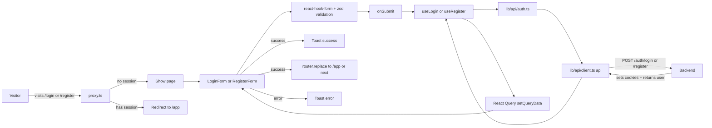

# Auth pages — how it works

This page walks through the form library, the validation rules, the login and
register flows, the single-flight session refresh, and the route guard.

## The big picture



## The form library

Both forms use **react-hook-form** for state management and **zod** for
validation. The two are wired together with `@hookform/resolvers/zod`.

```tsx
const loginSchema = z.object({
  username: z.string().min(3, "Username is too short"),
  password: z.string().min(1, "Password is required"),
});

const { control, handleSubmit, setValue, trigger, formState: { errors } } =
  useForm<LoginFormValues>({
    resolver: zodResolver(loginSchema),
    defaultValues: { username: "", password: "" },
  });
```

Each input uses the `Controller` wrapper so the custom `Input` component
(from `@/components/motion/input`) works with RHF. The `onChange` handler
calls `setValue` and `trigger` to re-validate as the user types.

## The login form

`login-form.tsx` (145 lines). Sections:

1. **Card header** — logo, title ("Welcome back"), description.
2. **Form** — two `Controller`-wrapped inputs, one `StatefulButton` submit.
3. **Card footer** — demo credentials button + "Create one" link.

### The validation rules

```typescript
const loginSchema = z.object({
  username: z.string().min(3, "Username is too short"),
  password: z.string().min(1, "Password is required"),
});
```

Username is at least 3 chars (matches the backend's `min_length=3`). Password
is at least 1 char — the backend does the real password check (Argon2
verify). Client-side validation is for UX only.

### The submit handler

```tsx
const onSubmit = handleSubmit(async (values) => {
  try {
    await login.mutateAsync(values);
    toast.success(`Welcome back, ${values.username}`);
    router.replace(searchParams.get("next") ?? "/app");
  } catch (e) {
    toast.error(e instanceof Error ? e.message : "Login failed");
  }
});
```

Three branches:

- **Success**: toast, then `router.replace` to the `next` param (or `/app`).
- **Error**: toast with the server's error message (e.g. "Invalid username
  or password").
- **Validation failure** (handled by RHF before this runs): the form shows
  field-level errors.

The `useLogin` hook returns a React Query mutation. `mutateAsync` resolves
with the user object on success and throws on failure.

### The demo button

```tsx
<button
  type="button"
  onClick={() => {
    setValue("username", "demo", { shouldValidate: true });
    setValue("password", "demo123", { shouldValidate: true });
    trigger();
  }}
>
  demo / demo123
</button>
```

Clicking it fills the form with the demo credentials. `shouldValidate: true`
runs the schema on the filled values, so any red borders are cleared.

## The register form

`register-form.tsx` (164 lines). Same structure, different fields.

### The validation rules

```typescript
const registerSchema = z
  .object({
    username: z
      .string()
      .min(3, "At least 3 characters")
      .max(50, "At most 50 characters")
      .regex(/^[a-zA-Z0-9_]+$/, "Letters, numbers and underscores only"),
    password: z.string().min(6, "At least 6 characters"),
    confirm: z.string().min(1, "Confirm your password"),
  })
  .refine((v) => v.password === v.confirm, {
    path: ["confirm"],
    message: "Passwords do not match",
  });
```

Three field rules plus a cross-field rule:

- `username` — 3–50 chars, regex `^[a-zA-Z0-9_]+$` (matches backend).
- `password` — at least 6 chars (matches backend's `min_length=6`).
- `confirm` — at least 1 char; must equal `password` (via `.refine`).

The regex is the **same** as the backend's. If the frontend regex passes, the
backend accepts the username (modulo the duplicate check).

### The submit handler

```tsx
const onSubmit = handleSubmit(async (values) => {
  try {
    await register.mutateAsync({
      username: values.username,
      password: values.password,
    });
    toast.success("Account created. Welcome aboard!");
    router.replace("/app");
  } catch (e) {
    toast.error(e instanceof Error ? e.message : "Registration failed");
  }
});
```

`confirm` is dropped before sending — only `username` and `password` go to
the server. On success, immediate redirect to `/app` (the `next` param is not
honoured on register).

## The `useMe` / `useLogin` / `useRegister` / `useLogout` hooks

`frontend/lib/hooks/use-auth.ts` (48 lines). Four hooks, all using React Query.

```typescript
export const userQueryKey = ["auth", "me"] as const;

export function useMe() {
  return useQuery({
    queryKey: userQueryKey,
    queryFn: me,
    retry: false,
    staleTime: 5 * 60 * 1000,
  });
}

export function useLogin() {
  const qc = useQueryClient();
  return useMutation({
    mutationFn: ({ username, password }) => login(username, password),
    onSuccess: (user) => { qc.setQueryData(userQueryKey, user); },
  });
}

export function useRegister() {
  const qc = useQueryClient();
  return useMutation({
    mutationFn: ({ username, password }) => register(username, password),
    onSuccess: (user) => { qc.setQueryData(userQueryKey, user); },
  });
}

export function useLogout() {
  const qc = useQueryClient();
  return useMutation({
    mutationFn: logout,
    onSuccess: () => { qc.setQueryData(userQueryKey, null); },
  });
}
```

The shared `userQueryKey` means every component reading `useMe` sees the
same cached user. After login, `setQueryData` updates the cache — every
component that called `useMe` re-renders with the new user.

`staleTime: 5 * 60 * 1000` (5 minutes) for `useMe` — the user is "fresh" for
5 minutes after a successful fetch. Within that window, components reading
`useMe` get the cached value without a network call.

`retry: false` — never retry the `/auth/me` call. If it fails once, the user
is treated as logged out.

## The single-flight session refresh

`lib/api/client.ts` (83 lines). This is the most subtle piece of the auth
flow.

The backend **rotates** the refresh token on every `/auth/refresh` — the
first call succeeds and revokes the old refresh token. If two parallel API
calls both get 401 and both try to refresh, the first succeeds, the second
fails because the refresh token is now revoked.

The client solves this with a single-flight promise:

```typescript
let inflightRefresh: Promise<boolean> | null = null;

function refreshSession(): Promise<boolean> {
  inflightRefresh ??= fetch(`${BASE}/auth/refresh`, {
    method: "POST",
    credentials: "include",
  })
    .then((res) => res.ok)
    .catch(() => false)
    .finally(() => { inflightRefresh = null; });
  return inflightRefresh;
}
```

`??=` assigns the promise only if it is currently null. So if 5 parallel
requests all hit 401 at the same time, they all `await` the **same**
refresh promise. The first one to start the fetch wins; the others get the
result.

```typescript
const NO_REFRESH_PATHS = ["/auth/login", "/auth/register", "/auth/refresh"];

if (res.status === 401 && allowRetry && !excluded) {
  const refreshed = await refreshSession();
  if (refreshed) return request<T>(path, options, false);
  throw new ApiError(401, "Your session has expired. Please sign in again.");
}
```

The `NO_REFRESH_PATHS` set prevents infinite refresh loops — login and
register do not trigger a refresh on 401 (they would loop forever).

`allowRetry` is set to `false` on the second attempt to prevent infinite
recursion.

## The route guard

`frontend/proxy.ts` (28 lines). Runs on every request before the page
renders.

```typescript
const ACCESS_COOKIE = "sv_access";
const REFRESH_COOKIE = "sv_refresh";

export function proxy(request: NextRequest) {
  const hasSession = Boolean(
    request.cookies.get(ACCESS_COOKIE) ?? request.cookies.get(REFRESH_COOKIE),
  );
  const { pathname } = request.nextUrl;

  if (pathname.startsWith("/app") && !hasSession) {
    const url = request.nextUrl.clone();
    url.pathname = "/login";
    url.searchParams.set("next", pathname);
    return NextResponse.redirect(url);
  }

  if ((pathname === "/login" || pathname === "/register") && hasSession) {
    const url = request.nextUrl.clone();
    url.pathname = "/app";
    url.search = "";
    return NextResponse.redirect(url);
  }

  return NextResponse.next();
}

export const config = {
  matcher: ["/app/:path*", "/login", "/register"],
};
```

Three rules:

1. `/app/*` without session → redirect to `/login?next=<original>`.
2. `/login` or `/register` with session → redirect to `/app`.
3. Everything else → pass through.

The `matcher` array limits the proxy to the relevant paths — it does not run
on `/api/*`, static files, etc.

> **Caveat**: the guard checks for the **presence** of a cookie, not its
> validity. A user with an expired access token but a valid refresh token
> will pass the guard (cookie present), get a 401 on the first API call, the
> api client will refresh, and the page will load. This is intentional —
> validating JWTs in the proxy would be expensive and would require sharing
> the secret with the frontend.

## The shared layout

`frontend/app/(auth)/layout.tsx` (22 lines). Wraps both pages with a centred
card on a textured background.

```tsx
<div className="relative flex min-h-dvh items-center justify-center overflow-hidden bg-background px-4 py-10">
  <div aria-hidden className="dot-grid absolute inset-0 [mask-image:radial-gradient(...)]" />
  <div aria-hidden className="absolute -top-40 left-1/2 h-96 w-[42rem] -translate-x-1/2 rounded-full bg-primary/10 blur-3xl" />
  {children}
</div>
```

Two decorative layers: a dot-grid texture masked into a soft ellipse, and a
blurred glow at the top. The `aria-hidden` attribute keeps them out of the
accessibility tree.

The metadata title for the auth layout is `StockView India — Sign in`.

## What can go wrong

| Symptom | Cause |
|---|---|
| `Invalid username or password` on correct creds | Cookies are missing. Open devtools → Application → Cookies and check `sv_access` and `sv_refresh` are present after a successful login. |
| 401 loop on every request | Refresh cookie is also missing/expired. The api client throws after one failed refresh. The user is effectively logged out. |
| Infinite spinner on login submit | The form is waiting for `mutateAsync` but the request never resolves. Check the network tab — likely a 5xx. |
| `/login` is reachable while logged in | Cookie was cleared but the user query cache still has the user. Logout and back in. |
| `/app` bounces to `/login` immediately | Session is dead. The cookie was rejected. The api client refreshes once, fails, and the user is logged out. |
| Register: "Username already taken" | The username is taken. Pick another. |
| Register form: red border on confirm | Passwords do not match. The `.refine` rule fires. |
| Login form: 401 then toast "Your session has expired" | The refresh token was also expired or invalid. Log in again. |

Related: [implementation](implementation.md) for the file map and request traces.