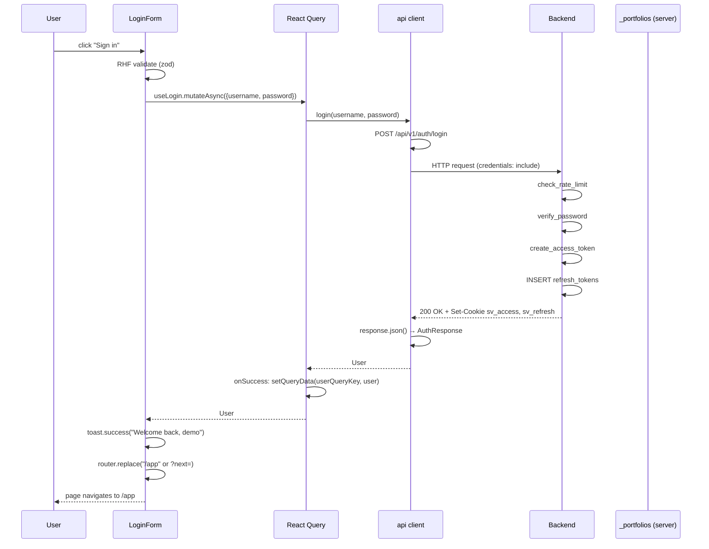
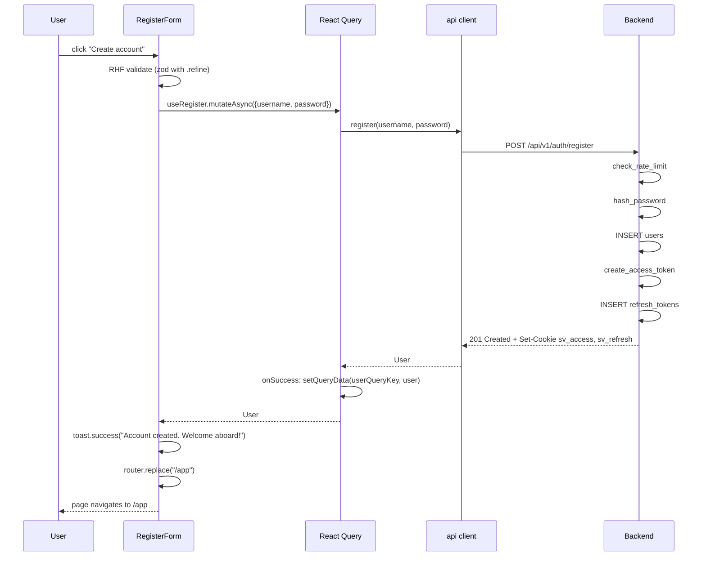
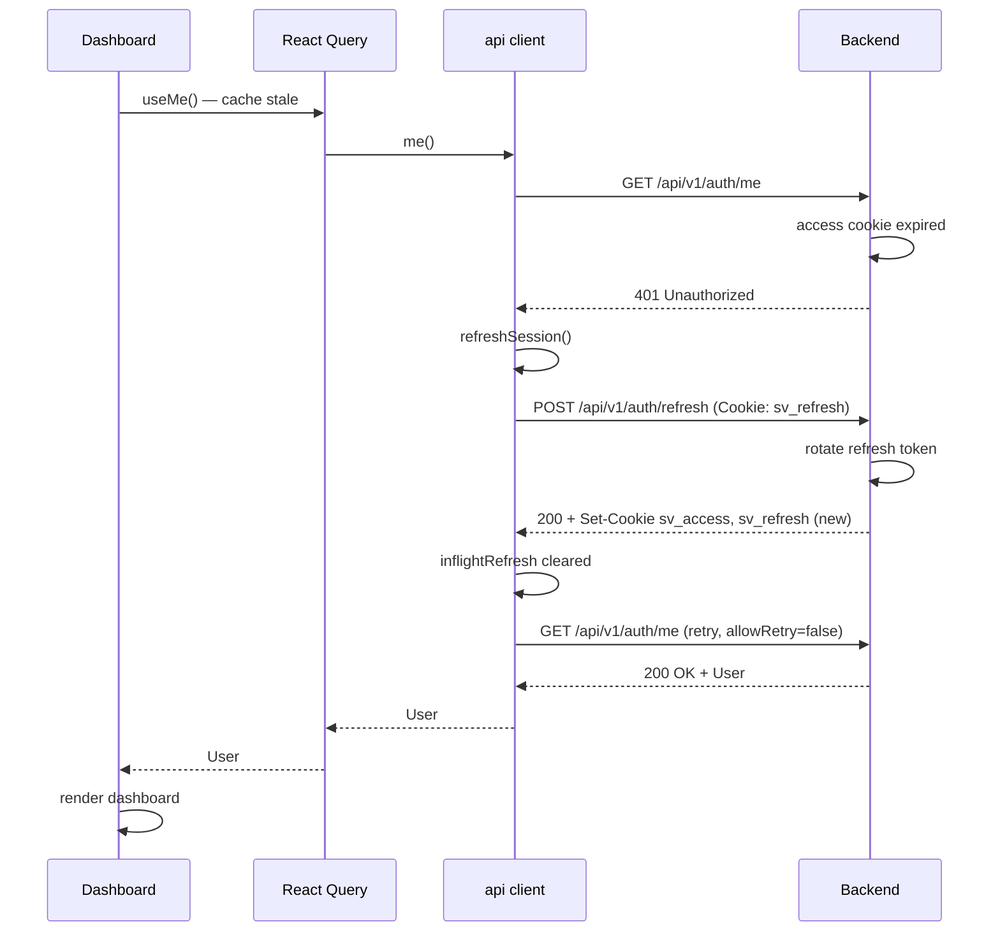

# Auth pages — implementation (reading the code)

A guide for someone with the repo open. Read the files in this order.

## File map

```mermaid
flowflowchart TD
    Login[login/page.tsx] --> LF[login/components/login-form.tsx]
    Register[register/page.tsx] --> RF[register/components/register-form.tsx]
    Login & Register --> Layout[(auth)/layout.tsx]
    LF --> AuthHook[lib/hooks/use-auth.ts]
    RF --> AuthHook
    AuthHook --> APIClient[lib/api/auth.ts]
    APIClient --> Fetch[lib/api/client.ts api]
    Fetch --> BE[backend /api/v1/auth/*]
    Guard[proxy.ts] --> Layout
    Guard --> AppLayout[(app)/layout.tsx]
```

## 1. `frontend/proxy.ts` (28 lines)

The route guard. Already shown in `how-it-works.md`. Key points:

- Reads the `sv_access` and `sv_refresh` cookies from the request.
- Redirects `/app/*` to `/login?next=…` if no session.
- Redirects `/login` or `/register` to `/app` if a session exists.
- The `config.matcher` is `["/app/:path*", "/login", "/register"]` — only
  these paths trigger the proxy.

> The proxy runs on the **edge runtime**, not the Node runtime. It must be
> self-contained — no DB calls, no module imports beyond `next/server`.

## 2. `frontend/app/(auth)/layout.tsx` (22 lines)

The shared card-on-glow shell. Sets the page metadata and wraps the page in a
centred card with two decorative backgrounds. The metadata is the only thing
in this file that is not styling:

```typescript
export const metadata: Metadata = {
  title: "StockView India — Sign in",
};
```

The decorative divs use `aria-hidden="true"` so screen readers skip them.

## 3. `frontend/app/(auth)/login/page.tsx` (11 lines)

```tsx
import { Suspense } from "react";
import { LoginForm } from "./components/login-form";

export default function LoginPage() {
  return (
    <Suspense>
      <LoginForm />
    </Suspense>
  );
}
```

The `<Suspense>` wrapper is required because the form reads `useSearchParams`
to honour the `next` query param. The `Suspense` boundary lets the form
suspend during the first render so `useSearchParams` can read the URL.

## 4. `frontend/app/(auth)/register/page.tsx` (5 lines)

```tsx
import { RegisterForm } from "./components/register-form";

export default function RegisterPage() {
  return <RegisterForm />;
}
```

No Suspense needed because the form does not read the URL. Just renders the
form.

## 5. `frontend/app/(auth)/login/components/login-form.tsx` (145 lines)

A client component (`"use client"`). Sections:

### 5.1 — Imports

```typescript
import Link from "next/link";
import { useRouter, useSearchParams } from "next/navigation";
import { useForm, Controller } from "react-hook-form";
import { z } from "zod";
import { zodResolver } from "@hookform/resolvers/zod";
import { LockKeyhole, UserRound } from "lucide-react";
import { toast } from "sonner";

import { Input } from "@/components/motion/input";
import { StatefulButton } from "@/components/motion/button";
import { Card, CardContent, CardDescription, CardFooter, CardHeader, CardTitle } from "@/components/ui/card";
import { useLogin } from "@/lib/hooks/use-auth";
```

`useSearchParams` is the client-side way to read query params. The form
reads `?next=…` to know where to send the user after a successful login.

### 5.2 — Schema

```typescript
const loginSchema = z.object({
  username: z.string().min(3, "Username is too short"),
  password: z.string().min(1, "Password is required"),
});

type LoginFormValues = z.infer<typeof loginSchema>;
```

Two fields, two rules. The zod type is inferred into `LoginFormValues` for
the form.

### 5.3 — Form state

```typescript
const { control, handleSubmit, setValue, trigger, formState: { errors } } =
  useForm<LoginFormValues>({
    resolver: zodResolver(loginSchema),
    defaultValues: { username: "", password: "" },
  });
```

`setValue` and `trigger` are used in the demo button to set the values and
re-validate.

### 5.4 — Submit handler

```typescript
const onSubmit = handleSubmit(async (values) => {
  try {
    await login.mutateAsync(values);
    toast.success(`Welcome back, ${values.username}`);
    router.replace(searchParams.get("next") ?? "/app");
  } catch (e) {
    toast.error(e instanceof Error ? e.message : "Login failed");
  }
});
```

`router.replace` (not `router.push`) means the login page is **not** in the
browser history. Back button goes to the page before login, not back to the
login form.

### 5.5 — Render

The form renders a `Card` with the inputs and the submit button. The
`StatefulButton` component takes a `state` prop that drives its visual
state:

- `state="loading"` while the mutation is pending.
- `state="error"` after a failed mutation.
- `state="idle"` otherwise.

The `loadingText` and `errorText` props are the labels during those states.

### 5.6 — Demo button

```tsx
<button
  type="button"
  onClick={() => {
    setValue("username", "demo", { shouldValidate: true });
    setValue("password", "demo123", { shouldValidate: true });
    trigger();
  }}
>
  demo / demo123
</button>
```

`type="button"` is important — without it, the button would default to
`type="submit"` and trigger the form submit. `shouldValidate: true` runs the
schema on the new values, clearing any red borders.

## 6. `frontend/app/(auth)/register/components/register-form.tsx` (164 lines)

Same structure as the login form, with:

- Three fields instead of two.
- A `.refine` cross-field rule for the password match.
- A `regex` rule for the username.
- A `min(6)` rule for the password.

```typescript
const registerSchema = z
  .object({
    username: z
      .string()
      .min(3, "At least 3 characters")
      .max(50, "At most 50 characters")
      .regex(/^[a-zA-Z0-9_]+$/, "Letters, numbers and underscores only"),
    password: z.string().min(6, "At least 6 characters"),
    confirm: z.string().min(1, "Confirm your password"),
  })
  .refine((v) => v.password === v.confirm, {
    path: ["confirm"],
    message: "Passwords do not match",
  });
```

The `.refine` attaches the error to the `confirm` field (`path: ["confirm"]`),
so the red border appears on the confirm input.

## 7. `frontend/lib/hooks/use-auth.ts` (48 lines)

```typescript
export const userQueryKey = ["auth", "me"] as const;

export function useMe() {
  return useQuery({
    queryKey: userQueryKey,
    queryFn: me,
    retry: false,
    staleTime: 5 * 60 * 1000,
  });
}

export function useLogin() {
  const qc = useQueryClient();
  return useMutation({
    mutationFn: ({ username, password }) => login(username, password),
    onSuccess: (user) => { qc.setQueryData(userQueryKey, user); },
  });
}

export function useRegister() {
  const qc = useQueryClient();
  return useMutation({
    mutationFn: ({ username, password }) => register(username, password),
    onSuccess: (user) => { qc.setQueryData(userQueryKey, user); },
  });
}

export function useLogout() {
  const qc = useQueryClient();
  return useMutation({
    mutationFn: logout,
    onSuccess: () => { qc.setQueryData(userQueryKey, null); },
  });
}
```

The shared `userQueryKey` is the key React Query uses to cache the user. Any
component calling `useMe` reads from the same cache.

`staleTime: 5 * 60 * 1000` (5 minutes) — within 5 minutes, `useMe` does not
re-fetch. The `me()` function is called only when the cache is stale or
explicitly invalidated.

`retry: false` — never retry `/auth/me`. If it fails, the user is treated as
logged out.

The mutations (`useLogin`, `useRegister`) update the user cache on success so
`useMe` consumers see the new user immediately.

`useLogout` clears the user cache on success.

## 8. `frontend/lib/api/auth.ts` (30 lines)

```typescript
import { api } from "./client";

export interface User {
  id: string;
  username: string;
  role: string;
  created_at: string;
}

interface AuthResponse {
  user: User;
}

export async function login(username, password): Promise<User> {
  const res = await api.post<AuthResponse>("/auth/login", { username, password });
  return res.user;
}

export async function register(username, password): Promise<User> {
  const res = await api.post<AuthResponse>("/auth/register", { username, password });
  return res.user;
}

export async function logout(): Promise<void> {
  await api.post("/auth/logout");
}

export async function me(): Promise<User> {
  return api.get<User>("/auth/me");
}
```

Four functions, one shared `api` client. The `User` type mirrors the backend
`UserOut` Pydantic model field-for-field.

## 9. `frontend/lib/api/client.ts` (83 lines)

The single most important file in the auth flow. Covered in `how-it-works.md`
in detail. Key parts:

```typescript
const NO_REFRESH_PATHS = ["/auth/login", "/auth/register", "/auth/refresh"];

let inflightRefresh: Promise<boolean> | null = null;

function refreshSession(): Promise<boolean> {
  inflightRefresh ??= fetch(...).then(...).finally(() => { inflightRefresh = null; });
  return inflightRefresh;
}

async function request<T>(path, options = {}, allowRetry = true): Promise<T> {
  const res = await fetch(...);
  const excluded = NO_REFRESH_PATHS.some((p) => path.startsWith(p));
  if (res.status === 401 && allowRetry && !excluded) {
    const refreshed = await refreshSession();
    if (refreshed) return request<T>(path, options, false);
    throw new ApiError(401, "Your session has expired. Please sign in again.");
  }
  if (!res.ok) {
    let detail = res.statusText;
    try {
      const body = await res.json();
      detail = body.detail ?? detail;
    } catch {}
    throw new ApiError(res.status, detail);
  }
  return (await res.json()) as T;
}

export const api = {
  get: <T>(path) => request<T>(path),
  post: <T>(path, body?) => request<T>(path, { method: "POST", body: body ? JSON.stringify(body) : undefined }),
  del: <T>(path) => request<T>(path, { method: "DELETE" }),
};
```

The `ApiError` class is exported so React Query can `instanceof`-check it
(in `providers.tsx`) and skip retries on 401/404.

## 10. End-to-end request trace — successful login

You submit `demo / demo123` on `/login`:



The toast and the navigation happen **before** the next page loads. The
cache has the user. The app layout reads `useMe` and gets the cached value
without a network call.

## 11. End-to-end request trace — register

You submit a new username and password on `/register`:



The new user is logged in immediately. No "verify your email" step.

## 12. End-to-end request trace — silent session refresh

You open the app 16 minutes after login (access cookie expired). The
dashboard calls `useMe` which calls `me()`:



The user sees nothing — the refresh happens in the background. The dashboard
loads normally.

## 13. Common gotchas

- **The `Suspense` boundary is required on login.** `useSearchParams` in a
  client component forces a Suspense boundary in the App Router. Without it,
  Next.js logs a build error.
- **The api client's `allowRetry: false` is recursive.** The second attempt
  to fetch the same path will not try to refresh again. This prevents
  infinite loops.
- **`staleTime: 5 * 60 * 1000` is for `useMe` only.** Other queries use the
  `staleTime: 30 * 1000` from `providers.tsx`.
- **The `next` param is honoured on login but not register.** On register,
  the user is always sent to `/app`. To honour `next` on register too, read
  `searchParams.get("next")` in the register submit handler.
- **The proxy matches the path prefix `/app`.** Adding a new public page
  under `/app` (e.g. `/app/share`) would still be guarded. Move it to a
  different top-level path if you want it public.
- **The session is "live" if either cookie is present.** The proxy does not
  validate the JWT. A user with a malformed `sv_access` cookie will pass the
  proxy and 401 on the first API call.
- **`mutateAsync` is awaited, not `mutate`.** The toast + navigation must
  run after the mutation resolves, so we await it. The `mutate` callback
  variant would run the navigation before the request resolves.

## 14. Adding a new auth flow

Quick recipe for adding, say, **logout from the dashboard**:

1. **Use the existing hook**:
   ```tsx
   import { useLogout } from "@/lib/hooks/use-auth";

   const logout = useLogout();
   const handleLogout = () => logout.mutate();
   ```

2. **Add a button**:
   ```tsx
   <Button onClick={handleLogout}>Sign out</Button>
   ```

3. **No backend changes.** `POST /auth/logout` already exists and clears
   both cookies. The hook clears the user cache on success.

The whole logout flow is ~10 lines because the heavy lifting (api client,
React Query, route guard) is already in place.

## Related

- Backend counterpart: [auth module](../../modules/auth/overview.md) — covers
  the API contract, the JWT mechanics, the rate limiter, the seed users.
- Sibling page: [landing](../landing/overview.md) — the page these forms
  funnel into.
- Architecture: [architecture](../../architecture.md) — how auth fits into
  the request lifecycle.
- Glossary: [glossary](../../glossary.md) — defines JWT, access token, refresh
  token, HttpOnly, SameSite.
- Parent page: [overview](overview.md).