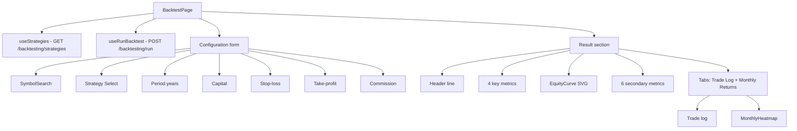

# Backtest — how it works

This page walks through the form state, the run flow, the result
structure, the equity curve, the monthly heatmap, and the trade log.

## The big picture



Two endpoints: a one-time list of strategies on mount, and the
`runBacktest` mutation that fires when the user clicks "Run Backtest".

## The form state

```typescript
const [symbol, setSymbol] = useState("RELIANCE.NS");
const [strategy, setStrategy] = useState("SMA Crossover");
const [years, setYears] = useState(5);
const [capital, setCapital] = useState(100000);
const [sl, setSl] = useState(5);
const [tp, setTp] = useState(0);
const [comm, setComm] = useState(0.1);
```

Seven fields. The defaults are:
- Symbol: `RELIANCE.NS`.
- Strategy: `SMA Crossover`.
- Period: 5 years.
- Capital: ₹1,00,000.
- Stop-loss: 5%.
- Take-profit: 0% (no TP — exit on signal only).
- Commission: 0.1% per leg.

The position size is fixed at 100% (no UI control).

## The SymbolSearch component

```tsx
<SymbolSearch
  value={symbol}
  onChange={(t) => setSymbol(t)}
  placeholder="Search stock…"
/>
```

A search input with autocomplete. Type a few letters, get a list of
matching NSE instruments, click one to select. The selected value is
the full ticker (e.g. `RELIANCE.NS`).

The component is shared with the watchlist star and the stock picker
modal. It uses the `/api/v1/instruments/search` endpoint.

## The strategy select

```tsx
<Select value={strategy} onValueChange={setStrategy}>
  <SelectTrigger className="w-full font-mono text-sm">
    <SelectValue />
  </SelectTrigger>
  <SelectContent>
    {strategies.data?.strategies.map((s) => (
      <SelectItem key={s.name} value={s.name}>{s.name}</SelectItem>
    ))}
  </SelectContent>
</Select>
{strategies.data && (
  <p className="text-[11px] text-muted-foreground">
    {strategies.data.strategies.find((s) => s.name === strategy)?.description}
  </p>
)}
```

The dropdown is populated from `strategies.data?.strategies`. Below the
dropdown, a one-line description of the currently selected strategy
shows. The description is taken from the backend.

## The numeric inputs

Five `<Input type="number">` fields with min/max validation:

```tsx
<Input
  type="number"
  min={1}
  max={10}
  value={years}
  onChange={(e) => setYears(Math.max(1, Math.min(10, Number(e.target.value))))}
/>
```

The `Math.max(min, Math.min(max, Number(value)))` clamp ensures the
value stays in range even if the user types a number out of bounds.

The `capital` input uses `step={10000}` to nudge the value to the
nearest ₹10,000.

## The run flow

```typescript
const runBt = useRunBacktest();
const result: BacktestResult | null = runBt.data ?? null;

const handleRun = () => {
  runBt.mutate({
    symbol: symbol.trim().toUpperCase(),
    strategy,
    years,
    initial_capital: capital,
    commission_pct: comm,
    sl_pct: sl,
    tp_pct: tp,
    position_size_pct: 100,
  });
};
```

The mutation takes the form state and a hardcoded `position_size_pct: 100`.
The mutation fires when the user clicks "Run Backtest".

The button is disabled while `runBt.isPending` (the request is in flight)
or when `!symbol.trim()` (the symbol is empty).

```tsx
<Button onClick={handleRun} disabled={runBt.isPending || !symbol.trim()} className="w-full bg-ai text-ai-foreground hover:bg-ai/90 sm:w-auto">
  {runBt.isPending ? "Running…" : "Run Backtest"}
</Button>
```

The button colour is the AI theme colour (blue). The "Running…" text
shows while pending.

## The result

When `runBt.data` is set, the result section renders. Three
sub-sections:

### Header

```tsx
<div className="flex flex-wrap items-center justify-between gap-2 text-sm">
  <span className="font-mono text-muted-foreground">{result.strategy} · {result.symbol} · {result.years}y</span>
  <span className="font-mono text-muted-foreground">₹{result.initial_capital.toLocaleString("en-IN")} → ₹{result.final_equity.toLocaleString("en-IN")}</span>
</div>
```

A two-column header: left is the strategy+symbol+years; right is the
capital→final. Both are mono font, muted colour.

### Key metrics (4 cards)

```tsx
<MetricCard label="CAGR" value={`${result.cagr >= 0 ? "+" : ""}${result.cagr.toFixed(2)}%`} sub="Annualised return" icon={<TrendingUp className="size-3" />} tone={result.cagr >= 0 ? "text-up" : "text-down"} />
<MetricCard label="Sharpe" value={result.sharpe.toFixed(2)} sub={result.sharpe > 2 ? "Excellent" : result.sharpe > 1 ? "Good" : result.sharpe > 0 ? "Marginal" : "Poor"} icon={<BarChart3 className="size-3" />} tone={result.sharpe > 1 ? "text-up" : result.sharpe > 0 ? "text-gold" : "text-down"} />
<MetricCard label="Max Drawdown" value={`${result.max_dd.toFixed(2)}%`} sub={`${result.dd_dur_days} days`} icon={<TrendingDown className="size-3" />} tone="text-down" />
<MetricCard label="Total Return" value={`${result.total_ret_pct >= 0 ? "+" : ""}${result.total_ret_pct.toFixed(2)}%`} sub={`Win rate ${result.win_rate.toFixed(1)}%`} icon={<Trophy className="size-3" />} tone={result.total_ret_pct >= 0 ? "text-up" : "text-down"} />
```

Each card has a label, a value, a sub-label, an icon, and a tone.
The tone is the value's text colour.

The Sharpe card has a categorical sub-label:
- > 2 → "Excellent" (green).
- > 1 → "Good" (green).
- > 0 → "Marginal" (gold).
- ≤ 0 → "Poor" (red).

The Max Drawdown is always red (a drawdown is always bad).

### Equity curve

```tsx
<EquityCurve data={result.equity_curve} />
```

`EquityCurve` is a 45-line SVG component. Already covered in the
implementation file below. The chart has:
- 5 horizontal grid lines.
- A filled polygon below the line (10% opacity).
- A polyline of the equity over time.
- A green fill/line if the final equity is higher than the start, red
  otherwise.

### Secondary metrics (6 cards)

```tsx
<MetricCard label="Sortino" value={result.sortino.toFixed(2)} tone={result.sortino > 1 ? "text-up" : "text-gold"} />
<MetricCard label="Calmar" value={result.calmar.toFixed(2)} tone={result.calmar > 1 ? "text-up" : "text-gold"} />
<MetricCard label="Profit Factor" value={result.profit_factor?.toFixed(2) ?? "∞"} tone={result.profit_factor && result.profit_factor > 1.5 ? "text-up" : "text-gold"} />
<MetricCard label="Alpha" value={`${result.alpha >= 0 ? "+" : ""}${result.alpha.toFixed(2)}%`} tone={result.alpha >= 0 ? "text-up" : "text-down"} />
<MetricCard label="Win Rate" value={`${result.win_rate.toFixed(1)}%`} sub={`${result.wins}W · ${result.losses}L`} tone={result.win_rate >= 50 ? "text-up" : "text-down"} />
<MetricCard label="Avg Hold" value={`${result.avg_hold.toFixed(0)}d`} sub={`Expect ₹${result.expectancy.toFixed(0)}`} />
```

6 smaller cards in a 6-column grid (3 on mobile).

The Profit Factor can be `null` (when the strategy has no losing trades
— all wins). In that case, the value is `∞` and the tone is gold.

### Tabs

```tsx
<Tabs defaultValue="trades">
  <TabsList className="w-full">
    <TabsTrigger value="trades" className="flex-1">Trade Log ({result.trades.length})</TabsTrigger>
    <TabsTrigger value="monthly" className="flex-1">Monthly Returns</TabsTrigger>
  </TabsList>
  <TabsContent value="trades">...</TabsContent>
  <TabsContent value="monthly"><MonthlyHeatmap data={result.monthly_returns} /></TabsContent>
</Tabs>
```

Two tabs:
- **Trade Log**: a list of all trades with entry/exit dates, prices, P&L,
  and exit reason.
- **Monthly Returns**: a 12-column heatmap with one cell per month.

The Trade Log tab shows the trade count in the tab label.

## The EquityCurve component

`EquityCurve` (~45 lines). A simple SVG.

```typescript
function EquityCurve({ data }) {
  if (!data.length) return null;
  const min = Math.min(...data.map((d) => d.equity));
  const max = Math.max(...data.map((d) => d.equity));
  const range = max - min || 1;
  const h = 140, w = 600;
  const points = data.map((d, i) => {
    const x = (i / (data.length - 1)) * w;
    const y = h - ((d.equity - min) / range) * h;
    return `${x},${y}`;
  }).join(" ");
  const firstEq = data[0].equity;
  const lastEq = data[data.length - 1].equity;
  const isUp = lastEq >= firstEq;

  return (
    <svg viewBox={`0 0 ${w} ${h}`} className="w-full" preserveAspectRatio="none">
      {/* grid lines */}
      <polygon points={`0,${h} ${points} ${w},${h}`} fill={isUp ? "rgb(52, 211, 153)" : "rgb(239, 83, 80)"} opacity={0.1} />
      <polyline points={points} fill="none" stroke={isUp ? "rgb(52, 211, 153)" : "rgb(239, 83, 80)"} strokeWidth={2} />
    </svg>
  );
}
```

Three SVG elements:
1. **Grid lines**: 5 horizontal lines at 0%, 25%, 50%, 75%, 100% of
   the height.
2. **Polygon**: a filled shape from `(0,h)` to all the data points to
   `(w,h)`. This is the "filled area" under the line. 10% opacity.
3. **Polyline**: the actual line. 2px stroke. Green if up, red if down.

The y-axis is reversed (0 at the top, 100 at the bottom — SVG
convention). The `h - ((d.equity - min) / range) * h` flips the value.

## The MonthlyHeatmap component

`MonthlyHeatmap` (~30 lines). A 12-column grid of cells.

```typescript
function MonthlyHeatmap({ data }) {
  if (!data.length) return null;
  return (
    <div className="grid grid-cols-4 gap-1.5 sm:grid-cols-6 md:grid-cols-12">
      {data.map((d) => {
        const pct = d.return_pct;
        const intensity = Math.min(Math.abs(pct) / 8, 1);
        const bg = pct >= 0 ? `rgba(52, 211, 153, ${0.15 + intensity * 0.6})` : `rgba(239, 83, 80, ${0.15 + intensity * 0.6})`;
        return (
          <div key={d.month} className="flex flex-col items-center rounded-lg p-1.5 text-[10px] font-mono" style={{ background: bg }} title={`${d.month}: ${pct >= 0 ? "+" : ""}${pct.toFixed(2)}%`}>
            <span className="text-muted-foreground">{d.month.slice(5)}</span>
            <span className={cn("font-semibold", pct >= 0 ? "text-up" : "text-down")}>{pct >= 0 ? "+" : ""}{pct.toFixed(1)}</span>
          </div>
        );
      })}
    </div>
  );
}
```

Each cell has:
- A coloured background (green or red, intensity scaled by magnitude).
- The month label (last 7 chars: "2024-01" → "-01" — actually, the
  `slice(5)` takes chars 5+, so "2024-01" → "01", "2024-12" → "12").
- The return %.
- A tooltip with the full month and exact %.

The colour formula:
- `intensity = min(|pct| / 8, 1)` — 8% move is the max intensity.
- `bg = rgba(green, 0.15 + intensity * 0.6)` for positive, similar for
  negative.
- Range: 15% to 75% opacity.

## The trade log

```tsx
{result.trades.map((t, i) => (
  <div key={i} className="flex items-center justify-between rounded-xl border border-border px-4 py-3">
    <div className="flex items-center gap-3">
      <span className={cn("rounded-full px-2.5 py-0.5 font-mono text-[10px] font-semibold", t.win ? "bg-up/10 text-up" : "bg-down/10 text-down")}>
        {t.exit_reason}
      </span>
      <span className="text-xs text-muted-foreground">{t.entry_date} → {t.exit_date}</span>
    </div>
    <div className="text-right">
      <div className="font-mono text-xs">₹{t.entry_px.toLocaleString("en-IN")} → ₹{t.exit_px.toLocaleString("en-IN")}</div>
      <div className={cn("font-mono text-xs font-semibold", t.pnl >= 0 ? "text-up" : "text-down")}>
        {t.pnl >= 0 ? "+" : ""}₹{t.pnl.toLocaleString("en-IN")} ({t.pnl_pct >= 0 ? "+" : ""}{t.pnl_pct.toFixed(2)}%)
      </div>
    </div>
  </div>
))}
```

One row per trade. Each row has:
- A pill with the exit reason (signal, stop-loss, take-profit).
- The entry date → exit date.
- The entry price → exit price.
- The P&L (in ₹ and %).

The exit reason pill is green for wins, red for losses.

If `result.trades.length === 0`, the page shows "No trades executed."

## What can go wrong

| Symptom | Cause |
|---|---|
| "Run Backtest" is greyed out | The symbol is empty, or a previous run is in flight. |
| Result section doesn't appear | The mutation has not been triggered. Click the button. |
| "Backtest failed" error | The backend's backtest service returned an error. Common: insufficient data for the period. |
| Strategy dropdown is empty | The `useStrategies` call failed. The list is hardcoded on the backend, so it should always succeed. |
| "No trades executed" | The strategy never generated a signal. Some strategies on some stocks produce 0 trades (e.g. Donchian Breakout on a sideways stock). |
| Equity curve is flat | The strategy never entered a trade, so equity stays at the initial capital. |
| All metrics are 0 or "—" | Same as above. |
| Sharpe = NaN | The standard deviation of daily returns is 0. The strategy produced a constant equity curve (e.g. no trades). |
| Profit Factor = "∞" | The strategy had no losing trades. Displayed as infinity. |
| Max Drawdown is positive | The data is wrong. The backend always returns negative drawdowns. |
| Heatmap is empty | The result has no `monthly_returns`. Check the backend. |
| Monthly heatmap shows "01", "02", "03" | The cells are labelled by the month number (last 2 chars of "2024-01"). The year is in the tooltip. |

Related: [implementation](implementation.md) for the file map and the
request traces.