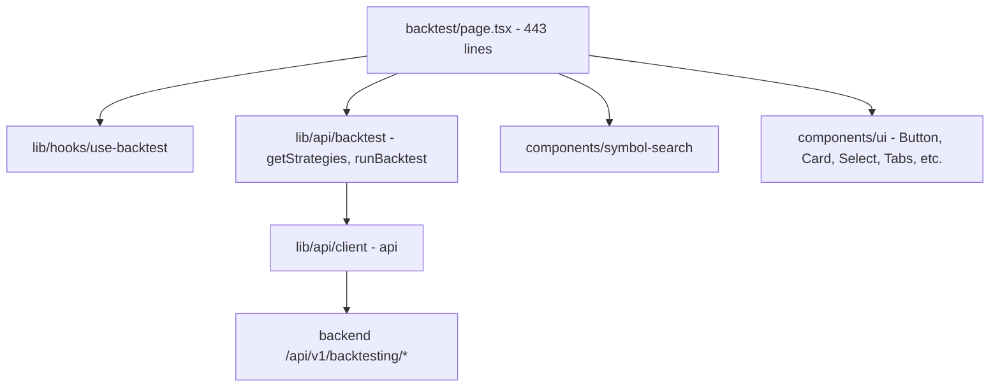
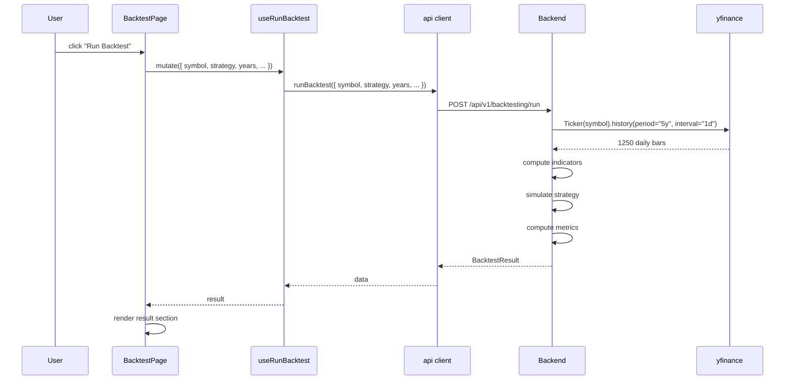

# Backtest — implementation (reading the code)

A guide for someone with the repo open. The whole page is one file.

## File map



## 1. `frontend/app/(app)/app/backtest/page.tsx` (443 lines)

The page contains 3 components, all inline.

| Component | Purpose |
|---|---|
| `MetricCard({ label, value, sub, icon, tone })` | One small metric card |
| `EquityCurve({ data })` | The equity curve SVG |
| `MonthlyHeatmap({ data })` | The 12-column heatmap |
| `BacktestPage` | The exported default |

## 2. `MetricCard` (~28 lines)

A reusable metric card. Used 10 times on the page (4 key metrics + 6
secondary).

```tsx
function MetricCard({ label, value, sub, icon, tone }) {
  return (
    <div className="rounded-xl border border-border bg-card p-4 text-center">
      <div className="mb-1 flex items-center justify-center gap-1.5 text-[11px] font-semibold uppercase tracking-wider text-muted-foreground">
        {icon}
        {label}
      </div>
      <div className={cn("font-mono text-xl font-bold tabular-nums", tone)}>{value}</div>
      {sub && <div className="mt-0.5 font-mono text-xs text-muted-foreground">{sub}</div>}
    </div>
  );
}
```

The card has:
- A label row with an optional icon.
- A value (mono, 20px, bold).
- An optional sub-label (mono, 12px, muted).

The `tone` prop is the Tailwind class for the value's text colour
(e.g. "text-up", "text-down", "text-gold").

## 3. `EquityCurve` (~45 lines)

A simple SVG line chart. The y-axis is the equity value (1.0 = initial
capital). The x-axis is the date index (sequential).

```typescript
const min = Math.min(...data.map((d) => d.equity));
const max = Math.max(...data.map((d) => d.equity));
const range = max - min || 1;
const h = 140, w = 600;
const points = data.map((d, i) => {
  const x = (i / (data.length - 1)) * w;
  const y = h - ((d.equity - min) / range) * h;
  return `${x},${y}`;
}).join(" ");
```

The y-coordinate is `h - ((d.equity - min) / range) * h` — this flips
the SVG y-axis so that higher equity is at the top.

The `range || 1` prevents division by zero.

### Grid lines

```tsx
{[0, 0.25, 0.5, 0.75, 1].map((pct) => (
  <line key={pct} x1={0} y1={h * pct} x2={w} y2={h * pct} stroke="currentColor" className="text-border" strokeWidth={0.5} />
))}
```

5 horizontal grid lines at 0%, 25%, 50%, 75%, 100% of the height. The
`text-border` class colours the stroke via `currentColor`.

### The polygon (fill)

```tsx
<polygon points={`0,${h} ${points} ${w},${h}`} fill={isUp ? "rgb(52, 211, 153)" : "rgb(239, 83, 80)"} opacity={0.1} />
```

A filled shape from `(0,h)` (bottom-left) to all the data points to
`(w,h)` (bottom-right). This creates the "area under the line" effect.
10% opacity.

### The polyline (line)

```tsx
<polyline points={points} fill="none" stroke={isUp ? "rgb(52, 211, 153)" : "rgb(239, 83, 80)"} strokeWidth={2} />
```

The actual line, 2px stroke. Green if `lastEq >= firstEq`, red
otherwise.

## 4. `MonthlyHeatmap` (~30 lines)

A 12-column grid of cells, one per month.

```typescript
function MonthlyHeatmap({ data }) {
  if (!data.length) return null;
  return (
    <div className="grid grid-cols-4 gap-1.5 sm:grid-cols-6 md:grid-cols-12">
      {data.map((d) => {
        const pct = d.return_pct;
        const intensity = Math.min(Math.abs(pct) / 8, 1);
        const bg = pct >= 0 ? `rgba(52, 211, 153, ${0.15 + intensity * 0.6})` : `rgba(239, 83, 80, ${0.15 + intensity * 0.6})`;
        return (
          <div key={d.month} className="flex flex-col items-center rounded-lg p-1.5 text-[10px] font-mono" style={{ background: bg }} title={`${d.month}: ${pct >= 0 ? "+" : ""}${pct.toFixed(2)}%`}>
            <span className="text-muted-foreground">{d.month.slice(5)}</span>
            <span className={cn("font-semibold", pct >= 0 ? "text-up" : "text-down")}>{pct >= 0 ? "+" : ""}{pct.toFixed(1)}</span>
          </div>
        );
      })}
    </div>
  );
}
```

### The colour formula

```typescript
const intensity = Math.min(Math.abs(pct) / 8, 1);
const bg = pct >= 0 ? `rgba(52, 211, 153, ${0.15 + intensity * 0.6})` : `rgba(239, 83, 80, ${0.15 + intensity * 0.6})`;
```

- `intensity` is `|pct| / 8`, clamped to [0, 1]. A 8% move is the max.
- `bg` opacity is `0.15 + intensity * 0.6`, so the range is 15% to 75%.
- Positive is green (`rgba(52, 211, 153, …)`), negative is red
  (`rgba(239, 83, 80, …)`).

### The month label

```tsx
<span className="text-muted-foreground">{d.month.slice(5)}</span>
```

`d.month` is a string like "2024-01". `slice(5)` takes the last 2 chars:
"01", "02", "03", etc. The full year is in the tooltip.

### The tooltip

```tsx
title={`${d.month}: ${pct >= 0 ? "+" : ""}${pct.toFixed(2)}%`}
```

The native `title` attribute — the browser shows the tooltip on hover.
Format: "2024-01: +2.35%".

## 5. `BacktestPage` (~200 lines)

The page composition. Already covered in `how-it-works.md`. Key parts:

### State

```typescript
const [symbol, setSymbol] = useState("RELIANCE.NS");
const [strategy, setStrategy] = useState("SMA Crossover");
const [years, setYears] = useState(5);
const [capital, setCapital] = useState(100000);
const [sl, setSl] = useState(5);
const [tp, setTp] = useState(0);
const [comm, setComm] = useState(0.1);
```

### Hooks

```typescript
const strategies = useStrategies();
const runBt = useRunBacktest();
const result: BacktestResult | null = runBt.data ?? null;
```

`useStrategies` returns `{ strategies: BacktestStrategy[] }`. The
default is undefined while loading.

`useRunBacktest` returns a mutation. The `data` is the result of the
last successful run.

### Run handler

```typescript
const handleRun = () => {
  runBt.mutate({
    symbol: symbol.trim().toUpperCase(),
    strategy,
    years,
    initial_capital: capital,
    commission_pct: comm,
    sl_pct: sl,
    tp_pct: tp,
    position_size_pct: 100,  // hardcoded
  });
};
```

`position_size_pct: 100` is hardcoded — the strategy always uses 100%
of capital. To make it user-configurable, add another state and input.

### The form

```tsx
<Card>
  <CardHeader className="pb-4">
    <CardTitle className="flex items-center gap-2 text-sm">
      <Settings2 className="size-4 text-ai" />Configure backtest
    </CardTitle>
  </CardHeader>
  <CardContent className="space-y-5">
    <div className="grid grid-cols-1 gap-4 sm:grid-cols-3">
      {/* Symbol, Strategy, Period */}
    </div>
    <div className="grid grid-cols-2 gap-4 sm:grid-cols-4">
      {/* Capital, SL, TP, Commission */}
    </div>
    <Button onClick={handleRun} disabled={runBt.isPending || !symbol.trim()} className="w-full bg-ai text-ai-foreground hover:bg-ai/90 sm:w-auto">
      {runBt.isPending ? "Running…" : "Run Backtest"}
    </Button>
  </CardContent>
</Card>
```

Two rows of inputs + a button. The button is full-width on mobile,
auto-width on `sm` and up. The colour is the AI theme.

### Result section

```tsx
{result && (
  <div className="space-y-6">
    <div className="flex flex-wrap items-center justify-between gap-2 text-sm">
      <span className="font-mono text-muted-foreground">{result.strategy} · {result.symbol} · {result.years}y</span>
      <span className="font-mono text-muted-foreground">₹{result.initial_capital.toLocaleString("en-IN")} → ₹{result.final_equity.toLocaleString("en-IN")}</span>
    </div>
    {/* metrics, chart, secondary metrics, tabs */}
  </div>
)}
```

The result is conditional on `result` being non-null. The
`runBt.data ?? null` ensures the result is null when no run has
happened yet.

### The trade log

```tsx
{result.trades.map((t, i) => (
  <div key={i} className="flex items-center justify-between rounded-xl border border-border px-4 py-3">
    <div className="flex items-center gap-3">
      <span className={cn("rounded-full px-2.5 py-0.5 font-mono text-[10px] font-semibold", t.win ? "bg-up/10 text-up" : "bg-down/10 text-down")}>{t.exit_reason}</span>
      <span className="text-xs text-muted-foreground">{t.entry_date} → {t.exit_date}</span>
    </div>
    <div className="text-right">
      <div className="font-mono text-xs">₹{t.entry_px.toLocaleString("en-IN")} → ₹{t.exit_px.toLocaleString("en-IN")}</div>
      <div className={cn("font-mono text-xs font-semibold", t.pnl >= 0 ? "text-up" : "text-down")}>
        {t.pnl >= 0 ? "+" : ""}₹{t.pnl.toLocaleString("en-IN")} ({t.pnl_pct >= 0 ? "+" : ""}{t.pnl_pct.toFixed(2)}%)
      </div>
    </div>
  </div>
))}
```

One row per trade. The exit reason pill is coloured by win/loss.

The `key={i}` is a code smell — using the index as a key means React
cannot reorder trades if the backend changes the order. To fix, use
`t.entry_date + "-" + t.exit_date` as the key (assuming dates are
unique).

## 6. The hooks used

| Hook | Endpoint | Type |
|---|---|---|
| `useStrategies()` | `GET /backtesting/strategies` | Query (cached) |
| `useRunBacktest()` | `POST /backtesting/run` | Mutation |

`useStrategies` is a one-shot fetch. The result is cached for the
session.

`useRunBacktest` is a mutation. It does not cache — each call hits the
backend.

## 7. End-to-end request trace — first backtest

You fill the form and click "Run Backtest":



The first run takes 1–3 seconds (yfinance fetch dominates). Subsequent
runs with the same symbol + period are similar (no caching at the
mutation level — each call refetches from yfinance).

## 8. Common gotchas

- **The result overwrites on each run.** There's no history of past
  results. Run, look, run again — the previous result is gone.
- **The strategies list is fetched on every page load.** No persistent
  cache. If the backend changes the list, the page reflects it on
  refresh.
- **The form is not validated client-side.** You can submit a symbol
  with whitespace (`RELIANCE.NS `) — the backend trims via
  `symbol.trim().toUpperCase()`. If you submit an invalid symbol, the
  backend returns 422 or 500 and the page shows the error.
- **The commission is per leg, not round-trip.** A 0.1% commission
  means 0.1% on entry AND 0.1% on exit, for a total of 0.2% per
  round-trip trade. This matches the backend's expectation.
- **The stop-loss and take-profit are checked intrabar.** The backend
  uses the low/high of each bar to check if SL/TP was hit before the
  signal exit. This is the conservative approach (worst-case fill
  within the bar). The exact timing depends on the bar order — see
  the [backtesting module docs](../../modules/backtesting/how-it-works.md).
- **The Sharpe ratio uses 252 trading days.** This is a US stock
  convention. The NSE has ~250 trading days per year. The difference
  is small (1%). For precise comparisons, multiply by √(250/252) ≈
  0.996.
- **The Sortino ratio uses downside deviation** (only negative returns
  counted). The Calmar uses CAGR / abs(MaxDD).
- **The Profit Factor is null when there are no losing trades.** The
  page shows "∞" in that case.
- **The max drawdown is always negative.** The card's tone is hardcoded
  to `text-down` (red).
- **The monthly heatmap's colour formula is asymmetric.** A 8% move
  gives the same intensity as a 8% loss. The 8% threshold is the
  "max intensity" — bigger moves stay at 75% opacity.
- **The trade log uses `key={i}` (array index).** This works for the
  current static order but breaks if the backend reorders trades. To
  fix, use a stable key like the trade ID or entry date.

## 9. Adding a new metric

Quick recipe for adding, say, **Recovery Factor** (CAGR / Max DD):

1. **Add the field to the backend response** (in
   `backend/app/modules/backtesting/service.py` and `schemas.py`).
2. **Add to the TypeScript type**:
   ```typescript
   export interface BacktestResult {
     ...
     recovery_factor: number | null;
   }
   ```
3. **Add a `MetricCard`** in the secondary metrics grid:
   ```tsx
   <MetricCard label="Recovery" value={result.recovery_factor?.toFixed(2) ?? "—"} tone={result.recovery_factor && result.recovery_factor > 3 ? "text-up" : "text-gold"} />
   ```

## Related

- Backend counterpart: [backtesting module](../../modules/backtesting/overview.md) — covers
  the 6 strategies, the equity curve, the metrics math, the event-driven
  simulator.
- Sibling page: [stock-terminal](../stock-terminal/overview.md) — where
  the symbol search takes you to see a stock's full detail.
- Parent page: [overview](overview.md).