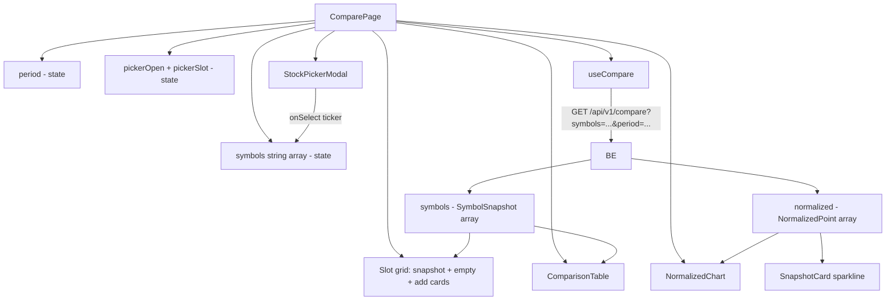
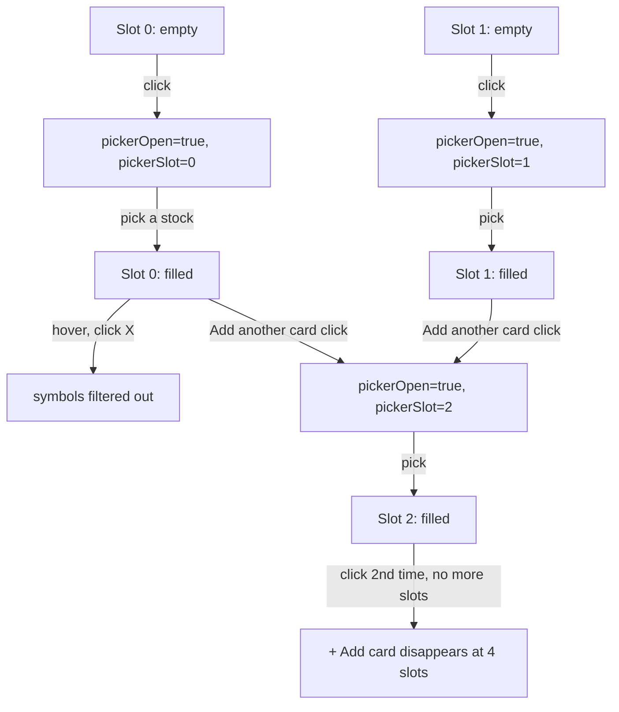

# Compare — how it works

This page walks through the page state, the slot UX, the picker flow, the
snapshot card structure, the normalisation chart, and the comparison
table.

## The big picture



One API call, one local state machine for the slots, two derived
visualisations (chart + table).

## The page state

```typescript
const [symbols, setSymbols] = useState<string[]>([]);
const [period, setPeriod] = useState("1y");
const [pickerOpen, setPickerOpen] = useState(false);
const [pickerSlot, setPickerSlot] = useState(0);
```

- `symbols` — the list of picked tickers (1–4 entries).
- `period` — the selected period (default "1y").
- `pickerOpen` — whether the stock picker modal is open.
- `pickerSlot` — which slot the picker is editing (0-indexed).

The picker is **modal**, so the user can only edit one slot at a time.

## The slot UX



The slot grid is always 2 columns wide on `sm` and up. With 0 or 1
symbol picked, the empty slots are dashed "+" placeholders. With 2 or 3
symbols, an additional "+ Add another" card is shown. With 4 symbols, no
add card.

## The pick flow

```typescript
const openPicker = (slot: number) => {
  setPickerSlot(slot);
  setPickerOpen(true);
};

const handleSelect = (ticker: string) => {
  const next = [...symbols];
  if (pickerSlot < next.length) {
    next[pickerSlot] = ticker;  // edit existing
  } else {
    next.push(ticker);  // add new
  }
  setSymbols(next);
};
```

The picker has two modes:
- **Edit existing** (when `pickerSlot < symbols.length`): replaces the
  stock at that index.
- **Add new** (when `pickerSlot === symbols.length`): appends.

The picker is closed by the modal's `onOpenChange` callback. The stock
list updates, and the hook refetches with the new `symbols` array.

## The data flow

```typescript
const { data, isLoading, isError } = useCompare(symbols, period);
```

The `useCompare` hook fires when:
- `symbols` changes (length or content).
- `period` changes.

The hook passes the array to the backend's `/api/v1/compare` endpoint,
which:
1. Fetches each symbol's history (yfinance, multi-year).
2. Computes snapshot data (last price, change, indicators).
3. Normalises the histories to base 100.
4. Returns the combined result.

The response is `{ symbols: SymbolSnapshot[], normalized: NormalizedPoint[], period: string }`.

## Section 1 — Slot cards

For each symbol in the list, the page renders a `SnapshotCard` if the
backend has returned a snapshot, or a loading placeholder if not.

```tsx
{symbols.map((sym, i) => {
  const snap = filled.find((s) => s.symbol === sym);
  return snap ? (
    <SnapshotCard
      key={sym}
      s={snap}
      color={COLORS[i]}
      colorDim={COLORS_DIM[i]}
      normalizedData={normalizedData}
      onEdit={() => editSymbol(sym)}
      onRemove={() => removeSymbol(sym)}
    />
  ) : (
    <div key={sym} className="flex min-h-[340px] items-center justify-center rounded-2xl border border-border">
      <div className="flex items-center gap-2 text-sm text-muted-foreground">
        <span className="size-4 animate-spin rounded-full border-2 border-muted border-t-foreground" />
        Loading…
      </div>
    </div>
  );
})}
```

The `filled` array is `data?.symbols ?? []`. The `find` looks up the
current symbol's snapshot. If the backend has not returned it yet (or
the response is loading), the loading placeholder is shown.

The `COLORS` array has 4 entries (green, red, blue, yellow). `COLORS_DIM`
is the same colours at 12% opacity, used for the card header gradient.

## Section 2 — SnapshotCard

`SnapshotCard` (in `page.tsx`, ~200 lines). The card has three regions:

### Header

```tsx
<div className="relative overflow-hidden px-5 pt-5 pb-4" style={{ background: `linear-gradient(135deg, ${colorDim}, transparent)` }}>
  <div className="absolute right-3 top-3 flex gap-1 opacity-0 transition-opacity group-hover:opacity-100">
    <button onClick={onEdit} className="rounded-full bg-background/80 p-1.5 ..." title="Change stock"><Edit3 className="size-3.5" /></button>
    <button onClick={onRemove} className="rounded-full bg-background/80 p-1.5 ..." title="Remove"><X className="size-3.5" /></button>
  </div>
  <div className="flex items-start justify-between">
    <div>
      <span className="font-mono text-lg font-bold" style={{ color }}>{s.symbol.replace(".NS", "")}</span>
      <p className="mt-0.5 truncate text-xs text-muted-foreground">{s.name}</p>
    </div>
    <Sparkline data={normalizedData} symbol={s.symbol} color={color} />
  </div>
  <div className="mt-3 flex items-baseline gap-3">
    <span className="font-mono text-3xl font-bold tracking-tight">₹{fmt(s.last_price)}</span>
    <span className={cn("flex items-center gap-0.5 rounded-full px-2 py-0.5 font-mono text-xs font-bold", up ? "bg-up/15 text-up" : "bg-down/15 text-down")}>
      {up ? <ArrowUpRight className="size-3" /> : <ArrowDownRight className="size-3" />}
      {up ? "+" : ""}{s.change_pct.toFixed(2)}%
    </span>
  </div>
</div>
```

The header has:
- A coloured gradient background (from the dim colour to transparent).
- Edit and Remove buttons in the top-right (visible on hover).
- The ticker (large, mono, coloured).
- The company name (small, muted, truncated).
- A 72×32 sparkline showing the symbol's normalised performance.
- The big last price.
- A coloured change % badge.

### Body

The body has three sub-sections:

1. **Key metrics grid** — 4 small pills: Volume, Market Cap, P/E, RSI.
   The RSI pill has a tone (down for overbought, up for oversold,
   neutral otherwise).
2. **52-week range bar** — a position bar between low and high.
3. **Trend indicators** — 4 small pills: SMA 20, SMA 50, MACD, Signal.
   The MACD pill has a tone (up if MACD > signal, down otherwise).

The pills are `MetricPill` components — an icon, a label, a value, and
an optional tone.

### Tone logic

```typescript
const rsiTone = s.rsi != null && s.rsi > 70 ? "down" : s.rsi != null && s.rsi < 30 ? "up" : "neutral";
const macdTone = s.macd != null && s.macd_signal != null ? s.macd > s.macd_signal ? "up" : "down" : "neutral";
```

RSI > 70 is **overbought** (red — `down` tone). RSI < 30 is **oversold**
(green — `up` tone). Between is neutral.

MACD > signal is **bullish** (green). MACD < signal is **bearish** (red).

### The 52-week range bar

```tsx
const range52 = s.high_52w && s.low_52w ? s.high_52w - s.low_52w : null;
const pos52 = range52 && range52 > 0 ? Math.min(100, Math.max(5, ((s.last_price - s.low_52w!) / range52) * 100)) : 50;
```

The position is `(last_price − low_52w) / (high_52w − low_52w) × 100`.
Clamped to [5, 100] so the marker is always visible. The bar uses the
symbol's colour.

The `Math.max(5, ...)` keeps the marker at least 5% from the left edge
when the price is very close to the low. Without this, a price at the
52-week low would make the marker invisible (0% position).

## Section 3 — Sparkline

`Sparkline` (in `page.tsx`, ~45 lines). A small SVG mini-chart.

```typescript
const vals = data.map((d) => d.values[symbol]).filter((v) => v != null) as number[];
if (vals.length < 2) return null;
const min = Math.min(...vals);
const max = Math.max(...vals);
const range = max - min || 1;
const pad = 2;
const pts = vals.map((v, i) => {
  const x = pad + (i / (vals.length - 1)) * (width - 2 * pad);
  const y = pad + (1 - (v - min) / range) * (height - 2 * pad);
  return `${x},${y}`;
}).join(" ");
```

The sparkline extracts the values for the current symbol from the
normalised data, then maps them to SVG coordinates. The min/max are
across **all** symbols' values in the chart, so all sparklines share
the same vertical scale — visual comparison is direct.

The polyline is drawn with `strokeLinecap="round"` and
`strokeLinejoin="round"` for smooth corners. A small circle marks the
last value.

## Section 4 — NormalizedChart

`NormalizedChart` (in `page.tsx`, ~110 lines). The main chart. Renders
the normalised performance of all picked stocks.

### The axes

```typescript
const allVals = data.flatMap((d) => Object.values(d.values));
const min = Math.min(...allVals);
const max = Math.max(...allVals);
const range = max - min || 1;
const h = 200, w = 600, pad = 44;
```

The min/max are across **all** symbols' values in the chart, so all
lines share the same vertical scale. The width is fixed at 600 (the
SVG `viewBox`); CSS scales the SVG to fit the container.

5 horizontal grid lines at 0%, 25%, 50%, 75%, 100% of the range. The
left axis shows the value at each grid line.

### The lines

```typescript
{symbols.map((sym, si) => {
  const pts = data.map((d, i) => {
    const v = d.values[sym];
    if (v == null) return null;
    const x = pad + (i / (data.length - 1)) * (w - 2 * pad);
    const y = pad + (1 - (v - min) / range) * (h - 2 * pad);
    return `${x},${y}`;
  }).filter(Boolean).join(" ");
  return <polyline key={sym} points={pts} fill="none" stroke={COLORS[si % COLORS.length]} strokeWidth={2} />;
})}
```

Each symbol gets a polyline. The x-coordinate is the date index
(normalised to the chart width). The y-coordinate is the normalised
value (mapped to the chart height). The stroke colour is the symbol's
slot colour.

The `if (v == null) return null` filter handles days when a symbol
didn't trade (e.g. a stock suspension).

### The legend

```tsx
<div className="flex flex-wrap gap-4">
  {symbols.map((sym, i) => (
    <div key={sym} className="flex items-center gap-1.5 text-xs">
      <span className="size-2.5 rounded-full" style={{ background: COLORS[i % COLORS.length] }} />
      <span className="font-mono text-muted-foreground">{sym.replace(".NS", "")}</span>
    </div>
  ))}
</div>
```

A small colour swatch + ticker for each symbol. The colour matches the
slot colour and the chart line colour.

## Section 5 — ComparisonTable

`ComparisonTable` (in `page.tsx`, ~130 lines). A static table with 11
rows.

The rows are defined as an array of `{ label, icon, fn, cls? }` objects.
`fn(s)` computes the cell value from the snapshot. `cls(s)` is an
optional function that returns a class for tone (e.g. "text-up" for
positive values).

The 11 rows:

| Row | Format | Tone |
|---|---|---|
| Price | ₹X,XXX | — |
| Change | ±X.XX% | up/down |
| Volume | formatted | — |
| Market Cap | ₹X.XT / ₹X.XB / ₹X.XCr | — |
| P/E | X.X | — |
| RSI | X (OB/OS suffix) | up/down |
| 52W High | ₹X,XXX | — |
| 52W Low | ₹X,XXX | — |
| SMA 20 | ₹X,XXX | — |
| SMA 50 | ₹X,XXX | — |
| MACD | X.XX | up/down |

The cells are aligned right (mono font) and the headers are coloured
to match the slot colours.

## The formatters

Three local formatters:

- `fmt(n)`: `n.toLocaleString("en-IN")` for the Indian digit grouping.
- `fmtCap(n)`: chooses T / B / Cr based on magnitude. ≥ 1e12 → T (trillion).
  ≥ 1e9 → B (billion). ≥ 1e7 → Cr (crore). Otherwise full number.
- The third is `formatPct` from `@/lib/utils/format`.

## What can go wrong

| Symptom | Cause |
|---|---|
| Empty slots do nothing | The page has no symbols. Add at least 2 to start comparing. |
| "Loading…" never resolves | The backend's compare endpoint is failing. Check the network tab. |
| "Failed to fetch comparison data" | The backend returned an error. The symbols may be invalid. |
| Sparkline is missing | The normalised data has fewer than 2 points for the symbol. |
| 52-week range bar is missing | `high_52w` or `low_52w` is null. The stock is too new. |
| RSI / MACD show "—" | The backend has fewer than 14/26 bars of history. |
| The chart is squished | The container is narrow. The viewBox stays 600x200; CSS scales. |
| The chart is empty | The normalised array is empty. The backend returned no common trading days. |
| The slot count is 3 but I expected 2 | A 3rd symbol was added. The "Add another" card shows. |
| Clear all does nothing | There are no symbols. |

Related: [implementation](implementation.md) for the file map and the
request traces.