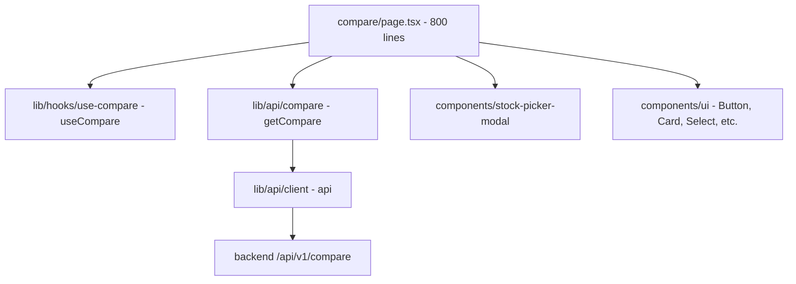
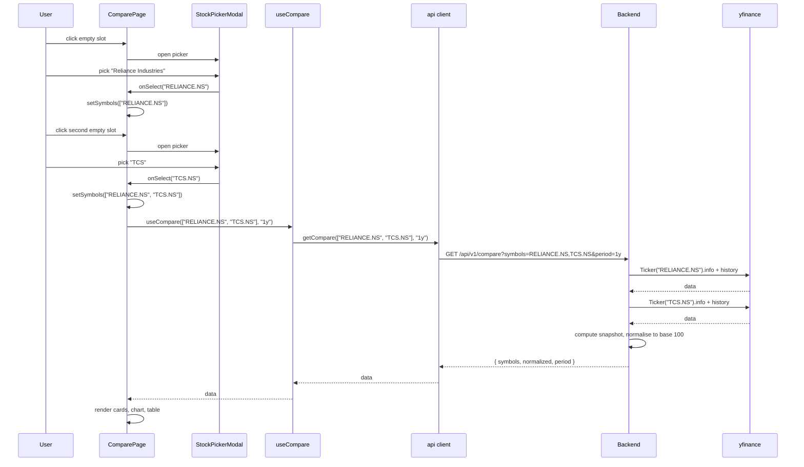

# Compare — implementation (reading the code)

A guide for someone with the repo open. The whole page is one file.

## File map



## 1. `frontend/app/(app)/app/compare/page.tsx` (800 lines)

The page contains 6 components, all inline. Top to bottom:

| Component | Purpose |
|---|---|
| `fmt(n)` | Indian digit grouping for numbers |
| `fmtCap(n)` | Market cap with T / B / Cr suffix |
| `Sparkline({ data, symbol, color, width, height })` | 72×32 mini-chart |
| `MetricPill({ icon, label, value, tone })` | One small metric chip |
| `EmptySlot({ onClick, index })` | Dashed "+" placeholder |
| `SnapshotCard({ s, color, colorDim, normalizedData, onEdit, onRemove })` | One filled slot card |
| `NormalizedChart({ data, symbols })` | The line chart |
| `ComparisonTable({ data })` | The 11-row table |
| `ComparePage` | The exported default |

## 2. The constants

```typescript
const COLORS = ["#34d399", "#ef4444", "#3b82f6", "#eab308"];
const COLORS_DIM = [
  "rgba(52,211,153,0.12)",
  "rgba(239,83,80,0.12)",
  "rgba(59,130,246,0.12)",
  "rgba(234,179,8,0.12)",
];
```

Four colours: emerald, red, blue, yellow. The same order is used for
slot cards, sparklines, chart lines, table headers, and legend dots.

`COLORS_DIM` is the same colours at 12% opacity, used for the card
header gradient.

## 3. `Sparkline` (45 lines)

A small SVG mini-chart. Renders a polyline of the symbol's normalised
values plus a small circle on the last point.

```typescript
const vals = data.map((d) => d.values[symbol]).filter((v) => v != null) as number[];
if (vals.length < 2) return null;
const min = Math.min(...vals);
const max = Math.max(...vals);
const range = max - min || 1;
const pad = 2;
const pts = vals.map((v, i) => {
  const x = pad + (i / (vals.length - 1)) * (width - 2 * pad);
  const y = pad + (1 - (v - min) / range) * (height - 2 * pad);
  return `${x},${y}`;
}).join(" ");
```

The `min`, `max`, and `range` are computed across **all** values in the
data array, not just the current symbol. This ensures all sparklines
share the same vertical scale — a 5% move looks the same on every
sparkline.

The `range || 1` prevents division by zero when all values are equal.

The polyline is drawn with `strokeLinecap="round"` and
`strokeLinejoin="round"`. A circle at `(width - pad, lastY)` marks the
final value.

## 4. `MetricPill` (30 lines)

A small chip with an icon, a label, a value, and an optional tone.

```tsx
<div className="flex items-center gap-2 rounded-lg bg-background/50 px-2.5 py-1.5">
  <span className="text-muted-foreground">{icon}</span>
  <span className="min-w-0 flex-1 truncate text-[11px] text-muted-foreground">{label}</span>
  <span className={cn("font-mono text-xs font-semibold", tone === "up" && "text-up", tone === "down" && "text-down", (!tone || tone === "neutral") && "text-foreground")}>
    {value}
  </span>
</div>
```

The label is truncated if too long. The tone controls the value's text
colour. The pill has a `bg-background/50` (semi-transparent) so it
sits on top of the gradient header.

## 5. `EmptySlot` (33 lines)

The dashed "+" placeholder. Click to open the picker.

```tsx
<button
  onClick={onClick}
  className={cn(
    "group relative flex min-h-[340px] flex-col items-center justify-center gap-5 overflow-hidden rounded-2xl border-2 border-dashed border-border transition-all duration-300",
    "hover:border-emerald-500/60 hover:shadow-lg hover:shadow-emerald-500/5",
  )}
>
  <div className="absolute inset-0 bg-gradient-to-br from-emerald-500/5 via-transparent to-cyan-500/5 opacity-0 transition-opacity group-hover:opacity-100" />
  <div className="relative flex flex-col items-center gap-4">
    <div className="rounded-2xl bg-muted/80 p-5 transition-all group-hover:scale-110 group-hover:bg-emerald-500/10">
      <Plus className="size-7 text-muted-foreground transition-colors group-hover:text-emerald-500" />
    </div>
    <div className="text-center">
      <p className="text-sm font-medium text-muted-foreground group-hover:text-foreground">Select a stock</p>
      <p className="mt-1 text-[11px] text-muted-foreground/60">Slot {index + 1}</p>
    </div>
  </div>
</button>
```

The empty slot has:
- A dashed border (changes to emerald on hover).
- A "+" icon in a rounded square (scales 110% on hover, fills emerald).
- A "Select a stock" label.
- The slot index (1-based).
- A subtle gradient overlay on hover.

The minimum height is 340px to match the filled `SnapshotCard`.

## 6. `SnapshotCard` (~200 lines)

The big card. Already covered in `how-it-works.md`. Key points:

### Tone logic

```typescript
const rsiTone = s.rsi != null && s.rsi > 70 ? "down" : s.rsi != null && s.rsi < 30 ? "up" : "neutral";
const macdTone = s.macd != null && s.macd_signal != null ? s.macd > s.macd_signal ? "up" : "down" : "neutral";
```

RSI > 70 is overbought (red — `down`). RSI < 30 is oversold (green —
`up`). Between is neutral. MACD > signal is bullish, MACD < signal is
bearish.

### 52-week range bar

```typescript
const range52 = s.high_52w && s.low_52w ? s.high_52w - s.low_52w : null;
const pos52 = range52 && range52 > 0 ? Math.min(100, Math.max(5, ((s.last_price - s.low_52w!) / range52) * 100)) : 50;
```

The position is `(last_price − low_52w) / (high_52w − low_52w) × 100`.
Clamped to [5, 100]. Default is 50 if the range is missing or zero.

The `Math.max(5, ...)` floor keeps the marker visible even when the
price is at the 52-week low.

### Edit / Remove

```tsx
<div className="absolute right-3 top-3 flex gap-1 opacity-0 transition-opacity group-hover:opacity-100">
  <button onClick={onEdit} className="..." title="Change stock">
    <Edit3 className="size-3.5" />
  </button>
  <button onClick={onRemove} className="..." title="Remove">
    <X className="size-3.5" />
  </button>
</div>
```

Both buttons are hidden by default (`opacity-0`) and shown on hover
(`group-hover:opacity-100`). The remove button is also highlighted in
red on hover (`hover:bg-down/10 hover:text-down`).

## 7. `NormalizedChart` (~110 lines)

The main chart. Already covered. Key points:

### The grid lines

```tsx
{[0, 0.25, 0.5, 0.75, 1].map((pct) => {
  const val = min + pct * range;
  const y = pad + (1 - pct) * (h - 2 * pad);
  return (
    <g key={pct}>
      <line x1={pad} y1={y} x2={w - pad} y2={y} stroke="currentColor" className="text-border" strokeWidth={0.5} />
      <text x={pad - 4} y={y + 3} textAnchor="end" className="fill-muted-foreground" fontSize={8}>
        {val.toFixed(0)}
      </text>
    </g>
  );
})}
```

5 horizontal lines at 0%, 25%, 50%, 75%, 100% of the range. The text
labels show the value at each line. The Y axis is reversed (0 at the
top, 100 at the bottom — this is the SVG convention).

### The polylines

```tsx
{symbols.map((sym, si) => {
  const pts = data.map((d, i) => {
    const v = d.values[sym];
    if (v == null) return null;
    const x = pad + (i / (data.length - 1)) * (w - 2 * pad);
    const y = pad + (1 - (v - min) / range) * (h - 2 * pad);
    return `${x},${y}`;
  }).filter(Boolean).join(" ");
  return <polyline key={sym} points={pts} fill="none" stroke={COLORS[si % COLORS.length]} strokeWidth={2} />;
})}
```

Each symbol's polyline. The `if (v == null) return null` skips days when
the symbol didn't trade. The result is a string of x,y pairs.

The stroke colour is the symbol's slot colour (`COLORS[si % 4]`).

## 8. `ComparisonTable` (~130 lines)

The static table. The 11 rows are defined inline:

```typescript
const rows: { label: string; icon: React.ReactNode; fn: (s: SymbolSnapshot) => string; cls?: (s: SymbolSnapshot) => string; }[] = [
  { label: "Price", icon: <BarChart3 />, fn: (s) => `₹${fmt(s.last_price)}` },
  { label: "Change", icon: <ArrowUpRight />, fn: (s) => `${s.change_pct >= 0 ? "+" : ""}${s.change_pct.toFixed(2)}%`, cls: (s) => (s.change_pct >= 0 ? "text-up" : "text-down") },
  ...
];
```

Each row has:
- `label` — the metric name.
- `icon` — a Lucide icon.
- `fn(s)` — the cell value computation.
- `cls(s)` — an optional tone class function.

The table renders as a `<table>` with one `<thead>` row and 11 `<tbody>`
rows. The headers are coloured with the symbol's slot colour:

```tsx
{data.map((s, i) => (
  <th key={s.symbol} className="py-2.5 px-3 text-right font-mono font-semibold" style={{ color: COLORS[i] }}>
    {s.symbol.replace(".NS", "")}
  </th>
))}
```

The cells are aligned right (mono font).

## 9. `ComparePage` (~175 lines)

The page composition. Already covered. Key code:

### State

```typescript
const [symbols, setSymbols] = useState<string[]>([]);
const [period, setPeriod] = useState("1y");
const [pickerOpen, setPickerOpen] = useState(false);
const [pickerSlot, setPickerSlot] = useState(0);
```

### Open picker

```typescript
const openPicker = (slot: number) => {
  setPickerSlot(slot);
  setPickerOpen(true);
};
```

### Handle select

```typescript
const handleSelect = (ticker: string) => {
  const next = [...symbols];
  if (pickerSlot < next.length) {
    next[pickerSlot] = ticker;  // edit
  } else {
    next.push(ticker);  // add
  }
  setSymbols(next);
};
```

### Edit / remove

```typescript
const removeSymbol = (sym: string) => {
  setSymbols(symbols.filter((s) => s !== sym));
};

const editSymbol = (sym: string) => {
  const idx = symbols.indexOf(sym);
  if (idx >= 0) openPicker(idx);
};
```

### The slot grid

```tsx
<div className="grid gap-4 sm:grid-cols-2">
  {symbols.map((sym, i) => {
    const snap = filled.find((s) => s.symbol === sym);
    return snap ? <SnapshotCard ... /> : <LoadingPlaceholder />;
  })}
  {symbols.length < 2 && Array.from({ length: 2 - symbols.length }).map((_, i) => (
    <EmptySlot key={`empty-${i}`} index={symbols.length + i} onClick={() => openPicker(symbols.length + i)} />
  ))}
  {symbols.length >= 2 && symbols.length < 4 && (
    <button onClick={() => openPicker(symbols.length)} className="...">
      <Plus className="size-5" />
      <span>Add another stock</span>
    </button>
  )}
</div>
```

Three regions of the grid:
1. **Filled slots**: a `SnapshotCard` or a loading placeholder.
2. **Empty slots**: only when there are fewer than 2 symbols.
3. **Add-another card**: only when 2–3 symbols are picked (not at 4).

### The chart + table

```tsx
{data && data.normalized.length > 0 && (
  <div className="space-y-6">
    <NormalizedChart data={data.normalized} symbols={data.symbols.map((s) => s.symbol)} />
    <ComparisonTable data={data.symbols} />
  </div>
)}
```

The chart and table only render when the data has normalised points.
The `data.symbols.map((s) => s.symbol)` is needed because
`NormalizedChart` takes a `symbols: string[]` prop, not a
`SymbolSnapshot[]`.

### The modal

```tsx
<StockPickerModal
  open={pickerOpen}
  onOpenChange={setPickerOpen}
  onSelect={handleSelect}
  exclude={symbols}
/>
```

`exclude` is the current `symbols` array — already-picked stocks are
hidden from the search results.

## 10. End-to-end request trace — first compare

You pick RELIANCE.NS and TCS.NS, change the period to "1y":



The first `getCompare` call hits yfinance twice (once per symbol). With
caching, the second call (if a user changes the period) is faster.

## 11. Common gotchas

- **The picker is modal.** Only one slot can be edited at a time. This
  prevents the user from accidentally editing the wrong slot.
- **The colour cycle is fixed.** You cannot choose which colour a
  stock gets. The first stock is always green, the second red, the
  third blue, the fourth yellow. The order is the order of picking.
- **Removing a stock does not preserve the colour of the remaining
  slots.** If you remove the 2nd stock (red), the 3rd stock (blue)
  becomes the 2nd (red). The colour follows the index, not the symbol.
- **The 52-week range position is clamped to [5, 100].** A stock at
  its 52-week low shows the marker at 5% (not 0%) so it stays visible.
- **The sparkline uses the same vertical scale as the main chart.** A
  5% move looks the same on the sparkline as on the main chart. This
  is intentional.
- **The table is rendered from `data.symbols` (the backend's response
  order), not from `symbols` (the user's picking order).** The
  backend's response order is the same as the request order, so this
  is usually a no-op — but if the backend reorders, the table will
  reorder.
- **The `exclude` prop on the modal hides already-picked stocks.** If
  you pick a stock and want to pick it again for a different slot, you
  must first remove it.
- **The clear all button** (`setSymbols([])`) is only shown when
  `symbols.length > 0`. With no symbols, the button is hidden.
- **The "Add another" card** is shown when 2 ≤ symbols.length < 4. At
  4, the card is hidden (no more slots).
- **The chart is drawn as an SVG, not canvas.** The viewBox is 600x200
  and CSS scales it to fit. The lines are crisp at any zoom level.

## Related

- Backend counterpart: [compare module](../../modules/compare/overview.md)
  — covers the snapshot building, the normalisation math, the in-place
  indicator compute.
- Sibling page: [dashboard](../dashboard/overview.md) — the user's
  watchlist lives there; the compare page is for ad-hoc analysis.
- Stock picker modal: `frontend/components/stock-picker-modal.tsx`.
- Parent page: [overview](overview.md).