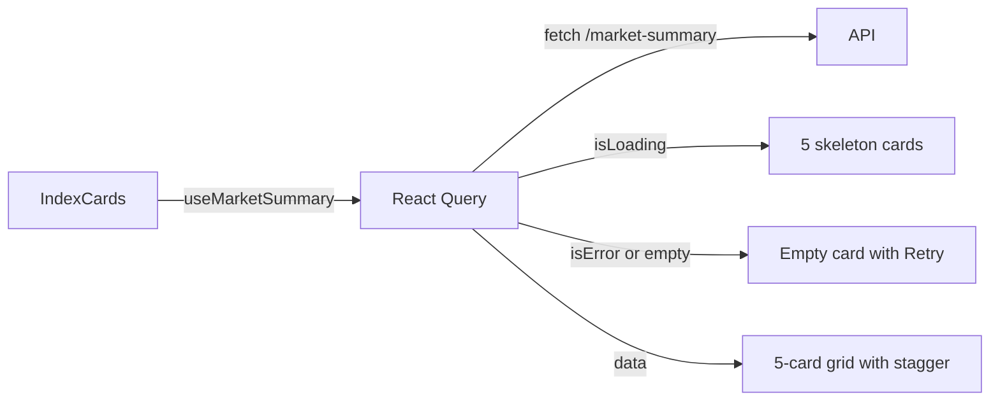
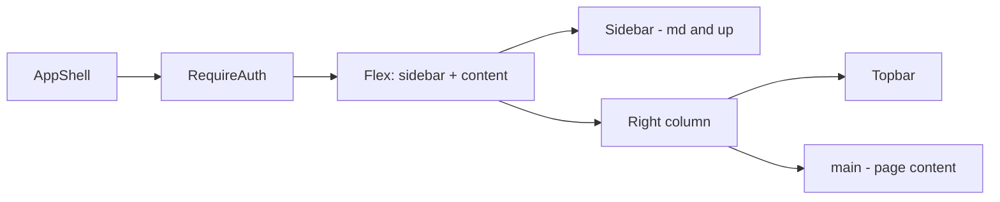

# Dashboard — how it works

This page walks through the page structure, the data sources, the per-section
rendering, and the live-update behaviour.

## The big picture

```mermaid
flowchart TD
    User[Logged-in user] -->|hits /app| Guard[proxy.ts - allow]
    Guard --> AppLayout[(app)/layout.tsx]
    AppLayout --> Shell[AppShell - sidebar + topbar]
    Shell --> RequireAuth[RequireAuth wrapper]
    RequireAuth --> Page[AppPage /app/page.tsx]
    Page --> Greeting[Greeting + MarketStatusChip]
    Page --> IndexCards[IndexCards - 5 NSE indices]
    Page --> Movers[MoversPanel - gainers + losers]
    Page --> Watchlist[WatchlistCard - starred tickers]
    IndexCards -->|useMarketSummary| MS[/api/v1/market-data/market-summary]
    Movers -->|useGainersLosers| GL[/api/v1/market-data/gainers-losers]
    Watchlist -->|useWatchlist| WL[/api/v1/portfolio/watchlist]
    Watchlist -->|per-row useQuote| Q[/api/v1/market-data/quote?symbol=…]
```

Three top-level API calls on first load (`market-summary`, `gainers-losers`,
`watchlist`) plus one `quote` per watchlist row. The shell wraps everything
in `RequireAuth` which guarantees a session before the page renders.

## The page itself

`frontend/app/(app)/app/page.tsx` (52 lines):

```tsx
"use client";

import { IndexCards } from "./components/index-cards";
import { MoversPanel } from "./components/movers-panel";
import { WatchlistCard } from "./components/watchlist-card";
import { MarketStatusChip } from "@/components/market/market-status-chip";
import { useMe } from "@/lib/hooks/use-auth";

function greeting(): string {
  const hour = new Date().getHours();
  if (hour < 12) return "Good morning";
  if (hour < 17) return "Good afternoon";
  return "Good evening";
}

export default function AppPage() {
  const { data: user } = useMe();
  const dateLine = new Date().toLocaleDateString("en-IN", { ... });

  return (
    <div className="mx-auto max-w-6xl space-y-6">
      <div className="flex flex-wrap items-end justify-between gap-3">
        <div>
          <h1 className="text-2xl font-semibold">
            {greeting()}, {user?.username}
          </h1>
          <p className="mt-0.5 flex items-center gap-2 text-sm text-muted-foreground">
            {dateLine}
            <MarketStatusChip />
          </p>
        </div>
      </div>

      <section aria-label="Market snapshot" className="space-y-3">
        <h2 className="...">Market snapshot</h2>
        <IndexCards />
      </section>

      <MoversPanel />

      <WatchlistCard />
    </div>
  );
}
```

A "use client" component (so the `useMe` hook can run). Four sections, no
state of its own beyond the username and the date line.

## The greeting

`greeting()` returns "Good morning" / "Good afternoon" / "Good evening"
based on `new Date().getHours()`. The user's local timezone. It is computed
on every render but is cheap (a single `Date` read).

The date line uses `toLocaleDateString("en-IN", …)` with these options:
`weekday: "short"`, `day: "numeric"`, `month: "short"`, `year: "numeric"`.
For April 17, 2026, this renders as "Fri, 17 Apr 2026".

## Market status chip

`MarketStatusChip` (from `@/components/market/market-status-chip`) is a
small pill that says "Market open" or "Market closed" based on the current
NSE hours (9:15 AM – 3:30 PM IST, Mon–Fri). The chip does **not** fetch
data — it computes the status from the local clock. During holidays it
will show "closed" even though it is a weekday (the NSE holiday calendar is
not checked).

## Section 1 — Market snapshot

`index-cards.tsx` (99 lines). A 5-card grid of major NSE indices.

### Data

The `useMarketSummary` hook hits `/api/v1/market-data/market-summary` and
returns `{ indices: IndexQuote[] }`. The backend's `market_data.router`
exposes this endpoint which fetches:
- NIFTY 50 (`^NSEI`)
- SENSEX (`^BSESN`)
- BANK NIFTY (`^NSEBANK`)
- NIFTY IT (`^CNXIT`)
- NIFTY AUTO (`^CNXAUTO`)

Each `IndexQuote` has `{ symbol, name, price, change, change_pct }`.

### Render flow



The grid is a 5-column layout on `lg` screens, 2-column on `sm`, single
column on mobile. Each card fades in with a 50ms delay per card (stagger).

The card itself has:
- The index name (mono, uppercase, 11px).
- The price (mono, 20px, semibold).
- A coloured arrow (up/down) + the % change.
- The absolute change in parens, muted.

Colour is driven by `toneTextClass[up ? "up" : "down"]` from
`@/lib/utils/format`.

### Error state

If the API fails or returns no indices, the grid is replaced with an empty
state card with a "Retry" button. The retry uses `refetch` from React Query.
The button has a `RefreshCw` icon that spins while refetching.

## Section 2 — Market movers

`movers-panel.tsx` (113 lines). A two-column list: top gainers on the left,
top losers on the right.

### Data

The `useGainersLosers` hook hits `/api/v1/market-data/gainers-losers` and
returns `{ gainers: Mover[], losers: Mover[] }`. The backend computes the
top 5 of each by % change from a fixed NSE-large-cap watchlist (50 tickers).

Each `Mover` has `{ symbol, price, change_pct }`.

### Render

```mermaid
flowchart LR
    MP[MoversPanel] -->|useGainersLosers| Q
    Q -->|isLoading| Skel[5 skeleton rows per side]
    Q -->|data| List[10 rows total]
    List -->|row click| Link[/app/stocks/SYM.NS]
```

Each row has:
- The symbol (e.g. "TATAMOTORS") in mono.
- The current price (in ₹, muted).
- A coloured badge with the % change.

Clicking a row navigates to `/app/stocks/{SYMBOL}.NS`. The `.NS` suffix is
appended automatically by the component (`mover.symbol + ".NS"`).

### Empty / error states

If the API fails, both columns show "Feed unavailable right now." (no retry
button — the section is small enough that a refresh of the page is fine).
If the API succeeds but returns empty arrays (no movers), the columns show
"No movers today."

## Section 3 — My watchlist

`watchlist-card.tsx` (132 lines). The user's personal starred tickers.

### Data

Two hooks:
- `useWatchlist()` hits `/api/v1/portfolio/watchlist` and returns
  `{ items: WatchlistItem[], count }`. Each `WatchlistItem` has
  `{ ticker, added_at }`.
- For each row, `useQuote(item.ticker, 60)` hits
  `/api/v1/market-data/quote?symbol={ticker}` and returns
  `{ price, change, change_pct }`. The `60` is the auto-refresh interval
  in seconds.

### Render

```mermaid
flowchart LR
    WC[WatchlistCard] -->|useWatchlist| W
    W -->|isLoading| Skel[3 skeleton rows]
    W -->|isError| Err[Empty card with Retry]
    W -->|data with items| Rows
    W -->|data empty| Empty[Empty state with hint]
    Rows --> Row[WatchlistRow]
    Row -->|useQuote 60s| Q[/api/v1/market-data/quote]
    Row -->|useRemoveFromWatchlist| Rem[DELETE /api/v1/portfolio/watchlist/SYM]
```

Each row has:
- A filled gold star (the "starred" indicator).
- The ticker (mono, clickable, links to `/app/stocks/{ticker}`).
- The current price (mono, muted). Shows "…" while loading.
- A coloured badge with the % change (only when data is available).
- A remove (X) button that shows on hover.

The X button is hidden by default (`opacity-0`) and shown on hover or
keyboard focus (`group-hover:opacity-100 focus-visible:opacity-100`).

### Empty state

If the user has no watchlist items, the card shows "Your watchlist is
empty" with a hint: "Open any stock from the search bar (⌘K) and hit the
star to add it here." The ⌘K hint is the keyboard shortcut to open the
command palette (search bar).

### Live updates

The watchlist's prices are **not** refetched when the window loses focus
(`refetchOnWindowFocus: false` in providers). They are refreshed every 60
seconds per row. So a watchlist with 5 tickers has 5 polls per minute
behind the scenes.

## The app shell

`app-shell.tsx` (239 lines). The persistent layout around every `/app/*`
page.



### RequireAuth

A client component that watches `useMe()`. If the user query is loading, it
shows a centred loader. If the user is null (not logged in), it redirects
to `/login?next={pathname}`. This is a **second layer** of auth — the
proxy is the first layer (cookie presence), `RequireAuth` is the second
(user validity).

### Sidebar (md and up)

A 60-wide column on the left with:
- The "SV" brand link to `/app`.
- 7 nav items: Dashboard, Markets, Sectors, Compare, Backtest,
  Paper Trading, Alerts.
- A "Settings" link at the bottom.

The active nav item is highlighted with `bg-primary/10 text-foreground`.
The active detection uses `pathname === item.href` for the Dashboard and
`pathname.startsWith(item.href)` for everything else (so
`/app/markets/options` highlights the Markets nav item).

### Topbar (always visible)

A sticky top bar with:
- A menu button (mobile only, opens a sheet with the sidebar links).
- A search button that opens the CommandPalette (⌘K).
- A theme toggle (sun/moon icon).
- The market status chip.
- A user menu (avatar with the first letter of the username). The menu has
  "Settings" and "Log out" items.

The user menu uses `DropdownMenu` (Radix UI). The Log out item calls
`useLogout().mutate()` and shows a toast on success.

### Mobile sidebar

On screens narrower than `md`, the sidebar is hidden. The topbar shows a
menu button that opens a `Sheet` (slide-in panel) with the same nav links.
The sheet auto-closes on link click.

## What can go wrong

| Symptom | Cause |
|---|---|
| Greeting is "undefined" or "demo" | `useMe` is still loading. The user query takes ~50ms to resolve. |
| All 5 index cards are skeletons | The `useMarketSummary` call is still in flight. Should resolve in 200–500ms. |
| All 5 index cards are "Live feed unavailable" | The backend's market-data is down. Click "Retry" or refresh. |
| Movers show "Feed unavailable" | `useGainersLosers` failed. The backend might be down or the upstream yfinance call failed. |
| Watchlist shows the empty state with the hint | The user has no starred tickers. Use ⌘K to search for a stock and star it. |
| Watchlist prices show "…" forever | The per-row `useQuote` hook is failing. Likely a bad ticker. |
| Watchlist remove button is invisible | You're not hovering the row. Hover, or focus the row via keyboard. |
| Page flashes the empty state then shows rows | React Query initially returns empty data from cache, then refetches and finds the real watchlist. |
| Stuck on "Loading…" on every visit | The session cookie is invalid. The api client is in a refresh loop. Log out and back in. |

Related: [implementation](implementation.md) for the file map and request
traces.