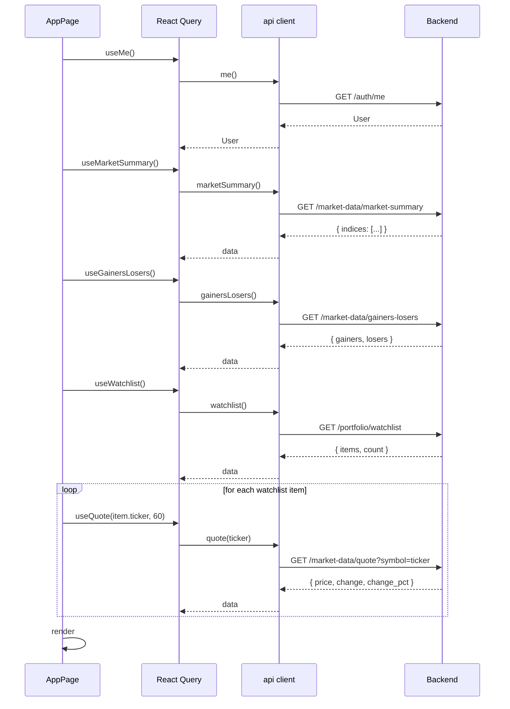
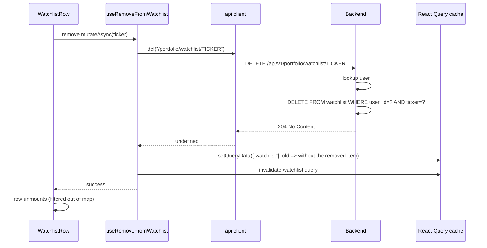

# Dashboard — implementation (reading the code)

A guide for someone with the repo open. Read the files in this order.

## File map

```mermaid
flowchart TD
    Page[app/page.tsx - AppPage] --> Greeting[greeting function - inline]
    Page --> IC[components/index-cards.tsx]
    Page --> MP[components/movers-panel.tsx]
    Page --> WC[components/watchlist-card.tsx]
    Page --> MSC[components/../../market/market-status-chip]
    Layout[(app)/app/layout.tsx] --> Shell[components/app-shell.tsx]
    Shell --> SB[Sidebar]
    Shell --> TB[Topbar]
    Shell --> RA[../../auth/require-auth]
    Proxy[proxy.ts] --> Layout
    Page --> UM[lib/hooks/use-auth - useMe]
    IC --> UMMarket[lib/hooks/use-market - useMarketSummary]
    MP --> UMMarket2[lib/hooks/use-market - useGainersLosers]
    WC --> UW[lib/hooks/use-watchlist - useWatchlist + useRemoveFromWatchlist]
    WC --> UMQ[lib/hooks/use-market - useQuote per row]
```

## 1. `frontend/app/(app)/app/page.tsx` (52 lines)

The page itself. Already covered in detail in `how-it-works.md`. Key
points:

- `"use client"` — required because `useMe` is a client hook.
- Imports four components and one chip.
- The greeting function is inline (3 lines).
- The page returns a single `<div>` with the four sections.
- `useMe` returns the user; `user?.username` is rendered (undefined while
  loading, then the username).

## 2. `frontend/app/(app)/app/layout.tsx` (11 lines)

```tsx
import type { Metadata } from "next";
import { AppShell } from "./components/app-shell";

export const metadata: Metadata = {
  title: "StockView India — App",
};

export default function AppLayout({ children }: LayoutProps<"/app">) {
  return <AppShell>{children}</AppShell>;
}
```

The `(app)/app/` route group's layout. Wraps every page under `/app/*`
with `<AppShell>`. Sets the page metadata.

The `(app)/` outer group has no layout — it is a pure grouping for the
App Router. The inner `app/` subdirectory has the layout.

## 3. `frontend/app/(app)/app/components/app-shell.tsx` (239 lines)

The persistent shell. Already covered in `how-it-works.md`. The file has
four top-level components:

| Component | Purpose |
|---|---|
| `brandLink()` | The "SV / StockView" logo link to `/app` |
| `NavLinks({ onNavigate })` | The 7 nav items + Settings, used by both desktop sidebar and mobile sheet |
| `Sidebar()` | Desktop-only 60-wide column with brand + nav |
| `Topbar()` | Sticky top bar with search, theme, user menu, mobile menu |
| `MobileNav({ open, onOpenChange })` | Sheet for mobile nav |
| `AppShell({ children })` | The exported wrapper — composes everything |

### Key code: nav

```typescript
const NAV = [
  { href: "/app", label: "Dashboard", icon: LayoutDashboard },
  { href: "/app/markets", label: "Markets", icon: Activity },
  { href: "/app/sectors", label: "Sectors", icon: PieChart },
  { href: "/app/compare", label: "Compare", icon: LineChart },
  { href: "/app/backtest", label: "Backtest", icon: Blocks },
  { href: "/app/paper-trading", label: "Paper Trading", icon: Wallet },
  { href: "/app/alerts", label: "Alerts", icon: Bell },
];
```

Seven nav items, all routed within `/app/*`.

### Key code: active detection

```typescript
const active =
  item.href === "/app"
    ? pathname === "/app"
    : pathname.startsWith(item.href);
```

Dashboard uses exact match (so `/app/stocks/...` does not highlight
Dashboard). Everything else uses prefix match (so `/app/markets/options`
highlights Markets).

### Key code: user menu

```tsx
<DropdownMenu>
  <DropdownMenuTrigger asChild>
    <Button variant="ghost" size="icon">
      <Avatar>
        <AvatarFallback>{user?.username?.[0]?.toUpperCase() ?? "U"}</AvatarFallback>
      </Avatar>
    </Button>
  </DropdownMenuTrigger>
  <DropdownMenuContent align="end">
    <DropdownMenuLabel>{user?.username}</DropdownMenuLabel>
    <DropdownMenuSeparator />
    <DropdownMenuItem asChild>
      <Link href="/app/settings"><Settings className="size-4" />Settings</Link>
    </DropdownMenuItem>
    <DropdownMenuItem
      onClick={() => toast.promise(logout.mutateAsync(), {
        loading: "Signing out…",
        success: "Logged out",
        error: "Could not log out",
      })}
    >
      <LogOut className="size-4" />Log out
    </DropdownMenuItem>
  </DropdownMenuContent>
</DropdownMenu>
```

The avatar shows the first letter of the username. The dropdown has
"Settings" (link) and "Log out" (action). Logout uses `toast.promise` for
a three-state toast (loading / success / error).

## 4. `frontend/app/(app)/app/components/index-cards.tsx` (99 lines)

Already covered in `how-it-works.md`. The file has two components:

| Component | Purpose |
|---|---|
| `IndexCard({ index, i })` | One card with the index data + a stagger animation |
| `IndexCards()` | The grid wrapper with loading/error/empty states |

### Key code: stagger

```tsx
<motion.div
  initial={{ opacity: 0, y: 8 }}
  animate={{ opacity: 1, y: 0 }}
  transition={{ duration: 0.2, delay: i * 0.05, ease: "easeOut" }}
>
```

Each card fades in with a 50ms delay per index. The first card has 0ms
delay, the second 50ms, the third 100ms, etc. The motion library
(`motion/react`) handles the animation.

### Key code: error retry

```tsx
{isError || !data?.indices.length ? (
  <Card className="border-dashed">
    <CardContent className="...">
      <p>Live feed unavailable right now.</p>
      <Button variant="outline" size="sm" onClick={() => refetch()}>
        <RefreshCw className={cn("size-4", isRefetching && "animate-spin")} />
        Retry
      </Button>
    </CardContent>
  </Card>
) : ( ... )}
```

The error card spans the full width of the grid (single card, not 5). The
refresh icon spins while the refetch is in flight.

## 5. `frontend/app/(app)/app/components/movers-panel.tsx` (113 lines)

Two components:

| Component | Purpose |
|---|---|
| `MoverRow({ mover })` | One row, link to the stock terminal |
| `MoversPanel()` | The card wrapper with two columns (gainers / losers) |
| `MoverSkeleton()` | A loading state for one column |

### Key code: link construction

```tsx
<Link
  href={`/app/stocks/${encodeURIComponent(mover.symbol + ".NS")}`}
  ...
>
```

The symbol is the bare ticker (e.g. "TATAMOTORS"). The link appends
`.NS` and URL-encodes it. TATAMOTORS → `TATAMOTORS%2ENS` (the `.` is
percent-encoded).

> **Note**: This hardcodes the NSE suffix. BSE-only stocks (`.BO`) will not
> work from the dashboard's movers. The list is built from the NSE large-cap
> list, so this is correct for the current data.

## 6. `frontend/app/(app)/app/components/watchlist-card.tsx` (132 lines)

Two components:

| Component | Purpose |
|---|---|
| `WatchlistRow({ item })` | One row with star + ticker + price + change + remove |
| `WatchlistCard()` | The card wrapper with loading/error/empty/data states |

### Key code: per-row quote

```tsx
function WatchlistRow({ item }: { item: WatchlistItem }) {
  const quote = useQuote(item.ticker, 60);
  ...
  <span className="font-mono text-xs text-muted-foreground">
    {quote.isLoading ? "…" : formatINR(quote.data?.price)}
  </span>
  ...
}
```

Each row has its own `useQuote` hook. The second argument (60) is the
auto-refresh interval in seconds. With 5 watchlist rows, that's 5 polls
per minute.

The `formatINR` formatter handles null gracefully — if the quote is in
flight or failed, the price shows "—".

### Key code: remove

```tsx
const remove = useRemoveFromWatchlist();
...
<Button
  ...
  disabled={remove.isPending}
  onClick={() => remove.mutateAsync(item.ticker)}
>
  <X className="size-4 text-muted-foreground" />
</Button>
```

`mutateAsync` is awaited so the button can show a loading state via
`remove.isPending`. The cache invalidation in `useRemoveFromWatchlist`
removes the row from `useWatchlist`'s cache, so the row disappears without
a full refetch.

## 7. `frontend/components/auth/require-auth.tsx`

A small client component that wraps the app shell. While `useMe` is
loading, it shows a centred loader. If `useMe` returns null, it redirects
to `/login?next={pathname}`.

This is the second layer of auth (after the proxy). The proxy checks
cookie presence; `RequireAuth` checks user validity. Together they
guarantee the user has a real session before any page renders.

## 8. The hooks used

| Hook | File | API |
|---|---|---|
| `useMe` | `lib/hooks/use-auth.ts` | `GET /auth/me` |
| `useMarketSummary` | `lib/hooks/use-market.ts` | `GET /market-data/market-summary` |
| `useGainersLosers` | `lib/hooks/use-market.ts` | `GET /market-data/gainers-losers` |
| `useQuote(symbol, sec)` | `lib/hooks/use-market.ts` | `GET /market-data/quote?symbol=…` (with auto-refetch every `sec` seconds) |
| `useWatchlist` | `lib/hooks/use-watchlist.ts` | `GET /portfolio/watchlist` |
| `useRemoveFromWatchlist` | `lib/hooks/use-watchlist.ts` | `DELETE /portfolio/watchlist/{ticker}` |

All hooks use React Query under the hood. The `useQuote` hook is the only
one that auto-polls (via the `refetchInterval` option). The rest refetch
on cache invalidation only.

## 9. End-to-end request trace — first visit

You log in and the dashboard loads:



The three top-level calls (`me`, `marketSummary`, `gainersLosers`,
`watchlist`) are in flight in parallel — React Query's hooks return
promises that the page renders around. The watchlist's per-row quotes
kick off after `useWatchlist` resolves.

## 10. End-to-end request trace — removing a watchlist item

You hover a row and click the X:



The cache is updated optimistically by `setQueryData` so the row
disappears immediately. The backend returns 204 No Content.

## 11. Common gotchas

- **`user?.username` is undefined on the first paint.** The page renders
  "Good morning, undefined" briefly until `useMe` resolves. To suppress
  this, you can default to a placeholder: `user?.username ?? "trader"`.
- **The greeting changes during the day.** If the user has the page open
  across the 12:00 or 17:00 boundary, the greeting will update on the next
  render. It does not auto-refresh — the user has to navigate or refresh.
- **Per-row `useQuote` polls continue in the background.** With 20
  starred tickers, the dashboard makes 20 polls per minute. The backend's
  market-data cache absorbs most of this — only the first call hits
  yfinance; the rest are Redis cache hits.
- **Removing the last watchlist item triggers the empty state.** The card
  switches from the list view to the "Your watchlist is empty" hint.
- **The market movers link to `.NS` only.** A mover with the symbol
  `TATAMOTORS` becomes `/app/stocks/TATAMOTORS.NS`. If you change the
  backend's movers list to include BSE-only tickers, the link is wrong.
- **`MarketStatusChip` is timezone-naive.** It uses the browser's local
  time, not IST. A user in New York at 9:00 AM EST (which is 7:30 PM IST)
  sees "Market closed" because the NSE has been closed for 3 hours.
- **The watchlist poll interval (60s) is hardcoded.** To change it, edit
  the `60` in `watchlist-card.tsx`. There is no UI for this.
- **The topbar's theme toggle** is a `ThemeToggle` from
  `@/components/layout/theme-toggle`. It uses `next-themes` (the provider
  in `Providers`). The toggle is light/dark only — there is no "system"
  option (the provider sets `enableSystem={false}`).

## Related

- Backend counterpart for index data: [market-data module](../../modules/market-data/overview.md).
- Backend counterpart for movers: same module (gainers-losers endpoint).
- Backend counterpart for watchlist: [portfolio module](../../modules/portfolio/overview.md).
- Sibling page: [stock-terminal](../stock-terminal/overview.md) — where
  the dashboard's links take the user.
- App shell: `frontend/app/(app)/app/components/app-shell.tsx`.
- Parent page: [overview](overview.md).