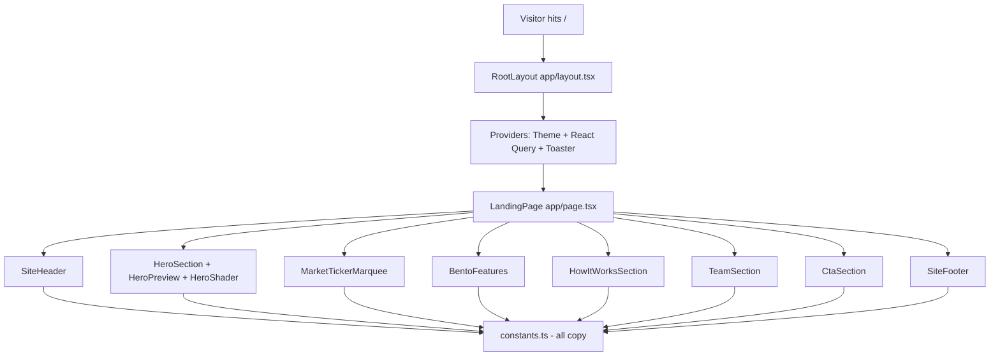
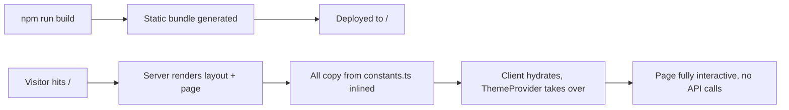

# Landing page — how it works

This page walks through the page structure, the section-by-section flow, and
the data flow. Read this if you want to understand what each section does
before changing the copy.

## The big picture



Every section component imports from `constants.ts`. There are **no API
calls** on the landing page.

## The root layout chain

`frontend/app/layout.tsx` is the root layout — it wraps every page in the
app. It does four things:

1. Loads two Google fonts (`IBM Plex Sans` for body, `IBM Plex Mono` for
   code) and exposes them as CSS variables.
2. Sets the page metadata (title, description).
3. Wraps the page tree in `<Providers>`.
4. Sets the `lang` attribute to `en` and adds `suppressHydrationWarning` for
   theme changes.

`Providers` (`frontend/components/providers.tsx`) is a client component
because it uses `ThemeProvider` and `QueryClientProvider`. The QueryClient
has one important config:

```typescript
retry: (failureCount, error) => {
  if (error instanceof ApiError && (error.status === 401 || error.status === 404)) {
    return false;
  }
  return failureCount < 2;
}
```

This stops React Query from retrying on auth failures (the api client already
refreshed once) and on 404s (the resource is gone, retrying is pointless).

## Section 1 — SiteHeader

`frontend/app/components/site-header.tsx`

The fixed header at the top. Contains:

- The "SV" logo and "StockView India" wordmark (links to `/`).
- Three nav links: Features, How it works, Team — all in-page anchors
  (`#features`, `#how`, `#team`).
- A right-side auth area: when logged out, "Log in" + "Create account"
  buttons; when logged in, a "Dashboard" button (links to `/app`).

The auth state is read from `useMe()`. The header re-renders when the user
query data changes (e.g. after login).

## Section 2 — HeroSection

`frontend/app/components/hero-section.tsx`

The full-viewport hero. Three background layers:

1. **CSS radial gradient** — `bg-[radial-gradient(...)]` — always visible.
2. **HeroShader** — WebGL fragment shader, opacity ~55–75%. Renders the
   moving aurora effect.
3. **Dot grid + drifting glow blobs** — `dot-grid` class + two
   `animate-drift` blobs with `animationDelay` so they move out of sync.

In front of the backgrounds:

- A small badge ("India's open-source trading terminal").
- The headline (`HERO.titleLines`) — two lines, last word is the animated
  gradient.
- A subtitle (`HERO.subtitle`).
- Two buttons: "Start trading free" (primary, links to `/register`) and
  "Try the demo account" (secondary, links to `/login`).
- The four trust numbers (`HERO_STATS`) under the buttons.
- `HeroPreview` — a mock terminal panel drawn with SVG showing what the
  real app looks like. Lives next to the text on wide screens, below on
  narrow.

## Section 3 — MarketTickerMarquee

`frontend/app/components/ticker-marquee.tsx`

A horizontal scrolling row of NSE tickers with daily % change. The component
takes a list of `{ symbol, change }` and renders them in a CSS-animated
infinite scroll.

The data is **static** (baked in the component) — not fetched from the API.
This is the one place where the landing "feels live" without making a backend
call.

## Section 4 — BentoFeatures

`frontend/app/components/bento-features.tsx`

A 6-card bento grid. Each card has:

- An icon (Lucide icon from `FEATURES[].icon`).
- A title and description.
- A `graphic` slot — picked by the `graphic` string. The `bento-graphics`
  component switches on this string and renders a small illustration
  (terminal preview, signal pulse, ML model, NSE chart, backtest equity
  curve, sectors treemap, ledger hash).

The bento layout uses CSS grid with `col-span` and `row-span` classes. The
6 cards are arranged in a 3-column grid on wide screens, 2 on medium, 1 on
small.

## Section 5 — HowItWorksSection

`frontend/app/components/how-it-works.tsx`

A 4-step horizontal strip:

| Step | Title | Description |
|---|---|---|
| 01 | Search | Any NSE/BSE instrument or index |
| 02 | Analyze | Indicators, SMC zones, news sentiment, ML |
| 03 | Backtest | Six strategies with walk-forward checks |
| 04 | Trade | Paper trade with a ₹1,00,000 portfolio |

Each step is a small card with a number, title, and one-line description.
On narrow screens, the steps stack vertically.

## Section 6 — TeamSection

`frontend/app/components/team-section.tsx`

Four cards, one per `TEAM_MEMBERS` entry. Each card has:

- The team member's name.
- Their role (e.g. "Team Lead · Backend").
- A short bio.
- An optional link to GitHub/LinkedIn (`href: "#"` for placeholder).

The team data is **placeholders** — the file says "replace the placeholder
names/roles with your team" in a comment. Edit `constants.ts` to customise.

## Section 7 — CtaSection

`frontend/app/components/cta-section.tsx`

The final call-to-action band. A short headline (`CTA_BAND.title`), a
subtitle (`CTA_BAND.subtitle`), and one big button ("Create free account")
that links to `/register`. Designed to be the last thing the visitor sees
before the footer.

## Section 8 — SiteFooter

`frontend/app/components/site-footer.tsx`

The four-column footer:

| Column | Links |
|---|---|
| Product | Features, How it works, Markets, Sectors |
| Account | Log in, Create account, Dashboard |
| Resources | API playground, How it works, Team |
| Legal | Disclaimer, Education only |

Plus a tagline at the top, social icons (GitHub, Twitter, LinkedIn —
placeholder `#` URLs), a copyright line, and a small disclaimer
("StockView India is a research and education tool…").

The disclaimer is **important** — it is the page's only legal line. Update it
if your deployment changes (e.g. add "Past performance is no guarantee of
future results").

## The component tree

```
LandingPage
├── SiteHeader
│   └── (reads useMe for auth state)
├── HeroSection
│   ├── HeroShader (WebGL)
│   ├── HeroCta
│   └── HeroPreview
├── MarketTickerMarquee
├── BentoFeatures
│   └── BentoGraphics (per-card illustration)
├── HowItWorksSection
├── TeamSection
├── CtaSection
└── SiteFooter
```

## The data flow



Everything is statically generated. The landing page is one of the fastest
pages in the app because it does nothing dynamic.

## What can go wrong

| Symptom | Cause |
|---|---|
| Hydration mismatch warning on the header | The auth state differs between server and client. The `suppressHydrationWarning` on `<html>` catches most cases. |
| WebGL error in console | GPU/driver issue. The CSS gradient still shows. |
| Layout breaks on a phone | Tailwind responsive classes not applied. Check the breakpoints. |
| Ticker marquee shows "—" for all rows | Constants list is empty. |
| Footer links go nowhere | In-page anchors (`#features`) need matching `id` on the section. |
| Landing shows login button while logged in | `useMe` query is in initial loading state. The header waits for it. |

Related: [implementation](implementation.md) for the file map and the
constants schema.